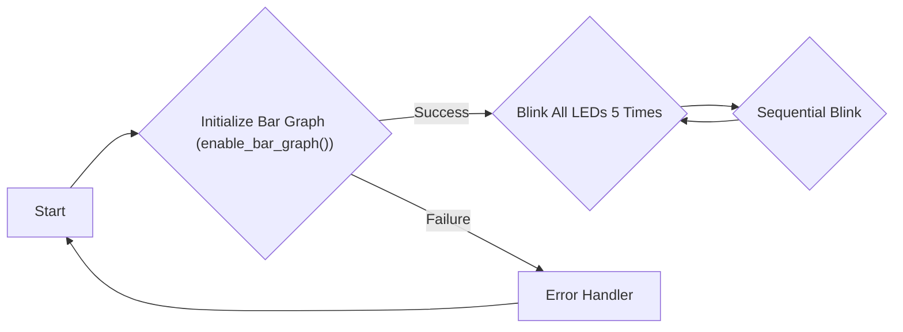
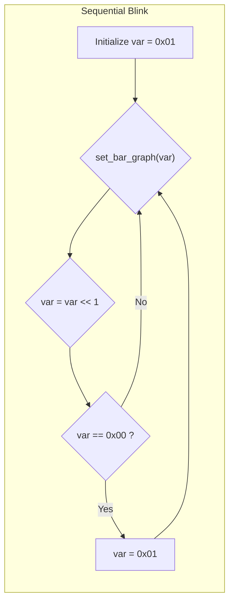

# LED Blink Implementation

This document explains the code and configurations for the LED blink example in the Wall-E project. This example demonstrates basic GPIO control using the ESP32 and FreeRTOS.

## Overview

The LED blink example showcases how to control LEDs connected to the ESP32, providing a fundamental understanding of GPIO manipulation and FreeRTOS task scheduling. The code initializes the bar graph (representing the LEDs), then implements two blinking patterns: a simultaneous blink of all LEDs and a sequential blink.

## Relevant Files

*   `1_led_blink/README.md`: Contains a high-level explanation of LEDs and blinking circuits.
*   `1_led_blink/main/main.c`: Contains the main application code for the LED blink example.

## README.md Breakdown

The `README.md` file provides introductory information about LEDs and basic blinking methods.

### What is a LED?

A Light Emitting Diode (LED) is a semiconductor light source that emits light when current flows through it.

### How does a LED blink?

The `README.md` outlines several methods for creating a blinking LED circuit:

*   Relay
*   Transistor
*   Inverter (logic NOT-gate)
*   PWM (Pulse Width Modulation)

### Circuit Diagram

The `README.md` includes a circuit diagram illustrating a basic LED circuit setup, which shows the connection between the ESP32 and the LEDs.

## main.c Breakdown

The `main.c` file contains the core logic for controlling the LEDs and implementing the blinking patterns.

### Includes

The code begins by including necessary header files:

```c
#include <stdio.h>
#include "freertos/FreeRTOS.h"
#include "freertos/task.h"
#include "sra_board.h"
```

*   `<stdio.h>`: Standard input/output library.
*   `freertos/FreeRTOS.h`: FreeRTOS header file.
*   `freertos/task.h`: FreeRTOS task management header file.
*   `sra_board.h`: Header file specific to the SRA board, containing definitions and functions for hardware peripherals like the bar graph (LEDs).

[View on GitHub](https://github.com/SRA-VJTI/Wall-E/blob/master/1_led_blink/main/main.c)

### `app_main` Function

The `app_main` function is the entry point of the application.

```c
void app_main()
{
    ESP_ERROR_CHECK(enable_bar_graph());

    while(1)
    {
        //blinks all the 8 leds 5 times
        for (int i = 0; i < 5; i++)
        {
            ESP_ERROR_CHECK(set_bar_graph(0xFF));
            vTaskDelay(1000 / portTICK_PERIOD_MS);
            ESP_ERROR_CHECK(set_bar_graph(0x00));
            vTaskDelay(1000 / portTICK_PERIOD_MS);
        }

        uint8_t var = 0x01;

        while(1)
        {   
            if (var == 0x00)
            {
                var = 0x01;
            }            
            ESP_ERROR_CHECK(set_bar_graph(var));
            var = var << 1;
            vTaskDelay(1000 / portTICK_PERIOD_MS);
        }
    }
}
```

*   `enable_bar_graph()`: Initializes the bar graph (LEDs).  The `ESP_ERROR_CHECK` macro verifies that the function returns `ESP_OK`; if not, it halts execution and prints an error message.
*   The outer `while(1)` loop ensures the blinking patterns repeat indefinitely.
*   The first `for` loop blinks all LEDs simultaneously five times.
*   The inner `while(1)` loop implements a sequential blinking pattern, where each LED turns on one after the other.

[View on GitHub](https://github.com/SRA-VJTI/Wall-E/blob/master/1_led_blink/main/main.c)

### Simultaneous Blink

```c
        for (int i = 0; i < 5; i++)
        {
            ESP_ERROR_CHECK(set_bar_graph(0xFF));
            //0xFF = 1111 1111(all leds are on)
            // setting values of all 8 leds to 1
            vTaskDelay(1000 / portTICK_PERIOD_MS);
            //delay of 1s
            ESP_ERROR_CHECK(set_bar_graph(0x00));
            //0x00 = 0000 0000(all leds are off)
            // setting values of all 8 leds to 0
            vTaskDelay(1000 / portTICK_PERIOD_MS);
            //delay of 1s
        }
```

*   `set_bar_graph(0xFF)`: Sets all LEDs on. `0xFF` in binary is `11111111`, where each `1` corresponds to an LED being on.
*   `vTaskDelay(1000 / portTICK_PERIOD_MS)`: Pauses the task for 1000 milliseconds (1 second). `portTICK_PERIOD_MS` converts milliseconds to FreeRTOS ticks.
*   `set_bar_graph(0x00)`: Sets all LEDs off. `0x00` in binary is `00000000`, where each `0` corresponds to an LED being off.

[View on GitHub](https://github.com/SRA-VJTI/Wall-E/blob/master/1_led_blink/main/main.c)

### Sequential Blink

```c
        uint8_t var = 0x01;
        //0x01 = 0000 0001(only 8th led is on)
        // After left-shifting 0x01 8-times, we end up with 0x00. To recover the var variable, we initialise it with 0x01.

        while(1)
        {   
            // After left-shifting 0x01 8-times, we end up with 0x00. To recover the var variable, we initialise it with 0x01.
            if (var == 0x00)
            //if variable var is  0x00(i.e, all leds are off)
            //it checks whether the value of var has changed from 0x01 to 0x00.
            {
                var = 0x01;
           //setting var to  0x01(8th led is on)
            }            
            ESP_ERROR_CHECK(set_bar_graph(var));
            // var contains the data for the LEDs and it's been passed as an argument to set_bar_graph() function.
            var = var << 1;
            // It left shifts the values of var eg. from 0x01(means only the 8th led is on) it changes to 
            // 0x02 (means only the 7th LED is on). Similarly, the LED's are turned on one by one from the 8th to the 1st.
            vTaskDelay(1000 / portTICK_PERIOD_MS);
            //delay of 1s
        }
```

*   `uint8_t var = 0x01;`: Initializes a variable `var` to `0x01` (binary `00000001`). This means only the last LED (8th LED) is initially on.
*   `var = var << 1;`: Left-shifts the bits in `var` by one position. For example, if `var` is `00000001`, after the left shift, it becomes `00000010`. This effectively turns on the next LED in the sequence.
*   The `if (var == 0x00)` condition resets `var` to `0x01` when all LEDs have been lit and shifted out, restarting the sequence.
*   `vTaskDelay(1000 / portTICK_PERIOD_MS)`:  Pauses the task for 1 second, controlling the speed of the sequential blinking.

[View on GitHub](https://github.com/SRA-VJTI/Wall-E/blob/master/1_led_blink/main/main.c)

### Error Checking

```c
ESP_ERROR_CHECK(enable_bar_graph());
ESP_ERROR_CHECK(set_bar_graph(0xFF));
ESP_ERROR_CHECK(set_bar_graph(0x00));
```

The `ESP_ERROR_CHECK` macro is used extensively throughout the code. It is essential for robust error handling in ESP32 projects.

[View on GitHub](https://github.com/SRA-VJTI/Wall-E/blob/master/1_led_blink/main/main.c)

### FreeRTOS Delay

```c
vTaskDelay(1000 / portTICK_PERIOD_MS);
```

This line uses the FreeRTOS function `vTaskDelay` to pause the current task. The delay time is specified in milliseconds, and `portTICK_PERIOD_MS` converts the delay to the appropriate tick count for the FreeRTOS scheduler.

### Mermaid Diagram: LED Blink Flow





This flowchart illustrates the main flow of the LED blinking program.

### Mermaid Diagram: Sequential Blink Logic





This flowchart illustrates the logic behind the sequential LED blinking pattern.

## Key Integration Points

*   **GPIO Initialization:** The `enable_bar_graph()` function initializes the GPIO pins connected to the LEDs. Ensure these pins are correctly configured in the `sra_board.c` file.
*   **FreeRTOS Task Scheduling:** The `vTaskDelay()` function allows for proper task scheduling and prevents the program from consuming excessive CPU resources.
*   **Bit Manipulation:**  The use of bitwise operators (left shift `<<`) is crucial for efficiently controlling individual LEDs.
*   **Error Handling:** Always use `ESP_ERROR_CHECK` to handle potential errors and ensure program stability.
*   **Hardware Abstraction:** The `sra_board.h` and `sra_board.c` files provide a hardware abstraction layer, making the code more portable and easier to maintain.
```