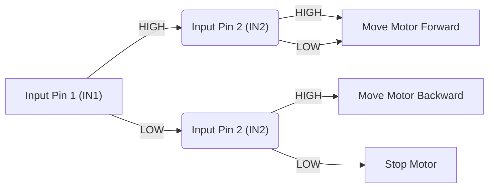
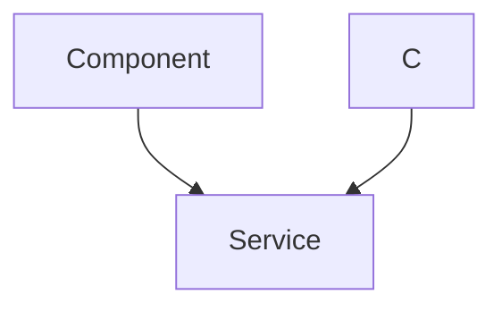

# Switch Controlled Motor

This document details the implementation and functionality of a switch-controlled motor system used in the Wall-E robot. This system utilizes the SRA board and its motor drivers to control motor movement based on input from line sensor array (LSA) switches. The implementation focuses on the "normal mode" operation of the TB6612FNG motor drivers.

## Motor Driver Configuration (Normal Mode)

The SRA board incorporates two TB6612FNG motor drivers, allowing control of up to four motors. In *normal mode*, each motor driver controls two independent motors. This approach uses 8 GPIO pins of the ESP32 to manage the four motors.

Here's a simplified representation of the motor control logic:

| Input Pin 1 | Input Pin 2 | Motor Action        |
|-------------|-------------|---------------------|
| High        | Low         | Move Motor Forward  |
| Low         | High        | Move Motor Backward |
| High        | High        | Move Motor Forward  |
| Low         | Low         | Stop Motor          |





This table and diagram illustrate how the states of two input pins (IN1 and IN2) determine the motor's direction and action.

## Core Functionality

The `switch_controlled_motor_normal` system works by:

1.  Activating GPIO switches to receive input from the LSA.
2.  Enabling one of the TB6612FNG motor drivers.
3.  Reading the input from the LSA.
4.  Controlling the motors in normal mode according to the LSA input.

## Code Implementation Details

The `switch_control_motor_normal.c` file contains the main logic for controlling the motors.

```c
// SRA's custom header file including additional functions
#include "sra_board.h"

// pointer to a character array
static const char *TAG_SWITCH_CONTROL_MOTOR = "switch_control";
```

This snippet includes the necessary header file (`sra_board.h`) which contains custom functions for the SRA board, and defines a tag for logging purposes. [View on GitHub](https://github.com/SRA-VJTI/Wall-E/blob/master/4_switch_controlled_motor_normal/main/switch_control_motor_normal.c)

The `drive_task` function is responsible for continuously reading input from the LSA and controlling the motors accordingly.

```c
void drive_task(void *arg)
{
	enable_switches();

	motor_handle_t motor_a_0, motor_a_1;
	ESP_ERROR_CHECK(enable_motor_driver(&motor_a_0, MOTOR_A_0));
	ESP_ERROR_CHECK(enable_motor_driver(&motor_a_1, MOTOR_A_1));

    while (1)
    {
        // ... LSA input and motor control logic ...
    }
}
```

Here, `enable_switches()` activates the GPIO pins connected to the LSA switches. `enable_motor_driver()` initializes the motor drivers.  [View on GitHub](https://github.com/SRA-VJTI/Wall-E/blob/master/4_switch_controlled_motor_normal/main/switch_control_motor_normal.c)

The core logic reads the switch states and sets motor speeds:

```c
        if (read_switch(SWITCH_1))
		{
			set_motor_speed(motor_a_0, MOTOR_FORWARD, 80);
			ESP_LOGI(TAG_SWITCH_CONTROL_MOTOR, "MOTOR_A_0 FORWARD");
		}
		else if (read_switch(SWITCH_2))
		{
			set_motor_speed(motor_a_0, MOTOR_BACKWARD, 80);
			ESP_LOGI(TAG_SWITCH_CONTROL_MOTOR, "MOTOR_A_0 BACKWARD");
		}
		else
		{
			set_motor_speed(motor_a_0, MOTOR_STOP, 0);
		}
```

This code segment reads the state of `SWITCH_1` and `SWITCH_2`. If `SWITCH_1` is active, motor `motor_a_0` moves forward. If `SWITCH_2` is active, the motor moves backward. If neither switch is active, the motor stops. `set_motor_speed()` controls the motor's speed and direction.  [View on GitHub](https://github.com/SRA-VJTI/Wall-E/blob/master/4_switch_controlled_motor_normal/main/switch_control_motor_normal.c)

A similar block controls `motor_a_1` based on `SWITCH_3` and `SWITCH_4`:

```c
		if (read_switch(SWITCH_3))
		{
			set_motor_speed(motor_a_1, MOTOR_FORWARD, 80);
			ESP_LOGI(TAG_SWITCH_CONTROL_MOTOR, "MOTOR_A_1 FORWARD");
		}
		else if (read_switch(SWITCH_4))
		{
			set_motor_speed(motor_a_1, MOTOR_BACKWARD, 80);
			ESP_LOGI(TAG_SWITCH_CONTROL_MOTOR, "MOTOR_A_1 BACKWARD");
		}
		else
		{
			set_motor_speed(motor_a_1, MOTOR_STOP, 0);
		}
```

[View on GitHub](https://github.com/SRA-VJTI/Wall-E/blob/master/4_switch_controlled_motor_normal/main/switch_control_motor_normal.c)

The `app_main` function creates the `drive_task`:

```c
void app_main()
{
	xTaskCreate(&drive_task, "drive_task", 4096, NULL, 1, NULL);
}
```

This initializes and starts the `drive_task`, which continuously monitors the LSA input and controls the motors.  [View on GitHub](https://github.com/SRA-VJTI/Wall-E/blob/master/4_switch_controlled_motor_normal/main/switch_control_motor_normal.c)

The `vTaskDelay` function ensures the task doesn't consume excessive CPU resources:

```c
		vTaskDelay(100 / portTICK_PERIOD_MS);
```

This line introduces a delay of 100 milliseconds, preventing the while loop from running continuously without pause.  [View on GitHub](https://github.com/SRA-VJTI/Wall-E/blob/master/4_switch_controlled_motor_normal/main/switch_control_motor_normal.c)





This sequence diagram depicts the interaction between the LSA, ESP32, motor driver, and motor, showing how switch inputs control motor direction and speed.

## Key Integration Points

*   **LSA Integration:** The system relies on the LSA to provide input via GPIO switches. Proper configuration and calibration of the LSA are crucial for accurate motor control.
*   **Motor Driver Configuration:** The TB6612FNG motor drivers must be correctly initialized and configured in normal mode. The GPIO pins assigned to the motor drivers must match the code configuration.
*   **FreeRTOS Task Management:** The `drive_task` runs within a FreeRTOS task. Proper task prioritization and delay management are essential for system stability and responsiveness.

By integrating these components effectively, the switch-controlled motor system provides a reliable way to control the Wall-E robot's movement based on sensor input.
```