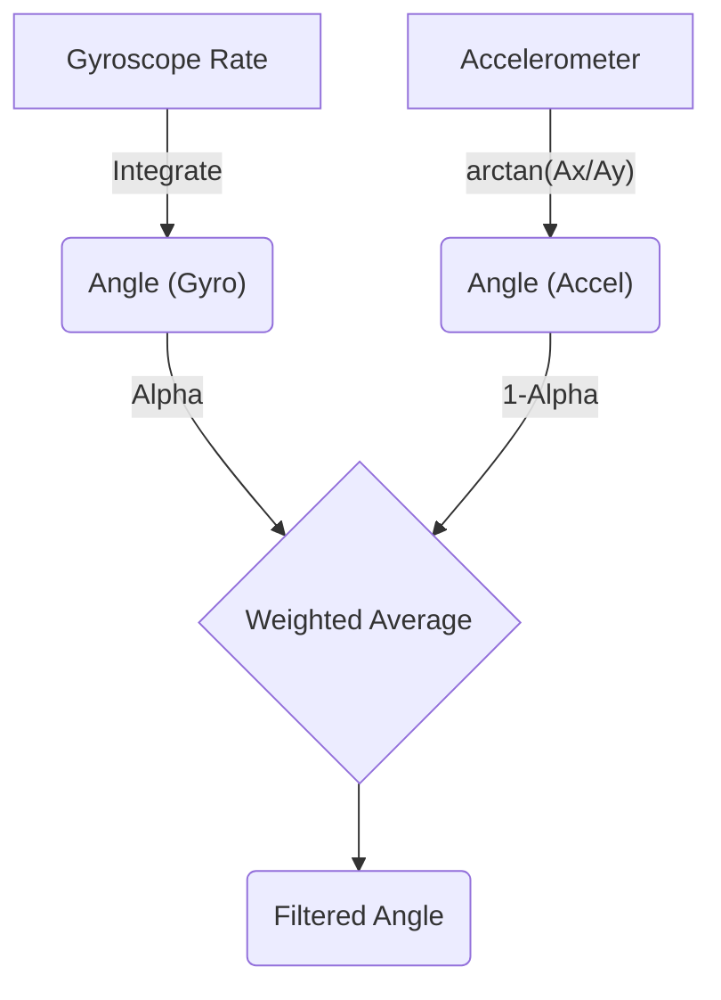
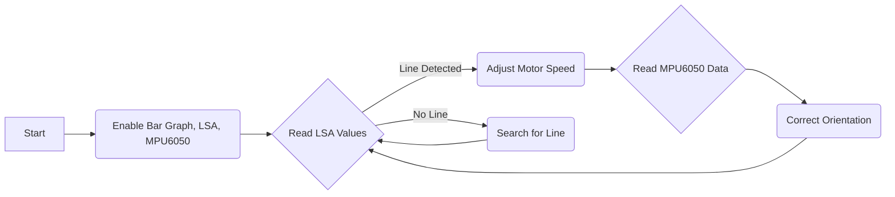

# Basic Functionalities

This section details the fundamental functionalities of the Wall-E project, focusing on LED control using the bar graph, light sensor array (LSA) for line detection, and the MPU6050 inertial measurement unit for orientation sensing.

## LED Control

The project utilizes an 8-LED bar graph for visual feedback and debugging. The code provides functions to control individual LEDs or the entire array.

### Blinking LEDs

The `1_led_blink/main/main.c` file demonstrates basic LED blinking functionality.

```c
#include <stdio.h>
#include "freertos/FreeRTOS.h"
#include "freertos/task.h"
#include "sra_board.h"

void app_main()
{
    ESP_ERROR_CHECK(enable_bar_graph());

    while(1)
    {
        for (int i = 0; i < 5; i++)
        {
            ESP_ERROR_CHECK(set_bar_graph(0xFF));
            vTaskDelay(1000 / portTICK_PERIOD_MS);
            ESP_ERROR_CHECK(set_bar_graph(0x00));
            vTaskDelay(1000 / portTICK_PERIOD_MS);
        }
        // ... (rest of the code)
    }
}
```

This snippet first initializes the bar graph using `enable_bar_graph()`. Then, it enters an infinite loop where it turns all LEDs on (`0xFF`) for 1 second and then turns them off (`0x00`) for 1 second, repeating this 5 times.  The `vTaskDelay` function is used to pause the execution for the specified duration. `ESP_ERROR_CHECK` macro checks the return value and ensures that the operations are successful.
[View on GitHub](https://github.com/SRA-VJTI/Wall-E/blob/master/1_led_blink/main/main.c)

### Shifting LEDs

```c
        uint8_t var = 0x01;

        while(1)
        {   
            if (var == 0x00)
            {
                var = 0x01;
            }            
            ESP_ERROR_CHECK(set_bar_graph(var));
            var = var << 1;
            vTaskDelay(1000 / portTICK_PERIOD_MS);
        }
```

This code segment demonstrates a shifting LED pattern. It initializes `var` to `0x01` (only the 8th LED is on). Then, it left-shifts `var` in each iteration, effectively turning on the next LED in the sequence. If `var` becomes `0x00`, it resets to `0x01` to restart the sequence.
[View on GitHub](https://github.com/SRA-VJTI/Wall-E/blob/master/1_led_blink/main/main.c)

## Light Sensor Array (LSA)

The LSA is crucial for line following. It consists of infrared emitters and phototransistors that detect the reflectivity of the surface below the robot.

### LSA Overview
The LSA module detects lines based on light reflectivity. White surfaces reflect more light than black surfaces. The LSA uses IR emitters and phototransistors to measure reflectivity and outputs analog readings.

### Enabling the Line Sensor

The `enable_line_sensor` function initializes the ADC (Analog-to-Digital Converter) for reading the LSA values.

```c
esp_err_t enable_line_sensor(int mode)
{
    // ADC initialization code here
    // ...
}
```

This function configures the ADC to read analog values from the phototransistors. The `mode` parameter might select different ADC configurations or sensor reading modes. The function returns `ESP_OK` if the initialization is successful.
[View on GitHub](https://github.com/SRA-VJTI/Wall-E/blob/master/components/sra_board/sra_board.c)

### Mapping Sensor Values
```c
float map(float val, float input_lower_limit, float input_higher_limit, float output_lower_limit, float output_higher_limit)
{
    return (val - input_lower_limit) * (output_higher_limit - output_lower_limit) / (input_higher_limit - input_lower_limit) + output_lower_limit;
}
```
This function maps a value from one range to another. It takes an input `val` and maps it from the input range `[input_lower_limit, input_higher_limit]` to the output range `[output_lower_limit, output_higher_limit]`. This is useful for normalizing sensor readings to a standard range.
[View on GitHub](https://github.com/SRA-VJTI/Wall-E/blob/master/components/sra_board/sra_board.c)

## MPU6050 - Inertial Measurement Unit

The MPU6050 is used to determine the orientation of the robot using accelerometer and gyroscope data.

### Initializing the MPU6050

```c
esp_err_t enable_mpu6050()
{
    // I2C initialization and MPU6050 configuration code here
    // ...
}
```

This function initializes the I2C communication and configures the MPU6050. It disables the sleep mode and sets up the accelerometer and gyroscope. If initialization fails, it returns an error code.
[View on GitHub](https://github.com/SRA-VJTI/Wall-E/blob/master/components/sra_board/sra_board.c)

### Reading MPU6050 Data

```c
esp_err_t read_mpu6050(float euler_angle[2], float mpu_offset[2])
{
  // Read raw accelerometer and gyroscope data
  // Apply complementary filter
  // Store Roll and Pitch angles in euler_angle array
}
```

This function reads the raw accelerometer and gyroscope data from the MPU6050. It then applies a complementary filter to combine the accelerometer and gyroscope readings, providing stable and accurate orientation data.  The resulting roll and pitch angles are stored in the `euler_angle` array. The `mpu_offset` array is used to calibrate the MPU6050 and compensate for any bias in the sensor readings.
[View on GitHub](https://github.com/SRA-VJTI/Wall-E/blob/master/components/sra_board/sra_board.c)

### Complementary Filter Equation





This diagram illustrates the complementary filter process, combining gyroscope and accelerometer data to estimate the orientation angle.

## Key Integration Points

The interaction between these functionalities is critical.  The robot uses LSA readings to determine its position relative to the line. The MPU6050 helps to maintain stability and balance, especially when navigating turns or uneven surfaces.  The LED bar graph offers a means to visualize sensor data and debug the system.

Here's a flowchart of how these components integrate:





This diagram illustrates the flow of control in a line-following robot. It starts by initializing the sensors and then continuously reads LSA values to detect the line. The motor speeds are adjusted based on the line position. MPU6050 data is used to correct the orientation of the robot.