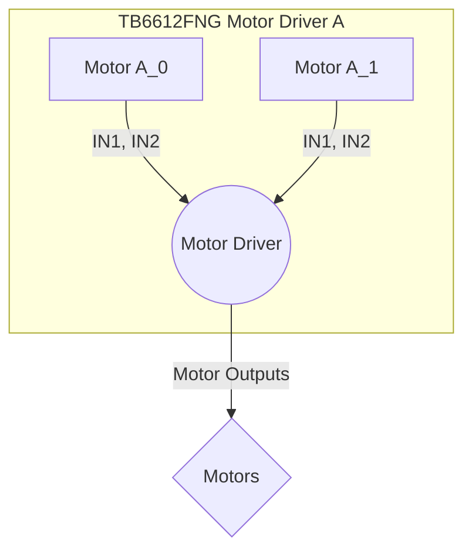

---
title: "Basic Functionality"
description: "Covers foundational functionalities such as LED blinking and switch-controlled motors."
---

# Basic Functionality

This section explores the foundational functionalities of the Wall-E robot, focusing on essential features like LED blinking and switch-controlled motors. These functionalities serve as building blocks for more complex behaviors.

## LED Blinking

The LED blinking functionality demonstrates basic hardware control and timing using the ESP32 microcontroller.

### Code Snippet 1: Enabling the Bar Graph

```c
#include "sra_board.h"

void app_main()
{
    ESP_ERROR_CHECK(enable_bar_graph());
    // enable_bar_graph() turns on the gpio pins, if it succeeds it returns ESP_OK else it returns ESP_FAIL
    // If the argument of ESP_ERROR_CHECK() is not equal ESP_OK, then an error message is printed on the console, and abort() is called.
```

This code snippet initializes the bar graph LEDs. The `enable_bar_graph()` function configures the necessary GPIO pins to control the LEDs. The `ESP_ERROR_CHECK` macro ensures that the function call is successful. [View on GitHub](https://github.com/SRA-VJTI/Wall-E/blob/master/1_led_blink/main/main.c)

### Code Snippet 2: Blinking all LEDs

```c
    while(1)
    {
        //blinks all the 8 leds 5 times
        for (int i = 0; i < 5; i++)
        {
            ESP_ERROR_CHECK(set_bar_graph(0xFF));
            //0xFF = 1111 1111(all leds are on)
            // setting values of all 8 leds to 1
            vTaskDelay(1000 / portTICK_PERIOD_MS);
            //delay of 1s
            ESP_ERROR_CHECK(set_bar_graph(0x00));
            //0x00 = 0000 0000(all leds are off)
            // setting values of all 8 leds to 0
            vTaskDelay(1000 / portTICK_PERIOD_MS);
            //delay of 1s
        }
```

This code blinks all 8 LEDs of the bar graph 5 times. `set_bar_graph(0xFF)` turns all LEDs on, and `set_bar_graph(0x00)` turns them all off. `vTaskDelay` introduces a delay of 1 second between each state. [View on GitHub](https://github.com/SRA-VJTI/Wall-E/blob/master/1_led_blink/main/main.c)

### Code Snippet 3: Shifting LED Pattern

```c
        uint8_t var = 0x01;
        //0x01 = 0000 0001(only 8th led is on)
        // After left-shifting 0x01 8-times, we end up with 0x00. To recover the var variable, we initialise it with 0x01.

        while(1)
        {   
            // After left-shifting 0x01 8-times, we end up with 0x00. To recover the var variable, we initialise it with 0x01.
            if (var == 0x00)
            //if variable var is  0x00(i.e, all leds are off)
            //it checks whether the value of var has changed from 0x01 to 0x00.
            {
                var = 0x01;
           //setting var to  0x01(8th led is on)
            }            
            ESP_ERROR_CHECK(set_bar_graph(var));
            // var contains the data for the LEDs and it's been passed as an argument to set_bar_graph() function.
            var = var << 1;
            // It left shifts the values of var eg. from 0x01(means only the 8th led is on) it changes to 
            // 0x02 (means only the 7th LED is on). Similarly, the LED's are turned on one by one from the 8th to the 1st.
            vTaskDelay(1000 / portTICK_PERIOD_MS);
            //delay of 1s
        }
```

This section of code creates a shifting LED pattern. It initializes a variable `var` to `0x01` (binary `00000001`), which corresponds to turning on only the last LED. The `var = var << 1;` statement left-shifts the bits in `var`, effectively moving the lit LED one position to the left in each iteration. [View on GitHub](https://github.com/SRA-VJTI/Wall-E/blob/master/1_led_blink/main/main.c)

## Switch-Controlled Motors

This functionality demonstrates controlling the robot's motors based on input from switches (simulating Line Sensor Array - LSA). This lays the groundwork for autonomous navigation.

### Code Snippet 4: Enabling Switches and Motor Drivers

```c
#include "sra_board.h"

void drive_task(void *arg)
{
	enable_switches();

	motor_handle_t motor_a_0, motor_a_1;
	ESP_ERROR_CHECK(enable_motor_driver(&motor_a_0, MOTOR_A_0));
	ESP_ERROR_CHECK(enable_motor_driver(&motor_a_1, MOTOR_A_1));
```

This code snippet initializes the switches and motor drivers. `enable_switches()` configures the GPIO pins associated with the switches. `enable_motor_driver()` initializes the motor drivers, allowing the ESP32 to control the motors. `MOTOR_A_0` and `MOTOR_A_1` define which motors are being controlled by driver A. [View on GitHub](https://github.com/SRA-VJTI/Wall-E/blob/master/4_switch_controlled_motor_normal/main/switch_control_motor_normal.c)

### Code Snippet 5: Reading Switch Input and Controlling Motors

```c
		if (read_switch(SWITCH_1))
		{
			set_motor_speed(motor_a_0, MOTOR_FORWARD, 80);
			ESP_LOGI(TAG_SWITCH_CONTROL_MOTOR, "MOTOR_A_0 FORWARD");
		}
		else if (read_switch(SWITCH_2))
		{
			set_motor_speed(motor_a_0, MOTOR_BACKWARD, 80);
			ESP_LOGI(TAG_SWITCH_CONTROL_MOTOR, "MOTOR_A_0 BACKWARD");
		}
		else
		{
			set_motor_speed(motor_a_0, MOTOR_STOP, 0);
		}
```

This code snippet reads the state of `SWITCH_1` and `SWITCH_2` and controls `motor_a_0` accordingly. If `SWITCH_1` is active, the motor moves forward. If `SWITCH_2` is active, the motor moves backward. If neither switch is active, the motor stops. `set_motor_speed` sets the motor's direction and speed. [View on GitHub](https://github.com/SRA-VJTI/Wall-E/blob/master/4_switch_controlled_motor_normal/main/switch_control_motor_normal.c)

### Motor Driver Modes

The SRA board utilizes TB6612FNG motor drivers, operating in Normal Mode to control the motors. In this mode, each motor driver can control two motors independently.





### Code Snippet 6: Task Creation

```c
void app_main()
{
	xTaskCreate(&drive_task, "drive_task", 4096, NULL, 1, NULL);
}
```

This code snippet creates a FreeRTOS task named "drive_task" which executes the motor control logic. [View on GitHub](https://github.com/SRA-VJTI/Wall-E/blob/master/4_switch_controlled_motor_normal/main/switch_control_motor_normal.c)

## Key Integration Points

These basic functionalities are crucial for integrating higher-level robot behaviors.

*   **Line Following:** The switch-controlled motor logic can be adapted to use readings from a line sensor array (LSA) to follow a line.
*   **Obstacle Avoidance:** By integrating ultrasonic sensors or other distance sensors, the motor control logic can be modified to avoid obstacles.
*   **Navigation:** The LED blinking can be used for debugging or signaling robot states.

**Best Practices:**

*   Use appropriate error handling (e.g., `ESP_ERROR_CHECK`) to catch and handle potential errors.
*   Modularize code into functions for better readability and maintainability.
*   Use descriptive variable names to improve code clarity.
*   Consider using a state machine to manage different robot behaviors.
```