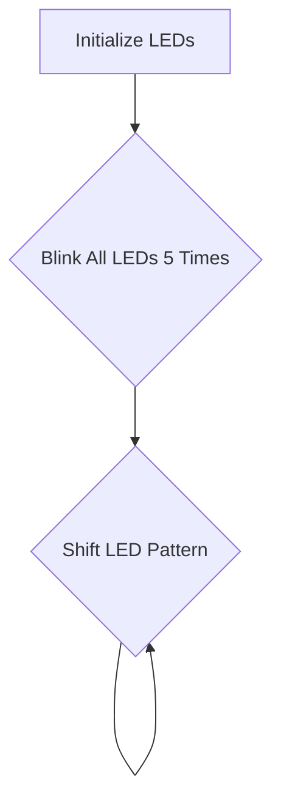
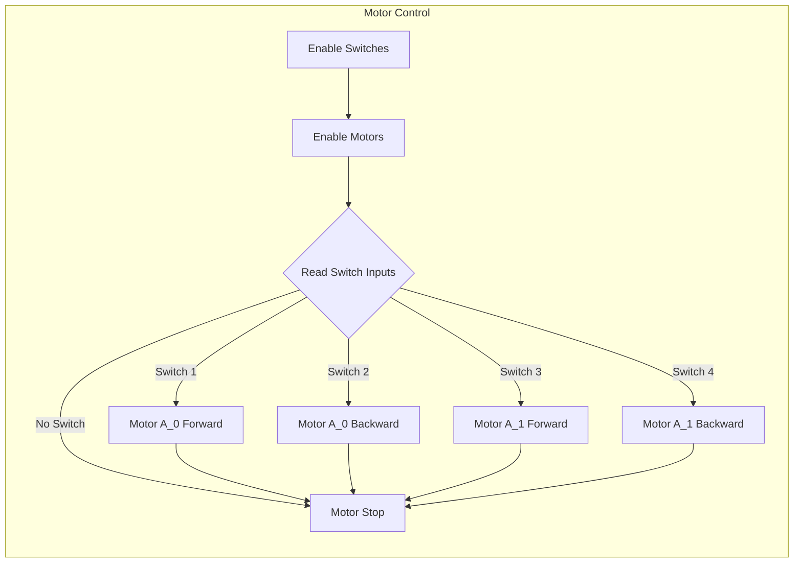

# Basic Hardware Control

This section details fundamental hardware control implementations for the Wall-E robot, including LED blinking and motor control. These examples serve as a starting point for more complex robot behaviors.

## LED Control

The `1_led_blink/main/main.c` file demonstrates how to control the LEDs on the SRA board. The code initializes the bar graph (8 LEDs) and then cycles through different blinking patterns.

### Enabling the Bar Graph

The `enable_bar_graph()` function initializes the GPIO pins connected to the LEDs. It returns `ESP_OK` if successful and `ESP_FAIL` otherwise. `ESP_ERROR_CHECK()` is used to handle potential errors during initialization.

```c
#include <stdio.h>
#include "freertos/FreeRTOS.h"
#include "freertos/task.h"
#include "sra_board.h"

void app_main()
{
    ESP_ERROR_CHECK(enable_bar_graph());
    // enable_bar_graph() turns on the gpio pins, if it succeeds it returns ESP_OK else it returns ESP_FAIL
    // If the argument of ESP_ERROR_CHECK() is not equal ESP_OK, then an error message is printed on the console, and abort() is called. 
```

[View on GitHub](https://github.com/SRA-VJTI/Wall-E/blob/master/1_led_blink/main/main.c)

### Blinking LEDs

The code first blinks all 8 LEDs on and off five times. The `set_bar_graph()` function controls the state of the LEDs, where each bit in the argument corresponds to an LED. `0xFF` turns all LEDs on, and `0x00` turns them all off. `vTaskDelay()` introduces a delay between state changes.

```c
        //blinks all the 8 leds 5 times
        for (int i = 0; i < 5; i++)
        {
            ESP_ERROR_CHECK(set_bar_graph(0xFF));
            //0xFF = 1111 1111(all leds are on)
            // setting values of all 8 leds to 1
            vTaskDelay(1000 / portTICK_PERIOD_MS);
            //delay of 1s
            ESP_ERROR_CHECK(set_bar_graph(0x00));
            //0x00 = 0000 0000(all leds are off)
            // setting values of all 8 leds to 0
            vTaskDelay(1000 / portTICK_PERIOD_MS);
            //delay of 1s
        }
```

[View on GitHub](https://github.com/SRA-VJTI/Wall-E/blob/master/1_led_blink/main/main.c)

### Shifting LED Pattern

The code then creates a shifting LED pattern where the LEDs turn on one by one.  The `var` variable is initialized to `0x01` (only the 8th LED is on), and in each iteration of the `while` loop, the `var` variable shifts one bit to the left (`var = var << 1`), effectively turning on the next LED.

```c
        uint8_t var = 0x01;
        //0x01 = 0000 0001(only 8th led is on)
        // After left-shifting 0x01 8-times, we end up with 0x00. To recover the var variable, we initialise it with 0x01.

        while(1)
        {   
            // After left-shifting 0x01 8-times, we end up with 0x00. To recover the var variable, we initialise it with 0x01.
            if (var == 0x00)
            //if variable var is  0x00(i.e, all leds are off)
            //it checks whether the value of var has changed from 0x01 to 0x00.
            {
                var = 0x01;
           //setting var to  0x01(8th led is on)
            }            
            ESP_ERROR_CHECK(set_bar_graph(var));
            // var contains the data for the LEDs and it's been passed as an argument to set_bar_graph() function.
            var = var << 1;
            // It left shifts the values of var eg. from 0x01(means only the 8th led is on) it changes to 
            // 0x02 (means only the 7th LED is on). Similarly, the LED's are turned on one by one from the 8th to the 1st.
            vTaskDelay(1000 / portTICK_PERIOD_MS);
            //delay of 1s
        }
```

[View on GitHub](https://github.com/SRA-VJTI/Wall-E/blob/master/1_led_blink/main/main.c)





## Motor Control

The `4_switch_controlled_motor_normal/main/switch_control_motor_normal.c` file demonstrates how to control the motors on the Wall-E robot based on switch inputs, simulating line sensor array (LSA) data.

### Enabling Switches and Motors

The `enable_switches()` function initializes the GPIO pins connected to the switches. `enable_motor_driver()` initializes the motor driver hardware, allowing control over motor speed and direction.

```c
#include "sra_board.h"

// pointer to a character array
static const char *TAG_SWITCH_CONTROL_MOTOR = "switch_control";

// main driver function
void drive_task(void *arg)
{
	enable_switches();

	motor_handle_t motor_a_0, motor_a_1;
	ESP_ERROR_CHECK(enable_motor_driver(&motor_a_0, MOTOR_A_0));
	ESP_ERROR_CHECK(enable_motor_driver(&motor_a_1, MOTOR_A_1));
```

[View on GitHub](https://github.com/SRA-VJTI/Wall-E/blob/master/4_switch_controlled_motor_normal/main/switch_control_motor_normal.c)

### Reading Switch Inputs

The `read_switch()` function reads the state of a specific switch. If the switch is activated (simulating an LSA detecting a line), the corresponding motor action is triggered.

```c
		if (read_switch(SWITCH_1))
		{
			set_motor_speed(motor_a_0, MOTOR_FORWARD, 80);

			// Display logs - final LSA readings
			ESP_LOGI(TAG_SWITCH_CONTROL_MOTOR, "MOTOR_A_0 FORWARD");
		}
		else if (read_switch(SWITCH_2))
		{
			set_motor_speed(motor_a_0, MOTOR_BACKWARD, 80);
			ESP_LOGI(TAG_SWITCH_CONTROL_MOTOR, "MOTOR_A_0 BACKWARD");
		}
		else
		{
			// if there is no input from  LSA for first motor then stop the motor, this stops the motor if the previous 80 duty cycles are not completed
			set_motor_speed(motor_a_0, MOTOR_STOP, 0);
		}

		if (read_switch(SWITCH_3))
		{
			set_motor_speed(motor_a_1, MOTOR_FORWARD, 80);

			//Displaying Logs - final LSA readings
			ESP_LOGI(TAG_SWITCH_CONTROL_MOTOR, "MOTOR_A_1 FORWARD");
		}
		else if (read_switch(SWITCH_4))
		{
			set_motor_speed(motor_a_1, MOTOR_BACKWARD, 80);
			ESP_LOGI(TAG_SWITCH_CONTROL_MOTOR, "MOTOR_A_1 BACKWARD");
		}
		else
		{
			//if there is no input from LSA for the second motor then stop the motor
			set_motor_speed(motor_a_1, MOTOR_STOP, 0);
		}
```

[View on GitHub](https://github.com/SRA-VJTI/Wall-E/blob/master/4_switch_controlled_motor_normal/main/switch_control_motor_normal.c)

### Setting Motor Speed and Direction

The `set_motor_speed()` function controls the motor's direction and speed. The first argument is the motor handle, the second is the direction (`MOTOR_FORWARD`, `MOTOR_BACKWARD`, or `MOTOR_STOP`), and the third is the duty cycle (speed) of the motor.

```c
			set_motor_speed(motor_a_0, MOTOR_FORWARD, 80);
```

[View on GitHub](https://github.com/SRA-VJTI/Wall-E/blob/master/4_switch_controlled_motor_normal/main/switch_control_motor_normal.c)

### Task Creation

The `app_main()` function creates a FreeRTOS task called `drive_task` that continuously monitors the switch inputs and controls the motors accordingly. `xTaskCreate()` creates the task, allocating memory and setting its priority.

```c
void app_main()
{
	xTaskCreate(&drive_task, "drive_task", 4096, NULL, 1, NULL);
}
```

[View on GitHub](https://github.com/SRA-VJTI/Wall-E/blob/master/4_switch_controlled_motor_normal/main/switch_control_motor_normal.c)





## Key Integration Points

- **LED Control:** The LED control example demonstrates basic GPIO control and can be extended to create visual indicators for robot status, debugging, or user feedback.
- **Motor Control:** The switch-controlled motor example illustrates how to interface with sensors (simulated by switches) and control the motors. This is a foundation for autonomous navigation and behavior.
- **FreeRTOS Tasks:** Both examples use FreeRTOS tasks, highlighting the importance of concurrent programming for managing multiple robot functions simultaneously.  The motor control particularly shows how to create a separate task for handling sensor input and motor output, allowing the main application loop to handle other processes.
- **Error Handling:** The examples consistently use `ESP_ERROR_CHECK()` to handle potential errors during hardware initialization and function calls. This is crucial for robust and reliable robot operation.

These basic hardware control examples provide a foundation for building more complex robot applications. Understanding how to control LEDs and motors, and integrating sensor input, are essential skills for developing autonomous robots.
```