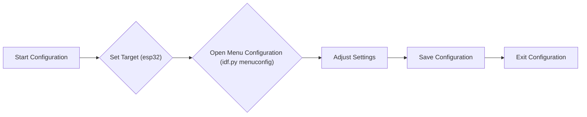
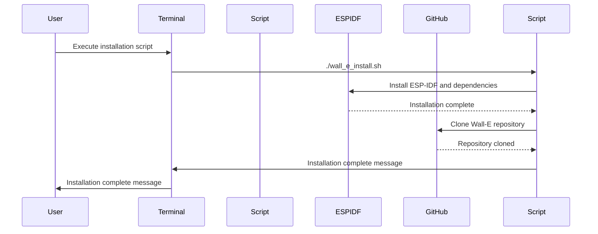

---
title: "Getting Started"
description: "Guides users through setting up the development environment and installing necessary dependencies."
---

# Getting Started

This guide walks you through setting up your development environment and installing the necessary dependencies for working with the Wall-E project. Follow the steps below for your specific operating system to get started.

## Installation Guides

*   [For Windows](#for-windows)
*   [For Linux](#for-linux)
*   [For MacOS](#for-macos)

## For Windows

### Step 1: Install ESP-IDF v5.2

Download the offline installer from [here](https://dl.espressif.com/dl/esp-idf/?idf=5.2). Using the offline installer ensures all necessary components are included.

### Step 2: Run the Installer

Follow the on-screen instructions. Accept the agreement, keep the default installation path, and select the default components. This will install the ESP-IDF toolchain and associated tools.

### Step 3: Complete the Installation

Ensure all checkboxes are marked before clicking "Finish". This will launch the ESP-IDF PowerShell environment.

### Step 4: Clone the Wall-E Git Repo

Open the ESP-IDF 5.2 PowerShell and execute the following commands to clone the Wall-E repository:

```powershell
cd ~
mkdir Projects
cd Projects
git clone https://github.com/SRA-VJTI/Wall-E --recursive --depth 1
cd Wall-E
```

This clones the repository recursively, ensuring all submodules are included.

[View on GitHub](https://github.com/SRA-VJTI/Wall-E/blob/master/.github/workflows/test_install_script.yml)

### Pro Tip

Use `cd ~/Projects/Wall-E` to quickly navigate to the Wall-E directory.

## For Linux

### Step 1: Install `curl`

Open your terminal and check if `curl` is installed:

```bash
which curl
```

If not installed, use your distribution's package manager:

```bash
# For Debian / Ubuntu based distributions
sudo apt install curl

# For Red Hat Enterprise Linux / Fedora based distributions
sudo dnf install curl

# For Arch based distributions
sudo pacman -S curl
```

### Step 2: Download the Installation Script

Download the installation script from the Wall-E repository:

```bash
cd $HOME
curl https://raw.githubusercontent.com/SRA-VJTI/Wall-E/refs/heads/master/wall_e_install.sh -o $HOME/wall_e_install.sh
```

### Step 3: Execute the Installation Script

Execute the following commands to install the required toolkit and clone the Wall-E repository:

```bash
chmod +x $HOME/wall_e_install.sh
./wall_e_install.sh && source $HOME/."${SHELL#${SHELL%/*}/}"rc
```

This script automates the installation process, setting up the necessary environment variables.

[View on GitHub](https://github.com/SRA-VJTI/Wall-E/blob/master/wall_e_install.sh)

## For MacOS

### Step 1: Open the Terminal

Open the terminal using Command + Space and typing "terminal".  If you are using an M1 Mac, make sure to use a terminal opened with Rosetta.

### Step 2: Download and Execute the Installation Script

Download and execute the installation script:

```bash
curl https://raw.githubusercontent.com/SRA-VJTI/Wall-E/refs/heads/master/wall_e_install.sh -o wall_e_install.sh
sudo chmod +x wall_e_install.sh
./wall_e_install.sh
```

You'll be prompted for your password; it won't be visible as you type.

### Step 3: Test the Installation

Test the `hello_world` example to ensure the installation is correct:

```bash
cd ~/esp/esp-idf/examples/get-started/hello_world
idf.py flash monitor
```

### Step 4: Navigate to the Wall-E Repository

Navigate to the cloned Wall-E repository:

```bash
cd $HOME
cd Wall-E
```

## Commands

This section provides a basic procedure for compiling and flashing code onto the ESP32.

### Step 1: Start a Project

Prepare your application for ESP32.

*   **Linux/MacOS:**

```bash
get_idf # To use esp-idf commands
cd ~/esp
cp -r ~/esp/esp-idf/examples/get-started/hello_world .
ls
```

*   **Windows:**

```powershell
cd ~/Projects/Wall-E/1_led_blink
```

### Step 2: Connect Your Device

Connect your ESP32 board to your computer and identify the serial port.

*   **Linux:** `/dev/ttyUSB0`
*   **MacOS:** `/dev/cu.usbserial-0001`
*   **Windows:** `COM1` (Check Device Manager)

### Step 3: Configure

*   **Linux/MacOS:**

```bash
cd ~/esp/esp-idf/examples/get-started/hello_world #Navigating to the file
idf.py set-target esp32 #Command for Setting the Target
idf.py menuconfig # Command for Opening the Configuration Menu
```

*   **Windows:**

```powershell
idf.py set-target esp32 #Command for Setting the Target
idf.py menuconfig #Command for Opening the Configuration
```

The `idf.py menuconfig` command opens a configuration menu where you can customize various project settings.





### Step 4: Build the Project

Build the project using:

```bash
idf.py build #Command for building the code
```

This command compiles the application and generates the necessary binaries.

### Step 5: Flash onto the Device

Flash the binaries onto your ESP32 board:

```bash
idf.py -p PORT flash
```

Replace `PORT` with the appropriate serial port for your operating system.  If flashing fails, press the Boot button on the ESP32 while running the flash command.

### Step 6: Monitor the Output

Monitor the output from the ESP32:

```bash
idf.py flash monitor
```

This command flashes the code and opens a serial monitor to display the output.

[View on GitHub](https://github.com/SRA-VJTI/Wall-E/blob/master/.github/workflows/validate_install_script.yml)

## Key Integration Points

The installation process is streamlined through the use of automated scripts, ensuring consistency across different operating systems. The `wall_e_install.sh` script handles the installation of required dependencies and clones the Wall-E repository. It is crucial to have a stable internet connection while running the script as it downloads several components. Ensure correct serial port is selected before flashing.





```bash
# Example of setting the target and building the project
idf.py set-target esp32
idf.py build
```
```bash
# Example of flashing the code
idf.py -p /dev/ttyUSB0 flash monitor
```
```bash
# Example of opening the configuration menu
idf.py menuconfig
```
```bash
# Example showing commands for linux
sudo apt update && sudo apt install git python3 python3-pip
```

## Best Practices

*   Always use the latest stable version of ESP-IDF.
*   Refer to the Espressif documentation for detailed information on ESP-IDF and ESP32 development.
*   Keep your toolchain and dependencies up to date to avoid compatibility issues.

```