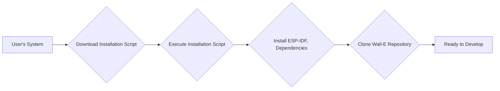
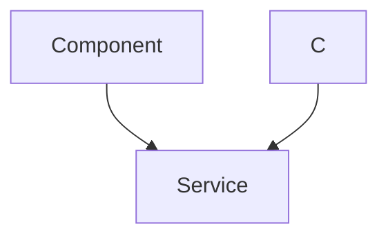

 # Getting Started

This section provides a comprehensive guide to setting up your development environment for working with the WALL-E project. Whether you're on Windows, Linux, or macOS, follow the instructions below to install the necessary dependencies and configure your system.

## Installation

### Windows

1.  **Install ESP-IDF v5.2:**

    *   Download the offline installer from [here](https://dl.espressif.com/dl/esp-idf/?idf=5.2).
    *   Run the downloaded `.exe` file and follow the on-screen instructions. Accept the agreement and proceed with the default installation path. Keep all components selected by default.
    *   Ensure all checkboxes are marked before clicking "Finish".
2.  **Open ESP-IDF 5.2 PowerShell:**
    *   Locate the "ESP-IDF 5.2 PowerShell" shortcut on your desktop and open it.
3.  **Clone the WALL-E Git Repository:**
    *   Execute the following commands in the ESP-IDF PowerShell to clone the repository to your home directory:

    ```powershell
    cd ~
    mkdir Projects
    cd Projects
    git clone https://github.com/SRA-VJTI/Wall-E --recursive --depth 1
    cd Wall-E
    ```

    *Explanation:*
        *  `cd ~`: Changes the current directory to the user's home directory.
        *   `mkdir Projects`: Creates a new directory named "Projects" to store your projects.
        *   `cd Projects`: Navigates into the newly created "Projects" directory.
        *   `git clone https://github.com/SRA-VJTI/Wall-E --recursive --depth 1`: Clones the WALL-E repository from GitHub with submodules and a limited history depth to speed up the process.  [View on GitHub](https://github.com/SRA-VJTI/Wall-E).
        *   `cd Wall-E`: Navigates into the cloned WALL-E repository directory.
       The `--recursive` flag ensures that submodules within the repository are also cloned. This is crucial for projects that depend on other repositories. The `--depth 1` flag clones only the most recent version of the project's history, reducing the download size and time.
    
    *   **Pro Tip:** `cd ~/Projects/Wall-E` takes you directly to the WALL-E directory containing the project code.

### Linux

1.  **Install `curl` (if not already installed):**

    ```sh
    # For Debian / Ubuntu based distributions
    sudo apt install curl

    # For Red Hat Enterprise Linux / Fedora based distributions
    sudo dnf install curl

    # For Arch based distributions
    sudo pacman -S curl
    ```
2.  **Download the Installation Script:**

    ```sh
    cd $HOME
    curl https://raw.githubusercontent.com/SRA-VJTI/Wall-E/refs/heads/master/wall_e_install.sh -o $HOME/wall_e_install.sh
    ```

    *Explanation:*
        *  `cd $HOME`: Changes the current directory to the user's home directory.
        *   `curl https://raw.githubusercontent.com/SRA-VJTI/Wall-E/refs/heads/master/wall_e_install.sh -o $HOME/wall_e_install.sh`: Downloads the installation script from the WALL-E repository and saves it as `wall_e_install.sh` in your home directory. [View on GitHub](https://github.com/SRA-VJTI/Wall-E/blob/master/wall_e_install.sh).
3.  **Execute the Installation Script:**

    ```sh
    chmod +x $HOME/wall_e_install.sh
    ./wall_e_install.sh && source $HOME/."${SHELL#${SHELL%/*}/}"rc
    ```

    *Explanation:*
        *   `chmod +x $HOME/wall_e_install.sh`: Makes the downloaded script executable.
        *   `./wall_e_install.sh`: Executes the installation script.
        *   `source $HOME/."${SHELL#${SHELL%/*}/}"rc`: Reloads your shell configuration to apply the changes made by the installation script (e.g., setting environment variables).

### MacOS

1.  **Open Terminal:**
    *   Press `Command + Space` and type "terminal".
    *   **Note:** If you're an M1 Mac user, refer to [this link](https://youtu.be/9W8rTTE1WEA) for specific instructions on opening the terminal.
2.  **Install Necessary Files:**

    ```sh
    curl https://raw.githubusercontent.com/SRA-VJTI/Wall-E/refs/heads/master/wall_e_install.sh -o wall_e_install.sh
    sudo chmod +x wall_e_install.sh
    ./wall_e_install.sh
    ```

    *Explanation:*
        *   `curl https://raw.githubusercontent.com/SRA-VJTI/Wall-E/refs/heads/master/wall_e_install.sh -o wall_e_install.sh`: Downloads the installation script from the WALL-E repository and saves it as `wall_e_install.sh`. [View on GitHub](https://github.com/SRA-VJTI/Wall-E/blob/master/wall_e_install.sh).
        *   `sudo chmod +x wall_e_install.sh`: Makes the downloaded script executable with administrator privileges.
        *   `./wall_e_install.sh`: Executes the installation script.
3.  **Test the Installation:**

    ```sh
    cd ~/esp/esp-idf/examples/get-started/hello_world
    idf.py flash monitor
    ```

    *Explanation:*
        *  `cd ~/esp/esp-idf/examples/get-started/hello_world`: navigates to the hello world example directory inside esp-idf.
        *  `idf.py flash monitor`: compiles, flashes and monitors the output of the program.
    * Connect ESP32 to your device before running the commands.
    *   If the example runs without errors, log out and log back in.
4.  **Navigate to the Cloned Repository:**

    ```sh
    cd $HOME
    cd Wall-E
    ```

    *Explanation:*
        *   `cd $HOME`: Changes the current directory to the user's home directory.
        *   `cd Wall-E`: Navigates into the cloned WALL-E repository directory.





## Basic Commands

Here's the basic procedure for compiling and flashing code onto the ESP32:

### Step 1: Start a Project

*   **Linux/MacOS:**

    ```sh
    get_idf # To use esp-idf commands
    cd ~/esp
    cp -r ~/esp/esp-idf/examples/get-started/hello_world .
    ls
    ```

*   **Windows:**

    ```powershell
    cd ~/Projects/Wall-E/1_led_blink
    ```

### Step 2: Connect Your Device

Connect your ESP32 board to the computer and identify the serial port.

*   **Linux:** `/dev/ttyUSB0`
*   **MacOS:** `/dev/cu.usbserial-0001`
*   **Windows:** `COM1` (Check Device Manager)

### Step 3: Configure

*   **Linux/MacOS:**

    ```sh
    cd ~/esp/esp-idf/examples/get-started/hello_world
    idf.py set-target esp32
    idf.py menuconfig
    ```

*   **Windows:**

    ```powershell
    idf.py set-target esp32
    idf.py menuconfig
    ```

    *Explanation:*
        *   `idf.py set-target esp32`: Sets the target device to ESP32.
        *   `idf.py menuconfig`: Opens the configuration menu, allowing you to customize project settings (e.g., Wi-Fi credentials, pin assignments).

    This step opens a configuration menu where you can customize various aspects of your project, such as the target chip, serial port, and other settings.

### Step 4: Build the Project

```sh
idf.py build
```

*Explanation:*
    * `idf.py build`: Compiles the application and all ESP-IDF components, generating the necessary binaries.

This command compiles your application along with all the necessary ESP-IDF components and libraries. It produces the bootloader, partition table, and application binaries.

### Step 5: Flash onto the Device

```sh
idf.py -p PORT flash
```

*   **Linux:** `idf.py -p /dev/ttyUSB0 flash`
*   **MacOS:** `idf.py -p /dev/cu.usbserial-0001 flash`
*   **Windows:** `idf.py -p COM1 flash`

*Explanation:*
    *  `idf.py -p PORT flash`: Flashes the generated binaries onto your ESP32 board via the specified serial port.

    *Note:* If flashing fails, press and hold the "Boot" button on the ESP32 while executing the flash command.

### Step 6: Monitor the Output

```sh
idf.py monitor
```

*Explanation:*
    *   `idf.py monitor`: Opens a serial monitor to view the output from the ESP32, allowing you to debug and verify your application's behavior.

This command opens a serial monitor that displays the output from the ESP32. This is useful for debugging and monitoring the application's behavior.





## Key Integration Points

The installation script automates the process of setting up the development environment, including:

*   Installing the ESP-IDF toolchain.
*   Setting environment variables.
*   Cloning the WALL-E repository.

This streamlined process allows developers to quickly get started with the project without having to manually configure each component.

**Best Practices:**

*   Always use the latest stable version of ESP-IDF.
*   Keep your toolchain and dependencies up to date.
*   Refer to the ESP-IDF documentation for detailed information on specific configurations and settings.
*   Use virtual environments to isolate project dependencies and avoid conflicts.