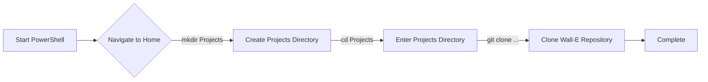
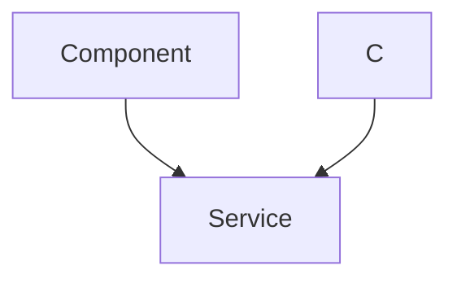

 # Installation and Setup

This section provides detailed instructions on setting up your development environment and installing the necessary dependencies to work with the WALL-E project. Follow the steps below for your respective operating system.

## Table Of Contents
* WALL-E Installation
    * [For Windows](#for-windows)
    * [For Linux](#for-linux)
    * [For MacOS](#for-macos)

## For Windows

The primary requirement for Windows is the ESP-IDF v5.2.

### Step 1: Download the installer
Download the **offline** version of the ESP-IDF v5.2 installer from [here](https://dl.espressif.com/dl/esp-idf/?idf=5.2).

### Step 2: Run the installer
After downloading, open the `.exe` file. Accept the agreement and proceed by clicking `Next >`.  It is recommended to keep the default installation path.

### Step 3: Select Components
Keep all components selected as default and click `Next`.

### Step 4: Ready to Install
Click `Install` to begin the installation process. This might take a few minutes. Click `Next` after installation.

### Step 5: Complete the Installation
Ensure all checkboxes are marked before clicking `Finish`.

### Step 6: Launch ESP-IDF PowerShell
Open the ESP-IDF 5.2 PowerShell, which should be available on your desktop.

### Step 7: Clone the Wall-E Git Repo
Execute the following commands in the ESP-IDF PowerShell to clone the Wall-E repository:

```powershell
cd ~
mkdir Projects
cd Projects
git clone https://github.com/SRA-VJTI/Wall-E --recursive --depth 1
cd Wall-E
```

This clones the repository into a `Projects` directory in your home directory. You can access the Wall-E directory using `cd ~/Projects/Wall-E`.





## For Linux

### Step 1: Get the Installation Script
Open a terminal and ensure `curl` is installed. If not, install it using your distribution's package manager:

```sh
# For Debian / Ubuntu based distributions
sudo apt install curl

# For Red Hat Enterprise Linux / Fedora based distributions
sudo dnf install curl

# For Arch based distributions
sudo pacman -S curl
```

Download the installation script:

```sh
cd $HOME
curl https://raw.githubusercontent.com/SRA-VJTI/Wall-E/refs/heads/master/wall_e_install.sh -o $HOME/wall_e_install.sh
```

### Step 2: Execute the Installation Script
Run the installation script:

```sh
chmod +x $HOME/wall_e_install.sh
./wall_e_install.sh && source $HOME/."${SHELL#${SHELL%/*}/}"rc
```

This script installs the required toolkit from Espressif and clones the Wall-E repository.

## For MacOS

### Step 1: Open the Terminal
Open the terminal using Command+Space and typing "terminal."

### Step 2: Install Necessary Files
Download and execute the installation script:

```sh
curl https://raw.githubusercontent.com/SRA-VJTI/Wall-E/refs/heads/master/wall_e_install.sh -o wall_e_install.sh
sudo chmod +x wall_e_install.sh
./wall_e_install.sh
```

Enter your password when prompted.

### Step 3: Test Installation
Test the installation by running the `hello_world` example:

```sh
cd ~/esp/esp-idf/examples/get-started/hello_world
idf.py flash monitor
```

If it runs without errors, log out and log back in.

### Step 4: Navigate to the Wall-E Repository
The installation script clones the Wall-E repository to your home directory. Navigate to it:

```sh
cd $HOME
cd Wall-E
```

## Commands

Here's the basic procedure for compiling and flashing code on the ESP32:

### Step 1: Start a Project

*   For Linux/MacOS:

```sh
get_idf # To use esp-idf commands
```

```sh
cd ~/esp
cp -r ~/esp/esp-idf/examples/get-started/hello_world .
ls
```

*   For Windows:

```powershell
cd ~/Projects/Wall-E/1_led_blink
```

### Step 2: Connect Your Device

Connect your ESP32 board and identify the serial port:

*   Linux: `/dev/ttyUSB0`
*   MacOS: `/dev/cu.usbserial-0001`
*   Windows: `COM1`

### Step 3: Configure

*   For Linux/MacOS:

```sh
cd ~/esp/esp-idf/examples/get-started/hello_world #Navigating to the file
idf.py set-target esp32 #Command for Setting the Target
idf.py menuconfig # Command for Opening the Configuration Menu
```

*   For Windows:

```powershell
idf.py set-target esp32 #Command for Setting the Target
idf.py menuconfig #Command for Opening the Configuration
```

This opens the project configuration menu.

### Step 4: Build the Project

```sh
idf.py build #Command for building the code
```

This compiles the application and generates the necessary binaries.

### Step 5: Flash onto the Device

```sh
idf.py -p PORT flash
```

Replace `PORT` with the appropriate serial port for your OS.  For example: `idf.py -p /dev/ttyUSB0 flash` (Linux).

### Step 6: Monitor the Output

```sh
idf.py flash monitor
```

This command displays the output from the ESP32 after flashing.





## Key Integration Points

*   **Environment Setup**:  The `wall_e_install.sh` script automates the setup process on Linux and MacOS, ensuring all necessary tools are installed. [View on GitHub](https://github.com/SRA-VJTI/Wall-E/blob/main/wall_e_install.sh)
*   **Project Configuration**: Use `idf.py menuconfig` to configure project-specific settings, such as Wi-Fi credentials and other hardware configurations.
*   **Flashing**:  Ensure the correct serial port is selected when flashing the ESP32. The `-p` flag is crucial.

```bash
idf.py -p /dev/ttyUSB0 flash  # Example for Linux
```

*   **Monitoring**:  Use the monitor to debug and observe the output from the ESP32. This is essential for verifying the correct operation of your code.
*   **Repository Structure**:  Familiarize yourself with the Wall-E repository structure to easily locate examples, libraries, and other resources.

By following these steps and best practices, you can successfully set up your development environment and start building applications for the Wall-E project.