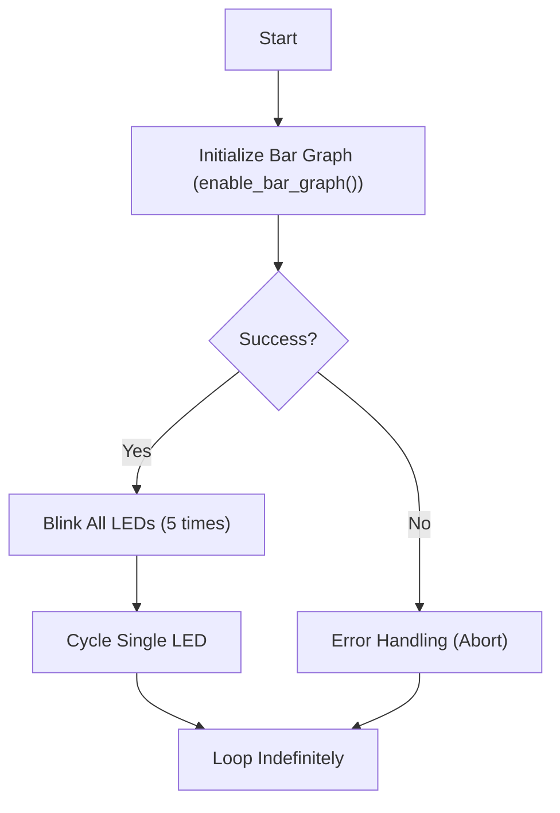

 # LED Blink Module

This module demonstrates a basic LED blinking functionality, a fundamental concept in embedded systems and electronics. It covers the essential aspects of controlling an LED, from understanding its basic function to implementing the blinking logic using the ESP32 microcontroller. This documentation provides a comprehensive overview of the LED blink module, including its components, code, and operational principles.

## Subsections

### What is an LED?

An LED, or **_Light Emitting Diode_**, is a semiconductor device that emits light when an electric current passes through it. It acts as a light sensor, emitting light that can be reflected from a surface, aiding in sensing the environment.

### How Does an LED Blink?

LED blinking can be achieved using various methods, including:

*   Relays
*   Transistors
*   Inverters (logic NOT-gates)
*   PWM (Pulse Width Modulation)

### Circuit Diagram

The circuit diagram for this module is as follows:


### Code Explanation

The core logic for the LED blink module resides in the `main.c` file. The code initializes the necessary GPIO pins for controlling the LEDs and then implements two blinking patterns: one that blinks all LEDs simultaneously and another that cycles a single LED across all positions.

#### Initializing the Bar Graph

The `enable_bar_graph()` function is responsible for initializing the GPIO pins connected to the LEDs. If this initialization is successful, it returns `ESP_OK`; otherwise, it returns `ESP_FAIL`. The `ESP_ERROR_CHECK()` macro is used to check the return value of this function. If an error occurs, an error message is printed to the console, and the program is aborted.

```c
ESP_ERROR_CHECK(enable_bar_graph());
```

[View on GitHub](https://github.com/SRA-VJTI/Wall-E/blob/main/1_led_blink/main/main.c#L10)

#### Blinking All LEDs Simultaneously

This section of the code blinks all eight LEDs together five times. It turns all LEDs on for one second and then off for another second, repeating this sequence five times.

```c
for (int i = 0; i < 5; i++)
{
    ESP_ERROR_CHECK(set_bar_graph(0xFF));
    vTaskDelay(1000 / portTICK_PERIOD_MS);
    ESP_ERROR_CHECK(set_bar_graph(0x00));
    vTaskDelay(1000 / portTICK_PERIOD_MS);
}
```

[View on GitHub](https://github.com/SRA-VJTI/Wall-E/blob/main/1_led_blink/main/main.c#L17-L28)

#### Cycling a Single LED

After blinking all LEDs simultaneously, the code then cycles a single LED across all positions. It uses a bitwise left-shift operation (`<<`) to move a single 'on' bit across the LEDs, creating the visual effect of a single LED moving across the bar graph.

```c
uint8_t var = 0x01;
while(1)
{
    if (var == 0x00)
    {
        var = 0x01;
    }
    ESP_ERROR_CHECK(set_bar_graph(var));
    var = var << 1;
    vTaskDelay(1000 / portTICK_PERIOD_MS);
}
```

[View on GitHub](https://github.com/SRA-VJTI/Wall-E/blob/main/1_led_blink/main/main.c#L30-L46)

#### Code Structure

The code utilizes FreeRTOS tasks for managing the blinking sequences. The `app_main()` function serves as the entry point, initializing the bar graph and then entering a `while(1)` loop to execute the blinking logic indefinitely.





## Key Integration Points

### GPIO Configuration

The correct configuration of GPIO pins is crucial for the LED blink module to function correctly. The `enable_bar_graph()` function handles this configuration.

### Timing and Delays

The `vTaskDelay()` function is used to introduce delays, controlling the blink rate. The delay duration (in milliseconds) is specified as an argument to this function.

### Error Handling

The `ESP_ERROR_CHECK()` macro is essential for detecting and handling errors. It ensures that any issues during the initialization or operation of the module are caught and addressed.