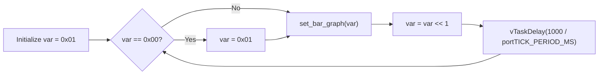
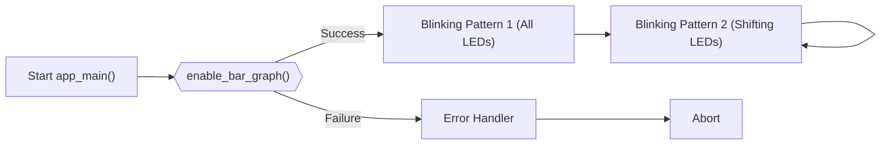

---
title: "LED Blinking"
description: "Details the implementation and usage of the LED blinking functionality."
---

# LED Blinking

This document details the implementation and usage of the LED blinking functionality in the Wall-E project. LED blinking is a fundamental concept in embedded systems, often used for visual feedback, debugging, or status indication. This implementation utilizes the ESP32 microcontroller and the SRA board's bar graph LEDs.

## What is a LED?

A Light Emitting Diode (LED) is a semiconductor light source. LEDs are used as indicator lamps in many devices and are increasingly used for other lighting. In this context, the LEDs on the SRA board are used to visually represent the state of the system or to indicate different operating modes.

## How does a LED blink?

Blinking an LED involves repeatedly turning it on and off at a specific frequency. This can be achieved using various methods, including:

*   **Delays:** Inserting pauses between turning the LED on and off.
*   **Timers:** Using hardware timers to trigger the on/off cycles.
*   **PWM (Pulse Width Modulation):** Rapidly switching the LED on and off, varying the duty cycle to control brightness.

In this implementation, delays are used for simplicity.

## Circuit Diagram

The circuit diagram shows the connection between the microcontroller and the LEDs. In the Wall-E project, the SRA board provides a pre-wired connection to the bar graph LEDs, simplifying the hardware setup.

## Implementation Details

The implementation uses the FreeRTOS operating system and the SRA board library. The `app_main()` function initializes the bar graph LEDs and then enters a loop that controls the blinking pattern.

### Initialization

The `enable_bar_graph()` function initializes the GPIO pins connected to the LEDs. This function is part of the `sra_board` library.

```c
#include "sra_board.h"

void app_main()
{
    ESP_ERROR_CHECK(enable_bar_graph());
    // ...
}
```

[View on GitHub](https://github.com/SRA-VJTI/Wall-E/blob/master/1_led_blink/main/main.c)

### Blinking Pattern 1: All LEDs

The first blinking pattern turns all 8 LEDs on and off simultaneously for 5 iterations.

```c
for (int i = 0; i < 5; i++)
{
    ESP_ERROR_CHECK(set_bar_graph(0xFF));
    vTaskDelay(1000 / portTICK_PERIOD_MS);
    ESP_ERROR_CHECK(set_bar_graph(0x00));
    vTaskDelay(1000 / portTICK_PERIOD_MS);
}
```

`set_bar_graph(0xFF)` turns all LEDs on (0xFF is a hexadecimal representation of 11111111 in binary), and `set_bar_graph(0x00)` turns them all off (0x00 is 00000000 in binary). The `vTaskDelay()` function introduces a delay of 1 second between each state.  `portTICK_PERIOD_MS` converts milliseconds to RTOS ticks.

[View on GitHub](https://github.com/SRA-VJTI/Wall-E/blob/master/1_led_blink/main/main.c)

### Blinking Pattern 2: Shifting LEDs

The second pattern shifts a single LED on from right to left.

```c
uint8_t var = 0x01;

while(1)
{   
    if (var == 0x00)
    {
        var = 0x01;
    }            
    ESP_ERROR_CHECK(set_bar_graph(var));
    var = var << 1;
    vTaskDelay(1000 / portTICK_PERIOD_MS);
}
```

Here, `var` is initialized to `0x01` (00000001 in binary), which turns on the rightmost LED. The `var = var << 1;` line left-shifts the bits in `var`, effectively moving the lit LED to the left. The loop continues indefinitely, creating the shifting effect. The conditional `if (var == 0x00)` resets var to 0x01 after it becomes 0x00 from left-shifting from 0x80.

[View on GitHub](https://github.com/SRA-VJTI/Wall-E/blob/master/1_led_blink/main/main.c)





### Error Handling
The `ESP_ERROR_CHECK()` macro checks the return value of ESP-IDF functions. If an error occurs, it prints an error message and aborts the program.
```c
ESP_ERROR_CHECK(set_bar_graph(0xFF));
```
[View on GitHub](https://github.com/SRA-VJTI/Wall-E/blob/master/1_led_blink/main/main.c)
This ensures that errors during LED control are caught and handled.

### FreeRTOS Delay
The `vTaskDelay()` function suspends the current task for a specified number of RTOS ticks.
```c
vTaskDelay(1000 / portTICK_PERIOD_MS);
```
[View on GitHub](https://github.com/SRA-VJTI/Wall-E/blob/master/1_led_blink/main/main.c)
This creates the delay between LED state changes, controlling the blinking speed.  `portTICK_PERIOD_MS` converts milliseconds to RTOS ticks, which are the units used by FreeRTOS for timing.

### Code Structure

The main structure of the `main.c` file can be represented as a flowchart:





## Key Integration Points

*   **`sra_board` Library:**  The `sra_board` library provides a high-level interface for controlling the LEDs on the SRA board.  This simplifies the code and makes it more readable.
*   **FreeRTOS:** FreeRTOS is used to manage the timing and execution of the LED blinking task. The `vTaskDelay()` function allows the task to be suspended for a specified period, controlling the blinking speed.
*   **GPIO Configuration:** The `enable_bar_graph()` function configures the GPIO pins connected to the LEDs, ensuring that they are properly initialized for output.

## Best Practices

*   **Error Handling:** Always check the return values of ESP-IDF functions and handle errors appropriately. The `ESP_ERROR_CHECK()` macro simplifies this process.
*   **Code Readability:** Use meaningful variable names and comments to make the code easier to understand.
*   **Modular Design:** Separate the LED control logic into functions to improve code organization and reusability.
*   **Timing Considerations:** When using delays, consider the impact on other tasks in the system. If precise timing is required, use hardware timers instead of delays.

This LED blinking example provides a foundation for more complex applications that involve visual feedback or status indication. By understanding the concepts and techniques presented here, you can create custom LED patterns and integrate them into your Wall-E project.
```