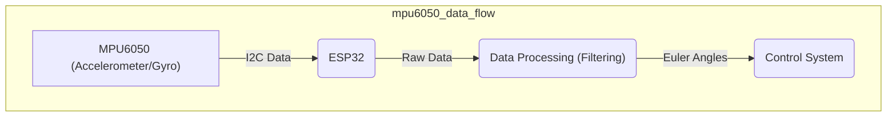
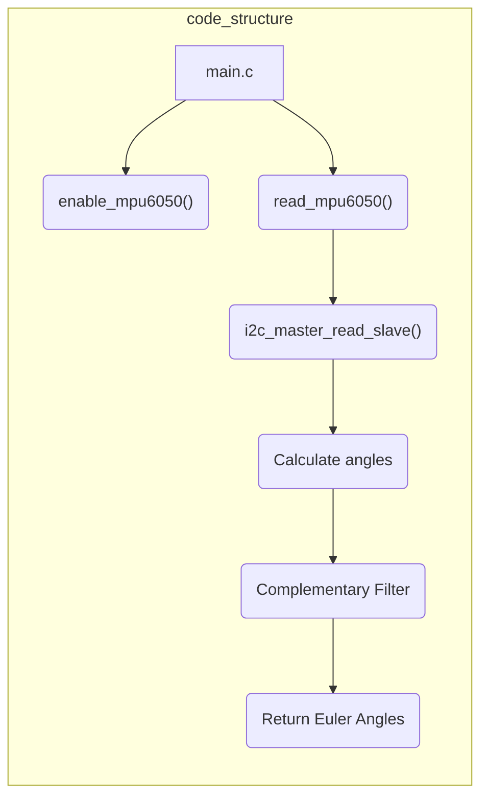

---
title: "MPU Sensor Details"
description: "Provides detailed information about the MPU sensor implementation."
---

# MPU Sensor Details

This document provides an in-depth look at the MPU6050 sensor implementation within the Wall-E project. The MPU6050 is a 6-axis motion tracking device, combining a MEMS gyroscope and a MEMS accelerometer. This section details the sensor's functionality, initialization, data acquisition, and application within the robot's control system.

## Understanding the MPU6050

The MPU6050 is an Inertial Measurement Unit (IMU) which is a system that measures and reports a moving object's specific force, angular rate, and sometimes the magnetic field surrounding the object. IMUs typically include three orthogonal rate gyroscopes and three orthogonal accelerometers. By processing signals from these devices, an IMU can track motion and orientation.

### Key Features:

*   **6-Axis Motion Tracking:** Combines a 3-axis gyroscope and a 3-axis accelerometer.
*   **I2C Communication:** Uses the standard I2C bus for data transmission, simplifying integration with microcontrollers like the ESP32.
*   **Low Voltage Operation:** Operates at 3.3V, making it directly compatible with the ESP32 without needing level shifters.

## Initialization

Initializing the MPU6050 involves waking it up from sleep mode and configuring the I2C communication. The following code snippet demonstrates how to enable the MPU6050.

```c
// From: 3_MPU/main/main.c
esp_err_t enable_mpu6050() {
    uint8_t data = 0;
    esp_err_t ret;

    // Write 0 to PWR_MGMT_1 register to wake up the MPU6050
    ret = i2c_master_write_slave(I2C_MASTER_NUM, MPU6050_ADDR, MPU6050_PWR_MGMT_1, &data, 1, I2C_MASTER_TIMEOUT_MS / portTICK_PERIOD_MS);
    if (ret != ESP_OK) {
        ESP_LOGE("MPU6050", "Failed to wake up MPU6050");
        return ESP_FAIL;
    }
    vTaskDelay(pdMS_TO_TICKS(10));

    return ESP_OK;
}

```

[View on GitHub](https://github.com/SRA-VJTI/Wall-E/blob/master/3_MPU/main/main.c)

Explanation: This function writes `0x00` to the `PWR_MGMT_1` register (address `0x6B`) to disable sleep mode. Proper error handling with `ESP_ERROR_CHECK` is essential for reliable operation.

## Reading Accelerometer and Gyroscope Data

The accelerometer measures linear acceleration, while the gyroscope measures angular velocity. Both sensors provide raw data that needs to be processed to obtain meaningful orientation information.

```c
// From: 3_MPU/main/main.c
esp_err_t read_mpu6050(float *euler_angle, float *mpu_offset) {
    uint8_t raw_data[14];
    int16_t accX, accY, accZ, gyroX, gyroY, gyroZ;
    float roll_acc, pitch_acc, roll, pitch;

    // Read accelerometer and gyroscope data from MPU6050 registers
    esp_err_t ret = i2c_master_read_slave(I2C_MASTER_NUM, MPU6050_ADDR, MPU6050_ACCEL_XOUT_H, raw_data, 14, I2C_MASTER_TIMEOUT_MS / portTICK_PERIOD_MS);
    if (ret != ESP_OK) {
        ESP_LOGE("MPU6050", "Failed to read MPU6050 data");
        return ESP_FAIL;
    }

    // Combine high and low bytes to form 16-bit values
    accX = (raw_data[0] << 8) | raw_data[1];
    accY = (raw_data[2] << 8) | raw_data[3];
    accZ = (raw_data[4] << 8) | raw_data[5];
    gyroX = (raw_data[8] << 8) | raw_data[9];
    gyroY = (raw_data[10] << 8) | raw_data[11];
    gyroZ = (raw_data[12] << 8) | raw_data[13];

    // Calculate roll and pitch angles from accelerometer data
    roll_acc = atan2(accY, accZ) * RAD_TO_DEG;
    pitch_acc = atan2(-accX, sqrt(accY * accY + accZ * accZ)) * RAD_TO_DEG;

    // Apply complementary filter to fuse accelerometer and gyroscope data
    roll = 0.98 * (euler_angle[0] + gyroX * GYRO_SCALE * DELTA_T) + 0.02 * roll_acc - mpu_offset[1];
    pitch = 0.98 * (euler_angle[1] + gyroY * GYRO_SCALE * DELTA_T) + 0.02 * pitch_acc - mpu_offset[0];

    euler_angle[0] = roll;
    euler_angle[1] = pitch;

    return ESP_OK;
}
```

[View on GitHub](https://github.com/SRA-VJTI/Wall-E/blob/master/3_MPU/main/main.c)

Explanation: This function reads raw accelerometer and gyroscope data from the MPU6050's registers.  It converts the combined high and low bytes to signed 16-bit integers. Accelerometer data is then used to calculate initial roll and pitch angles.  A complementary filter is applied to fuse accelerometer and gyroscope data, providing stable and accurate orientation estimates. Offsets are applied to calibrate the sensor.

## Complementary Filter

The complementary filter combines accelerometer and gyroscope readings to provide a more accurate and stable orientation estimate. The accelerometer is good for static orientation but is susceptible to noise, while the gyroscope is good for measuring changes in orientation but suffers from drift over time. The complementary filter uses a weighted average of the two sensor readings to mitigate these issues.

```python
# Pseudo-code for Complementary Filter
angle = 0.98 * (angle + gyro_rate * dt) + 0.02 * accelerometer_angle
```

The gyroscope provides a rate of change.  That rate is integrated over time (dt) to predict the angle change since the last measurement.
The accelerometer provides an absolute angle, but it's noisy. The complimentary filter blends the gyro rate and accelerometer angle together to achieve better results.

## I2C Communication

The MPU6050 communicates using the I2C protocol. The ESP32 acts as the I2C master, sending commands to and receiving data from the MPU6050 (slave).

```c
// Example I2C Write Function (simplified)
esp_err_t i2c_master_write_slave(i2c_port_t i2c_num, uint8_t slave_address, uint8_t register_address, uint8_t *data_wr, size_t size, TickType_t ticks_to_wait)
{
    i2c_cmd_handle_t cmd = i2c_cmd_link_create();
    i2c_master_start(cmd);
    i2c_master_write_byte(cmd, (slave_address << 1) | I2C_MASTER_WRITE, true);
    i2c_master_write_byte(cmd, register_address, true);
    i2c_master_write(cmd, data_wr, size, true);
    i2c_master_stop(cmd);
    esp_err_t ret = i2c_master_cmd_begin(i2c_num, cmd, ticks_to_wait);
    i2c_cmd_link_delete(cmd);
    return ret;
}
```

[View on GitHub](https://github.com/espressif/esp-idf/blob/master/examples/peripherals/i2c/i2c_master/main/i2c_master_example_main.c) (Note: This is from an ESP-IDF example, not the Wall-E repo directly, but demonstrates the fundamental I2C write operation.)

Explanation: This code uses the ESP-IDF I2C driver to write data to a specific register on the slave device.  It creates an I2C command, sets the slave address and register address, writes the data, and then executes the command. Error handling is critical for ensuring reliable communication.

```c
// Example I2C Read Function (simplified)
esp_err_t i2c_master_read_slave(i2c_port_t i2c_num, uint8_t slave_address, uint8_t register_address, uint8_t *data_rd, size_t size, TickType_t ticks_to_wait)
{
    i2c_cmd_handle_t cmd = i2c_cmd_link_create();
    i2c_master_start(cmd);
    i2c_master_write_byte(cmd, (slave_address << 1) | I2C_MASTER_WRITE, true);
    i2c_master_write_byte(cmd, register_address, true);
    i2c_master_start(cmd);
    i2c_master_write_byte(cmd, (slave_address << 1) | I2C_MASTER_READ, true);
    i2c_master_read(cmd, data_rd, size, I2C_MASTER_LAST_NACK);
    i2c_master_stop(cmd);
    esp_err_t ret = i2c_master_cmd_begin(i2c_num, cmd, ticks_to_wait);
    i2c_cmd_link_delete(cmd);
    return ret;
}
```

[View on GitHub](https://github.com/espressif/esp-idf/blob/master/examples/peripherals/i2c/i2c_master/main/i2c_master_example_main.c) (Note: This is from an ESP-IDF example, not the Wall-E repo directly, but demonstrates the fundamental I2C read operation.)

Explanation: This code demonstrates reading data from a slave device using the ESP-IDF I2C driver. It first writes the register address to read from, then performs a repeated start and reads the data.  The `I2C_MASTER_LAST_NACK` argument ensures that the slave stops transmitting after the requested number of bytes have been read.

## Visualization

The calculated roll and pitch angles can be visualized, allowing for debugging and calibration.

```c
// From: 3_MPU/main/main.c
#ifdef CONFIG_ENABLE_OLED
                // Displaying pitch and roll on OLED
                display_mpu(euler_angle[1], euler_angle[0]);
#endif
```

[View on GitHub](https://github.com/SRA-VJTI/Wall-E/blob/master/3_MPU/main/main.c)

Explanation: This code uses the OLED display (if enabled) to show the calculated pitch and roll angles. This is very useful for visualizing the sensor output and debugging the implementation.

## MPU6050 Data Flow





This diagram illustrates the flow of data from the MPU6050 to the ESP32, where it is processed and used by the control system.

## Code Structure





This diagram illustrates the main functions involved in reading and processing data from the MPU6050.

## Key Integration Points

*   **Calibration:** Proper calibration is crucial for accurate orientation estimation. The MPU6050 may have inherent biases that need to be compensated for.  This is achieved using the `mpu_offset` parameters.
*   **Noise Reduction:** Filtering techniques, such as the complementary filter, are essential for reducing noise and drift in the sensor data.
*   **Real-Time Performance:** The MPU6050 data processing needs to be performed in real-time to ensure accurate control of the robot. Optimize calculations to ensure that they complete within the required time constraints.
*   **I2C Configuration:** Correctly configuring the I2C bus, including setting the clock speed and pull-up resistors, is essential for reliable communication with the MPU6050.
* **Sensor Fusion:** The complementary filter is a simple but effective method for sensor fusion. More advanced algorithms like Kalman filters can be used for even better accuracy.

By understanding these key aspects of the MPU6050 implementation, developers can effectively utilize this sensor for motion tracking and control in the Wall-E project.
```