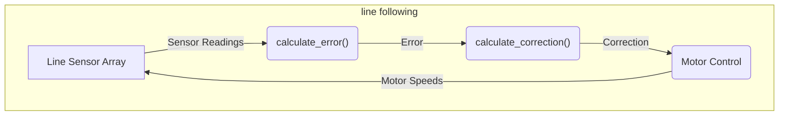

---
title: "Line Following System"
description: "Explains the line following system including sensor inputs and motor control logic."
---

# Line Following System

The line following system is a crucial component of Wall-E, enabling it to autonomously navigate a predefined path. This system relies on a combination of sensor inputs, a PID control algorithm, and precise motor control. This document provides a detailed explanation of the system's theory, implementation, and tuning.

## Overview

The system uses a 5-sensor line sensor array to detect a black line on a white surface (or vice versa). The sensor data is then processed by a PID controller, which generates correction signals to adjust the motor speeds. By continuously monitoring the line position and adjusting the motor speeds accordingly, Wall-E can accurately follow the line.

## Key Components

*   **Line Sensor Array:** Detects the line's position.
*   **PID Controller:** Calculates the necessary correction based on the error.
*   **Motor Control:** Adjusts motor speeds based on the PID output.

## Theory of Operation

### Sensor Input

The line sensor array consists of five analog sensors, each providing a reading based on the reflectance of the surface beneath it. These sensors are strategically positioned to cover a specific area around the line. Each sensor is assigned a weight, typically {-5, -3, 1, 3, 5}, corresponding to its position from left to right. The readings from these sensors are used to calculate an error value, which represents the bot's deviation from the center of the line.

### PID Control

The PID (Proportional-Integral-Derivative) controller is the core of the line following system. It continuously adjusts the motor speeds to minimize the error between the bot's current position and the desired line position.

#### Proportional Term (Kp)

The proportional term provides an immediate correction proportional to the current error.

```c
correction = Kp * Error;
```

[View on GitHub](https://github.com/SRA-VJTI/Wall-E/blob/master/6_line_following/main/line_following.c)

A higher Kp value results in a more aggressive correction, while a lower value results in a slower response.

#### Integral Term (Ki)

The integral term accumulates past errors to eliminate steady-state errors. This is particularly useful for correcting persistent deviations caused by mechanical imbalances or sensor biases.

```c
cumulative_error += error;
correction += Ki * cumulative_error;
```

[View on GitHub](https://github.com/SRA-VJTI/Wall-E/blob/master/6_line_following/main/line_following.c)

#### Derivative Term (Kd)

The derivative term predicts future error based on the rate of change of the current error. It helps dampen oscillations and improve the system's stability.

```c
difference = error - prev_error;
correction += Kd * difference;
```

[View on GitHub](https://github.com/SRA-VJTI/Wall-E/blob/master/6_line_following/main/line_following.c)

### Motor Control Logic

The PID controller outputs a correction value that is used to adjust the motor speeds. The left motor speed is increased, and the right motor speed is decreased (or vice versa), to steer the bot back onto the line. The motor speeds are typically bounded to prevent excessive values and ensure smooth operation.

```c
left_duty_cycle = bound((optimum_duty_cycle + correction), lower_duty_cycle, higher_duty_cycle);
right_duty_cycle = bound((optimum_duty_cycle - correction), lower_duty_cycle, higher_duty_cycle);

set_motor_speed(motor_a_0, MOTOR_FORWARD, left_duty_cycle);
set_motor_speed(motor_a_1, MOTOR_FORWARD, right_duty_cycle);
```

[View on GitHub](https://github.com/SRA-VJTI/Wall-E/blob/master/6_line_following/main/line_following.c)

## Algorithm

The line following algorithm can be summarized as follows:

1.  Initialize the line sensor array, motors, and PID constants.
2.  Read the sensor values from the line sensor array.
3.  Normalize the sensor readings.
4.  Calculate the error using the weighted average of the sensor readings.
5.  Calculate the PID correction value.
6.  Adjust the motor speeds based on the correction value.
7.  Repeat steps 2-6.

## Implementation Details

### `calculate_error()` Function

This function calculates the error based on the line sensor readings. It assigns weights to each sensor and computes a weighted average to determine the bot's deviation from the center of the line.

```c
void calculate_error()
{
    int all_black_flag = 1; // assuming initially all black condition
    float weighted_sum = 0, sum = 0; 
    float pos = 0; int k = 0;

    for(int i = 0; i < 5; i++)
    {
        if(line_sensor_readings.adc_reading[i] > BLACK_BOUNDARY)
        {
            all_black_flag = 0;
        }
        if(line_sensor_readings.adc_reading[i] > BLACK_BOUNDARY)
        {
            k = 1;
        }
        if(line_sensor_readings.adc_reading[i] < BLACK_BOUNDARY)
        {
            k = 0;
        }
        weighted_sum += (float)(weights[i]) * k;
        sum = sum + k;
    }

    if(sum != 0) // sum can never be 0 but just for safety purposes
    {
        pos = (weighted_sum - 1) / sum; // This will give us the position wrt line. if +ve then bot is facing left and if -ve the bot is facing to right.
    }

    if(all_black_flag == 1)  // If all black then we check for previous error to assign current error.
    {
        if(prev_error > 0)
        {
            error = 2.5;
        }
        else
        {
            error = -2.5;
        }
    }
    else
    {
        error = pos;
    }
}
```

[View on GitHub](https://github.com/SRA-VJTI/Wall-E/blob/master/6_line_following/main/line_following.c)

### `calculate_correction()` Function

This function calculates the PID correction value based on the current error, previous error, and cumulative error.

```c
void calculate_correction()
{
    error = error*10;  // we need the error correction in range 0-100 so that we can send it directly as duty cycle paramete
    difference = error - prev_error;
    cumulative_error += error;

    cumulative_error = bound(cumulative_error, -30, 30);

    correction = read_pid_const().kp*error + read_pid_const().ki*cumulative_error + read_pid_const().kd*difference;
    prev_error = error;
}
```

[View on GitHub](https://github.com/SRA-VJTI/Wall-E/blob/master/6_line_following/main/line_following.c)

### `line_follow_task()` Function

This is the main task that orchestrates the line following process. It reads sensor data, calculates the error and correction, and controls the motors.

```c
void line_follow_task(void* arg)
{
    motor_handle_t motor_a_0, motor_a_1;
    ESP_ERROR_CHECK(enable_motor_driver(&motor_a_0, MOTOR_A_0));
    ESP_ERROR_CHECK(enable_motor_driver(&motor_a_1, MOTOR_A_1));
    adc_handle_t line_sensor;
    ESP_ERROR_CHECK(enable_line_sensor(&line_sensor));
    ESP_ERROR_CHECK(enable_bar_graph());

    while(true)
    {
        line_sensor_readings = read_line_sensor(line_sensor);
        for(int i = 0; i < 5; i++)
        {
            line_sensor_readings.adc_reading[i] = bound(line_sensor_readings.adc_reading[i], WHITE_MARGIN, BLACK_MARGIN);
            line_sensor_readings.adc_reading[i] = map(line_sensor_readings.adc_reading[i], WHITE_MARGIN, BLACK_MARGIN, bound_LSA_LOW, bound_LSA_HIGH);
            line_sensor_readings.adc_reading[i] = 1000 - (line_sensor_readings.adc_reading[i]);
        }

        calculate_error();
        calculate_correction();

        left_duty_cycle = bound((optimum_duty_cycle + correction), lower_duty_cycle, higher_duty_cycle);
        right_duty_cycle = bound((optimum_duty_cycle - correction), lower_duty_cycle, higher_duty_cycle);

        set_motor_speed(motor_a_0, MOTOR_FORWARD, left_duty_cycle);
        set_motor_speed(motor_a_1, MOTOR_FORWARD, right_duty_cycle);

        ESP_LOGI("debug", "KP: %f ::  KI: %f  :: KD: %f", read_pid_const().kp, read_pid_const().ki, read_pid_const().kd);

        vTaskDelay(10 / portTICK_PERIOD_MS);
    }

    vTaskDelete(NULL);
}
```

[View on GitHub](https://github.com/SRA-VJTI/Wall-E/blob/master/6_line_following/main/line_following.c)

## PID Tuning Interface

The system includes a web-based interface for tuning the PID constants. This interface allows users to adjust the Kp, Ki, and Kd values in real-time and observe the effect on the bot's performance.

```html
<!DOCTYPE html>
<html lang="en">
	<head>
		<meta charset="UTF-8" />
		<meta name="viewport" content="width=device-width, initial-scale=1.0" />
		<title>Tuning page</title>
    </head>
    <body>
        <main>
			<h1>Line Following</h1>
			<div class="button-group">
				<h3>Kp</h3>
				<button>&lt;</button>
				<input type="number" value="0.000" id="kp" />
				<button>&gt;</button>
			</div>
			<div class="button-group">
				<h3>Ki</h3>
				<button>&lt;</button>
				<input type="number" value="0.000" id="ki" />
				<button>&gt;</button>
			</div>
			<div class="button-group">
				<h3>Kd</h3>
				<button>&lt;</button>
				<input type="number" value="0.000" id="kd" />
				<button>&gt;</button>
			</div>
		</main>
    </body>
</html>
```

[View on GitHub](https://github.com/SRA-VJTI/Wall-E/blob/master/6_line_following/frontend/index.html)

The `start_tuning_http_server()` function starts an HTTP server that serves this interface.  Changes made in the web interface are sent to the ESP32 via POST requests to `/api/v1/pid`.

## System Flow





## Best Practices

*   Start with tuning the Proportional (Kp) term first.
*   Increase the Integral (Ki) term to eliminate any steady-state error.
*   Adjust the Derivative (Kd) term to dampen oscillations and improve stability.
*   Test the system thoroughly on various line conditions.

## Key Integration Points

*   The line following system is tightly integrated with the motor control system.
*   The PID tuning interface allows for easy adjustment of the control parameters.
*   The system can be further enhanced by incorporating obstacle avoidance and path planning algorithms.

By understanding the theory, implementation, and tuning of the line following system, developers can effectively configure Wall-E to navigate complex paths with precision and reliability.
```