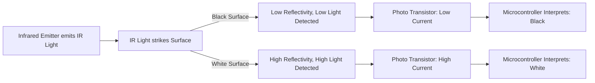
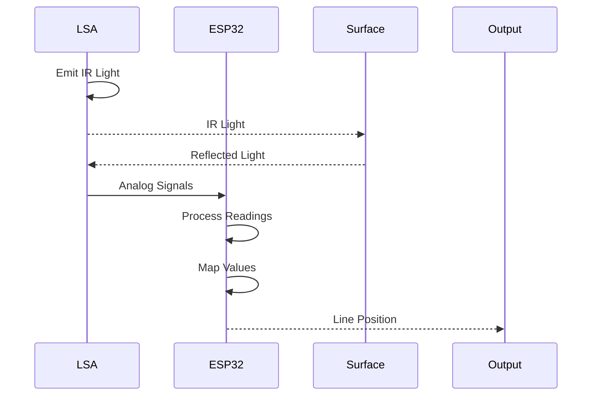

 # LSA Module

## Overview

The Light Sensor Array (LSA) is a crucial component in our line-following robot, responsible for detecting white/black lines on a surface and relaying this information to the ESP32 microcontroller. This module enables the robot to navigate autonomously.

### Physical Representation

The physical LSA module consists of infrared emitters, photo transistors, resistors, and a JST connector.

### PCB Model

The PCB model provides a structured and organized arrangement of the LSA components.

## Components and Functionality

The LSA module comprises several key components working in concert:

| Component          | Description                                                    | Quantity |
| ------------------ | -------------------------------------------------------------- | -------- |
| Infrared Emitter   | Emits infrared light.                                         | 5        |
| Photo Transistor   | Detects the reflected infrared light.                        | 5        |
| Resistors          | Current limiting resistors                                    | 10       |
| JST connector      | Connects the LSA to the SRA board or other PCB.                | 1        |

## Working Principle

The LSA operates based on the principle of light reflectivity. Black surfaces absorb most of the infrared light, resulting in low reflectivity, while white surfaces reflect most of the light, leading to high reflectivity. The photo transistors detect the reflected light, and the microcontroller interprets these readings to determine the surface type.





## Code Snippets

### 1. Enabling the Line Sensor
This function initializes and configures the ADC (Analog-to-Digital Converter) to read data from the LSA sensors. [View on GitHub](https://github.com/SRA-VJTI/Wall-E/blob/main/2_LSA/main/main.c#L50-L52).

```c
    esp_err_t enable_line_sensor(int mode)
```

```c
    adc_handle_t line_sensor;
    ESP_ERROR_CHECK(enable_line_sensor(&line_sensor));
```
### 2. Reading the Line Sensor
This part of the code reads the analog values from the LSA sensors. [View on GitHub](https://github.com/SRA-VJTI/Wall-E/blob/main/2_LSA/main/main.c#L68-L68).

```c
    line_sensor_array line_sensor_readings;
```
```c
    line_sensor_readings = read_line_sensor(line_sensor);
```

### 3. Bounding the Sensor Readings
This function constrains sensor readings within defined minimum and maximum limits. [View on GitHub](https://github.com/SRA-VJTI/Wall-E/blob/main/2_LSA/main/main.c#L70-L70).

```c
            line_sensor_readings.adc_reading[i] = bound(line_sensor_readings.adc_reading[i], WHITE_MARGIN, BLACK_MARGIN);
```

### 4. Mapping the Sensor Readings
The map function is used to scale the sensor readings to a more useful range. [View on GitHub](https://github.com/SRA-VJTI/Wall-E/blob/main/2_LSA/main/main.c#L72-L72).

```c
            line_sensor_readings.adc_reading[i] = map(line_sensor_readings.adc_reading[i], WHITE_MARGIN, BLACK_MARGIN, CONSTRAIN_LSA_LOW, CONSTRAIN_LSA_HIGH);
```

## Key Integration Points

### Data Flow

The LSA module's data flow begins with the emission of infrared light. This light interacts with the surface, and the reflected light is captured by the photo transistors. The photo transistors convert the light into electrical signals, which are then read by the ADC on the ESP32. The readings are processed and mapped to a useful scale, which helps determine the position of the line.





### Best Practices
*   **Calibration:** Proper calibration is crucial for accurate line detection. This involves defining the range of readings for white and black surfaces.
*   **Sensor Placement:** Ensure the LSA is positioned close to the ground for optimal readings and to minimize interference from ambient light.
*   **Filtering:** Implement filtering techniques (e.g., averaging) to reduce noise and provide more stable readings.
*   **Testing:** Thorough testing is necessary to ensure the robot correctly follows the line under various lighting conditions and surface types.