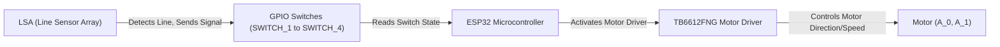
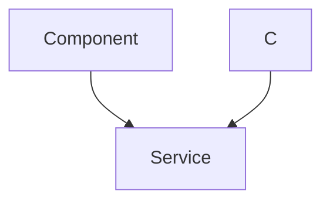

---
title: "Switch Controlled Motor"
description: "Describes how a switch controls the state of a motor."
---

# Switch Controlled Motor

This document explains how a switch is used to control the state (direction and speed) of a motor using the SRA-VJTI Wall-E robot's motor drivers. The system utilizes the TB6612FNG motor drivers in normal mode, allowing for individual control of up to four motors. This project focuses on reading input from switches activated by Line Sensor Array (LSA) and controlling the motors accordingly.

## Motor Driver Modes: Normal Mode

The SRA board uses TB6612FNG motor drivers, supporting both Normal and Parallel modes. This project utilizes the normal mode for independent motor control.

In normal mode, each TB6612FNG driver can control two motors. The direction of each motor is controlled by two GPIO pins (IN1 and IN2). The table below illustrates how the motor's direction is determined based on the input signals to these pins:

| IN2\IN1 | High | Low |
|---|---|---|
| High | Move motor forward | Move Motor Forward |
| Low | Move motor backward | Stop Motor |

This allows precise control over the motor's movement, which is essential for navigation and other robotic tasks.

## Working Principle

The core functionality involves activating GPIO switches to receive input from the LSA. This input dictates the desired movement of the motors connected to one of the TB6612FNG drivers operating in normal mode. Based on the LSA input, the motors are driven forward, backward, or stopped.





## Code Implementation Details

The `switch_control_motor_normal.c` file contains the main logic for controlling the motors based on the switch inputs.

### Enabling Switches and Motor Drivers

The code first enables the GPIO pins associated with the switches and then initializes the motor drivers.

```c
#include "sra_board.h"

void drive_task(void *arg)
{
	enable_switches();

	motor_handle_t motor_a_0, motor_a_1;
	ESP_ERROR_CHECK(enable_motor_driver(&motor_a_0, MOTOR_A_0));
	ESP_ERROR_CHECK(enable_motor_driver(&motor_a_1, MOTOR_A_1));

    // ... rest of the code
}
```

[View on GitHub](https://github.com/SRA-VJTI/Wall-E/blob/master/4_switch_controlled_motor_normal/main/switch_control_motor_normal.c)

`enable_switches()` activates the GPIO pins for the switches. `enable_motor_driver()` initializes the TB6612FNG drivers, providing a handle for each motor.

### Reading Switch Inputs and Controlling Motors

The code continuously reads the state of each switch and sets the motor speed and direction accordingly.

```c
		if (read_switch(SWITCH_1))
		{
			set_motor_speed(motor_a_0, MOTOR_FORWARD, 80);
			ESP_LOGI(TAG_SWITCH_CONTROL_MOTOR, "MOTOR_A_0 FORWARD");
		}
		else if (read_switch(SWITCH_2))
		{
			set_motor_speed(motor_a_0, MOTOR_BACKWARD, 80);
			ESP_LOGI(TAG_SWITCH_CONTROL_MOTOR, "MOTOR_A_0 BACKWARD");
		}
		else
		{
			set_motor_speed(motor_a_0, MOTOR_STOP, 0);
		}
```

[View on GitHub](https://github.com/SRA-VJTI/Wall-E/blob/master/4_switch_controlled_motor_normal/main/switch_control_motor_normal.c)

`read_switch()` checks the state of a given switch. `set_motor_speed()` configures the motor's direction and speed (duty cycle).  `MOTOR_FORWARD`, `MOTOR_BACKWARD`, and `MOTOR_STOP` are predefined constants. `ESP_LOGI` prints logs for debugging and monitoring.

### Task Creation and Main Function

The `app_main` function creates a FreeRTOS task to run the motor control logic.

```c
void app_main()
{
	xTaskCreate(&drive_task, "drive_task", 4096, NULL, 1, NULL);
}
```

[View on GitHub](https://github.com/SRA-VJTI/Wall-E/blob/master/4_switch_controlled_motor_normal/main/switch_control_motor_normal.c)

`xTaskCreate` creates a new task named `drive_task`, allocating memory and setting its priority. This allows the motor control logic to run concurrently with other tasks.

## Relevant Functions from `sra_board.h`

The following functions from the `sra_board.h` file are essential for this project:

- `enable_switches()`: Activates the GPIO pins for reading switch inputs.
- `enable_motor_driver(motor_handle_t *handle, motor_channel_t channel)`: Initializes the motor driver for a specific motor channel.
- `read_switch(switch_t switch_num)`: Reads the state of a specific switch.
- `set_motor_speed(motor_handle_t handle, motor_direction_t direction, uint8_t speed)`: Sets the speed and direction of a motor.

### `enable_switches()` Function

```c
// From sra_board/src/switches.c (Hypothetical Location)
void enable_switches() {
    // Configuration of GPIO pins for switches (SWITCH_1, SWITCH_2, SWITCH_3, SWITCH_4)
    // Setting pin direction as input
    // Enabling pull-up resistors if needed
}
```

This function configures the designated GPIO pins connected to the physical switches, ensuring they are ready to receive input signals.

### `enable_motor_driver()` Function

```c
// From sra_board/src/motor_driver.c (Hypothetical Location)
esp_err_t enable_motor_driver(motor_handle_t *handle, motor_channel_t channel) {
    // Initialization of motor driver related configurations
    // Setting up GPIO pins for motor control (IN1, IN2, PWM)
    // Configuring PWM parameters
    return ESP_OK;
}
```

This function initializes the motor driver for a specified motor channel. It configures the necessary GPIO pins for controlling the motor's direction and speed through PWM.

### `read_switch()` Function

```c
// From sra_board/src/switches.c (Hypothetical Location)
bool read_switch(switch_t switch_num) {
    // Reads the digital value from the GPIO pin associated with the given switch_num
    // Returns true if the switch is activated (HIGH), false otherwise.
    return gpio_get_level(switch_num);
}
```

This function reads the digital value from the GPIO pin associated with a specified switch number. It returns `true` if the switch is activated (HIGH) and `false` otherwise.

### `set_motor_speed()` Function

```c
// From sra_board/src/motor_driver.c (Hypothetical Location)
esp_err_t set_motor_speed(motor_handle_t handle, motor_direction_t direction, uint8_t speed) {
    // Sets the motor speed and direction using PWM and GPIO signals.
    // Sets the GPIO levels for IN1 and IN2 based on the direction.
    // Adjusts the PWM duty cycle based on the speed parameter.
    return ESP_OK;
}
```

This function sets the motor's speed and direction using PWM and GPIO signals. It configures the GPIO levels for the `IN1` and `IN2` pins based on the desired direction and adjusts the PWM duty cycle based on the speed parameter.

## FreeRTOS Task

The motor control logic is encapsulated within a FreeRTOS task, allowing it to run concurrently with other system tasks. This ensures that the motor control is responsive and does not block other critical operations.

```c
void drive_task(void *arg)
{
	// ... motor control logic ...
	vTaskDelay(100 / portTICK_PERIOD_MS); // Delay for 100ms
}
```

[View on GitHub](https://github.com/SRA-VJTI/Wall-E/blob/master/4_switch_controlled_motor_normal/main/switch_control_motor_normal.c)

The `vTaskDelay` function suspends the task for a specified duration, preventing it from consuming excessive CPU resources.





## Key Integration Points

- **LSA Integration:** The project relies on input from the Line Sensor Array (LSA) to determine the desired motor behavior. Proper calibration and configuration of the LSA are crucial for accurate line following.
- **Motor Driver Configuration:** The TB6612FNG motor drivers must be correctly initialized and configured to ensure proper motor control. This includes setting the correct GPIO pins and PWM parameters.
- **FreeRTOS Task Management:** The motor control logic should be implemented as a FreeRTOS task to allow for concurrent execution and prevent blocking of other system tasks.

## Best Practices

- Use descriptive variable names and comments to improve code readability.
- Implement error handling to gracefully handle unexpected situations, such as switch failures or motor driver errors.
- Optimize the motor control logic to minimize CPU usage and ensure responsiveness.
- Thoroughly test the system to ensure that the motors behave as expected in various scenarios.

This documentation provides a comprehensive overview of the switch-controlled motor system implemented in the SRA-VJTI Wall-E robot. By following these guidelines and best practices, you can effectively control the motors and achieve the desired robotic behavior.
```