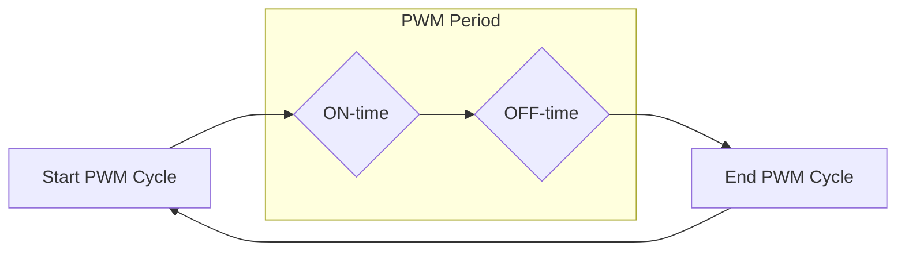
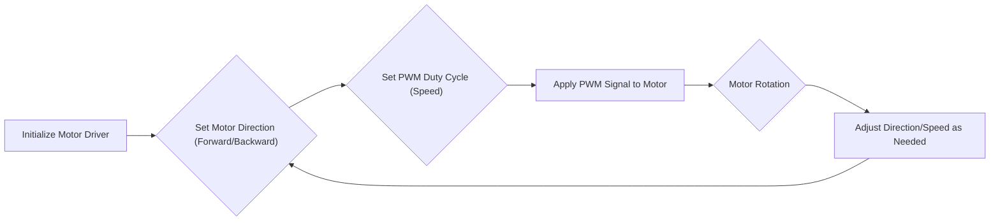

# PWM Motor Control

This document explains the Pulse Width Modulation (PWM) based motor control functionality implemented in the Wall-E project. PWM is a technique used to control the average power delivered to an electrical device by varying the duty cycle of a square wave signal. This is particularly useful for controlling the speed and direction of DC motors.

## Understanding PWM

Pulse Width Modulation (PWM) involves varying the width of a pulse while keeping the frequency constant. The **duty cycle** is the percentage of time the signal is HIGH during one period.

### Duty Cycle

The duty cycle is calculated as:

```
Duty Cycle = (ON-time / Period) * 100%
```

A higher duty cycle means more power is delivered to the motor, resulting in higher speed (for forward or backward direction based on other control signals).

### Period

The period of the PWM signal is the sum of the ON-time and OFF-time:

```
Period = ON-time + OFF-time
```





## Applications of PWM

PWM is widely used in various applications, including:

*   LED dimming
*   Motor speed control
*   Voltage regulation

## LED Dimmer

LED dimming is a simple example of PWM in action. By varying the duty cycle of the PWM signal applied to an LED, its brightness can be controlled.

## PWM for Motor Control

PWM is commonly used to control the speed of DC motors. By varying the duty cycle, the average voltage applied to the motor is controlled, thereby controlling its speed.

### Motor Drivers

Motor drivers act as interfaces between the control circuit and the motor. They amplify the low current control signal from the microcontroller to a higher current signal required by the motor. The TB6612FNG motor driver is used in this project.

## Code Implementation

Let's examine the code used to implement PWM motor control.

### Enabling the Motor Driver

The `enable_motor_driver` function enables the motor driver.

```c
esp_err_t enable_motor_driver(motor_handle_t *motor_handle, int motor_id) {
    // Implementation details to enable the motor driver
    // Initializes necessary GPIO pins and PWM configurations
    return ESP_OK; // Or ESP_FAIL in case of error
}
```

[View on GitHub](https://github.com/SRA-VJTI/Wall-E/blob/master/5_PWM/main/pwm_test.c)

### Setting Motor Speed

The `set_motor_speed` function sets the speed and direction of the motor using PWM.

```c
esp_err_t set_motor_speed (motor_handle_t motor, int direction, float duty_cycle )
{
    // Implementation details to control the motor speed and direction
    // Sets the PWM duty cycle and direction pins for the specified motor.
    return ESP_OK; // Or ESP_FAIL in case of error
}
```

[View on GitHub](https://github.com/SRA-VJTI/Wall-E/blob/master/5_PWM/main/pwm_test.c)

### PWM Task

The `pwm_task` function is responsible for controlling the motors using PWM. It initializes the motor drivers and then enters a loop to vary the motor speeds.

```c
void pwm_task(void *arg)
{
	motor_handle_t motor_a_0, motor_a_1;
	ESP_ERROR_CHECK(enable_motor_driver(&motor_a_0, MOTOR_A_0)); // Enable motor driver A0
	ESP_ERROR_CHECK(enable_motor_driver(&motor_a_1, MOTOR_A_1)); // Enable motor driver A1

	// Make the Motors go forward & backward alternatively, at different PWM from 60 to 100
	while (1)
	{
		for (int duty_cycle = 60; duty_cycle <= 100; duty_cycle++)
		{
			// setting motor speed of MOTOR A0 in forward direction with duty cycle
			set_motor_speed(motor_a_0, MOTOR_FORWARD, duty_cycle);

			// setting motor speed of MOTOR A1 in forward direction with duty cycle
			set_motor_speed(motor_a_1, MOTOR_FORWARD, duty_cycle);

			// adding delay of 100ms
			vTaskDelay(100 / portTICK_PERIOD_MS);
		}

		// stopping the MOTOR A0
		set_motor_speed(motor_a_0, MOTOR_STOP, 0);

		// stopping the MOTOR A1
		set_motor_speed(motor_a_1, MOTOR_STOP, 0);

		// adding delay of 100ms
		vTaskDelay(100 / portTICK_PERIOD_MS);

		for (int duty_cycle = 60; duty_cycle <= 100; duty_cycle++)
		{
			// setting motor speed of MOTOR A0 in backward direction with duty cycle
			set_motor_speed(motor_a_0, MOTOR_BACKWARD, duty_cycle);

			// setting motor speed of MOTOR A1 in backward direction with duty cycle
			set_motor_speed(motor_a_1, MOTOR_BACKWARD, duty_cycle);

			// adding delay of 100ms
			vTaskDelay(100 / portTICK_PERIOD_MS);
		}

		// stopping the MOTOR A0
		set_motor_speed(motor_a_0, MOTOR_STOP, 0);

		// stopping the MOTOR A1
		set_motor_speed(motor_a_1, MOTOR_STOP, 0);

		// adding delay of 100ms
		vTaskDelay(100 / portTICK_PERIOD_MS);
	}
}
```

[View on GitHub](https://github.com/SRA-VJTI/Wall-E/blob/master/5_PWM/main/pwm_test.c)

### Task Creation

The `app_main` function creates the `pwm_task`.

```c
void app_main()
{
	// Basic Function for task creation
	xTaskCreate(&pwm_task, "pwm_task", 4096, NULL, 1, NULL);
}
```

[View on GitHub](https://github.com/SRA-VJTI/Wall-E/blob/master/5_PWM/main/pwm_test.c)

### FreeRTOS Delay

The `vTaskDelay` function is used to introduce delays in the `pwm_task`.

```c
void vTaskDelay(const TickType_t xTicksToDelay)
{
  //Implementation details for task delay
}
```

### Task Creation using FreeRTOS

The function `xTaskCreate` is from FreeRTOS library.

```c
static BaseType_t xTaskCreate(TaskFunction_t pvTaskCode, 
                                  const char *constpcName, 
                                  const uint32_t usStackDepth, 
                                  void *constpvParameters, 
                                  UBaseType_t uxPriority, 
                                  TaskHandle_t *constpvCreatedTask)
{
  //Implementation for creating FreeRTOS task
  return pdPASS;
}
```

### PWM Control Flow

The following diagram illustrates the general control flow of the PWM motor control system:





## Key Integration Points

*   **Motor Driver Initialization:** Ensure the motor driver is correctly initialized with the appropriate GPIO pins and PWM configurations.
*   **Duty Cycle Mapping:** Map the desired motor speed to a corresponding PWM duty cycle. Consider non-linear relationships between duty cycle and motor speed.
*   **Direction Control:** Implement logic to control the direction of the motor (forward, backward, stop) using appropriate GPIO signals.
*   **Task Scheduling:** Use FreeRTOS task scheduling to manage the PWM control task efficiently, allowing other tasks to run concurrently.

This documentation provides an overview of the PWM motor control implementation in the Wall-E project, covering the underlying principles, code implementation, and key integration points.