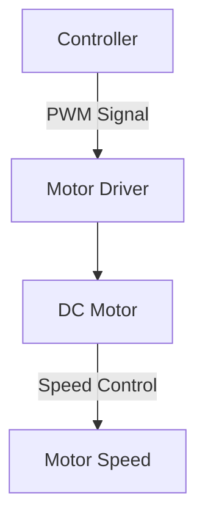

 # PWM Module

This document provides a comprehensive overview of the Pulse Width Modulation (PWM) module, its functionalities, and its application in controlling various hardware components, particularly motors and LEDs.

## Pulse Width Modulation

Pulse Width Modulation (PWM) is a powerful technique used to control analog devices with digital means. It involves generating a square wave signal whose "on-time" (pulse width) is varied to control the average voltage applied to a load.

### Duty Cycle

The duty cycle is a crucial parameter in PWM, representing the percentage of time the signal is high during a period. A higher duty cycle results in a higher average voltage.

### Period

The period of a PWM signal is the sum of the "on-time" and "off-time." The frequency of the PWM signal is the inverse of its period.

## LED Dimmer

PWM is extensively used in LED dimming applications. By varying the duty cycle of the PWM signal, we can control the brightness of an LED.

```c
// Example: Setting LED brightness using PWM
// Assuming a PWM pin is configured for LED control
// and duty_cycle is a value between 0 and 100
void set_led_brightness(int duty_cycle) {
    // Implementation to set the PWM duty cycle
    // based on the duty_cycle value.
    // This part depends on the specific hardware/library
    // being used for PWM generation.
}
```
[View on GitHub](https://github.com/SRA-VJTI/Wall-E/blob/main/5_PWM/main/pwm_test.c)

## PWM for controlling speed

PWM is extensively used in controlling the speed of DC motors.





## Motor Drivers

Motor drivers act as an interface between the control circuits and the motors. They amplify the low-current control signals from the microcontroller to drive the motor with the required current.

```c
// Function to set motor speed and direction
esp_err_t set_motor_speed(int motor_id, int direction, float duty_cycle) {
    // Implementation to set motor speed
    // This part depends on the specific motor driver and hardware setup.
}
```
[View on GitHub](https://github.com/SRA-VJTI/Wall-E/blob/main/5_PWM/main/pwm_test.c)

## Description Of Functions Used

The provided code includes several functions designed for controlling motor drivers and managing PWM signals.

```c
// Function to enable motor driver A
esp_err_t enable_motor_driver_a(int mode) {
    // Implementation to enable motor driver A
    // based on the provided mode
}
```
[View on GitHub](https://github.com/SRA-VJTI/Wall-E/blob/main/5_PWM/main/pwm_test.c)

```c
// Function to set motor speed
esp_err_t set_motor_speed(int motor_id, int direction, float duty_cycle) {
    // Implementation to set motor speed
    // This part depends on the specific motor driver and hardware setup.
}
```
[View on GitHub](https://github.com/SRA-VJTI/Wall-E/blob/main/5_PWM/main/pwm_test.c)

## Key Integration Points

The PWM module provides a flexible way to control a wide variety of hardware components, particularly motors and LEDs. The key to successful integration lies in understanding the relationship between duty cycle, frequency, and the desired output (e.g., motor speed, LED brightness). The example code demonstrates how to set up PWM for motor control and LED dimming, showing the basic steps to control different devices using this technique. Proper configuration of the PWM frequency is essential, and the selection depends on the hardware being controlled and the requirements of the application. The use of motor drivers as intermediaries between the microcontroller and the motors is crucial to avoid damage and ensure proper operation.