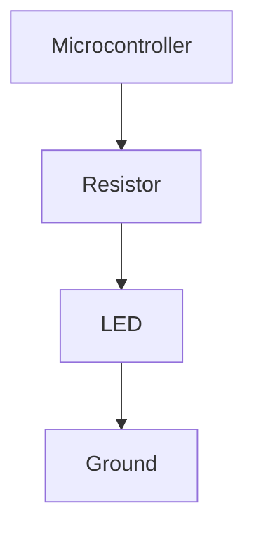
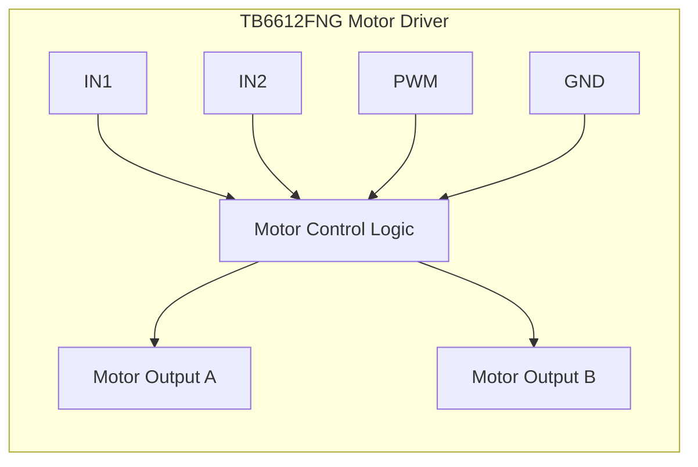
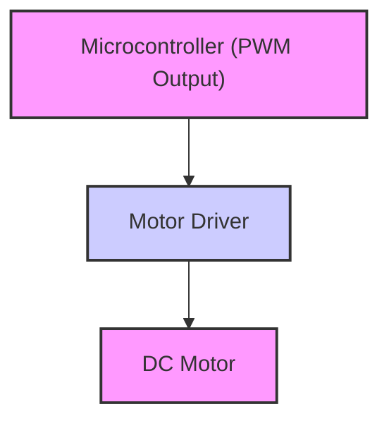

---
title: "Basic Functionality Demonstrations"
description: "Explains basic functionalities like LED blinking, switch control, and PWM motor control with example code."
---

# Basic Functionality Demonstrations

This section provides demonstrations of fundamental functionalities implemented in the Wall-E project. These include controlling LEDs, using switches to manage motor behavior, and Pulse Width Modulation (PWM) for motor speed regulation. Example code snippets and explanations are provided for each feature.

## LED Blinking

The simplest functionality is making an LED blink. This serves as a 'Hello, World!' for embedded systems, confirming the board's ability to execute basic instructions.

```markdown
[View on GitHub](https://github.com/SRA-VJTI/Wall-E/blob/master/1_led_blink/README.md)
```

The core idea involves setting a GPIO pin HIGH for a duration, then setting it LOW, creating an on-off cycle.

```c
// Example (Conceptual - Specific implementation depends on the framework)
void led_blink() {
  gpio_set_level(LED_PIN, 1); // Set LED pin HIGH (ON)
  delay(1000);                // Wait for 1 second
  gpio_set_level(LED_PIN, 0); // Set LED pin LOW (OFF)
  delay(1000);                // Wait for 1 second
}
```

This code toggles the `LED_PIN` between HIGH and LOW states, with a 1-second delay in each state.

### Circuit Diagram





## Switch-Controlled Motor

This example demonstrates how to use a switch as an input to control a motor. Pressing the switch starts the motor in normal mode.

```markdown
[View on GitHub](https://github.com/SRA-VJTI/Wall-E/blob/master/4_switch_controlled_motor_normal/README.md)
```

Here's a conceptual snippet:

```c
// Example
void switch_motor_control() {
  if (gpio_get_level(SWITCH_PIN) == 1) { // If switch is pressed (HIGH)
    // Code to start motor in normal mode
    set_motor_speed(MOTOR_A_0, MOTOR_FORWARD, 0.5); // Motor A, forward, 50% speed
  } else {
    set_motor_speed(MOTOR_A_0, MOTOR_STOP, 0);  // Stop the motor
  }
}
```

The `switch_motor_control` function continuously checks the state of the `SWITCH_PIN`. If it's HIGH (switch pressed), it sets the motor to move forward at half speed using `set_motor_speed`. If the switch is not pressed, the motor is stopped.  The `set_motor_speed` function is assumed to be part of the motor control library.

### Motor Driver Modes

The SRA board utilizes TB6612FNG motor drivers, supporting both Normal and Parallel modes. In normal mode, each driver controls two motors independently.





## PWM Motor Control

Pulse Width Modulation (PWM) is a technique used to control the speed of a DC motor by varying the average voltage applied to it.

```markdown
[View on GitHub](https://github.com/SRA-VJTI/Wall-E/blob/master/5_PWM/README.md)
```

```c
// Example PWM Motor Control
void pwm_motor_control(float duty_cycle) {
  // Set the duty cycle for the motor (0.0 to 1.0)
  set_motor_speed(MOTOR_A_0, MOTOR_FORWARD, duty_cycle);
}

//Usage:
pwm_motor_control(0.75); //Set motor to 75% speed
```

The `pwm_motor_control` function takes a `duty_cycle` parameter, which represents the percentage of time the motor is powered on during each PWM cycle.  A duty cycle of 0.75 corresponds to 75% of the maximum voltage being applied, resulting in a proportional motor speed. The `set_motor_speed` function handles the PWM configuration.





### Description Of Functions Used

Example functions (hypothetical based on documentation)
```c
esp_err_t set_motor_speed (int motor_id,
                           int direction,
                           float duty_cycle )
```
    **Description** : Set the speed of motors.
    **Parameters** :
        * `motor_id` : set it as MOTOR_A_0, MOTOR_A_1, MOTOR_B_0, MOTOR_B_1 to select the appropriate motor to set its speed and direction
        *  `direction` : set is as MOTOR_FORWARD for forward motion, MOTOR_BACKWARD for backward motion, MOTOR_STOP to stop the motor
        * `duty_cycle` : set the duty cycle of the motor driver PWM
    **Returns** : esp_err_t returns ESP_OK if speed correctly, ESP_FAIL if any error occurs

## Key Integration Points

These basic functionalities are often combined. For example, switch control can be enhanced with PWM to allow multiple speed settings.

Best Practices:

*   **Modularity:**  Encapsulate motor control logic into reusable functions (like `set_motor_speed`) to avoid code duplication.
*   **Abstraction:** Use enums or constants (`MOTOR_FORWARD`, `MOTOR_STOP`) to represent motor directions, making the code more readable and maintainable.
*   **Error Handling:** Incorporate error checking (using `esp_err_t`) to handle potential issues with GPIO configuration or motor driver communication.
```