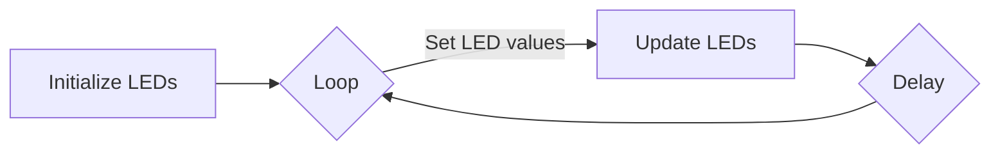
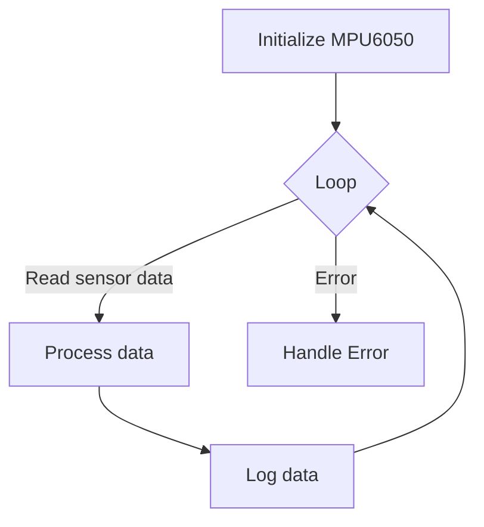

 # Core Functionalities

This section details the core functionalities implemented in the robot's embedded system, focusing on LED control, line sensor array (LSA) readings, and the Inertial Measurement Unit (IMU) integration.

## LED Control (1_led_blink/main/main.c)

The robot uses LEDs for visual feedback. The code demonstrates how to control the onboard LEDs using the `sra_board.h` library.

- **LED Initialization:** `enable_bar_graph()` initializes the GPIO pins connected to the LEDs. [View on GitHub](https://github.com/SRA-VJTI/Wall-E/blob/main/1_led_blink/main/main.c)

```c
#include <stdio.h>
#include "freertos/FreeRTOS.h"
#include "freertos/task.h"
#include "sra_board.h"

void app_main()
{
    ESP_ERROR_CHECK(enable_bar_graph());
    // enable_bar_graph() turns on the gpio pins, if it succeeds it returns ESP_OK else it returns ESP_FAIL
    // If the argument of ESP_ERROR_CHECK() is not equal ESP_OK, then an error message is printed on the console, and abort() is called.
```

- **Blinking LEDs:** The code demonstrates blinking all 8 LEDs a specific number of times.

```c
        for (int i = 0; i < 5; i++)
        {
            ESP_ERROR_CHECK(set_bar_graph(0xFF));
            //0xFF = 1111 1111(all leds are on)
            // setting values of all 8 leds to 1
            vTaskDelay(1000 / portTICK_PERIOD_MS);
            //delay of 1s
            ESP_ERROR_CHECK(set_bar_graph(0x00));
            //0x00 = 0000 0000(all leds are off)
            // setting values of all 8 leds to 0
            vTaskDelay(1000 / portTICK_PERIOD_MS);
            //delay of 1s
        }
```

- **Sequential LED Activation:** The code includes a segment that activates each LED sequentially.

```c
        uint8_t var = 0x01;

        while(1)
        {   
            if (var == 0x00)
            {
                var = 0x01;
            }            
            ESP_ERROR_CHECK(set_bar_graph(var));
            var = var << 1;
            vTaskDelay(1000 / portTICK_PERIOD_MS);
        }
```

- **Error Handling:** `ESP_ERROR_CHECK()` is used to handle potential errors during LED control.

Here's a basic diagram of LED Control flow:





## Line Sensor Array (LSA) Readings (2_LSA/main/main.c)

The robot utilizes an LSA to detect and follow lines. This involves reading analog values from the sensors and mapping them to a usable range.

- **LSA Initialization:** `enable_line_sensor()` initializes the ADC for reading LSA values. [View on GitHub](https://github.com/SRA-VJTI/Wall-E/blob/main/2_LSA/main/main.c)

```c
    adc_handle_t line_sensor;
    ESP_ERROR_CHECK(enable_line_sensor(&line_sensor));
```

- **Reading LSA Values:** The `read_line_sensor()` function reads the analog values from the line sensors.

```c
 line_sensor_array line_sensor_readings;
 line_sensor_readings = read_line_sensor(line_sensor);
```

- **Data Processing:** Raw ADC values are constrained and mapped to a predefined range.

```c
            line_sensor_readings.adc_reading[i] = bound(line_sensor_readings.adc_reading[i], WHITE_MARGIN, BLACK_MARGIN);
            line_sensor_readings.adc_reading[i] = map(line_sensor_readings.adc_reading[i], WHITE_MARGIN, BLACK_MARGIN, CONSTRAIN_LSA_LOW, CONSTRAIN_LSA_HIGH);
            line_sensor_readings.adc_reading[i] = 1000 - line_sensor_readings.adc_reading[i];
```

- **Logging LSA Readings:** The code logs the processed LSA readings to the console using `ESP_LOGI()`.

```c
 ESP_LOGI(TAG, "LSA_1: %d \t LSA_2: %d \t LSA_3: %d \t LSA_4: %d \t LSA_5: %d", line_sensor_readings.adc_reading[0], line_sensor_readings.adc_reading[1], line_sensor_readings.adc_reading[2], line_sensor_readings.adc_reading[3], line_sensor_readings.adc_reading[4]);
```

The `bound` and `map` functions are crucial for normalizing the sensor data:

```c
int bound(int value, int low, int high) {
    return (value < low) ? low : ((value > high) ? high : value);
}

int map(int x, int in_min, int in_max, int out_min, int out_max) {
  return (x - in_min) * (out_max - out_min) / (in_max - in_min) + out_min;
}
```

This `map` function converts a value from one range to another.  It's essential for scaling the raw sensor readings (which might be in a wide, hardware-specific range) to a more usable range for the robot's control algorithms (e.g., 0-1000).

## Inertial Measurement Unit (MPU) Integration (3_MPU/main/main.c)

The MPU6050 is used to measure the robot's orientation and angular velocity. This is essential for tasks like balancing and navigation.

- **MPU Initialization:** `enable_mpu6050()` initializes the MPU6050 sensor. [View on GitHub](https://github.com/SRA-VJTI/Wall-E/blob/main/3_MPU/main/main.c)

```c
        if (enable_mpu6050() == ESP_OK)
        {
```

- **Reading MPU Values:** The `read_mpu6050()` function reads the roll and pitch angles from the MPU6050.

```c
            while (read_mpu6050(euler_angle, mpu_offset) == ESP_OK)
            {
```

- **Logging MPU Readings:** The code logs the roll and pitch angles to the console using `ESP_LOGI()`.

```c
                ESP_LOGI(TAG, "Roll: %0.2f | Pitch: %0.2f", euler_angle[0], euler_angle[1]);
```

- **MPU Task:** The `mpu_task` function encapsulates the MPU6050 functionality.

```c
void mpu_task(void *arg)
{
    float euler_angle[2], mpu_offset[2] = {0.0f, 0.0f};

    while (1)
    {
        if (enable_mpu6050() == ESP_OK)
        {
            while (read_mpu6050(euler_angle, mpu_offset) == ESP_OK)
            {
                ESP_LOGI(TAG, "Roll: %0.2f | Pitch: %0.2f", euler_angle[0], euler_angle[1]);
            }
        }
        ESP_LOGE(TAG, "MPU Initialisation Failed / Connection Broke!");
    }
}

void app_main()
{
    xTaskCreate(mpu_task, "mpu_task", 4096, NULL, 1, NULL);
}
```

The data flow can be represented as:





## Key Integration Points

- **FreeRTOS Integration:** All three functionalities are implemented as FreeRTOS tasks, enabling concurrent execution. This is crucial for real-time control of the robot.  The `xTaskCreate` function in `app_main` within `3_MPU/main/main.c` shows how the MPU reading is done within a FreeRTOS task, allowing it to run concurrently with other robot functions.

- **Error Handling:** Consistent use of `ESP_ERROR_CHECK()` ensures that errors are caught and handled appropriately, preventing unexpected behavior.

- **Hardware Abstraction:** The `sra_board.h` library provides a hardware abstraction layer, making the code more portable and easier to maintain.

- **Data Normalization:** The LSA code demonstrates the importance of normalizing sensor data before using it in control algorithms. Mapping sensor readings to a consistent range (e.g., 0-1000) simplifies the design of higher-level control logic.

By combining LED control, LSA readings, and MPU integration, the robot can effectively perceive its environment, provide feedback, and maintain stability. These core functionalities form the foundation for more advanced behaviors like line following, obstacle avoidance, and autonomous navigation.