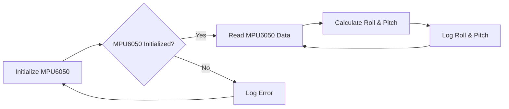

 # Core Functionality Modules

This section details the core functionalities of the robot, broken down by module. Each module's purpose, implementation details, and integration points are explained.

## LED Blink Module

This module controls the blinking of LEDs on the robot, providing a basic visual output.

*   **Functionality:** Blinks all LEDs simultaneously, then blinks them sequentially.
*   **File:** `1_led_blink/main/main.c`

```c
#include "sra_board.h"

void app_main()
{
    ESP_ERROR_CHECK(enable_bar_graph());

    while(1)
    {
        //blinks all the 8 leds 5 times
        for (int i = 0; i < 5; i++)
        {
            ESP_ERROR_CHECK(set_bar_graph(0xFF));
            vTaskDelay(1000 / portTICK_PERIOD_MS);
            ESP_ERROR_CHECK(set_bar_graph(0x00));
            vTaskDelay(1000 / portTICK_PERIOD_MS);
        }

        uint8_t var = 0x01;

        while(1)
        {   
            if (var == 0x00)
            {
                var = 0x01;
            }            
            ESP_ERROR_CHECK(set_bar_graph(var));
            var = var << 1;
            vTaskDelay(1000 / portTICK_PERIOD_MS);
        }
    }
}
```

The `enable_bar_graph()` function initializes the GPIO pins for the LEDs. The `set_bar_graph()` function sets the state of the LEDs based on the input value. The code first blinks all LEDs on and off repeatedly. Then, it shifts a bit across the LEDs, creating a sequential blinking pattern. [View on GitHub](https://github.com/SRA-VJTI/Wall-E/blob/main/1_led_blink/main/main.c)

```c
ESP_ERROR_CHECK(set_bar_graph(0xFF));
//0xFF = 1111 1111(all leds are on)
// setting values of all 8 leds to 1
vTaskDelay(1000 / portTICK_PERIOD_MS);
//delay of 1s
ESP_ERROR_CHECK(set_bar_graph(0x00));
//0x00 = 0000 0000(all leds are off)
// setting values of all 8 leds to 0
```

This snippet from lines 15-22 shows how the `set_bar_graph` function is used to turn all the LEDs on and off by setting the input to `0xFF` (all on) and `0x00` (all off) respectively. The `vTaskDelay` function introduces a 1-second delay between the on and off states. [View on GitHub](https://github.com/SRA-VJTI/Wall-E/blob/main/1_led_blink/main/main.c)

```c
uint8_t var = 0x01;
//0x01 = 0000 0001(only 8th led is on)
// After left-shifting 0x01 8-times, we end up with 0x00. To recover the var variable, we initialise it with 0x01.
```

Lines 26-28 initializes a variable `var` to `0x01`, which corresponds to turning on the 8th LED. The subsequent loop shifts this bit to create a sequential blinking effect. [View on GitHub](https://github.com/SRA-VJTI/Wall-E/blob/main/1_led_blink/main/main.c)

## Line Sensor Array (LSA) Module

This module reads data from the line sensor array, which is crucial for line following.

*   **Functionality:** Reads analog values from five line sensors, constrains and maps the readings to a specified range, and displays them (optionally on an OLED screen).
*   **File:** `2_LSA/main/main.c`

```c
#include "sra_board.h"

#define BLACK_MARGIN 4095
#define WHITE_MARGIN 0

#define CONSTRAIN_LSA_LOW 0
#define CONSTRAIN_LSA_HIGH 1000

void app_main(void)
{
    adc_handle_t line_sensor;
    ESP_ERROR_CHECK(enable_line_sensor(&line_sensor));

    line_sensor_array line_sensor_readings;

    while (1)
    {
        line_sensor_readings = read_line_sensor(line_sensor);
        for (int i = 0; i < 5; i++)
        {
            line_sensor_readings.adc_reading[i] = bound(line_sensor_readings.adc_reading[i], WHITE_MARGIN, BLACK_MARGIN);
            line_sensor_readings.adc_reading[i] = map(line_sensor_readings.adc_reading[i], WHITE_MARGIN, BLACK_MARGIN, CONSTRAIN_LSA_LOW, CONSTRAIN_LSA_HIGH);
            line_sensor_readings.adc_reading[i] = 1000 - line_sensor_readings.adc_reading[i];
        }
        ESP_LOGI("LSA_READINGS", "LSA_1: %d \t LSA_2: %d \t LSA_3: %d \t LSA_4: %d \t LSA_5: %d", line_sensor_readings.adc_reading[0], line_sensor_readings.adc_reading[1], line_sensor_readings.adc_reading[2], line_sensor_readings.adc_reading[3], line_sensor_readings.adc_reading[4]);
        vTaskDelay(10 / portTICK_PERIOD_MS);
    }
}
```

The `enable_line_sensor()` function initializes the ADC for reading the line sensor values. The `read_line_sensor()` function reads the analog values from the five sensors. The readings are then constrained and mapped to a specific range using `bound()` and `map()` functions. Finally, the LSA readings are logged. [View on GitHub](https://github.com/SRA-VJTI/Wall-E/blob/main/2_LSA/main/main.c)

```c
line_sensor_readings.adc_reading[i] = bound(line_sensor_readings.adc_reading[i], WHITE_MARGIN, BLACK_MARGIN);
// map readings from (BLACK_MARGIN, WHITE_MARGIN) to (CONSTRAIN_LSA_LOW, CONSTRAIN_LSA_HIGH)
line_sensor_readings.adc_reading[i] = map(line_sensor_readings.adc_reading[i], WHITE_MARGIN, BLACK_MARGIN, CONSTRAIN_LSA_LOW, CONSTRAIN_LSA_HIGH);
```

This snippet from lines 44-47 shows how the raw ADC readings from the line sensors are first bounded and then mapped to a new range. This normalization is essential for reliable line following. [View on GitHub](https://github.com/SRA-VJTI/Wall-E/blob/main/2_LSA/main/main.c)

```c
ESP_LOGI(TAG, "LSA_1: %d \t LSA_2: %d \t LSA_3: %d \t LSA_4: %d \t LSA_5: %d", line_sensor_readings.adc_reading[0], line_sensor_readings.adc_reading[1], line_sensor_readings.adc_reading[2], line_sensor_readings.adc_reading[3], line_sensor_readings.adc_reading[4]);
```

This line logs the processed line sensor readings, which is useful for debugging and calibration. [View on GitHub](https://github.com/SRA-VJTI/Wall-E/blob/main/2_LSA/main/main.c)

## MPU6050 Module

This module reads data from the MPU6050 Inertial Measurement Unit (IMU) to obtain roll and pitch angles.

*   **Functionality:** Initializes the MPU6050, reads accelerometer and gyroscope data, performs sensor fusion to calculate roll and pitch angles, and displays these angles (optionally on an OLED screen).
*   **File:** `3_MPU/main/main.c`

```c
#include "sra_board.h"

static const char *TAG = "mpu_test";

void mpu_task(void *arg)
{
    float euler_angle[2], mpu_offset[2] = {0.0f, 0.0f};

    while (1)
    {
        if (enable_mpu6050() == ESP_OK)
        {
            while (read_mpu6050(euler_angle, mpu_offset) == ESP_OK)
            {
                ESP_LOGI(TAG, "Roll: %0.2f | Pitch: %0.2f", euler_angle[0], euler_angle[1]);
            }
        }
        ESP_LOGE(TAG, "MPU Initialisation Failed / Connection Broke!");
    }
}

void app_main()
{
    xTaskCreate(mpu_task, "mpu_task", 4096, NULL, 1, NULL);
}
```

The `enable_mpu6050()` function initializes the MPU6050. The `read_mpu6050()` function reads the accelerometer and gyroscope data and calculates the roll and pitch angles using sensor fusion techniques. These angles are then logged. [View on GitHub](https://github.com/SRA-VJTI/Wall-E/blob/main/3_MPU/main/main.c)

```c
if (enable_mpu6050() == ESP_OK)
{
    while (read_mpu6050(euler_angle, mpu_offset) == ESP_OK)
    {
        ESP_LOGI(TAG, "Roll: %0.2f | Pitch: %0.2f", euler_angle[0], euler_angle[1]);
    }
}
```

This snippet from lines 26-32 shows the core logic for reading and displaying the MPU6050 data. The `enable_mpu6050` function initializes the MPU, and `read_mpu6050` continuously retrieves the roll and pitch angles. [View on GitHub](https://github.com/SRA-VJTI/Wall-E/blob/main/3_MPU/main/main.c)

```c
xTaskCreate(mpu_task, "mpu_task", 4096, NULL, 1, NULL);
```

This line creates a FreeRTOS task to run the `mpu_task` function, allowing the MPU6050 readings to be processed in parallel with other tasks. [View on GitHub](https://github.com/SRA-VJTI/Wall-E/blob/main/3_MPU/main/main.c)





## Key Integration Points

The modules described above are integrated to provide the robot with essential functionalities. The LSA module provides line position data, which can be used by a control system to adjust the robot's trajectory. The MPU6050 module provides orientation data, which can be used for balancing or navigation. The LED module provides a basic visual output for debugging or signaling.

*   **Line Following:** LSA readings are used to calculate the error with respect to the line, which is then fed into a PID controller to adjust the motor speeds.
*   **Balancing:** MPU6050 data is used to maintain balance by adjusting motor torques based on the robot's inclination.
*   **Visual Feedback:** LED blinking patterns can indicate different states of the robot, such as initialization, error, or successful operation.

The best practices for integrating these modules include:

*   **Calibration:** Calibrating the sensors to minimize errors and biases.
*   **Filtering:** Applying filters to smooth the sensor data and reduce noise.
*   **Testing:** Thoroughly testing the integrated system to ensure that it meets the desired performance criteria.