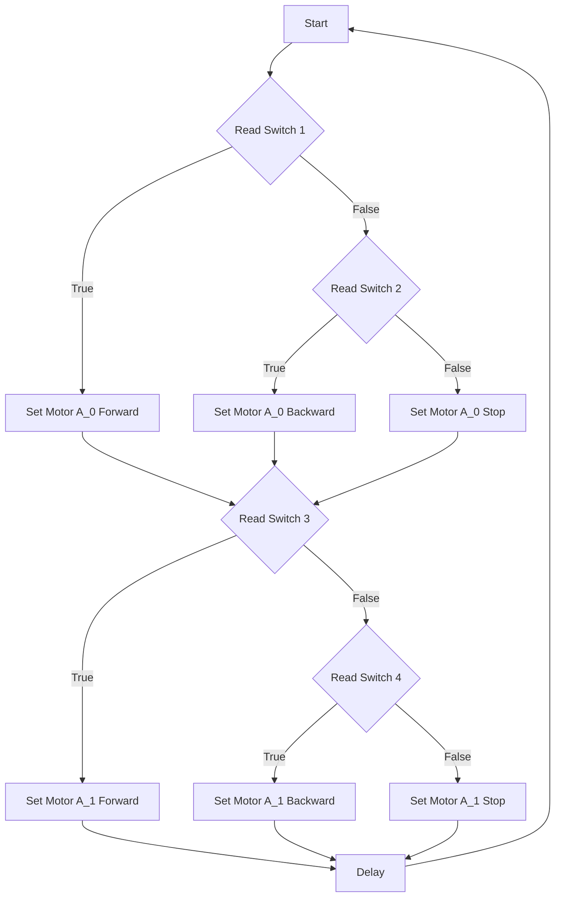
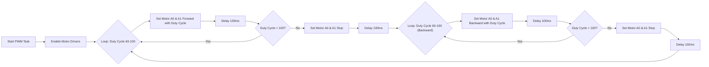

# Motor Control Systems

This document details the motor control implementations used in Wall-E, covering both switch-controlled and PWM-based systems. It provides insights into the control logic, motor driver configurations, and code snippets for controlling motor speed and direction.

## Switch-Controlled Motor System

The switch-controlled motor system allows for basic motor control using digital inputs from line sensor array (LSA). This implementation uses the TB6612FNG motor driver in normal mode.

### Normal Mode Operation

In normal mode, each TB6612FNG motor driver can control two motors independently. The direction of each motor is determined by the state of two GPIO pins (IN1 and IN2) connected to the driver.

| IN1 | IN2 | Motor Action       |
| --- | --- | ------------------ |
| High | Low  | Move Motor Forward |
| Low  | High | Move Motor Backward|
| Low  | Low  | Stop Motor         |
|High | High | Stop Motor |

### Code Implementation: Switch-Controlled Motor

The following code snippet demonstrates the implementation of the switch-controlled motor system:

```c
// SRA's custom header file including additional functions
#include "sra_board.h"

// pointer to a character array
static const char *TAG_SWITCH_CONTROL_MOTOR = "switch_control";

// main driver function
void drive_task(void *arg)
{
	enable_switches();

	motor_handle_t motor_a_0, motor_a_1;
	ESP_ERROR_CHECK(enable_motor_driver(&motor_a_0, MOTOR_A_0));
	ESP_ERROR_CHECK(enable_motor_driver(&motor_a_1, MOTOR_A_1));

	while (1)
	{
		if (read_switch(SWITCH_1))
		{
			set_motor_speed(motor_a_0, MOTOR_FORWARD, 80);
			ESP_LOGI(TAG_SWITCH_CONTROL_MOTOR, "MOTOR_A_0 FORWARD");
		}
		else if (read_switch(SWITCH_2))
		{
			set_motor_speed(motor_a_0, MOTOR_BACKWARD, 80);
			ESP_LOGI(TAG_SWITCH_CONTROL_MOTOR, "MOTOR_A_0 BACKWARD");
		}
		else
		{
			set_motor_speed(motor_a_0, MOTOR_STOP, 0);
		}

		if (read_switch(SWITCH_3))
		{
			set_motor_speed(motor_a_1, MOTOR_FORWARD, 80);
			ESP_LOGI(TAG_SWITCH_CONTROL_MOTOR, "MOTOR_A_1 FORWARD");
		}
		else if (read_switch(SWITCH_4))
		{
			set_motor_speed(motor_a_1, MOTOR_BACKWARD, 80);
			ESP_LOGI(TAG_SWITCH_CONTROL_MOTOR, "MOTOR_A_1 BACKWARD");
		}
		else
		{
			set_motor_speed(motor_a_1, MOTOR_STOP, 0);
		}
		vTaskDelay(100 / portTICK_PERIOD_MS);
	}
}
```

[View on GitHub](https://github.com/SRA-VJTI/Wall-E/blob/master/4_switch_controlled_motor_normal/main/switch_control_motor_normal.c)

This code reads input from switches (representing LSA readings) and controls two motors (MOTOR_A_0 and MOTOR_A_1) accordingly. The `set_motor_speed` function sets the motor direction and speed (duty cycle).

### Switch Control Flow





## PWM-Based Motor Control System

The PWM-based motor control system allows for more precise control of motor speed by varying the duty cycle of a PWM signal.

### Pulse Width Modulation (PWM)

PWM is a technique used to control the average power delivered to a load by varying the duty cycle of a square wave. The duty cycle is the percentage of time the signal is HIGH during one period.

*   **Duty Cycle:** `Duty Cycle = (ON-Time / Period) * 100`
*   **Period:** `Period = ON-Time + OFF-Time`

### Voltage Regulation Using PWM
PWM signals can regulate output voltage by varying the duty cycle, this can be calculated as:

*   **Output Voltage** = `Duty Cycle * Input Voltage`

### Code Implementation: PWM Motor Control

The following code snippet demonstrates PWM-based motor control:

```c
//Components
#include "sra_board.h"

void pwm_task(void *arg)
{
	motor_handle_t motor_a_0, motor_a_1;
	ESP_ERROR_CHECK(enable_motor_driver(&motor_a_0, MOTOR_A_0)); // Enable motor driver A0
	ESP_ERROR_CHECK(enable_motor_driver(&motor_a_1, MOTOR_A_1)); // Enable motor driver A1

	// Make the Motors go forward & backward alternatively, at different PWM from 60 to 100
	while (1)
	{
		for (int duty_cycle = 60; duty_cycle <= 100; duty_cycle++)
		{
			// setting motor speed of MOTOR A0 in forward direction with duty cycle
			set_motor_speed(motor_a_0, MOTOR_FORWARD, duty_cycle);

			// setting motor speed of MOTOR A1 in forward direction with duty cycle
			set_motor_speed(motor_a_1, MOTOR_FORWARD, duty_cycle);

			// adding delay of 100ms
			vTaskDelay(100 / portTICK_PERIOD_MS);
		}

		// stopping the MOTOR A0
		set_motor_speed(motor_a_0, MOTOR_STOP, 0);

		// stopping the MOTOR A1
		set_motor_speed(motor_a_1, MOTOR_STOP, 0);

		// adding delay of 100ms
		vTaskDelay(100 / portTICK_PERIOD_MS);

		for (int duty_cycle = 60; duty_cycle <= 100; duty_cycle++)
		{
			// setting motor speed of MOTOR A0 in backward direction with duty cycle
			set_motor_speed(motor_a_0, MOTOR_BACKWARD, duty_cycle);

			// setting motor speed of MOTOR A1 in backward direction with duty cycle
			set_motor_speed(motor_a_1, MOTOR_BACKWARD, duty_cycle);

			// adding delay of 100ms
			vTaskDelay(100 / portTICK_PERIOD_MS);
		}

		// stopping the MOTOR A0
		set_motor_speed(motor_a_0, MOTOR_STOP, 0);

		// stopping the MOTOR A1
		set_motor_speed(motor_a_1, MOTOR_STOP, 0);

		// adding delay of 100ms
		vTaskDelay(100 / portTICK_PERIOD_MS);
	}
}
```

[View on GitHub](https://github.com/SRA-VJTI/Wall-E/blob/master/5_PWM/main/pwm_test.c)

This code iteratively sets the motor speed, varying the duty cycle from 60 to 100, resulting in gradual changes in motor speed. The motors are then stopped and the process is repeated in the backward direction.

### Function Descriptions

*   `enable_motor_driver(&motor_a_0, MOTOR_A_0)`: Enables the motor driver for the specified motor.
*   `set_motor_speed(motor_a_0, MOTOR_FORWARD, duty_cycle)`: Sets the motor speed with specified direction and duty cycle.
*   `vTaskDelay(100 / portTICK_PERIOD_MS)`: Delays the execution for 100ms.
*   `xTaskCreate(&pwm_task, "pwm_task", 4096, NULL, 1, NULL)`: Creates a new task for PWM motor control.

### PWM Control Flow





## Key Integration Points

- The `sra_board` component provides essential functions for motor control, including enabling motor drivers and setting motor speeds.
- Both switch-controlled and PWM-based systems rely on the TB6612FNG motor driver for controlling the motors.
- The choice between switch control and PWM control depends on the desired level of precision and control complexity. Switch control is simpler but offers less control over speed, while PWM control allows for fine-grained speed adjustments.
- FreeRTOS tasks are used to manage the motor control logic, allowing for concurrent operation with other system tasks.

### Best Practices

- Use appropriate duty cycle values for PWM control to avoid excessive motor heating or damage.
- Implement proper error handling to gracefully handle unexpected events, such as motor driver failures.
- Optimize the task delay values to achieve the desired motor control response time without consuming excessive CPU resources.