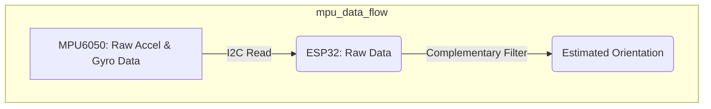
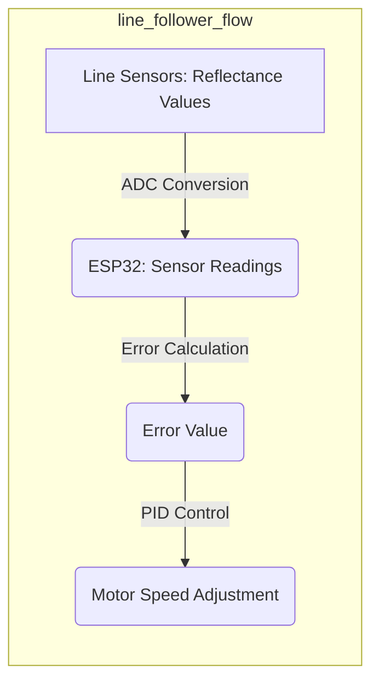

---
title: "Sensor Integration"
description: "Describes the integration of sensors like MPU and Line Followers."
---

# Sensor Integration

This document details the integration of key sensors used in the Wall-E robot, namely the MPU6050 Inertial Measurement Unit (IMU) and the line follower sensor array. These sensors provide crucial data for navigation, orientation, and autonomous line following capabilities.

## MPU6050 Integration

The MPU6050 is a 6-axis motion tracking device, combining a gyroscope and an accelerometer. It communicates using the I2C protocol, making it relatively straightforward to interface with the ESP32 microcontroller.

### Initialization

The MPU6050 starts in sleep mode and must be initialized by disabling this mode via I2C communication.

```c
// Example: Disabling sleep mode in MPU6050
esp_err_t enable_mpu6050() {
    i2c_cmd_handle_t cmd = i2c_cmd_link_create();
    i2c_master_start(cmd);
    i2c_master_write_byte(cmd, (MPU6050_ADDRESS << 1) | I2C_MASTER_WRITE, ACK_CHECK_EN);
    i2c_master_write_byte(cmd, PWR_MGMT_1, ACK_CHECK_EN);
    i2c_master_write_byte(cmd, 0x00, ACK_CHECK_EN); // Disable sleep mode
    i2c_master_stop(cmd);
    esp_err_t ret = i2c_master_cmd_begin(I2C_MASTER_NUM, cmd, 1000 / portTICK_RATE_MS);
    i2c_cmd_link_delete(cmd);
    return ret;
}
```
[View on GitHub](https://github.com/SRA-VJTI/Wall-E/blob/master/3_MPU/README.md)

This code snippet demonstrates how to disable the sleep mode of the MPU6050 using the I2C protocol.  It sends a write command to the `PWR_MGMT_1` register (address `0x6B`) with a value of `0x00`, effectively waking up the sensor.

### Reading Accelerometer Data

The accelerometer measures linear acceleration along three axes (X, Y, Z). The raw data is stored in registers as 16-bit values.

```c
// Example: Reading accelerometer data from MPU6050
esp_err_t read_raw_accel(int16_t *accel_x, int16_t *accel_y, int16_t *accel_z) {
    uint8_t data[6];
    esp_err_t ret = i2c_master_read_reg(MPU6050_ADDRESS, ACCEL_XOUT_H, data, 6);
    if (ret == ESP_OK) {
        *accel_x = (int16_t)((data[0] << 8) | data[1]);
        *accel_y = (int16_t)((data[2] << 8) | data[3]);
        *accel_z = (int16_t)((data[4] << 8) | data[5]);
    }
    return ret;
}
```
[View on GitHub](https://github.com/SRA-VJTI/Wall-E/blob/master/3_MPU/README.md)

This snippet reads six bytes of data, corresponding to the high and low bytes of the X, Y, and Z accelerometer readings. These bytes are then combined to form 16-bit integer values. `i2c_master_read_reg` is assumed to be a helper function for reading from I2C registers.

### Reading Gyroscope Data

Similarly, the gyroscope measures angular velocity around the three axes.

```c
// Example: Reading gyroscope data from MPU6050
esp_err_t read_raw_gyro(int16_t *gyro_x, int16_t *gyro_y, int16_t *gyro_z) {
    uint8_t data[6];
    esp_err_t ret = i2c_master_read_reg(MPU6050_ADDRESS, GYRO_XOUT_H, data, 6);
    if (ret == ESP_OK) {
        *gyro_x = (int16_t)((data[0] << 8) | data[1]);
        *gyro_y = (int16_t)((data[2] << 8) | data[3]);
        *gyro_z = (int16_t)((data[4] << 8) | data[5]);
    }
    return ret;
}
```
[View on GitHub](https://github.com/SRA-VJTI/Wall-E/blob/master/3_MPU/README.md)

This code mirrors the accelerometer reading process but reads from the gyroscope data registers.

### Complementary Filter

A complementary filter is used to fuse accelerometer and gyroscope data to obtain more accurate orientation estimates.

```c
// Example: Applying complementary filter
void complementary_filter(float accel_x, float accel_y, float gyro_z, float dt, float *angle) {
    float accel_angle = atan2(accel_y, accel_x) * RAD_TO_DEG;
    *angle = (0.98 * (*angle + gyro_z * dt)) + (0.02 * accel_angle);
}
```
[View on GitHub](https://github.com/SRA-VJTI/Wall-E/blob/master/3_MPU/README.md)

This filter combines the accelerometer-derived angle with the gyroscope-derived angular rate, weighted by coefficients (0.98 and 0.02 in this case) determined experimentally.  The gyroscope reading is integrated over time (`dt`) to estimate the angle change.





## Line Follower Sensor Array Integration

The line follower sensor array typically consists of multiple infrared (IR) sensors that detect the reflectance of the surface below. The sensor readings are used to determine the robot's position relative to the line.

### Reading Sensor Values

The sensor readings are often analog values that need to be converted to digital values using an Analog-to-Digital Converter (ADC).

```c
// Example: Reading line follower sensor values
#define NUM_SENSORS 5

int sensor_values[NUM_SENSORS];

void read_line_sensors() {
    for (int i = 0; i < NUM_SENSORS; i++) {
        sensor_values[i] = adc1_get_raw((adc1_channel_t)line_sensor_pins[i]); // Assuming adc1_get_raw exists
    }
}
```
[View on GitHub](https://github.com/SRA-VJTI/Wall-E/blob/master/6_line_following/README.md)

This code iterates through the line sensors, reading the analog values and storing them in the `sensor_values` array. The  `adc1_get_raw` function (from ESP-IDF ADC API) reads the raw ADC value from the specified channel.

### Calculating Error

The sensor readings are then used to calculate an error value, representing the deviation from the center of the line.

```c
// Example: Calculating error from sensor values
int calculate_error() {
    int weighted_sum = 0;
    int sum = 0;
    int k[NUM_SENSORS];
    int weights[NUM_SENSORS] = {-5, -3, -1, 3, 5};

    for (int i = 0; i < NUM_SENSORS; i++) {
        k[i] = (sensor_values[i] > BLACK_BOUNDARY) ? 1 : 0; // BLACK_BOUNDARY is a threshold
        weighted_sum += weights[i] * k[i];
        sum += k[i];
    }

    if (sum == 0) return 0; // No line detected
    return weighted_sum / sum;
}
```
[View on GitHub](https://github.com/SRA-VJTI/Wall-E/blob/master/6_line_following/README.md)

This snippet calculates a weighted average of the sensor readings, where the weights correspond to the position of each sensor relative to the center of the array. The `BLACK_BOUNDARY` defines the threshold above which the sensor is considered to be "on the line."

### PID Control

A PID controller uses the error value to adjust the motor speeds and keep the robot on the line.

```c
// Example: PID control loop
float kp = 0.1;
float ki = 0.01;
float kd = 0.05;

float last_error = 0;
float integral = 0;

float pid_control(float error) {
    float proportional = kp * error;
    integral += error;
    float derivative = error - last_error;
    last_error = error;

    return proportional + ki * integral + kd * derivative;
}
```
[View on GitHub](https://github.com/SRA-VJTI/Wall-E/blob/master/6_line_following/README.md)

This code demonstrates a simple PID control loop. The `pid_control` function calculates the control output based on the proportional, integral, and derivative terms, each weighted by their respective gains (`kp`, `ki`, `kd`). These gains need to be tuned for optimal performance.





## Key Integration Points

*   **Data Synchronization:** Ensure that sensor readings are synchronized and timestamped to avoid inconsistencies in data fusion algorithms.
*   **Calibration:** Calibrate both the MPU6050 and line follower sensors to minimize bias and improve accuracy.  MPU6050 calibration may involve determining offsets for accelerometer and gyroscope readings.  Line follower calibration could entail adjusting the `BLACK_BOUNDARY` based on ambient lighting conditions.
*   **Noise Filtering:** Implement noise filtering techniques (e.g., Kalman filter, moving average) to reduce the impact of sensor noise on control performance.
*   **Parameter Tuning:** Experimentally tune PID parameters for optimal line following performance.  Tools like the HTTP server mentioned in the line following README are extremely helpful for this.
*   **Power Management:** Consider power consumption of each sensor to optimize battery life, including enabling and disabling sensors.
* **Resource management:** Coordinate I2C access with FreeRTOS synchronization primitives such as mutexes.

By carefully integrating these sensors and implementing appropriate data processing and control algorithms, the Wall-E robot can achieve robust and reliable navigation and autonomous line following capabilities.
```