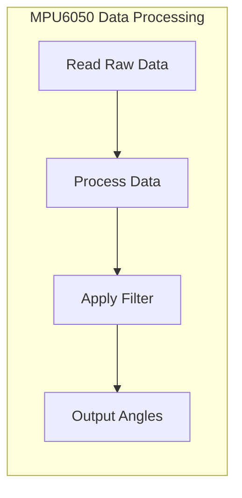

# Sensor Integration

This document details the integration of the MPU6050 sensor into the Wall-E project, focusing on data acquisition and processing for inertial measurements. The MPU6050 is a 6-axis motion tracking device that combines a MEMS gyroscope and a MEMS accelerometer, communicating via I2C.

## MPU6050 Overview

The MPU6050 provides data about angular rate and linear acceleration. It's a 3.3V device that can be directly connected to ESP32 pins. Its default I2C address is 0x68 (can be changed to 0x69). It's commonly used in applications requiring orientation and motion sensing.

## Initializing the MPU6050

Upon power-up, the MPU6050 enters SLEEP mode and must be initialized to enable data acquisition.  This involves disabling the sleep mode by writing to the `PWR_MGMT_1` register.

```c
esp_err_t enable_mpu6050() {
    uint8_t data = 0;
    esp_err_t ret;

    // Write 0 to PWR_MGMT_1 register to wake up the MPU6050
    ret = i2c_master_write_slave_reg(I2C_MASTER_NUM, MPU6050_ADDR, PWR_MGMT_1, &data, 1, I2C_MASTER_TIMEOUT_MS / portTICK_PERIOD_MS);
    if (ret != ESP_OK) {
        ESP_LOGE("MPU6050", "Error writing to PWR_MGMT_1: %s", esp_err_to_name(ret));
        return ESP_FAIL;
    }
    vTaskDelay(100 / portTICK_PERIOD_MS); // Delay to allow MPU6050 to stabilize

    // Check if MPU6050 is correctly initialized
    uint8_t check;
    ret = i2c_master_read_slave_reg(I2C_MASTER_NUM, MPU6050_ADDR, WHO_AM_I, &check, 1, I2C_MASTER_TIMEOUT_MS / portTICK_PERIOD_MS);
    if (ret != ESP_OK) {
        ESP_LOGE("MPU6050", "Error reading WHO_AM_I: %s", esp_err_to_name(ret));
        return ESP_FAIL;
    }
    if (check != 0x68) {
        ESP_LOGE("MPU6050", "WHO_AM_I returned: 0x%x (expected 0x68)", check);
        return ESP_FAIL;
    }

    ESP_LOGI("MPU6050", "MPU6050 initialized successfully");
    return ESP_OK;
}
```

[View on GitHub](https://github.com/SRA-VJTI/Wall-E/blob/master/3_MPU/main/main.c)

This snippet shows the `enable_mpu6050` function, which initializes the MPU6050 by writing `0x00` to the `PWR_MGMT_1` register, taking it out of sleep mode.  It also verifies the initialization by reading the `WHO_AM_I` register, which should return `0x68`.

## Reading Accelerometer Data

The accelerometer data is stored in six registers (two for each axis: X, Y, and Z).  These registers contain the MSB and LSB of the acceleration values. The data must be combined to form a 16-bit value.

```c
esp_err_t read_raw_accel(int16_t *accel_x, int16_t *accel_y, int16_t *accel_z) {
    uint8_t data[6];
    esp_err_t ret;

    // Read accelerometer data registers (ACCEL_XOUT_H to ACCEL_ZOUT_L)
    ret = i2c_master_read_slave_reg(I2C_MASTER_NUM, MPU6050_ADDR, ACCEL_XOUT_H, data, 6, I2C_MASTER_TIMEOUT_MS / portTICK_PERIOD_MS);
    if (ret != ESP_OK) {
        ESP_LOGE("MPU6050", "Error reading accelerometer data: %s", esp_err_to_name(ret));
        return ESP_FAIL;
    }

    // Combine MSB and LSB for each axis
    *accel_x = (int16_t)((data[0] << 8) | data[1]);
    *accel_y = (int16_t)((data[2] << 8) | data[3]);
    *accel_z = (int16_t)((data[4] << 8) | data[5]);

    return ESP_OK;
}
```

[View on GitHub](https://github.com/SRA-VJTI/Wall-E/blob/master/3_MPU/main/main.c)

This function reads the raw accelerometer data from the MPU6050. It reads six bytes representing the X, Y, and Z axes and combines the high and low bytes to create signed 16-bit integer values.

## Reading Gyroscope Data

Similar to the accelerometer, gyroscope data is also stored in six registers. The raw values need to be combined, and then converted to degrees/second based on the sensitivity factor.

```c
esp_err_t read_raw_gyro(int16_t *gyro_x, int16_t *gyro_y, int16_t *gyro_z) {
    uint8_t data[6];
    esp_err_t ret;

    // Read gyroscope data registers (GYRO_XOUT_H to GYRO_ZOUT_L)
    ret = i2c_master_read_slave_reg(I2C_MASTER_NUM, MPU6050_ADDR, GYRO_XOUT_H, data, 6, I2C_MASTER_TIMEOUT_MS / portTICK_PERIOD_MS);
    if (ret != ESP_OK) {
        ESP_LOGE("MPU6050", "Error reading gyroscope data: %s", esp_err_to_name(ret));
        return ESP_FAIL;
    }

    // Combine MSB and LSB for each axis
    *gyro_x = (int16_t)((data[0] << 8) | data[1]);
    *gyro_y = (int16_t)((data[2] << 8) | data[3]);
    *gyro_z = (int16_t)((data[4] << 8) | data[5]);

    return ESP_OK;
}
```

[View on GitHub](https://github.com/SRA-VJTI/Wall-E/blob/master/3_MPU/main/main.c)

This function reads the raw gyroscope data from the MPU6050. It reads six bytes representing the X, Y, and Z axes and combines the high and low bytes to create signed 16-bit integer values. These raw values will then be used in the complementary filter.

## Calculating Euler Angles and Complementary Filter

The accelerometer provides information about orientation with respect to gravity, while the gyroscope measures angular rates. To get accurate and stable orientation estimates, a complementary filter combines the data from both sensors. The accelerometer is used for long-term stability, while the gyroscope provides short-term accuracy.

```c
#define ALPHA 0.98 // Weight for complementary filter

esp_err_t read_mpu6050(float *euler_angle, float *mpu_offset) {
    int16_t accel_x, accel_y, accel_z, gyro_x, gyro_y, gyro_z;
    static float roll_complementary = 0, pitch_complementary = 0;
    esp_err_t ret;

    ret = read_raw_accel(&accel_x, &accel_y, &accel_z);
    if (ret != ESP_OK) return ret;

    ret = read_raw_gyro(&gyro_x, &gyro_y, &gyro_z);
    if (ret != ESP_OK) return ret;

    // Calculate roll and pitch from accelerometer data
    float roll_accel = atan2f(accel_y, accel_z) * RAD_TO_DEG;
    float pitch_accel = atan2f(-accel_x, sqrtf(accel_y * accel_y + accel_z * accel_z)) * RAD_TO_DEG;

    // Calculate angular rate from gyroscope data (convert to degrees/second)
    float gyro_roll_rate = gyro_x / 131.0f;
    float gyro_pitch_rate = gyro_y / 131.0f;

    // Apply complementary filter
    roll_complementary = ALPHA * (roll_complementary + gyro_roll_rate * (SAMPLE_TIME / 1000.0f)) + (1 - ALPHA) * roll_accel;
    pitch_complementary = ALPHA * (pitch_complementary + gyro_pitch_rate * (SAMPLE_TIME / 1000.0f)) + (1 - ALPHA) * pitch_accel;

    euler_angle[0] = roll_complementary - mpu_offset[0]; // Roll
    euler_angle[1] = pitch_complementary - mpu_offset[1]; // Pitch

    return ESP_OK;
}
```

[View on GitHub](https://github.com/SRA-VJTI/Wall-E/blob/master/3_MPU/main/main.c)

This function implements the complementary filter. It first reads the raw accelerometer and gyroscope data.  Then it calculates the roll and pitch angles from the accelerometer data. It also gets the angular rates from the gyroscope data. The complementary filter combines these values, weighting them by `ALPHA`.

## I2C Communication

The MPU6050 communicates using the I2C protocol. The ESP32 acts as the I2C master and the MPU6050 as the slave.  Reading and writing to the MPU6050 involves sending the slave address, register address, and data.

```c
esp_err_t i2c_master_read_slave_reg(i2c_port_t i2c_num, uint8_t slave_addr, uint8_t reg_addr, uint8_t *data, size_t data_len, int ticks_to_wait)
{
    i2c_cmd_handle_t cmd = i2c_cmd_link_create();
    esp_err_t ret;

    i2c_master_start(cmd);
    i2c_master_write_byte(cmd, (slave_addr << 1) | I2C_MASTER_WRITE, ACK_CHECK_EN);
    i2c_master_write_byte(cmd, reg_addr, ACK_CHECK_EN);
    i2c_master_start(cmd);
    i2c_master_write_byte(cmd, (slave_addr << 1) | I2C_MASTER_READ, ACK_CHECK_EN);
    if (data_len > 1) {
        i2c_master_read(cmd, data, data_len - 1, ACK_VAL);
    }
    i2c_master_read_byte(cmd, data + data_len - 1, NACK_VAL);
    i2c_master_stop(cmd);
    ret = i2c_master_cmd_begin(i2c_num, cmd, ticks_to_wait);
    i2c_cmd_link_delete(cmd);
    return ret;
}
```

[View on GitHub](https://github.com/SRA-VJTI/Wall-E/blob/master/3_MPU/main/main.c)

This function handles I2C reads from the MPU6050.  It creates an I2C command, sends the slave address and register address, performs a repeated start, reads the data, and sends a stop condition.  This is a low-level function used by the other read functions.

## Data Flow Diagram


```mermaid
flowchart LR
    A["ESP32"] -->|I2C Write (Addr + Reg)| B["MPU6050"];
    A -->|I2C Read (Addr)| B;
    B -->|Raw Accel Data| C["Read Raw Accel"];
    B -->|Raw Gyro Data| D["Read Raw Gyro"];
    C --> E["Complementary Filter"];
    D --> E;
    E --> F["Euler Angles (Roll, Pitch)"];
    F --> G["Application Logic"];
```


## Key Integration Points

- **Initialization Sequence:** Ensure the MPU6050 is properly initialized by disabling sleep mode and verifying communication through the `WHO_AM_I` register.
- **Data Acquisition:** Read accelerometer and gyroscope data using I2C communication, combining MSB and LSB values for each axis.
- **Sensor Fusion:** Implement a complementary filter to combine accelerometer and gyroscope data for accurate and stable orientation estimates.  Tune the `ALPHA` value for optimal performance.
- **Offset Calibration:** Account for sensor offsets by subtracting them from the calculated Euler angles.  Determine these offsets experimentally.
- **Error Handling:** Implement robust error handling for I2C communication and sensor initialization to ensure reliable operation.

```c
void app_main()
{
    /* creating task to run mpu_task function
     * which runs at priority 1
     */
    xTaskCreate(mpu_task, "mpu_task", 4096, NULL, 1, NULL);
}
```

[View on GitHub](https://github.com/SRA-VJTI/Wall-E/blob/master/3_MPU/main/main.c)

This function creates task to run mpu_task function which is reponsible for doing all the functionalities of MPU6050 .





```
```