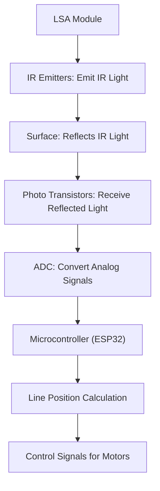
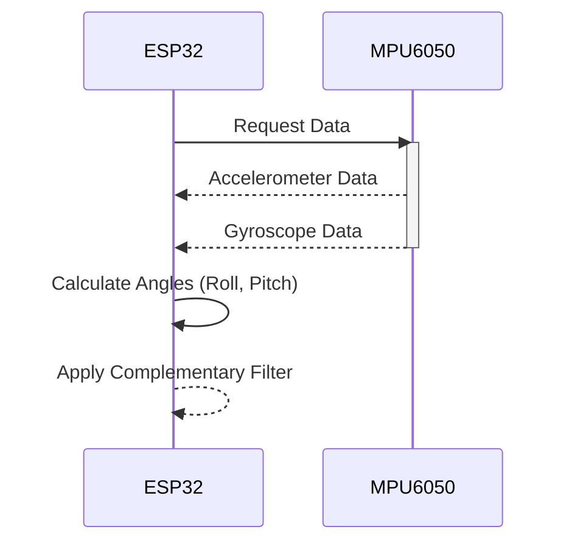

 
---
  title: "Software Modules"
  description: "Details of the different software modules demonstrating features."
---
# Software Modules

This section details the software modules implemented, showcasing the features and functionalities of each. These modules provide the core logic for the robot's behavior, encompassing LED control, line following, and motion sensing.

## 1. LED Blink

This module, demonstrated in `1_led_blink/README.md`, provides a fundamental example of controlling an LED. It showcases basic digital output control, a crucial element in embedded systems.

### Features

*   **LED Control:** The module controls an LED, turning it on and off.
*   **Blinking Logic:** Implements a blinking pattern using delay functions.

### Code Snippets

Here's an example of how the LED is toggled:

```c
// Example code for toggling an LED
#include <driver/gpio.h>
#include <freertos/FreeRTOS.h>
#include <freertos/task.h>

#define LED_PIN 2  // Define the GPIO pin connected to the LED

void app_main() {
    gpio_set_direction(LED_PIN, GPIO_MODE_OUTPUT); // Set GPIO as output

    while (true) {
        gpio_set_level(LED_PIN, 1); // Turn LED on
        vTaskDelay(pdMS_TO_TICKS(500)); // Delay for 500ms
        gpio_set_level(LED_PIN, 0); // Turn LED off
        vTaskDelay(pdMS_TO_TICKS(500)); // Delay for 500ms
    }
}
```

[View on GitHub](https://github.com/SRA-VJTI/Wall-E/blob/main/1_led_blink/README.md).

## 2. LSA (Line Sensor Array)

The LSA module, documented in `2_LSA/README.md`, is designed for line following capabilities. It uses an array of light sensors to detect white/black lines on a surface, feeding data to the ESP32 microcontroller for processing.

### Features

*   **Line Detection:** Detects lines using an array of infrared emitters and photo transistors.
*   **ADC Configuration:** Configures the Analog-to-Digital Converter (ADC) for reading sensor values.
*   **Data Processing:** Processes sensor data to determine the position of the line.

### Code Snippets

Here's an example of how the LSA module reads sensor data:

```c
// Example code for reading LSA sensor values
#include "lsa.h"  // Assuming a header file for LSA functions

// Assuming a function to read sensor values
uint16_t sensor_values[NUM_SENSORS]; // Assuming NUM_SENSORS is defined
esp_err_t read_lsa_sensors(uint16_t *sensor_values) {
    // Implement ADC reading for each sensor
    for (int i = 0; i < NUM_SENSORS; i++) {
        sensor_values[i] = adc1_get_raw(ADC1_CHANNEL_0 + i); // Assuming ADC1_CHANNEL_0 to be the starting channel
    }
    return ESP_OK;
}
```

[View on GitHub](https://github.com/SRA-VJTI/Wall-E/blob/main/2_LSA/README.md).

### LSA Workflow





## 3. MPU6050

The MPU6050 module, detailed in `3_MPU/README.md`, integrates an Inertial Measurement Unit (IMU) to measure the robot's orientation and motion. It combines a gyroscope and an accelerometer to provide data for calculating roll, pitch, and yaw angles.

### Features

*   **IMU Integration:** Integrates the MPU6050 IMU for motion tracking.
*   **Data Acquisition:** Reads accelerometer and gyroscope data.
*   **Angle Calculation:** Calculates roll and pitch angles using the accelerometer and gyroscope data.
*   **Complementary Filter:** Implements a complementary filter to fuse accelerometer and gyroscope data for more accurate angle estimation.

### Code Snippets

Here's an example of how the MPU6050 module reads sensor data:

```c
// Example code for reading MPU6050 data
#include "mpu6050.h"

// Assuming a function to read MPU6050 values
float euler_angles[2]; // Roll and Pitch
mpu_offset_t mpu_offset;
esp_err_t read_motion_data() {
    esp_err_t err = read_mpu6050(euler_angles,mpu_offset); //Implement this function
    if (err != ESP_OK) {
        return err; // Handle the error
    }
    return ESP_OK;
}
```

[View on GitHub](https://github.com/SRA-VJTI/Wall-E/blob/main/3_MPU/README.md).

### MPU6050 Data Flow





## Key Integration Points

The software modules are designed to work together to achieve the desired robot behavior. The LSA module provides line detection information, which is used by the control system to steer the robot along a line. The MPU6050 module provides motion data, which can be used for tasks like balancing or navigation. The LED blink module is a basic utility for status indication.

Best practices are followed throughout the code, including modular design, clear comments, and error handling.