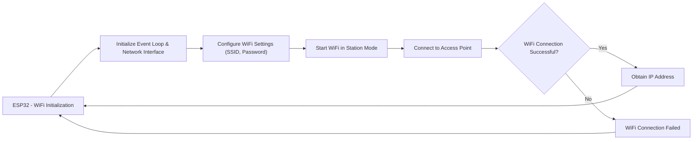

 # Line Following: Backend

The backend implementation for the line following module encompasses several key components that work together to enable the line following functionality of the robot. This section details the core elements, including the HTTP server for PID tuning, WiFi handling, and the IDF component manifest.

## IDF Component Manifest (`idf_component.yml`)

The `idf_component.yml` file serves as the manifest for the ESP-IDF component. It defines the dependencies required for the line following module.

```yaml
 File: 6_line_following/main/idf_component.yml
## IDF Component Manager Manifest File
dependencies:
  espressif/mdns: "^1.0.7"
  ## Required IDF version
  idf:
    version: ">=4.1.0"
  # # Put list of dependencies here
  # # For components maintained by Espressif:
  # component: "~1.0.0"
  # # For 3rd party components:
  # username/component: ">=1.0.0,<2.0.0"
  # username2/component2:
  #   version: "~1.0.0"
  #   # For transient dependencies `public` flag can be set.
  #   # `public` flag doesn't have an effect dependencies of the `main` component.
  #   # All dependencies of `main` are public by default.
  #   public: true
```

The manifest declares a dependency on the `espressif/mdns` component, which is used for mDNS (Multicast DNS) service discovery. It also specifies the required ESP-IDF version. This file ensures that all necessary dependencies are in place for the component to function correctly. [View on GitHub](https://github.com/SRA-VJTI/Wall-E/blob/main/6_line_following/main/idf_component.yml).

## WiFi Handling (`wifi_handler.c` and `wifi_handler.h`)

The WiFi handling module is responsible for connecting the ESP32 to a WiFi network. It utilizes the ESP-IDF WiFi API to establish a connection to a specified access point.

```c
// File: 6_line_following/main/wifi_handler.c
#include "wifi_handler.h"

// ... (Rest of the code)
```

The `wifi_handler.h` file contains the necessary definitions and includes for WiFi-related operations. It defines constants for WiFi connection parameters such as the SSID, password, and maximum retry attempts. The `wifi_handler.c` file implements the functions to initialize WiFi, connect to the access point, and handle WiFi events. The code includes an event handler to manage WiFi events such as connection attempts, successful connections, and disconnections. [View on GitHub](https://github.com/SRA-VJTI/Wall-E/blob/main/6_line_following/main/wifi_handler.c).

```c
// File: 6_line_following/main/wifi_handler.h
#ifndef WIFI_HANDLER_H
#define WIFI_HANDLER_H

// ... (Rest of the code)

#endif
```





## Tuning HTTP Server (`tuning_http_server.c` and `tuning_http_server.h`)

The tuning HTTP server provides a web interface for adjusting the PID (Proportional-Integral-Derivative) controller parameters used in the line following algorithm. This allows for real-time adjustments to optimize the robot's performance.

```c
// File: 6_line_following/main/tuning_http_server.c
#include "tuning_http_server.h"

// ... (Rest of the code)
```

The `tuning_http_server.h` file defines the necessary structures, constants, and function prototypes for the HTTP server. It includes headers for FreeRTOS, HTTP server functionality, JSON parsing, and WiFi handling. The file defines a structure `pid_const_t` to hold the PID constants (Kp, Ki, Kd) and a `read_pid_const()` function to retrieve these constants. [View on GitHub](https://github.com/SRA-VJTI/Wall-E/blob/main/6_line_following/main/tuning_http_server.h).

```c
// File: 6_line_following/main/tuning_http_server.h
#ifndef TUNING_HTTP_SERVER_H
#define TUNING_HTTP_SERVER_H

// ... (Rest of the code)

#endif
```

The `tuning_http_server.c` file implements the HTTP server logic. It includes functions for:

*   Initializing the mDNS service for service discovery.
*   Initializing the SPIFFS file system to serve web content.
*   Handling HTTP requests, including serving static HTML, CSS, and JavaScript files.
*   Handling POST requests to update PID constants.

```c
// Example: PID POST Handler in tuning_http_server.c
static esp_err_t tuning_pid_post_handler(httpd_req_t *req) {
    // ... (Code to parse JSON, update PID constants)
    pid_constants.val_changed = true; // Flag that PID values have changed
    return ESP_OK;
}
```

The `tuning_http_server.c` file also includes the `start_tuning_http_server()` function, which initializes the required components, such as mDNS, WiFi, and SPIFFS, before starting the HTTP server. The server listens for POST requests on the `/api/v1/pid` endpoint to receive new PID values in JSON format. When a POST request is received, the handler parses the JSON data, updates the PID constants, and signals that the PID values have been modified. [View on GitHub](https://github.com/SRA-VJTI/Wall-E/blob/main/6_line_following/main/tuning_http_server.c).

## Key Integration Points

The core functionality of the line following module is orchestrated through the interplay of these backend components:

1.  **Initialization:** The `main` function (not shown here, but a part of the overall project structure) typically calls `start_tuning_http_server()`, which initializes WiFi, mDNS, and the HTTP server.
2.  **WiFi Connection:** The WiFi handler establishes a connection to the configured WiFi network. Once connected, the ESP32 obtains an IP address.
3.  **mDNS Service Discovery:** The mDNS service allows the tuning web server to be discovered on the network using a human-readable hostname (e.g., `walle.local`).
4.  **HTTP Server for PID Tuning:** The HTTP server serves a web interface (HTML, CSS, JavaScript) that allows users to adjust the PID parameters. The web interface sends JSON data to the server via POST requests.
5.  **PID Parameter Updates:** The HTTP server's POST handler parses the JSON data containing the new PID values and updates the `pid_constants` structure.
6.  **PID Controller Integration:** (This part of the code is not shown here but is assumed.) The updated PID constants are then used by the line following algorithm to control the robot's movement.

The backend components work in tandem to create a system that allows remote tuning and control of the robot's line following behavior. By providing a web interface, this design makes it easy for users to adjust the PID parameters and observe their effects in real time, simplifying the process of optimizing the robot's performance.