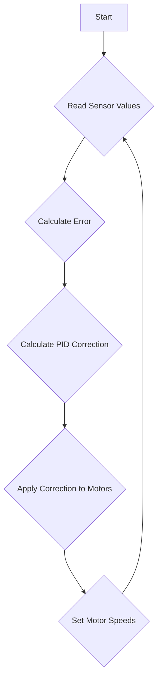
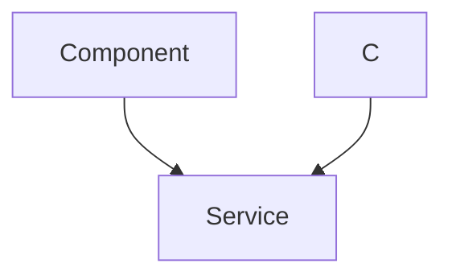

# Line Following System

This document details the implementation of the line following system for the Wall-E robot. The system uses a line sensor array, PID control, and motor control to autonomously follow a designated line.

## Overview

The line following system consists of the following components:

*   **Line Sensor Array:**  Detects the position of the line.
*   **PID Controller:** Calculates the correction needed to keep the robot on the line.
*   **Motor Control:** Adjusts the speed of the motors to steer the robot.
*   **Tuning Interface:** Allows for real-time adjustment of PID parameters.

## Theory of Operation

The robot employs a five-sensor line sensor array to identify a black line on a white surface (or vice versa). Each sensor outputs an analog reading that corresponds to the surface's reflectance beneath it. These sensors are assigned weights {-5, -3, 1, 3, 5}, from left to right, respectively. When the robot is correctly aligned, the sensors detect the line, and a weighted average of the activated sensors is used to calculate an error value. This error indicates the robot's deviation from the line's center and its direction. A positive error means the robot must turn right, while a negative error necessitates a left turn. The robot corrects its position relative to the line by driving the motors on each side at different speeds.

A PID (Proportional-Integral-Derivative) controller is employed to calculate the necessary corrections for line following. The PID controller adjusts the motor speeds to minimize the error between the robot's current position and the desired line position. The desired state is the center of the line (error = 0). The PID controller uses three terms:

*   **Proportional Term (Kp):** Responds to the current error.
*   **Integral Term (Ki):** Accumulates past errors to eliminate steady-state error.
*   **Derivative Term (Kd):** Predicts future error based on the rate of change of the current error.

The PID controller calculates a correction value based on the following formula:

```
correction = Kp*(error) + Ki*(cumulative_error) + Kd*(difference)
```

## Algorithm

1.  Initialize the line sensor array, motors, and read PID constants.
2.  Read the 5 sensors from the line sensor array.
3.  Normalize the sensor readings to a consistent range (0-1000).
4.  Calculate weighted error using the formula:
    *   For each sensor: if reading > `BLACK_BOUNDARY` (820), consider it "on line" (k = 1)
    *   Calculate weighted sum: `weighted_sum = sum of (weight[i] * k)`
    *   Calculate total activated sensors: `sum = sum of k`
    *   Calculate position: `pos = (weighted_sum - 1) / sum`
5.  Handle special case: if all sensors detect black (all black condition), use previous error to estimate direction.
6.  Calculate PID correction with current error, cumulative error, and error difference.
7.  Apply correction to motor speeds:
    *   Left motor speed = `optimum_duty_cycle` + correction
    *   Right motor speed = `optimum_duty_cycle` - correction
8.  Apply bounds to motor speeds to prevent excessive values.
9.  Set motor speeds using the calculated values.
10. Repeat from step 2.

## Code Implementation

### `calculate_error()`

This function calculates the error position of the robot relative to the line using a weighted average of activated sensors.

```c
void calculate_error()
{
    int all_black_flag = 1; // assuming initially all black condition
    float weighted_sum = 0, sum = 0; 
    float pos = 0; int k = 0;

    for(int i = 0; i < 5; i++)
    {
        if(line_sensor_readings.adc_reading[i] > BLACK_BOUNDARY)
        {
            all_black_flag = 0;
        }
        if(line_sensor_readings.adc_reading[i] > BLACK_BOUNDARY)
        {
            k = 1;
        }
        if(line_sensor_readings.adc_reading[i] < BLACK_BOUNDARY)
        {
            k = 0;
        }
        weighted_sum += (float)(weights[i]) * k;
        sum = sum + k;
    }

    if(sum != 0) // sum can never be 0 but just for safety purposes
    {
        pos = (weighted_sum - 1) / sum; // This will give us the position wrt line. if +ve then bot is facing left and if -ve the bot is facing to right.
    }

    if(all_black_flag == 1)  // If all black then we check for previous error to assign current error.
    {
        if(prev_error > 0)
        {
            error = 2.5;
        }
        else
        {
            error = -2.5;
        }
    }
    else
    {
        error = pos;
    }
}
```

[View on GitHub](https://github.com/SRA-VJTI/Wall-E/blob/master/6_line_following/main/line_following.c)

### `calculate_correction()`

This function calculates the PID correction value using the current error, cumulative error, and error difference.

```c
void calculate_correction()
{
    error = error*10;  // we need the error correction in range 0-100 so that we can send it directly as duty cycle paramete
    difference = error - prev_error;
    cumulative_error += error;

    cumulative_error = bound(cumulative_error, -30, 30);

    correction = read_pid_const().kp*error + read_pid_const().ki*cumulative_error + read_pid_const().kd*difference;
    prev_error = error;
}
```

[View on GitHub](https://github.com/SRA-VJTI/Wall-E/blob/master/6_line_following/main/line_following.c)

### `line_follow_task()`

This is the main task that handles the entire line following process, reading sensors, calculating error and correction, and controlling the motors.

```c
void line_follow_task(void* arg)
{
    motor_handle_t motor_a_0, motor_a_1;
    ESP_ERROR_CHECK(enable_motor_driver(&motor_a_0, MOTOR_A_0));
    ESP_ERROR_CHECK(enable_motor_driver(&motor_a_1, MOTOR_A_1));
    adc_handle_t line_sensor;
    ESP_ERROR_CHECK(enable_line_sensor(&line_sensor));
    ESP_ERROR_CHECK(enable_bar_graph());
#ifdef CONFIG_ENABLE_OLED
    // Initialising the OLED
    ESP_ERROR_CHECK(init_oled());
    vTaskDelay(100);

    // Clearing the screen
    lv_obj_clean(lv_scr_act());

#endif

    while(true)
    {
        line_sensor_readings = read_line_sensor(line_sensor);
        for(int i = 0; i < 5; i++)
        {
            line_sensor_readings.adc_reading[i] = bound(line_sensor_readings.adc_reading[i], WHITE_MARGIN, BLACK_MARGIN);
            line_sensor_readings.adc_reading[i] = map(line_sensor_readings.adc_reading[i], WHITE_MARGIN, BLACK_MARGIN, bound_LSA_LOW, bound_LSA_HIGH);
            line_sensor_readings.adc_reading[i] = 1000 - (line_sensor_readings.adc_reading[i]);
        }

        calculate_error();
        calculate_correction();

        left_duty_cycle = bound((optimum_duty_cycle + correction), lower_duty_cycle, higher_duty_cycle);
        right_duty_cycle = bound((optimum_duty_cycle - correction), lower_duty_cycle, higher_duty_cycle);

        set_motor_speed(motor_a_0, MOTOR_FORWARD, left_duty_cycle);
        set_motor_speed(motor_a_1, MOTOR_FORWARD, right_duty_cycle);


        //ESP_LOGI("debug","left_duty_cycle:  %f    ::  right_duty_cycle :  %f  :: error :  %f  correction  :  %f  \n",left_duty_cycle, right_duty_cycle, error, correction);
        ESP_LOGI("debug", "KP: %f ::  KI: %f  :: KD: %f", read_pid_const().kp, read_pid_const().ki, read_pid_const().kd);
#ifdef CONFIG_ENABLE_OLED
        // Diplaying kp, ki, kd values on OLED 
        if (read_pid_const().val_changed)
        {
            display_pid_values(read_pid_const().kp, read_pid_const().ki, read_pid_const().kd);
            reset_val_changed_pid_const();
        }
#endif

        vTaskDelay(10 / portTICK_PERIOD_MS);
    }

    vTaskDelete(NULL);
}
```

[View on GitHub](https://github.com/SRA-VJTI/Wall-E/blob/master/6_line_following/main/line_following.c)

### `read_pid_const()`

This function retrieves the current PID constants (Kp, Ki, Kd) which were set from the tuning interface.

```c
pid_const_t read_pid_const()
{
    return pid_const;
}
```

[View on GitHub](https://github.com/SRA-VJTI/Wall-E/blob/master/6_line_following/main/line_following.c)

### `start_tuning_http_server()`

This function initiates an HTTP server that provides a web interface for tuning the PID parameters in real-time.

```c
void start_tuning_http_server()
{
    static httpd_handle_t server = NULL;

    /*Generate the certificates in flash
    * we are not doing any error checking here because
    * this is an example and the flash has been partitioned
    * accordingly
    */
    esp_err_t ret = nvs_flash_init();
    if (ret == ESP_ERR_NVS_NO_FREE_PAGES || ret == ESP_ERR_NVS_NEW_VERSION_FOUND) {
        ESP_ERROR_CHECK(nvs_flash_erase());
        ret = nvs_flash_init();
    }
    ESP_ERROR_CHECK(ret);

    /*start web server*/
    server = start_webserver();

    /*register all uri handlers*/
    register_uri_handlers(server);
}
```

[View on GitHub](https://github.com/SRA-VJTI/Wall-E/blob/master/tuning_http_server/tuning_http_server.c)

### `index.html` (Frontend)

This HTML file provides a user interface for tuning the PID constants.  It includes input fields for Kp, Ki, and Kd, along with buttons to increment and decrement the values.

```html
<!DOCTYPE html>
<html lang="en">
	<head>
		<meta charset="UTF-8" />
		<meta name="viewport" content="width=device-width, initial-scale=1.0" />
		<title>Tuning page</title>
		<style>
			* {
				margin: 0;
				padding: 0;
				box-sizing: border-box;
				font-family: "Segoe UI", Tahoma, Geneva, Verdana, sans-serif;
				outline: none;
			}
			button {
				border: none;
				background: transparent;
			}
			body {
				width: 100%;
				height: 100vh;

				background: url("data:image/svg+xml;base64,PHN2ZyB4bWxucz0iaHR0cDovL3d3dy53My5vcmcvMjAwMC9zdmciIHhtbG5zOnhsaW5rPSJodHRwOi8vd3d3LnczLm9yZy8xOTk5L3hsaW5rIiB3aWR0aD0iMTAwJSIgaGVpZ2h0PSIxMDAlIj48ZGVmcz48cGF0dGVybiBpZD0icGF0dGVybiIgd2lkdGg9IjQ2LjE5IiBoZWlnaHQ9IjQwIiB2aWV3Qm94PSIwIDAgMzQuNjQxMDE2MTUxMzc3NTUsMzAiIHBhdHRlcm5Vbml0cz0idXNlclNwYWNlT25Vc2UiIHBhdHRlcm5UcmFuc2Zvcm09InJvdGF0ZSgxMzUpICI+PHJlY3QgaWQ9InBhdHRlcm4tYmFja2dyb3VuZCIgd2lkdGg9IjQwMCUiIGhlaWdodD0iNDAwJSIgZmlsbD0icmdiYSgyNiwgMzIsIDQ0LDEpIj48L3JlY3Q+IDxwYXRoIGZpbGw9InJnYmEoNDUsIDU1LCA3MiwxKSIgZD0iTS0yMCAtMjAgaDIwMCB2MjAwIGgtMjAwIE0zMy43NyAyNS41TDI1Ljk4IDIxTDE4LjE5IDI1LjVMMTguMTkgMzQuNUwyNS45OCAzOUwzMy43NyAzNC41ek0xNi40NSAyNS41TDguNjYgMjFMMC44NyAyNS41TDAuODcgMzQuNUw4LjY2IDM5TDE2LjQ1IDM0LjV6TTcuNzkgMTAuNUwwIDZMLTcuNzkgMTAuNUwtNy43OSAxOS41TDAgMjRMNy43OSAxOS41ek0xNi40NSAtNC41TDguNjYgLTlMMC44NyAtNC41TDAuODcgNC41TDguNjYgOUwxNi40NSA0LjV6TTMzLjc3IC00LjVMMjUuOTggLTlMMTguMTkgLTQuNUwxOC4xOSA0LjVMMjUuOTggOUwzMy43NyA0LjV6TTQyLjQzIDEwLjVMMzQuNjQgNkwyNi44NSAxMC41TDI2Ljg1IDE5LjVMMzQuNjQgMjRMNDIuNDMgMTkuNXpNMjUuMTEgMTAuNUwxNy4zMiA2TDkuNTMgMTAuNUw5LjUzIDE5LjVMMTcuMzIgMjRMMjUuMTEgMTkuNXoiPjwvcGF0aD48cGF0aCBmaWxsPSJyZ2JhKDE5MCwgMjI3LCAyNDgsMSkiIGQ9Ik0tMjAgLTIwIGgyMDAgdjIwMCBoLTIwMCBNMjQuMjEgMjUuMjVMMTUuOTggMjAuNUw3Ljc1IDI1LjI1TDcuNzUgMzQuNzVMMTUuOTggMzkuNUwyNC4yMSAzNC43NXpNNi44OSAyNS4yNUwtMS4zNCAyMC41TC05LjU3IDI1LjI1TC05LjU3IDM0Ljc1TC0xLjM0IDM5LjVMNi44OSAzNC43NXpNLTEuNzcgMTAuMjVMLTEwIDUuNUwtMTguMjMgMTAuMjVMLTE4LjIzIDE5Ljc1TC0xMCAyNC41TC0xLjc3IDE5Ljc1ek02Ljg5IC00Ljc1TC0xLjM0IC05LjVMLTkuNTcgLTQuNzVMLTkuNTcgNC43NUwtMS4zNCA5LjVMNi44OSA0Ljc1ek0yNC4yMSAtNC43NUwxNS45OCAtOS41TDcuNzUgLTQuNzVMNy43NSA0Ljc1TDE1Ljk4IDkuNUwyNC4yMSA0Ljc1ek0zMi44NyAxMC4yNUwyNC42NCA1LjVMMTYuNDEgMTAuMjVMMTYuNDEgMTkuNzVMMjQuNjQgMjQuNUwzMi44NyAxOS43NXpNNDEuNTMgMjUuMjVMMzMuMyAyMC41TDI1LjA3IDI1LjI1TDI1LjA3IDM0Ljc1TDMzLjMgMzkuNUw0MS5a/VJQUm34uNzVlMTUuNTUgNDAuMjVMNy4zMiAzNS41TC0wLjkxIDQwLjI1TC0wLjkxIDQ5Ljc1TDcuMzIgNTQuNUwxNS5a/VJQUm34uNzVlLTEwLjQzIDI1LjI1TC0xOC42NiAyMC41TC0yNi44OSAyNS4yNUwtMjYuODkgMzQuNzVMLTE4LjY2IDM5LjVMLTEwLjQzIDM0Ljc1ek0tMTAuNDMgLTQuNzVMLTE4LjY2IC05LjVMLTI2Ljg5IC00Ljc1TC0yNi44OSA0Ljc1TC0xOC42NiA5LjVMLTEwLjQzIDQuNzVlMTUuNTUgLTE5Ljc1TDcuMzIgLTI0LjVMLTAuOTEgLTE5Ljc1TC0wLjkxIC0xMC4yNUw3LjMyIC01LjVMMTUua/VJQUm34uMjVlNDEuNTMgLTQuNzVMMzMuMyAtOS41TDI1LjA3IC00Ljc1TDI1LjA3IDQuNzVMMzMuMyA5LjVMNDEua/VJQUm34uNzVlMzIuODcgNDAuMjVMMjQuNjQgMzUuNUwxNi40MSA0MC4yNUwxNi40MSA0OS43NUwyNC42NCA1NC41TDMy.87 49.75eS0x.77 40.25L-10 35.5L-18.23 40.25L-18.23 49.75L-10 54.5L-1.77 49.75eS0xOS4wOSAxMC4yNUwtMjcuMzIgNS41TC0zNS41NSAxMC4yNUwtMzUuNTUgMTkuNzVMLTI3LjMyIDI0LjVMLTE5.09 19.75eS0x.77 -19.75L-10 -24.5L-18.23 -19.75L-18.23 -10.25L-10 -5.5L-1.77 -10.25eMzIuODcgLTE5Ljc1LDI0LjY0IC0yNC41LDE2LjQxIC0xOS43NUwxNi40MSAtMTAuMjVMMjQuNjQgLTUuNUwzMi44NyAtMTAuMjVlNTAuMTkgMTAuMjVMNDEuOTYgNS41TDMzLjczIDEwLjI1TDMzLjczIDE5Ljc1TDQxLjk2IDI0LjVMNTAuMTkgMTkuNzVlMTUuNTUgMTAuMjVMNy4zMiA1LjVMLTAuOTEgMTAuMjVM-0.91 19.75LDcuMzIgMjQuNUwxNS5a/VJQUm34uNzUiPjwvcGF0aD48L3BhdHRlcm4+ICA8L2RlZnM+IDxyZWN0IGZpbGw9InVybCgjcGF0dGVybikiIGhlaWdodD0iMTAwJSIgd2lkdGg9IjEwMCUiPjwvcmVjdD48L3N2Zz4=");
				display: flex;
				justify-content: center;
				align-items: center;
			}
			main {
				background-color: rgba(0, 0, 0, 0.493);
				/* backdrop-filter: blur(2px); */
				color: white;
				min-width: 35%;
				padding: 2em;
				height: 90vh;
				border-radius: 10px;
				display: flex;
				flex-direction: column;
				justify-content: space-around;
				align-items: center;

				font-weight: 100;
			}
			.button-group {
				margin-bottom: 20px;
			}
			h1 {
				font-weight: normal;
				margin-bottom: 10px;
			}
			.button-group h3 {
				font-weight: normal;
				text-align: center;
				font-family: "Segoe UI", Tahoma, Geneva, Verdana, sans-serif;
				font-size: 1.4rem;
				/* margin-bottom: 5px; */
			}
			.button-group input {
				background-color: transparent;
				border: none;
				border-bottom: 2px solid white;
				color: white;
				text-align: center;
				font-size: 1.2rem;
				padding: 5px;
			}
			input::-webkit-outer-spin-button,
			input::-webkit-inner-spin-button {
				-webkit-appearance: none;
			}

			.button-group button {
				color: white;
				cursor: pointer;
				font-size: 2rem;
			}
		</style>
	</head>
	<body>
		<main>
			<h1>Line Following</h1>
			<div class="button-group">
				<h3>Kp</h3>
				<button>&lt;</button>
				<input type="number" value="0.000" id="kp" />
				<button>&gt;</button>
			</div>
			<div class="button-group">
				<h3>Ki</h3>
				<button>&lt;</button>
				<input type="number" value="0.000" id="ki" />
				<button>&gt;</button>
			</div>
			<div class="button-group">
				<h3>Kd</h3>
				<button>&lt;</button>
				<input type="number" value="0.000" id="kd" />
				<button>&gt;</button>
			</div>
		</main>
		<script>
			let inpArray = document.querySelectorAll("input[type='number']");
			function submitVals() {
				const data = {};
				data["kp"] = parseFloat(document.getElementById("kp").value);
				data["ki"] = parseFloat(document.getElementById("ki").value);
				data["kd"] = parseFloat(document.getElementById("kd").value);
				let finaldata = JSON.stringify(data);
				console.log(finaldata);

				let xhr = new XMLHttpRequest();

				// Vedant!
				let url = "/api/v1/pid";

				// open a connection
				xhr.open("POST", url, true);

				// Set the request header i.e. which type of content you are sending
				xhr.setRequestHeader("Content-Type", "application/json");
				// Create a state change callback
				xhr.onreadystatechange = function () {
					if (xhr.readyState === 4) {
						if (xhr.status == 400) {
							console.log("Success!");
						} else {
							console.log(xhr.status);
						}
						// Print received data from server
					}
				};

				// Sending data with the request
				xhr.send(finaldata);
			}
			for (let i = 0; i < inpArray.length; i++) {
				inpArray[i].addEventListener("change", submitVals);
			}

			let decrementButtons = document.querySelectorAll(
				".button-group button:first-of-type"
			);
			let incrementButtons = document.querySelectorAll(
				".button-group button:last-of-type"
			);
			function decrementVal(e) {
				let test = e.target.parentNode.children[2].value;
				if (!isNaN(Number(test))) {
					e.target.parentNode.children[2].value = String(
						(Number(test) - 0.01).toFixed(3)
					);
					submitVals();
				} else {
					e.target.parentNode.children[2].value = "0.000";
				}
			}
			function incrementVal(e) {
				let test = e.target.parentNode.children[2].value;
				if (!isNaN(Number(test))) {
					e.target.parentNode.children[2].value = String(
						(Number(test) + 0.01).toFixed(3)
					);
					submitVals();
				} else {
					e.target.parentNode.children[2].value = "0.000";
				}
			}
			for (button of decrementButtons) {
				button.addEventListener("click", decrementVal);
			}
			for (button of incrementButtons) {
				button.addEventListener("click", incrementVal);
			}
		</script>
	</body>
</html>
```

[View on GitHub](https://github.com/SRA-VJTI/Wall-E/blob/master/6_line_following/frontend/index.html)

## PID Tuning

The line following system utilizes a PID controller. The tuning of Kp, Ki and Kd values are very important to the system performance. The `index.html` in the frontend folder serves as a tuning interface.





## System Architecture

The interaction between the components can be summarized in this manner:





## Key Integration Points

*   The `line_follow_task` function is the core of the line following system. It integrates the line sensor, PID controller, and motor control.
*   The `start_tuning_http_server` function allows for remote tuning of the PID parameters, enabling real-time optimization of the line following performance.
*   The `index.html` file provides a simple and intuitive web interface for adjusting the PID constants.
*   The error calculation directly impacts the robot's ability to stay on the line; proper weighting and handling of edge cases (like all sensors detecting black) are crucial.

## Best Practices

*   **PID Tuning:**  Start with a low Kp value and gradually increase it until the robot starts to oscillate. Then, add a small Kd value to dampen the oscillations. Finally, add a small Ki value to eliminate any steady-state error.
*   **Sensor Calibration:** Ensure that the line sensors are properly calibrated to provide accurate readings.
*   **Motor Control:** Implement a smooth motor control algorithm to prevent jerky movements.
*   **Error Handling:** Implement robust error handling to deal with unexpected situations, such as the robot losing the line.
*   **Data Logging:** Log sensor readings, error values, and motor speeds to facilitate debugging and performance analysis.