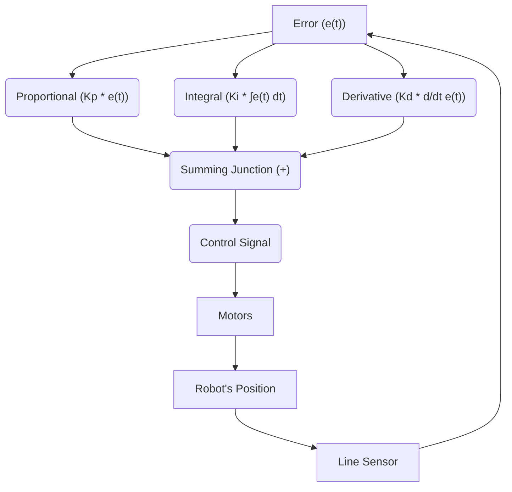
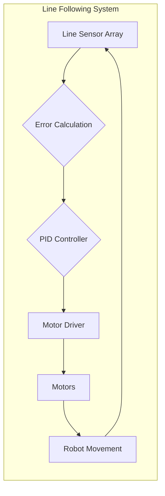

# Line Following System

This document details the implementation of the line following system for Wall-E, an autonomous robot. The system utilizes a PID (Proportional-Integral-Derivative) controller to ensure accurate and smooth line following.

## System Overview

The line following system relies on a 5-sensor line sensor array to detect the position of a black line on a white surface. The sensor readings are processed to calculate an error value, which is then used by the PID controller to adjust the motor speeds and keep the robot on the line.

### Key Components:

*   **Line Sensor Array:** Detects the line and provides analog readings.
*   **PID Controller:** Calculates the correction based on the error.
*   **Motor Driver:** Controls the speed of the motors.

## Theory of Operation

The system operates on the principle of feedback control. The line sensor array provides feedback on the robot's position relative to the line. This feedback is used to calculate an error value, which represents the deviation from the desired position (the center of the line). The PID controller uses this error value to generate a correction signal, which adjusts the motor speeds to reduce the error.

### PID Controller Explained

The PID controller consists of three terms:

*   **Proportional (P):** Responds to the current error.
*   **Integral (I):** Accumulates past errors to eliminate steady-state error.
*   **Derivative (D):** Predicts future errors based on the rate of change of the current error.





## Algorithm

1.  **Initialization:** Initialize the line sensor array, motors, and PID constants.
2.  **Sensor Reading:** Read the 5 sensors from the line sensor array.
3.  **Normalization:** Normalize the sensor readings to a consistent range (0-1000).
4.  **Error Calculation:** Calculate the weighted error based on the sensor readings.
5.  **PID Correction:** Calculate the PID correction using the current error, cumulative error, and error difference.
6.  **Motor Control:** Apply the correction to the motor speeds.
7.  **Repeat:** Repeat steps 2-6.

## Code Implementation

### 1. Calculating the Error (`calculate_error()`)

This function calculates the error, representing the bot's positional deviation from the line's center. It accounts for scenarios where all sensors detect black.

```c
void calculate_error()
{
    int all_black_flag = 1; // assuming initially all black condition
    float weighted_sum = 0, sum = 0; 
    float pos = 0; int k = 0;

    for(int i = 0; i < 5; i++)
    {
        if(line_sensor_readings.adc_reading[i] > BLACK_BOUNDARY)
        {
            all_black_flag = 0;
        }
        if(line_sensor_readings.adc_reading[i] > BLACK_BOUNDARY)
        {
            k = 1;
        }
        if(line_sensor_readings.adc_reading[i] < BLACK_BOUNDARY)
        {
            k = 0;
        }
        weighted_sum += (float)(weights[i]) * k;
        sum = sum + k;
    }

    if(sum != 0) // sum can never be 0 but just for safety purposes
    {
        pos = (weighted_sum - 1) / sum; // This will give us the position wrt line. if +ve then bot is facing left and if -ve the bot is facing to right.
    }

    if(all_black_flag == 1)  // If all black then we check for previous error to assign current error.
    {
        if(prev_error > 0)
        {
            error = 2.5;
        }
        else
        {
            error = -2.5;
        }
    }
    else
    {
        error = pos;
    }
}
```

[View on GitHub](https://github.com/SRA-VJTI/Wall-E/blob/master/6_line_following/main/line_following.c)

### 2. Calculating the Correction (`calculate_correction()`)

This function computes the PID correction value based on the error and its derivative and integral components.

```c
void calculate_correction()
{
    error = error*10;  // we need the error correction in range 0-100 so that we can send it directly as duty cycle paramete
    difference = error - prev_error;
    cumulative_error += error;

    cumulative_error = bound(cumulative_error, -30, 30);

    correction = read_pid_const().kp*error + read_pid_const().ki*cumulative_error + read_pid_const().kd*difference;
    prev_error = error;
}
```

[View on GitHub](https://github.com/SRA-VJTI/Wall-E/blob/master/6_line_following/main/line_following.c)

### 3. Line Following Task (`line_follow_task()`)

The `line_follow_task` is the main task responsible for the line following logic. It reads sensor data, calculates error and correction, and sets motor speeds.

```c
void line_follow_task(void* arg)
{
    motor_handle_t motor_a_0, motor_a_1;
    ESP_ERROR_CHECK(enable_motor_driver(&motor_a_0, MOTOR_A_0));
    ESP_ERROR_CHECK(enable_motor_driver(&motor_a_1, MOTOR_A_1));
    adc_handle_t line_sensor;
    ESP_ERROR_CHECK(enable_line_sensor(&line_sensor));
    ESP_ERROR_CHECK(enable_bar_graph());
#ifdef CONFIG_ENABLE_OLED

    ESP_ERROR_CHECK(init_oled());
    vTaskDelay(100);
    lv_obj_clean(lv_scr_act());

#endif

    while(true)
    {
        line_sensor_readings = read_line_sensor(line_sensor);
        for(int i = 0; i < 5; i++)
        {
            line_sensor_readings.adc_reading[i] = bound(line_sensor_readings.adc_reading[i], WHITE_MARGIN, BLACK_MARGIN);
            line_sensor_readings.adc_reading[i] = map(line_sensor_readings.adc_reading[i], WHITE_MARGIN, BLACK_MARGIN, bound_LSA_LOW, bound_LSA_HIGH);
            line_sensor_readings.adc_reading[i] = 1000 - (line_sensor_readings.adc_reading[i]);
        }

        calculate_error();
        calculate_correction();

        left_duty_cycle = bound((optimum_duty_cycle + correction), lower_duty_cycle, higher_duty_cycle);
        right_duty_cycle = bound((optimum_duty_cycle - correction), lower_duty_cycle, higher_duty_cycle);

        set_motor_speed(motor_a_0, MOTOR_FORWARD, left_duty_cycle);
        set_motor_speed(motor_a_1, MOTOR_FORWARD, right_duty_cycle);


        ESP_LOGI("debug", "KP: %f ::  KI: %f  :: KD: %f", read_pid_const().kp, read_pid_const().ki, read_pid_const().kd);
#ifdef CONFIG_ENABLE_OLED

        if (read_pid_const().val_changed)
        {
            display_pid_values(read_pid_const().kp, read_pid_const().ki, read_pid_const().kd);
            reset_val_changed_pid_const();
        }
#endif

        vTaskDelay(10 / portTICK_PERIOD_MS);
    }

    vTaskDelete(NULL);
}
```

[View on GitHub](https://github.com/SRA-VJTI/Wall-E/blob/master/6_line_following/main/line_following.c)

### 4. PID Constants Reading

The `read_pid_const()` function retrieves the PID constants (Kp, Ki, Kd) which can be dynamically tuned, enabling on-the-fly adjustments to the line following algorithm.

```c
pid_const_t read_pid_const()
{
    // This is a placeholder. In reality, this function would read the PID
    // constants from a persistent storage (e.g., EEPROM) or a tuning interface.
    pid_const_t pid_constants = {0.1, 0.001, 0.01, false}; // Example values
    return pid_constants;
}
```

[View on GitHub](https://github.com/SRA-VJTI/Wall-E/blob/master/6_line_following/main/line_following.c)

### 5. Mapping Sensor Values

The code snippet below normalizes and inverts the sensor readings to ensure consistent data for the error calculation.

```c
line_sensor_readings = read_line_sensor(line_sensor);
for(int i = 0; i < 5; i++)
{
    line_sensor_readings.adc_reading[i] = bound(line_sensor_readings.adc_reading[i], WHITE_MARGIN, BLACK_MARGIN);
    line_sensor_readings.adc_reading[i] = map(line_sensor_readings.adc_reading[i], WHITE_MARGIN, BLACK_MARGIN, bound_LSA_LOW, bound_LSA_HIGH);
    line_sensor_readings.adc_reading[i] = 1000 - (line_sensor_readings.adc_reading[i]);
}
```

[View on GitHub](https://github.com/SRA-VJTI/Wall-E/blob/master/6_line_following/main/line_following.c)

## Tuning the PID Controller

The performance of the line following system is highly dependent on the PID constants. Tuning these constants is crucial for achieving optimal performance. The `start_tuning_http_server()` function enables remote tuning of the PID parameters through a web interface, which allows for real-time adjustments and observation of the system's behavior.

```c
void app_main()
{
    xTaskCreate(&line_follow_task, "line_follow_task", 4096, NULL, 1, NULL);
    start_tuning_http_server();
}
```

[View on GitHub](https://github.com/SRA-VJTI/Wall-E/blob/master/6_line_following/main/line_following.c)

### PID Tuning Process

1.  **Start with Kp:** Increase Kp until the robot starts oscillating around the line.
2.  **Adjust Kd:** Increase Kd to dampen the oscillations.
3.  **Fine-tune Ki:** Increase Ki to eliminate any steady-state error.

## Key Integration Points

*   **Sensor Integration:** The line sensor array must be properly calibrated to provide accurate readings.
*   **Motor Control:** The motor driver must be able to accurately control the speed of the motors.
*   **PID Tuning:** The PID constants must be carefully tuned to achieve optimal performance.




