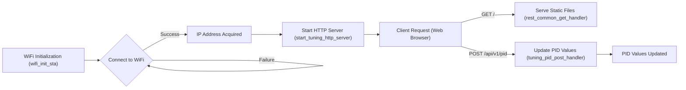

# Line Following - WiFi Connectivity

This document details the WiFi connectivity configuration and handling within the Wall-E line following system. It covers the setup, initialization, and management of WiFi connections, as well as the implementation of an HTTP server for tuning PID controller parameters.

## WiFi Initialization and Connection

The `wifi_handler.c` file handles the WiFi connection process. It initializes the ESP32's WiFi module in station mode (STA), configures the WiFi credentials, and attempts to connect to the specified access point.

```c
// File: 6_line_following/main/wifi_handler.c
void wifi_init_sta(void)
{
    s_wifi_event_group = xEventGroupCreate();

    ESP_ERROR_CHECK(esp_netif_init());

    esp_netif_create_default_wifi_sta();

    wifi_init_config_t cfg = WIFI_INIT_CONFIG_DEFAULT();
    ESP_ERROR_CHECK(esp_wifi_init(&cfg));

    // ... (rest of the function)
}
```

[View on GitHub](https://github.com/SRA-VJTI/Wall-E/blob/master/6_line_following/main/wifi_handler.c)

This snippet shows the initialization of the WiFi station. The `esp_netif_init()` initializes the underlying TCP/IP stack. `esp_netif_create_default_wifi_sta()` creates the network interface for WiFi station mode, and `esp_wifi_init()` initializes the WiFi driver.  The event group `s_wifi_event_group` is used for signaling connection status.

### Event Handling

The `event_handler` function manages various WiFi and IP events, such as connection establishment, disconnection, and IP address acquisition.

```c
// File: 6_line_following/main/wifi_handler.c
static void event_handler(void* arg, esp_event_base_t event_base, int32_t event_id, void* event_data)
{
    if (event_base == WIFI_EVENT && event_id == WIFI_EVENT_STA_START)
    {
        esp_wifi_connect();
    }
    else if (event_base == WIFI_EVENT && event_id == WIFI_EVENT_STA_DISCONNECTED)
    {
        // ... (retry logic)
    }
    else if (event_base == IP_EVENT && event_id == IP_EVENT_STA_GOT_IP)
    {
        // ... (IP address acquired)
    }
}
```

[View on GitHub](https://github.com/SRA-VJTI/Wall-E/blob/master/6_line_following/main/wifi_handler.c)

This function is registered to handle WiFi and IP events. When the WiFi station starts (`WIFI_EVENT_STA_START`), it initiates a connection attempt. If disconnected (`WIFI_EVENT_STA_DISCONNECTED`), it retries the connection up to a maximum number of attempts. Upon successful IP address acquisition (`IP_EVENT_STA_GOT_IP`), it sets the `WIFI_CONNECTED_BIT` in the event group.

### WiFi Configuration

The `wifi_config_t` structure holds the WiFi credentials (SSID and password).

```c
// File: 6_line_following/main/wifi_handler.c
wifi_config_t wifi_config = {
    .sta = {
        .ssid = WIFI_SSID,
        .password = WIFI_PASS,
        .threshold.authmode = WIFI_AUTH_WPA2_PSK,
        .pmf_cfg = {
            .capable = true,
            .required = false
        },
    },
};
```

[View on GitHub](https://github.com/SRA-VJTI/Wall-E/blob/master/6_line_following/main/wifi_handler.c)

The code sets the SSID and password for the WiFi network.  It also configures the authentication mode to WPA2-PSK.  The `pmf_cfg` settings configure Protected Management Frames (PMF) for enhanced security.

## HTTP Server for PID Tuning

The `tuning_http_server.c` file implements an HTTP server that allows users to remotely adjust the PID controller parameters (Kp, Ki, Kd).

### Initialization of HTTP Server

The `start_tuning_http_server_private` function sets up the HTTP server.

```c
// File: 6_line_following/main/tuning_http_server.c
static esp_err_t start_tuning_http_server_private()
{
    httpd_handle_t server = NULL;
    httpd_config_t config = HTTPD_DEFAULT_CONFIG();
    config.uri_match_fn = httpd_uri_match_wildcard;

    ESP_LOGI(TAG, "Starting HTTP Server");
    if (httpd_start(&server, &config) != ESP_OK)
    {
        ESP_LOGE(TAG, "start server failed");
        return ESP_FAIL;
    }

    // ... (URI handler registration)
}
```

[View on GitHub](https://github.com/SRA-VJTI/Wall-E/blob/master/6_line_following/main/tuning_http_server.c)

This snippet configures and starts the HTTP server. `HTTPD_DEFAULT_CONFIG()` provides a default configuration, and `httpd_start()` starts the server.  Error handling is included to check for server startup failures.  A wildcard URI matching function is used to handle all GET requests for static files.

### URI Handlers

The server registers URI handlers for specific endpoints. The `/api/v1/pid` endpoint handles POST requests for updating PID parameters. The `/*` endpoint handles GET requests for serving static files from the SPIFFS filesystem.

```c
// File: 6_line_following/main/tuning_http_server.c
httpd_uri_t tuning_pid_post_uri = {
    .uri = "/api/v1/pid",
    .method = HTTP_POST,
    .handler = tuning_pid_post_handler,
    .user_ctx = NULL
};
if (httpd_register_uri_handler(server, &tuning_pid_post_uri) != ESP_OK)
{
    ESP_LOGE(TAG, "register post uri failed");
    return ESP_FAIL;
}

httpd_uri_t common_get_uri = {
    .uri = "/*",
    .method = HTTP_GET,
    .handler = rest_common_get_handler,
    .user_ctx = NULL
};
if(httpd_register_uri_handler(server, &common_get_uri) != ESP_OK)
{
    ESP_LOGE(TAG, "register get uri failed");
    return ESP_FAIL;
}
```

[View on GitHub](https://github.com/SRA-VJTI/Wall-E/blob/master/6_line_following/main/tuning_http_server.c)

This code registers the handlers for the `/api/v1/pid` (POST) and `/*` (GET) URIs. The `tuning_pid_post_handler` processes requests to update PID values, while the `rest_common_get_handler` serves static files.

### Handling POST Requests

The `tuning_pid_post_handler` function processes POST requests to update the PID controller parameters. It parses the JSON payload, extracts the Kp, Ki, and Kd values, and updates the `pid_constants` structure.

```c
// File: 6_line_following/main/tuning_http_server.c
static esp_err_t tuning_pid_post_handler(httpd_req_t *req)
{
    // ... (receive data)

    cJSON *root = cJSON_Parse(buf);
    if (root == NULL)
    {
        ESP_LOGE(TAG, "invalid json response");
        return ESP_FAIL;
    }

    // ... (extract PID values)

    pid_constants.kp = (float)cJSON_GetObjectItem(root, "kp")->valuedouble;
    pid_constants.ki = (float)cJSON_GetObjectItem(root, "ki")->valuedouble;
    pid_constants.kd = (float)cJSON_GetObjectItem(root, "kd")->valuedouble;

    cJSON_Delete(root);
    httpd_resp_sendstr(req, "Post control value successfully");

    pid_constants.val_changed = true;
    return ESP_OK;
}
```

[View on GitHub](https://github.com/SRA-VJTI/Wall-E/blob/master/6_line_following/main/tuning_http_server.c)

The handler receives the POST data, parses it as JSON, and extracts the `kp`, `ki`, and `kd` values.  It updates the `pid_constants` structure and sets `val_changed` to `true` to indicate that the PID values have been modified.

### Serving Static Files

The `rest_common_get_handler` function serves static files (HTML, CSS, JavaScript) from the SPIFFS filesystem.

```c
// File: 6_line_following/main/tuning_http_server.c
static esp_err_t rest_common_get_handler(httpd_req_t *req)
{
    char filepath[FILE_PATH_MAX] = WEB_MOUNT_POINT;

    if (strlen(req->uri) > 0 && req->uri[strlen(req->uri) - 1] == '/')
    {
        strlcat(filepath, "/index.html", sizeof(filepath));
    }
    else
    {
        strlcat(filepath, req->uri, sizeof(filepath));
    }

    // ... (open and send file)
}
```

[View on GitHub](https://github.com/SRA-VJTI/Wall-E/blob/master/6_line_following/main/tuning_http_server.c)

This function constructs the file path from the requested URI and the base path.  If the URI ends with a `/`, it defaults to serving `index.html`.  It reads the file in chunks and sends it as an HTTP response.

### MDNS Configuration

The code initializes MDNS for service discovery.

```c
// File: 6_line_following/main/tuning_http_server.c
static void initialise_mdns(void)
{
    mdns_init();
    mdns_hostname_set(MDNS_HOST_NAME);
    mdns_instance_name_set(MDNS_INSTANCE);

    mdns_txt_item_t serviceTxtData[] = {
        {"board", "esp32"},
        {"path", "/"}
    };

    ESP_ERROR_CHECK(mdns_service_add("ESP32-WebServer", "_http", "_tcp", 80, serviceTxtData,
                                     sizeof(serviceTxtData) / sizeof(serviceTxtData[0])));
}
```

[View on GitHub](https://github.com/SRA-VJTI/Wall-E/blob/master/6_line_following/main/tuning_http_server.c)

The `initialise_mdns` function initializes MDNS, sets the hostname and instance name, and adds a service record for the web server.  This allows devices on the network to discover the server by its hostname.

## Data Flow





## Key Integration Points

*   **WiFi Connection**: The system relies on a stable WiFi connection to provide remote access to the PID tuning interface.
*   **HTTP Server**: The HTTP server enables remote configuration of the PID controller parameters via a web browser.
*   **SPIFFS Filesystem**: The SPIFFS filesystem stores the static web files (HTML, CSS, JavaScript) that make up the web interface.
*   **PID Controller**: The PID controller uses the tuned parameters to control the line following behavior.

## Best Practices

*   **Error Handling**: Implement robust error handling to gracefully manage connection failures and invalid user inputs.
*   **Security**: Protect the web interface with authentication and authorization mechanisms to prevent unauthorized access.
*   **Configuration**: Store WiFi credentials and other configuration parameters in non-volatile storage (NVS) to persist settings across reboots.
*   **Modularity**: Separate the WiFi handling and HTTP server functionalities into distinct modules to improve code organization and maintainability.
*   **Asynchronous Operations**: Use asynchronous operations to avoid blocking the main execution thread, ensuring responsiveness.