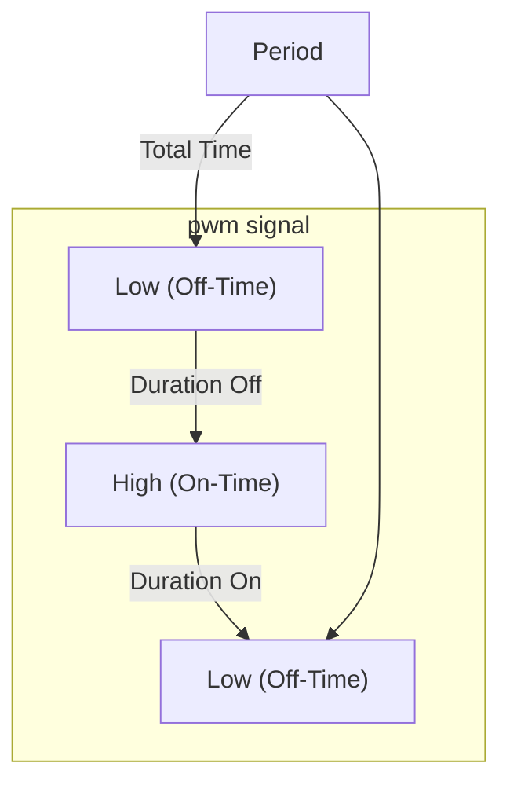
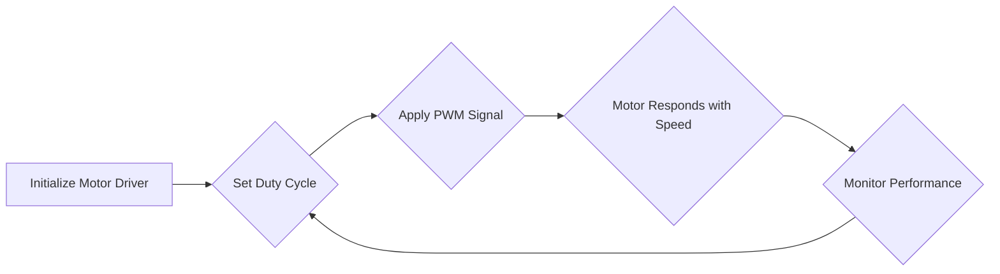

---
title: "PWM Control"
description: "Describes the Pulse Width Modulation (PWM) control implementation."
---

# PWM Control

Pulse Width Modulation (PWM) is a fundamental technique used to control the amount of power delivered to a device by varying the duty cycle of a square wave. This page details the PWM implementation within the Wall-E project, focusing on its application in motor speed control.

## Understanding PWM

PWM involves rapidly switching a signal between on and off states. The *duty cycle* refers to the percentage of time the signal is in the "on" state during a single period. By adjusting the duty cycle, we can effectively control the average voltage applied to a device, such as a DC motor.

### Key Concepts:

*   **Duty Cycle:** The ratio of ON-time to the total period (ON-time + OFF-time). Expressed as a percentage.
*   **Frequency:** The number of PWM cycles per second (Hertz).  A higher frequency typically results in smoother operation.
*   **Resolution:** The number of discrete duty cycle steps available. Higher resolution allows for finer control.

Here's a basic Mermaid diagram illustrating the PWM concept:





## Implementation in Wall-E

In the Wall-E project, PWM is primarily used to control the speed of the DC motors that drive the robot. The TB6612FNG motor driver is utilized as an interface between the ESP32 microcontroller and the motors. This driver accepts PWM signals and translates them into appropriate voltage levels for the motors.

### Motor Control Functions

The `sra_board.h` header file defines key functions for controlling the motors using PWM.

*   `enable_motor_driver_a(int mode)`: Enables motor driver A in parallel or normal mode.
*   `enable_motor_driver_b(int mode)`: Enables motor driver B in parallel or normal mode.
*   `set_motor_speed(int motor_id, int direction, float duty_cycle)`: Sets the speed of a specified motor using PWM.

Let's look at how the `set_motor_speed` function is used in `5_PWM/main/pwm_test.c`:

```c
// setting motor speed of MOTOR A0 in forward direction with duty cycle
set_motor_speed(motor_a_0, MOTOR_FORWARD, duty_cycle);
```

[View on GitHub](https://github.com/SRA-VJTI/Wall-E/blob/master/5_PWM/main/pwm_test.c)

This code snippet sets the speed of motor A0 to a specified `duty_cycle` in the forward direction.  The `motor_a_0` variable is a motor handle obtained by enabling the motor driver.

### PWM Test Code

The `pwm_test.c` file provides a demonstration of PWM-based motor control.  It initializes the motor drivers, then iterates through a range of duty cycles to vary the motor speed.

```c
#include <stdio.h>
#include <math.h>
#include <time.h>
#include <string.h>
#include <stdlib.h>

//Components
#include "sra_board.h"

void pwm_task(void *arg)
{
	motor_handle_t motor_a_0, motor_a_1;
	ESP_ERROR_CHECK(enable_motor_driver(&motor_a_0, MOTOR_A_0)); // Enable motor driver A0
	ESP_ERROR_CHECK(enable_motor_driver(&motor_a_1, MOTOR_A_1)); // Enable motor driver A1

	// Make the Motors go forward & backward alternatively, at different PWM from 60 to 100
	while (1)
	{
		for (int duty_cycle = 60; duty_cycle <= 100; duty_cycle++)
		{
			// setting motor speed of MOTOR A0 in forward direction with duty cycle
			set_motor_speed(motor_a_0, MOTOR_FORWARD, duty_cycle);

			// setting motor speed of MOTOR A1 in forward direction with duty cycle
			set_motor_speed(motor_a_1, MOTOR_FORWARD, duty_cycle);

			// adding delay of 100ms
			vTaskDelay(100 / portTICK_PERIOD_MS);
		}

		// stopping the MOTOR A0
		set_motor_speed(motor_a_0, MOTOR_STOP, 0);

		// stopping the MOTOR A1
		set_motor_speed(motor_a_1, MOTOR_STOP, 0);

		// adding delay of 100ms
		vTaskDelay(100 / portTICK_PERIOD_MS);

		for (int duty_cycle = 60; duty_cycle <= 100; duty_cycle++)
		{
			// setting motor speed of MOTOR A0 in backward direction with duty cycle
			set_motor_speed(motor_a_0, MOTOR_BACKWARD, duty_cycle);

			// setting motor speed of MOTOR A1 in backward direction with duty cycle
			set_motor_speed(motor_a_1, MOTOR_BACKWARD, duty_cycle);

			// adding delay of 100ms
			vTaskDelay(100 / portTICK_PERIOD_MS);
		}

		// stopping the MOTOR A0
		set_motor_speed(motor_a_0, MOTOR_STOP, 0);

		// stopping the MOTOR A1
		set_motor_speed(motor_a_1, MOTOR_STOP, 0);

		// adding delay of 100ms
		vTaskDelay(100 / portTICK_PERIOD_MS);
	}
}

void app_main()
{
	// Basic Function for task creation
	xTaskCreate(&pwm_task, "pwm_task", 4096, NULL, 1, NULL);
}
```

[View on GitHub](https://github.com/SRA-VJTI/Wall-E/blob/master/5_PWM/main/pwm_test.c)

This example demonstrates setting the motors to move forward and backward at varying speeds, controlled by the PWM duty cycle. The `vTaskDelay` function is used to introduce pauses between speed changes.

### FreeRTOS Integration

The Wall-E project utilizes FreeRTOS for task management. The `pwm_task` function is created as a separate task using `xTaskCreate`.

```c
xTaskCreate(&pwm_task, "pwm_task", 4096, NULL, 1, NULL);
```

[View on GitHub](https://github.com/SRA-VJTI/Wall-E/blob/master/5_PWM/main/pwm_test.c)

This line creates a task named "pwm_task" that executes the `pwm_task` function. It's assigned a stack size of 4096 bytes and a priority of 1.

### Motor Driver Enablement

Before controlling the motor speed, the motor driver must be enabled using the `enable_motor_driver` function. The function initializes the necessary GPIO pins and configures the PWM channels.

```c
ESP_ERROR_CHECK(enable_motor_driver(&motor_a_0, MOTOR_A_0)); // Enable motor driver A0
```

[View on GitHub](https://github.com/SRA-VJTI/Wall-E/blob/master/5_PWM/main/pwm_test.c)

### Important considerations

* The mode selected for the `enable_motor_driver` function impacts how the motor is powered.  Refer to the TB6612FNG datasheet for details on parallel and normal modes.
* The PWM frequency should be chosen carefully to avoid audible noise and ensure smooth motor operation.
* The duty cycle range should be calibrated to match the motor's operating voltage and current requirements.  Exceeding these limits can damage the motor or driver.

## PWM Function Details

The `5_PWM/README.md` file contains further documentation, specifically about the functions used. Let's look at the function definitions:

```c
esp_err_t enable_motor_driver_a(int mode)
```

[View on GitHub](https://github.com/SRA-VJTI/Wall-E/blob/master/5_PWM/README.md)

**Description**: Enables Motor driver A in Parallel or Normal Mode.

**Parameters**:

* `mode`: if mode = 1 is passed, motor driver is operated in parallel mode, if mode = 2 is passed, motor driver is operated in normal mode

**Returns**: esp_err_t returns ESP_OK if motor driver initialised properly, else it returns ESP_ERR_INVALID_ARG

```c
esp_err_t set_motor_speed (int 	motor_id,
                           int 	direction,
                           float duty_cycle )
```

[View on GitHub](https://github.com/SRA-VJTI/Wall-E/blob/master/5_PWM/README.md)

**Description**: Set the speed of motors.

**Parameters**:

*   `motor_id`: set it as MOTOR_A_0, MOTOR_A_1, MOTOR_B_0, MOTOR_B_1 to select the appropriate motor to set its speed and direction

*   `direction`: set is as MOTOR_FORWARD for forward motion, MOTOR_BACKWARD for backward motion, MOTOR_STOP to stop the motor

*   `duty_cycle`: set the duty cycle of the motor driver PWM

**Returns**: esp_err_t returns ESP_OK if speed correctly, ESP_FAIL if any error occurs

## Best Practices

*   **Calibration:**  Always calibrate the PWM duty cycle to the motor's voltage requirements and load.
*   **Frequency Selection:** Choose an appropriate PWM frequency to minimize noise and maximize motor efficiency.
*   **Error Handling:** Implement robust error handling to detect and respond to motor driver faults.





This flowchart describes the basic PWM control loop for controlling motor speed.

## Key Integration Points

The PWM control is a crucial integration point in the Wall-E project. It directly affects the robot's movement and responsiveness. The `pwm_test.c` file serves as an excellent starting point for understanding how to integrate PWM control into other parts of the robot's software. By modifying the duty cycle values, you can fine-tune the robot's speed and maneuverability.  The control system can then use this as a base to provide accurate speeds.