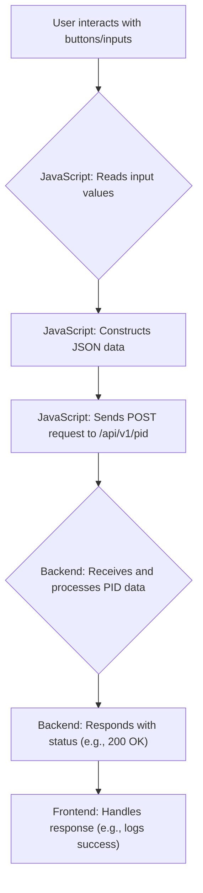

 # Line Following: Frontend

The frontend for the line following module provides a user interface for tuning the PID (Proportional-Integral-Derivative) control parameters. This allows for real-time adjustments to optimize the robot's line-following behavior. The frontend is built using HTML, CSS, and JavaScript.

## Frontend Structure and Functionality

The core of the frontend is the `index.html` file, which includes the HTML structure, CSS styling, and JavaScript logic for interacting with the user and the backend.

### HTML Structure

The HTML provides the basic layout of the tuning interface. It includes a title and a container (`main`) for the PID parameters (Kp, Ki, Kd). Each parameter has a corresponding input field and increment/decrement buttons for adjusting the values.

```html
<main>
    <h1>Line Following</h1>
    <div class="button-group">
        <h3>Kp</h3>
        <button>&lt;</button>
        <input type="number" value="0.000" id="kp" />
        <button>&gt;</button>
    </div>
    <!-- ... Ki and Kd similar divs ... -->
</main>
```

[View on GitHub](https://github.com/SRA-VJTI/Wall-E/blob/main/6_line_following/frontend/index.html#L31-L45)

### CSS Styling

The CSS provides the visual styling for the frontend, including the background, layout, and button/input styles. The styling ensures a clean and user-friendly interface.

```css
body {
    background: url("..."); /* Background image, omitted for brevity */
    display: flex;
    justify-content: center;
    align-items: center;
}
main {
    /* ... styling for the main container ... */
}
```

[View on GitHub](https://github.com/SRA-VJTI/Wall-E/blob/main/6_line_following/frontend/index.html#L7-L54)

### JavaScript Logic

The JavaScript code handles user interaction and communication with the backend. It includes:

1.  **Event Listeners:** Attaches event listeners to the input fields and increment/decrement buttons.
2.  **Value Submission:** The `submitVals()` function sends the PID parameter values to the backend via a POST request to the `/api/v1/pid` endpoint.
3.  **Increment/Decrement Functions:** Functions `decrementVal()` and `incrementVal()` update the input field values when the buttons are clicked, with error handling to make sure user only enter numbers.

```javascript
function submitVals() {
    const data = {};
    data["kp"] = parseFloat(document.getElementById("kp").value);
    data["ki"] = parseFloat(document.getElementById("ki").value);
    data["kd"] = parseFloat(document.getElementById("kd").value);
    let finaldata = JSON.stringify(data);
    console.log(finaldata);

    let xhr = new XMLHttpRequest();
    let url = "/api/v1/pid";
    xhr.open("POST", url, true);
    xhr.setRequestHeader("Content-Type", "application/json");
    xhr.onreadystatechange = function () {
        if (xhr.readyState === 4) {
            if (xhr.status == 400) {
                console.log("Success!");
            } else {
                console.log(xhr.status);
            }
        }
    };
    xhr.send(finaldata);
}
```

[View on GitHub](https://github.com/SRA-VJTI/Wall-E/blob/main/6_line_following/frontend/index.html#L75-L105)

```javascript
function decrementVal(e) {
    let test = e.target.parentNode.children[2].value;
    if (!isNaN(Number(test))) {
        e.target.parentNode.children[2].value = String(
            (Number(test) - 0.01).toFixed(3)
        );
        submitVals();
    } else {
        e.target.parentNode.children[2].value = "0.000";
    }
}
```

[View on GitHub](https://github.com/SRA-VJTI/Wall-E/blob/main/6_line_following/frontend/index.html#L112-L121)

### Mermaid Diagram: Frontend Workflow

This diagram illustrates the flow of data and actions within the frontend.





## Key Integration Points

The frontend's primary function is to provide a user-friendly interface for tuning the PID parameters. The core integration points are:

*   **User Input:** The interface allows users to enter and adjust the `Kp`, `Ki`, and `Kd` values.
*   **Data Transmission:** The JavaScript code constructs a JSON payload containing the PID values and sends it to the backend.
*   **Backend Interaction:** The frontend communicates with the backend via HTTP POST requests to the `/api/v1/pid` endpoint.
*   **Real-time Tuning:** The real-time nature of the interface allows for immediate feedback on the robot's performance as the PID values are adjusted.

## Best Practices and Considerations

*   **Error Handling:** The current implementation includes basic checks to ensure numerical input. Further error handling could be implemented to handle network issues or invalid responses from the backend.
*   **User Feedback:** Providing visual feedback on the success or failure of the data submission can enhance the user experience (e.g., changing button color, displaying a confirmation message).
*   **Data Validation:** While the current implementation includes rudimentary numerical checks, the backend should also perform input validation to ensure data integrity.
*   **Responsiveness:** The frontend should be designed to be responsive and adaptable to different screen sizes.
*   **Security:** If the frontend handles sensitive data or interacts with critical robot control functions, security best practices should be implemented.