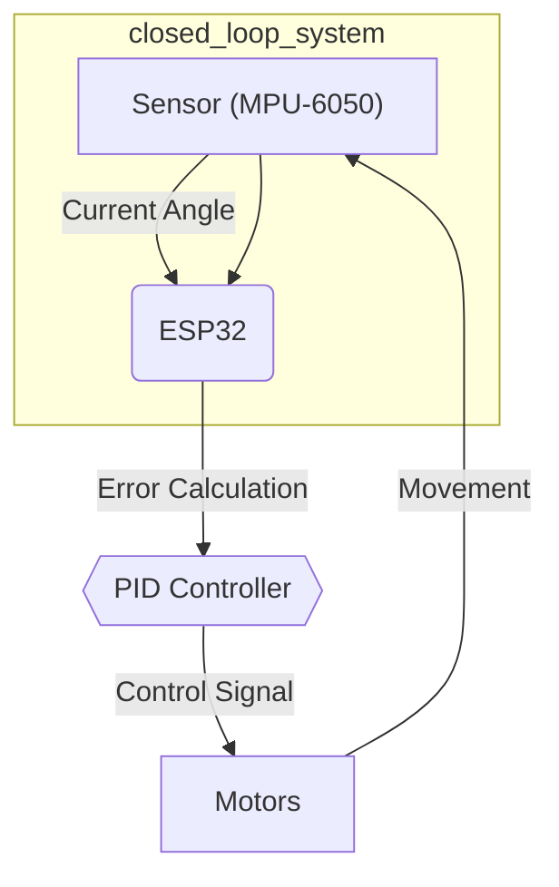
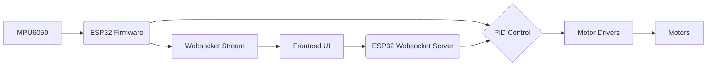

---
title: "Self-Balancing System"
description: "Details the implementation of the self-balancing system including sensor feedback and motor control."
---

# Self-Balancing System

This document details the self-balancing implementation of Wall-E, covering the theory, PID control, algorithm, and key functions.

## Theory of Operation

The self-balancing mechanism relies on continuously adjusting the bot's position to maintain equilibrium. The core idea is:

*   If the bot leans forward (front goes upwards), move backward.
*   If the bot leans backward (front goes downwards), move forward.

This creates a feedback loop that constantly corrects the bot's tilt.

## PID Control

PID (Proportional-Integral-Derivative) control is the heart of the self-balancing system. It calculates the necessary motor adjustments based on the error between the desired angle (straight up) and the current angle.

*   **Proportional (P) Term:** Responds directly to the current error. Larger error leads to a larger correction.
*   **Integral (I) Term:** Accumulates past errors over time. Helps eliminate steady-state errors.
*   **Derivative (D) Term:** Reacts to the rate of change of the error. Dampens oscillations and improves stability.

Here's the PID control loop visualized:





### Proportional Term in Detail

The proportional term provides immediate correction.  The correction speed is calculated as:

```
correction_speed = Kp * Error
```

where `Kp` is the proportional gain. Choosing the right `Kp` is crucial.

### Derivative Term in Detail

The derivative term dampens oscillations. It considers the rate of change of the error.

```
Error_Rate = (Current_Error - Previous_Error) / dt
Correction_Speed = Kp * Error + Kd * Error_Rate
```

where `Kd` is the derivative gain.

### Integral Term in Detail

The integral term eliminates steady-state errors. It accumulates the error over time.

```
Integral_Error = Integral(Error)
Correction_Speed = Kp * Error + Ki * Integral_Error + Kd * Error_Rate
```

where `Ki` is the integral gain.

## Algorithm

The self-balancing algorithm can be summarized as follows:

1.  Read sensor data (MPU6050) and calculate the error (difference between desired and current angle).
2.  Calculate the "Error Rate" and "Cumulative Error (Integral)" terms.
3.  Calculate the correction speed using the PID equation:

    ```
    pitch_correction = Kp*(error) + Ki*(Integral_Error) + Kd*(Error_rate)
    ```
4.  Threshold the correction speed to MAX and MIN PWM values.
5.  Determine the direction the bot should move:

    *   If Error > 1 (Bot-front is down): move forward.
    *   If Error < -1 (Bot-front is up): move backward.
    *   Else (bot is balanced): stop.
6.  Repeat from Step 1.

## Function Descriptions

### `calculate_motor_command`

This function calculates the motor inputs based on the pitch error using the PID algorithm.

```c
void calculate_motor_command(const float pitch_error, float *motor_cmd) {
    // ... PID calculations ...
    *motor_cmd = bound(absolute_pitch_correction, 0, MAX_PITCH_CORRECTION);
}
```

[View on GitHub](https://github.com/SRA-VJTI/Wall-E/blob/master/7_self_balancing/main/self_balancing.c#L26)

This function is the core of the PID control, taking the pitch error as input and calculating the required motor command to correct the bot's angle.  It uses static variables to maintain the previous error and accumulated error for the derivative and integral terms, respectively. The final motor command is bounded to prevent excessive corrections.

### `balance_task`

This function is the main task responsible for balancing the bot. It reads data from the MPU6050, calculates the pitch error, and controls the motors accordingly.

```c
void balance_task(void *arg) {
    // ... MPU6050 initialization and reading ...
    if (read_mpu6050(euler_angle, mpu_offset) == ESP_OK) {
        // ... PID control loop ...
        set_motor_speed(motor_a_0, MOTOR_BACKWARD, motor_pwm);
        set_motor_speed(motor_a_1, MOTOR_BACKWARD, motor_pwm);
    }
}
```

[View on GitHub](https://github.com/SRA-VJTI/Wall-E/blob/master/7_self_balancing/main/self_balancing.c#L104)

This task continuously monitors the bot's orientation using the MPU6050 sensor.  It reads the Euler angles, calculates the pitch error, calls `calculate_motor_command` to determine the appropriate motor commands, and then sets the motor speeds to maintain balance. The `read_mpu6050` function is crucial for getting the orientation data.

### `read_mpu6050`

This function reads data from the MPU6050 sensor and calculates the complementary pitch and roll angles.

```c
// Assuming this function exists in sra_board.c or a similar file
// ESP_OK means success
esp_err_t read_mpu6050(float *euler_angle, float *mpu_offset);
```

This function interacts with the MPU6050 sensor to obtain raw acceleration and gyroscope data. It then applies a complementary filter to fuse the accelerometer and gyroscope data to estimate the pitch and roll angles.  The `mpu_offset` is used for calibration.

### Frontend JavaScript for PID Tuning

The frontend uses JavaScript to send PID tuning parameters to the ESP32 via WebSockets.

```javascript
function send_Text_kp(text) {
  websocket.send("P" + text);
}
function send_Text_kd(text) {
  websocket.send("D" + text);
}
function send_Text_ki(text) {
  websocket.send("I" + text);
}
```

[View on GitHub](https://github.com/SRA-VJTI/Wall-E/blob/master/7_self_balancing/frontend/index.html#L14)

These functions send the `Kp`, `Ki`, and `Kd` values entered by the user to the ESP32 via WebSocket messages. The ESP32 then parses these messages and updates the PID constants accordingly. The prefix "P", "D", and "I" are used to identify the type of parameter being sent.

### Frontend Chart Update

The frontend also uses JavaScript and Chart.js to visualize the sensor data received from the ESP32.

```javascript
function addData(data) {
  var new_data = data
    .split(",")
    .filter((x) => x.trim().length && !isNaN(x))
    .map(Number);

  // ... update chart data ...
  xAccelChartInstance.update();
  yAccelChartInstance.update();
  zAccelChartInstance.update();
  rollChartInstance.update();
  pitchChartInstance.update();
}
```

[View on GitHub](https://github.com/SRA-VJTI/Wall-E/blob/master/7_self_balancing/frontend/index.html#L249)

This function parses the comma-separated data received from the ESP32 via WebSocket, extracts the sensor readings, and updates the corresponding charts using Chart.js. The charts display the X, Y, and Z accelerations, as well as the roll and pitch angles, allowing users to monitor the bot's performance in real-time.

## Key Integration Points

The self-balancing system involves tight integration between the hardware (MPU6050, motors), the ESP32 firmware, and the frontend interface.

*   **Sensor Data Acquisition:** The MPU6050 provides real-time orientation data to the ESP32.
*   **PID Control Loop:** The ESP32 implements the PID control algorithm to calculate motor commands.
*   **Motor Control:** The ESP32 controls the motor drivers to adjust the bot's position.
*   **Frontend Tuning:** The frontend allows users to adjust PID parameters and visualize sensor data for optimal tuning.

The communication flow looks like this:





## Best Practices

*   **Sensor Calibration:** Accurately calibrate the MPU6050 to minimize offsets and improve accuracy.
*   **PID Tuning:**  Carefully tune the PID parameters to achieve optimal balance and stability. Start with small values for Kp, Ki, and Kd, and gradually increase them until the desired performance is achieved.
*   **Motor Selection:**  Choose motors with sufficient torque and speed to effectively balance the bot.
*   **Filtering:** Consider adding filtering to the sensor data to reduce noise and improve the robustness of the control system.
*   **Safety:** Implement safety measures to prevent the bot from falling over or damaging itself.  This could include limiting the maximum motor speed or adding physical supports to prevent tipping.