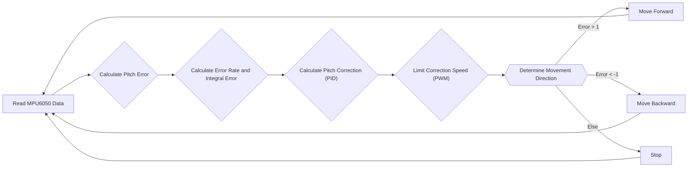

# Self-Balancing System

This document explains the code and control algorithms used in the self-balancing implementation of Wall-E. The system utilizes a PID (Proportional-Integral-Derivative) controller to maintain balance by adjusting motor speeds based on feedback from an MPU6050 inertial measurement unit.

## How the Bot Balances Itself

### Theory

The core principle is that any deviation from the desired upright position is corrected by moving the wheels in the appropriate direction. If the bot leans forward, it moves forward to compensate. If it leans backward, it moves backward.

### PID Control

PID control is crucial for precise balance. It uses three terms:

*   **Proportional (P):** Responds to the current error.
*   **Integral (I):** Corrects for accumulated error over time.
*   **Derivative (D):** Dampens oscillations by responding to the rate of change of error.

### PID Terms Explained

*   **Proportional Term:** Adjusts motor speed proportional to the error. A higher `Kp` value results in a stronger correction.
*   **Derivative Term:** Dampens oscillations. `Kd` helps prevent overshooting.
*   **Integral Term:** Eliminates steady-state errors by accumulating error over time. `Ki` helps correct small, persistent errors.

## Pitch Correction Formula

The pitch correction is calculated as follows:

```
pitch_correction = Kp*(error) + Ki*(Integral_Error) + Kd*(Error_rate)
```

Where:

*   `Kp`, `Ki`, and `Kd` are the proportional, integral, and derivative gains, respectively.
*   `error` is the difference between the desired angle and the current angle.
*   `Integral_Error` is the accumulated error over time.
*   `Error_rate` is the rate of change of the error.

## Algorithm

1.  Read data from MPU6050 and calculate the pitch error.
2.  Calculate the error rate and integral error.
3.  Calculate the pitch correction using the PID equation.
4.  Limit the correction speed to the maximum and minimum PWM values.
5.  Determine the direction the bot should move:
    *   If `error > 1`: move forward.
    *   If `error < -1`: move backward.
    *   Otherwise: stop.
6.  Repeat from step 1.





## Function Descriptions

*   `void calculate_motor_command(const float pitch_error, float *motor_cmd)`: Calculates the motor inputs based on the pitch error.
*   `void balance_task(void *arg)`: The main task responsible for balancing the bot.
*   `read_mpu6050(euler_angle, mpu_offset)`: Reads data from the MPU6050 and calculates the pitch and roll angles.

## Code Snippets and Explanations

1.  **`calculate_motor_command` Function:**

    ```c
    void calculate_motor_command(const float pitch_error, float *motor_cmd)
    {
        static float prev_pitch_error = 0.0f;
        static float pitch_area = 0.0f;
        float pitch_error_difference = 0.0f;

        float pitch_correction = 0.0f, absolute_pitch_correction = 0.0f;
        float pitch_rate = 0.0f;

        float P_term = 0.0f, I_term = 0.0f, D_term = 0.0f;

        pitch_error_difference = pitch_error - prev_pitch_error;
        pitch_area += (pitch_error);
        pitch_rate = pitch_error_difference;

        P_term = read_pid_const().kp * pitch_error;
        I_term = read_pid_const().ki * bound(pitch_area, -MAX_PITCH_AREA, MAX_PITCH_AREA);
        D_term = read_pid_const().kd * bound(pitch_rate, -MAX_PITCH_RATE, MAX_PITCH_RATE);

        pitch_correction = P_term + I_term + D_term;

        absolute_pitch_correction = fabsf(pitch_correction);

        *motor_cmd = bound(absolute_pitch_correction, 0, MAX_PITCH_CORRECTION);
        prev_pitch_error = pitch_error;
    }
    ```

    This function calculates the motor command based on the PID algorithm. It takes the pitch error as input and calculates the P, I, and D terms, then combines them to determine the required motor correction. The `bound` function limits the integral term and the final motor command to prevent excessive values.
     [View on GitHub](https://github.com/SRA-VJTI/Wall-E/blob/master/7_self_balancing/main/self_balancing.c#L37)

2.  **`balance_task` Function:**

    ```c
    void balance_task(void *arg)
    {
        float euler_angle[2], mpu_offset[2] = {0.0f, 0.0f};
        float pitch_angle, pitch_error;
        float motor_cmd, motor_pwm = 0.0f;
        motor_handle_t motor_a_0, motor_a_1;
        float pitch_cmd = 0.0f;

        if (enable_mpu6050() == ESP_OK)
        {
            enable_motor_driver(&motor_a_0, MOTOR_A_0);
            enable_motor_driver(&motor_a_1, MOTOR_A_1);
            while (1)
            {
                if (read_mpu6050(euler_angle, mpu_offset) == ESP_OK)
                {
                    pitch_cmd = read_pid_const().setpoint;
                    pitch_angle = euler_angle[1];
                    pitch_error = pitch_cmd - pitch_angle;

                    calculate_motor_command(pitch_error, &motor_cmd);
                    motor_pwm = bound((motor_cmd), MIN_PWM, MAX_PWM);

                    if (pitch_error > 1)
                    {
                        set_motor_speed(motor_a_0, MOTOR_BACKWARD, motor_pwm);
                        set_motor_speed(motor_a_1, MOTOR_BACKWARD, motor_pwm);
                    }
                    else if (pitch_error < -1)
                    {
                        set_motor_speed(motor_a_0, MOTOR_FORWARD, motor_pwm);
                        set_motor_speed(motor_a_1, MOTOR_FORWARD, motor_pwm);
                    }
                    else
                    {
                        set_motor_speed(motor_a_0, MOTOR_STOP, 0);
                        set_motor_speed(motor_a_1, MOTOR_STOP, 0);
                    }
                    vTaskDelay(10 / portTICK_PERIOD_MS);
                }
            }
        }
        vTaskDelete(NULL);
    }
    ```

    This function is the main task responsible for balancing the robot. It initializes the MPU6050 and motor drivers, then enters a loop that reads the pitch angle, calculates the error, computes the motor command using the `calculate_motor_command` function, and sets the motor speeds accordingly.
    [View on GitHub](https://github.com/SRA-VJTI/Wall-E/blob/master/7_self_balancing/main/self_balancing.c#L90)

3.  **Reading PID constants:**

    ```c
        P_term = read_pid_const().kp * pitch_error;
        I_term = read_pid_const().ki * bound(pitch_area, -MAX_PITCH_AREA, MAX_PITCH_AREA);
        D_term = read_pid_const().kd * bound(pitch_rate, -MAX_PITCH_RATE, MAX_PITCH_RATE);
    ```

    This code snippet shows how the PID constants (Kp, Ki, Kd) are read and used to calculate the proportional, integral, and derivative terms of the PID controller. `read_pid_const()` is assumed to be a function that retrieves the current PID constants, likely from a configuration or tuning interface. This allows for dynamic adjustment of the PID parameters.

    [View on GitHub](https://github.com/SRA-VJTI/Wall-E/blob/master/7_self_balancing/main/self_balancing.c#L62-L64)

4.  **Setting Motor Speeds:**

    ```c
        if (pitch_error > 1)
        {
            set_motor_speed(motor_a_0, MOTOR_BACKWARD, motor_pwm);
            set_motor_speed(motor_a_1, MOTOR_BACKWARD, motor_pwm);
        }
        else if (pitch_error < -1)
        {
            set_motor_speed(motor_a_0, MOTOR_FORWARD, motor_pwm);
            set_motor_speed(motor_a_1, MOTOR_FORWARD, motor_pwm);
        }
        else
        {
            set_motor_speed(motor_a_0, MOTOR_STOP, 0);
            set_motor_speed(motor_a_1, MOTOR_STOP, 0);
        }
    ```

    This code snippet demonstrates how the motor speeds are set based on the pitch error. If the error is positive (bot leaning forward), the motors are set to move backward. If the error is negative (bot leaning backward), the motors are set to move forward. If the error is within a small range, the motors are stopped. The `set_motor_speed` function is responsible for controlling the motor drivers.
     [View on GitHub](https://github.com/SRA-VJTI/Wall-E/blob/master/7_self_balancing/main/self_balancing.c#L122-L137)

5. **MPU6050 initialization:**

    ```c
    if (enable_mpu6050() == ESP_OK)
    {
            enable_motor_driver(&motor_a_0, MOTOR_A_0);
            enable_motor_driver(&motor_a_1, MOTOR_A_1);
            while (1)
            {
            if (read_mpu6050(euler_angle, mpu_offset) == ESP_OK)
            {
                // Main Logic
            }
        }
    }

    ```

    The code initializes the MPU6050 sensor using the `enable_mpu6050()` function and checks if the sensor initializes correctly. It also enables the motor drivers. A while loop ensures continuous reading of the MPU6050 sensor values which in turn are used in the PID control to maintain the self balancing of the Wall-E bot.
     [View on GitHub](https://github.com/SRA-VJTI/Wall-E/blob/master/7_self_balancing/main/self_balancing.c#L94-L101)

6. **Data Plotting:**
   ```c
	pg_data.p_term = P_term;
	pg_data.d_term = D_term;
	pg_data.i_term = I_term;
	pg_data.pitch_corr = pitch_correction;
	pg_data.pitch_err = pitch_error;
	
	plot_graph_data_t *pg_data_handle = &pg_data;

	xQueueSend(plot_graph_queue, (void *)&pg_data_handle, (TickType_t)0);
   ```

    This code snippet sends the PID terms and other relevant data to a queue `plot_graph_queue`, which is then used by another task to plot the data for visualization and tuning purposes. This allows for real-time monitoring of the PID controller's performance.
     [View on GitHub](https://github.com/SRA-VJTI/Wall-E/blob/master/7_self_balancing/main/self_balancing.c#L73-L79)

## Key Integration Points

*   **MPU6050 Integration:** The MPU6050 provides the critical pitch angle data used by the PID controller. Proper calibration and filtering of the sensor data are essential for stable balancing.
*   **Motor Driver Integration:** The motor drivers control the speed and direction of the motors based on the output of the PID controller. Precise control of the motor drivers is crucial for achieving accurate balancing.
*   **PID Tuning:** Proper tuning of the PID gains (Kp, Ki, Kd) is essential for optimal performance. The tuning process involves adjusting the gains to achieve a balance between responsiveness and stability. The tuning_websocket_server allows for real-time parameter adjustments.
*   **Data Visualization:** The `plot_graph_task` and `plot_graph_queue` enable real-time visualization of the PID terms and error, which helps in understanding the controller's behavior and tuning the parameters effectively.

## Best Practices

*   **Sensor Calibration:** Ensure the MPU6050 is properly calibrated to minimize drift and bias.
*   **Filter Noise:** Implement filtering techniques (e.g., Kalman filter) to reduce noise in the sensor data.
*   **Limit Integral Windup:** Implement anti-windup measures to prevent the integral term from accumulating excessively.
*   **Tune PID Gains:** Use a systematic approach to tune the PID gains, starting with the proportional gain and then adjusting the integral and derivative gains.
*   **Monitor Performance:** Continuously monitor the system's performance and adjust the PID gains as needed.
```