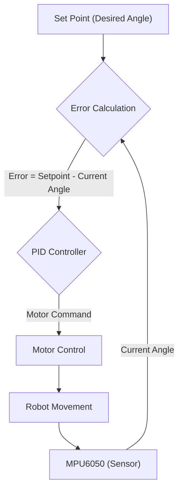
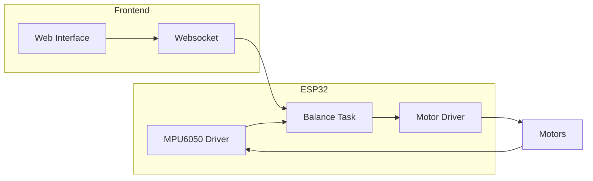

---
title: "Self-Balancing System"
description: "Provides information about the self-balancing system, including sensor integration and control algorithms."
---

# Self-Balancing System

This document details the self-balancing system implemented in Wall-E, covering the theory, algorithms, and code implementation. It explains how sensor data is integrated and how the PID control algorithm maintains balance.

## Table of Contents
- [Theory of Operation](#theory-of-operation)
- [PID Control Algorithm](#pid-control-algorithm)
- [Algorithm Implementation](#algorithm-implementation)
- [Key Functions and Code Snippets](#key-functions-and-code-snippets)
- [Frontend Interface](#frontend-interface)
- [Key Integration Points](#key-integration-points)

## Theory of Operation

The core idea is to use feedback from an Inertial Measurement Unit (IMU), specifically the MPU6050, to detect the robot's tilt angle and then adjust motor speeds to counteract the tilt. If the robot leans forward, the wheels move forward to compensate, and vice versa. The system aims to keep the robot upright by continuously monitoring and correcting its orientation.

### PID Control Algorithm

The self-balancing mechanism relies on a Proportional-Integral-Derivative (PID) controller. PID controllers calculate an error value as the difference between a desired setpoint (e.g., vertical) and a measured process variable (e.g., tilt angle). The controller attempts to minimize the error by adjusting the process control inputs.

- **Proportional Term (P):** Provides a correction proportional to the current error.
- **Integral Term (I):** Accumulates past errors and corrects for steady-state errors.
- **Derivative Term (D):** Predicts future errors based on the current rate of change of the error.

The output of the PID controller is a motor command that adjusts the robot's wheel speeds.





## Algorithm Implementation

The algorithm consists of the following steps:

1.  **Read Sensor Data:** Obtain pitch and roll angles from the MPU6050.
2.  **Calculate Error:** Determine the difference between the desired angle (setpoint) and the current angle.
3.  **Compute PID Output:** Calculate the motor command using the PID algorithm.
4.  **Apply Motor Command:** Set the motor speeds based on the calculated command, ensuring they remain within safe limits.
5.  **Repeat:** Continuously repeat these steps to maintain balance.

## Key Functions and Code Snippets

### `calculate_motor_command`

This function calculates the motor inputs based on the pitch error using the PID algorithm. It takes the pitch error as input and outputs the motor command.

```c
void calculate_motor_command(const float pitch_error, float *motor_cmd) {
    static float prev_pitch_error = 0.0f;
    static float pitch_area = 0.0f;
    float pitch_error_difference = 0.0f;

    float pitch_correction = 0.0f, absolute_pitch_correction = 0.0f;
    float pitch_rate = 0.0f;

    float P_term = 0.0f, I_term = 0.0f, D_term = 0.0f;

    pitch_error_difference = pitch_error - prev_pitch_error;

    pitch_area += (pitch_error);
    pitch_rate = pitch_error_difference;

    P_term = read_pid_const().kp * pitch_error;
    I_term = read_pid_const().ki * bound(pitch_area, -MAX_PITCH_AREA, MAX_PITCH_AREA);
    D_term = read_pid_const().kd * bound(pitch_rate, -MAX_PITCH_RATE, MAX_PITCH_RATE);

    pitch_correction = P_term + I_term + D_term;

    absolute_pitch_correction = fabsf(pitch_correction);

    *motor_cmd = bound(absolute_pitch_correction, 0, MAX_PITCH_CORRECTION);
    prev_pitch_error = pitch_error;
}
```

[View on GitHub](https://github.com/SRA-VJTI/Wall-E/blob/master/7_self_balancing/main/self_balancing.c)

### `balance_task`

This task is the main control loop that reads sensor data, calculates the motor command, and applies it to the motors.

```c
void balance_task(void *arg) {
    float euler_angle[2], mpu_offset[2] = {0.0f, 0.0f};
    float pitch_angle, pitch_error;
    float motor_cmd, motor_pwm = 0.0f;
    motor_handle_t motor_a_0, motor_a_1;
    float pitch_cmd = 0.0f;

    if (enable_mpu6050() == ESP_OK) {
        enable_motor_driver(&motor_a_0, MOTOR_A_0);
        enable_motor_driver(&motor_a_1, MOTOR_A_1);
        while (1) {
            if (read_mpu6050(euler_angle, mpu_offset) == ESP_OK) {
                pitch_cmd = read_pid_const().setpoint;
                pitch_angle = euler_angle[1];
                pitch_error = pitch_cmd - pitch_angle;

                calculate_motor_command(pitch_error, &motor_cmd);
                motor_pwm = bound((motor_cmd), MIN_PWM, MAX_PWM);

                if (pitch_error > 1) {
                    set_motor_speed(motor_a_0, MOTOR_BACKWARD, motor_pwm);
                    set_motor_speed(motor_a_1, MOTOR_BACKWARD, motor_pwm);
                } else if (pitch_error < -1) {
                    set_motor_speed(motor_a_0, MOTOR_FORWARD, motor_pwm);
                    set_motor_speed(motor_a_1, MOTOR_FORWARD, motor_pwm);
                } else {
                    set_motor_speed(motor_a_0, MOTOR_STOP, 0);
                    set_motor_speed(motor_a_1, MOTOR_STOP, 0);
                }

                ESP_LOGI("debug", "KP: %f ::  KI: %f  :: KD: %f :: Setpoint: %0.2f :: Roll: %0.2f | Pitch: %0.2f | PitchError: %0.2f", read_pid_const().kp, read_pid_const().ki, read_pid_const().kd, read_pid_const().setpoint, euler_angle[0], euler_angle[1], pitch_error);

                vTaskDelay(10 / portTICK_PERIOD_MS);
            }
        }
    }
    vTaskDelete(NULL);
}
```

[View on GitHub](https://github.com/SRA-VJTI/Wall-E/blob/master/7_self_balancing/main/self_balancing.c)

### `read_mpu6050`

Reads data from the MPU6050 sensor and calculates the pitch and roll angles.

```c
esp_err_t read_mpu6050(float *euler_angle, float *mpu_offset) {
    // Implementation details for reading MPU6050 sensor data
    // and calculating pitch and roll angles.
    // Returns ESP_OK on success, ESP_FAIL on failure.
    return ESP_OK; // Placeholder
}
```

[View on GitHub](https://github.com/SRA-VJTI/Wall-E/blob/master/7_self_balancing/main/self_balancing.c)

### PID constants

The PID constants (Kp, Ki, Kd, and Setpoint) are controlled via websocket:

```javascript
    function send_Text_kp(text) {
      websocket.send("P" + text);
    }
    function send_Text_kd(text) {
      websocket.send("D" + text);
    }
    function send_Text_ki(text) {
      websocket.send("I" + text);
    }
    function send_Text_setpoint(text) {
      websocket.send("S" + text);
    }
    function send_Text_offset(text) {
      websocket.send("O" + text);
    }
```

[View on GitHub](https://github.com/SRA-VJTI/Wall-E/blob/master/7_self_balancing/frontend/index.html)

### `bound`

This function limits a value between a minimum and maximum range.

```c
float bound(float val, float min, float max) {
  if (val < min) {
    return min;
  } else if (val > max) {
    return max;
  } else {
    return val;
  }
}
```
[View on GitHub](https://github.com/SRA-VJTI/Wall-E/blob/master/7_self_balancing/main/self_balancing.c)

## Frontend Interface

The `index.html` file provides a web-based interface for tuning the PID parameters and visualizing the sensor data. It uses JavaScript and Chart.js to display real-time data from the robot.  The `index.html` file uses websockets to communicate with the ESP32. Users can adjust the Kp, Ki, Kd, setpoint and offset values through input fields, and the updated values are sent to the ESP32 for real-time tuning. Charts display X, Y, and Z acceleration, roll and pitch.

```html
<div class="container value-container">
      <div class="row">
        <div class="col-sm">
          <form id="frm1" action="#">
            <div style="width:200px;" class="input-group mb-3">
              <div class="input-group-prepend">
                <span class="input-group-text" id="inputGroup-sizing-default">Kp</span>
              </div>
              <input name="ftext" type="number" class="form-control" aria-label="Sizing example input"
                aria-describedby="inputGroup-sizing-default">
            </div>
            <div style="transform: translateX(70px); margin-top: 10px">
              <button type="button" class="btn btn-secondary btn-block"
                onclick="send_Text_kp(document.getElementsByName('ftext')[0].value);">
                Send
              </button>
            </div>
          </form>
        </div>
```
[View on GitHub](https://github.com/SRA-VJTI/Wall-E/blob/master/7_self_balancing/frontend/index.html)

## Key Integration Points

-   **Sensor Integration:** The MPU6050 provides real-time data of the robot's orientation. Correct calibration of offsets is essential.
-   **PID Tuning:** The PID constants significantly impact the performance of the self-balancing system. Fine-tuning these values is crucial for achieving stable and responsive balance. A web-based interface simplifies this process.
-   **Motor Control:** Accurate control of the motors is necessary to translate the PID output into precise movements.
-   **Task Scheduling:** The `balance_task` must be scheduled appropriately within the RTOS to ensure real-time performance.




