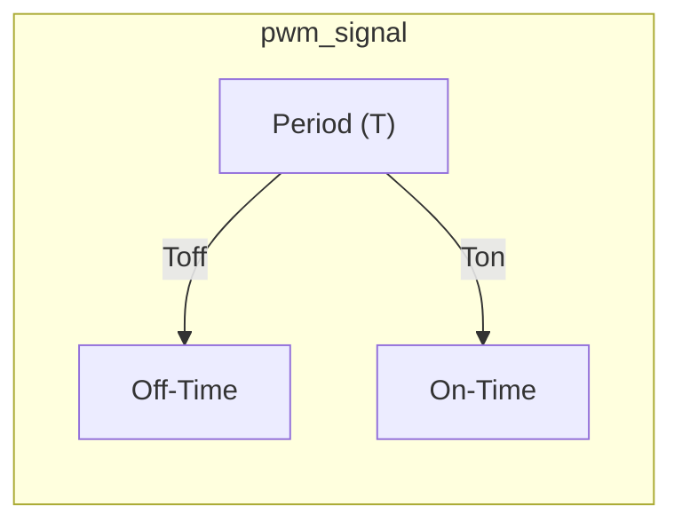
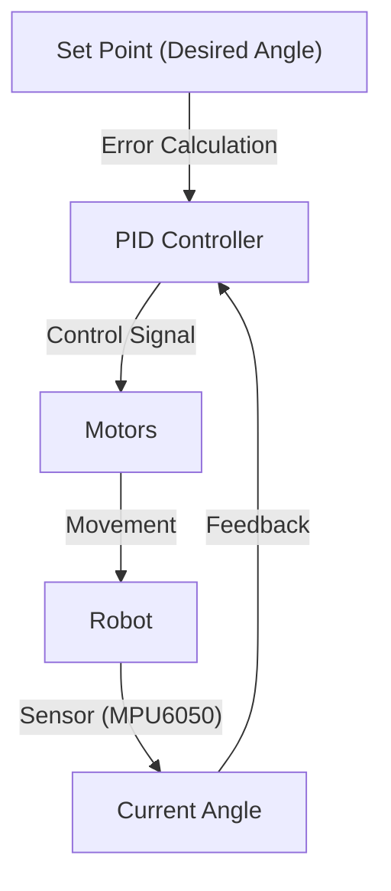

---
title: "Advanced Control Systems"
description: "Focuses on advanced control systems like PWM and Self-Balancing."
---

# Advanced Control Systems

This section delves into the advanced control mechanisms implemented in Wall-E, focusing on Pulse Width Modulation (PWM) for motor control and LED dimming, as well as the self-balancing system achieved through PID control.

## Pulse Width Modulation (PWM)

PWM is a technique used to control the average power delivered to an electrical device by switching the power supply on and off at a rapid rate.  The duty cycle, which is the percentage of time the signal is high, determines the average voltage applied.

### Duty Cycle and Period

The duty cycle is the ratio of the ON-time to the total period of the PWM signal.  A higher duty cycle means more power is delivered.





### LED Dimmer

PWM is effectively used in LED dimmers to control the brightness of the LED.  Instead of adjusting the current, PWM varies the on/off time, resulting in energy savings.

### Motor Speed Control

Similarly, PWM controls DC motor speed by varying the average voltage applied to the motor.

```javascript
// Example of setting motor speed using PWM
function setMotorSpeed(motorId, direction, dutyCycle) {
  // motorId:  Identifier for the motor (e.g., MOTOR_A, MOTOR_B)
  // direction: FORWARD, BACKWARD, STOP
  // dutyCycle:  Percentage of ON time (0.0 to 1.0)

  console.log(`Setting motor ${motorId} to ${direction} with duty cycle ${dutyCycle}`);
  // Actual implementation would involve hardware-specific PWM control
}

setMotorSpeed("MOTOR_A", "FORWARD", 0.75); // Example:  Motor A, Forward, 75% duty cycle
```

[View on GitHub](https://github.com/SRA-VJTI/Wall-E/blob/master/5_PWM/README.md)

### Motor Drivers

Motor drivers serve as an interface between the low-current control signals from the microcontroller and the high-current requirements of the motors.  The TB6612FNG driver is used in Wall-E.

```c
// Example usage of motor driver functions
esp_err_t enable_motor_driver_a(int mode); // Declared function

//Enable motor driver A in parallel mode
enable_motor_driver_a(1);
```
[View on GitHub](https://github.com/SRA-VJTI/Wall-E/blob/master/5_PWM/README.md)

### PWM Functions Description

The following functions are used for PWM control:

*   `enable_motor_driver_a(int mode)`: Enables motor driver A in parallel or normal mode. `mode = 1` for parallel, `mode = 2` for normal.
*   `enable_motor_driver_b(int mode)`: Enables motor driver B in parallel or normal mode. `mode = 1` for parallel, `mode = 2` for normal.
*   `set_motor_speed (int motor_id, int direction, float duty_cycle )`: Sets the speed of the specified motor.

```c
esp_err_t set_motor_speed (int 	motor_id,
                           int 	direction,
                           float duty_cycle ) {
  // Implementation of setting the motor speed
  if (duty_cycle < 0 || duty_cycle > 1) {
    return ESP_FAIL; // Example error handling
  }
  printf("Setting motor speed for motor %d\n", motor_id);
  return ESP_OK;
}
```

[View on GitHub](https://github.com/SRA-VJTI/Wall-E/blob/master/5_PWM/README.md)

## Self-Balancing System

Wall-E maintains its balance using a PID (Proportional-Integral-Derivative) control loop.

### PID Control Theory

The PID controller adjusts the motor speeds to minimize the error between the desired angle (vertical) and the current angle.





### PID Terms

*   **Proportional (P):**  Responds to the current error. A larger error results in a larger correction.
*   **Integral (I):**  Accumulates the error over time. Helps eliminate steady-state errors.
*   **Derivative (D):**  Responds to the rate of change of the error.  Dampens oscillations.

### Pitch Correction Formula

The pitch correction is calculated as follows:

`pitch_correction = Kp*(error) + Ki*(Integral_Error) + Kd*(Error_rate)`

```python
# Example of PID calculation
def calculate_pid(error, integral_error, error_rate, Kp, Ki, Kd):
  """Calculates the PID output."""
  proportional = Kp * error
  integral = Ki * integral_error
  derivative = Kd * error_rate
  pid_output = proportional + integral + derivative
  return pid_output

# Example usage
error = 0.5
integral_error = 0.1
error_rate = -0.2
Kp = 1.0
Ki = 0.1
Kd = 0.5
correction = calculate_pid(error, integral_error, error_rate, Kp, Ki, Kd)
print(f"PID Correction: {correction}")
```

### Algorithm

1.  Read data from the MPU6050 sensor and calculate the error.
2.  Calculate the error rate and cumulative error (integral).
3.  Calculate the correction speed using the PID equation.
4.  Limit the correction speed to maximum and minimum PWM values.
5.  Determine the direction in which the robot should move based on the error.
6.  Repeat from step 1.

### Self-Balancing Functions Description

The following functions are crucial for implementing the self-balancing feature:

*   `calculate_motor_command(const float pitch_error, float *motor_cmd)`: Calculates motor inputs based on the MPU angle.

```c
void calculate_motor_command(const float pitch_error, float *motor_cmd){
  //Implementation to calculate motor command based on pitch error.
  *motor_cmd = pitch_error * 0.5; //Example scaling.
  printf("Calculating motor command based on pitch error: %f\n", pitch_error);
}
```

[View on GitHub](https://github.com/SRA-VJTI/Wall-E/blob/master/7_self_balancing/README.md)

*   `balance_task(void *arg)`:  The primary task responsible for balancing the robot.
*   `read_mpu6050(euler_angle, mpu_offset)`: Reads the MPU6050 sensor, and calculates pitch and roll angles.

```c
esp_err_t read_mpu6050(float* euler_angle, float* mpu_offset) {
  // Implementation to read MPU6050 sensor
  printf("Reading MPU6050 Sensor\n");
  euler_angle[0] = 10.0; // Example pitch angle
  euler_angle[1] = 5.0; // Example roll angle
  return ESP_OK;
}
```

[View on GitHub](https://github.com/SRA-VJTI/Wall-E/blob/master/7_self_balancing/README.md)

## Key Integration Points

The PWM and self-balancing systems are tightly integrated. The `balance_task` uses the `read_mpu6050` function to get the robot's orientation, calculates the necessary motor commands using the PID algorithm, and then sets the motor speeds using the PWM functions (`set_motor_speed`).  Proper tuning of the PID gains (Kp, Ki, Kd) is essential for achieving stable and responsive balancing.  The specific values will depend on the robot's physical characteristics and motor performance. Careful calibration of the MPU6050 is also crucial to eliminate biases that could prevent stable balancing.

```c
void balance_task(void *arg) {
    float euler_angle[2], mpu_offset[2], motor_cmd;

    while (1) {
        if (read_mpu6050(euler_angle, mpu_offset) == ESP_OK) {
            float pitch_error = euler_angle[0]; // Assuming euler_angle[0] is pitch
            calculate_motor_command(pitch_error, &motor_cmd);
            // Assuming motor_cmd contains the required duty cycle adjustment
            // set_motor_speed(MOTOR_A, FORWARD, motor_cmd);  // Example - adjust motor A
            printf("Pitch Error: %f, Motor Command: %f\n", pitch_error, motor_cmd);
        } else {
            printf("Failed to read MPU6050\n");
        }
        vTaskDelay(pdMS_TO_TICKS(10)); // Delay for a short interval
    }
}
```

[View on GitHub](https://github.com/SRA-VJTI/Wall-E/blob/master/7_self_balancing/README.md)
```