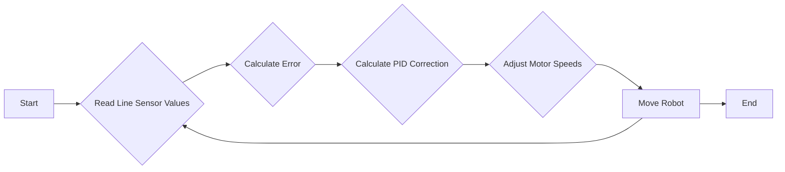
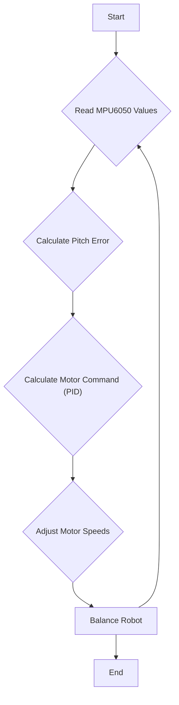

# Advanced Control Systems

This section explores advanced control systems implemented in the Wall-E robot, focusing on line following and self-balancing functionalities. These systems rely on sensor data and feedback loops to achieve stable and accurate control.

## Line Following

The line following system enables Wall-E to autonomously navigate along a designated path marked by a line. This is achieved through a PID (Proportional-Integral-Derivative) controller that adjusts the motor speeds based on the robot's position relative to the line.

### Line Sensor Array

Wall-E uses a line sensor array to detect the line. The array consists of multiple sensors that provide analog readings indicating the intensity of reflected light.

```c
// File: 6_line_following/main/line_following.c
line_sensor_array line_sensor_readings;

typedef struct {
    uint32_t adc_reading[5];
} line_sensor_array;

line_sensor_readings = read_line_sensor(line_sensor);
```

This snippet shows the structure used to store line sensor readings. `read_line_sensor` function reads analog values from the line sensors and stores them in the `adc_reading` array.
[View on GitHub](https://github.com/SRA-VJTI/Wall-E/blob/master/6_line_following/main/line_following.c)

### Error Calculation

The core of the line following algorithm is calculating the error, which represents the deviation of the robot from the center of the line.

```c
// File: 6_line_following/main/line_following.c
void calculate_error()
{
    int all_black_flag = 1; // assuming initially all black condition
    float weighted_sum = 0, sum = 0; 
    float pos = 0; int k = 0;

    for(int i = 0; i < 5; i++)
    {
        if(line_sensor_readings.adc_reading[i] > BLACK_BOUNDARY)
        {
            all_black_flag = 0;
        }
        if(line_sensor_readings.adc_reading[i] > BLACK_BOUNDARY)
        {
            k = 1;
        }
        if(line_sensor_readings.adc_reading[i] < BLACK_BOUNDARY)
        {
            k = 0;
        }
        weighted_sum += (float)(weights[i]) * k;
        sum = sum + k;
    }

    if(sum != 0) // sum can never be 0 but just for safety purposes
    {
        pos = (weighted_sum - 1) / sum; // This will give us the position wrt line. if +ve then bot is facing left and if -ve the bot is facing to right.
    }

    if(all_black_flag == 1)  // If all black then we check for previous error to assign current error.
    {
        if(prev_error > 0)
        {
            error = 2.5;
        }
        else
        {
            error = -2.5;
        }
    }
    else
    {
        error = pos;
    }
}
```

This function calculates the error based on the readings from the line sensor array. It uses a weighted sum of the sensor readings to determine the robot's position relative to the line. If all sensors detect black, it uses the previous error to maintain direction.
[View on GitHub](https://github.com/SRA-VJTI/Wall-E/blob/master/6_line_following/main/line_following.c)

### PID Controller

The PID controller adjusts the motor speeds based on the error. The controller calculates a correction value that is added to one motor speed and subtracted from the other.

```c
// File: 6_line_following/main/line_following.c
void calculate_correction()
{
    error = error*10;  // we need the error correction in range 0-100 so that we can send it directly as duty cycle paramete
    difference = error - prev_error;
    cumulative_error += error;

    cumulative_error = bound(cumulative_error, -30, 30);

    correction = read_pid_const().kp*error + read_pid_const().ki*cumulative_error + read_pid_const().kd*difference;
    prev_error = error;
}
```

This function implements the PID control algorithm. It calculates the correction term based on the error, the cumulative error, and the difference between the current and previous errors. The `read_pid_const()` function is assumed to retrieve the PID constants (Kp, Ki, Kd) from a tuning server.
[View on GitHub](https://github.com/SRA-VJTI/Wall-E/blob/master/6_line_following/main/line_following.c)

### Motor Control

The calculated correction is then used to adjust the motor speeds, ensuring that the robot stays on the line.

```c
// File: 6_line_following/main/line_following.c
left_duty_cycle = bound((optimum_duty_cycle + correction), lower_duty_cycle, higher_duty_cycle);
right_duty_cycle = bound((optimum_duty_cycle - correction), lower_duty_cycle, higher_duty_cycle);

set_motor_speed(motor_a_0, MOTOR_FORWARD, left_duty_cycle);
set_motor_speed(motor_a_1, MOTOR_FORWARD, right_duty_cycle);
```

This snippet shows how the calculated correction is used to adjust the motor speeds. The `bound` function limits the duty cycle to a safe range. The `set_motor_speed` function then sets the motor speeds based on the calculated duty cycles.
[View on GitHub](https://github.com/SRA-VJTI/Wall-E/blob/master/6_line_following/main/line_following.c)

### Line Following Flow





## Self-Balancing

The self-balancing system enables Wall-E to maintain an upright position by constantly adjusting its motor speeds based on the angle and angular velocity measured by an IMU (Inertial Measurement Unit), specifically the MPU6050.

### MPU6050 Integration

The MPU6050 provides the necessary data to determine the robot's orientation and angular velocity.

```c
// File: 7_self_balancing/main/self_balancing.c
float euler_angle[2], mpu_offset[2] = {0.0f, 0.0f};

if (read_mpu6050(euler_angle, mpu_offset) == ESP_OK)
{
    pitch_cmd = read_pid_const().setpoint;
    pitch_angle = euler_angle[1];
    pitch_error = pitch_cmd - pitch_angle;

    calculate_motor_command(pitch_error, &motor_cmd);

    //bound PWM values between max and min
    motor_pwm = bound((motor_cmd), MIN_PWM, MAX_PWM);
}
```

This snippet shows how the MPU6050 is used to obtain the robot's pitch angle. The `read_mpu6050` function reads the Euler angles from the MPU6050, and the pitch angle is extracted from the returned array.
[View on GitHub](https://github.com/SRA-VJTI/Wall-E/blob/master/7_self_balancing/main/self_balancing.c)

### Motor Command Calculation

The `calculate_motor_command` function implements the PID control algorithm to determine the necessary motor command to maintain balance.

```c
// File: 7_self_balancing/main/self_balancing.c
void calculate_motor_command(const float pitch_error, float *motor_cmd)
{
	
	/** Error values **/
	// Stores pitch error of previous iteration
	static float prev_pitch_error = 0.0f;
	// Stores sum of product of errors with time interval obtained during each iteration
	static float pitch_area = 0.0f;
	// Stores difference between current error and previous iteration error
	float pitch_error_difference = 0.0f;

	/** Correction values **/
	// Variables for storing corrected values
	float pitch_correction = 0.0f, absolute_pitch_correction = 0.0f;
	// Helper variables for calculating integral and derivative correction
	float pitch_rate = 0.0f;

	// Variables storing correction values of different error terms
	float P_term = 0.0f, I_term = 0.0f, D_term = 0.0f;

	// Evaluated delta(error)
	pitch_error_difference = pitch_error - prev_pitch_error;

	// Evaluated area of the graph error vs time (cumulative error)
	pitch_area += (pitch_error);
	// evaluated delta(error)/delta(time) to calculate rate of change in error w.r.t time
	pitch_rate = pitch_error_difference;

	// Calculating p,i and d terms my multuplying corresponding proportional constants
	P_term = read_pid_const().kp * pitch_error;
	I_term = read_pid_const().ki * bound(pitch_area, -MAX_PITCH_AREA, MAX_PITCH_AREA);
	D_term = read_pid_const().kd * bound(pitch_rate, -MAX_PITCH_RATE, MAX_PITCH_RATE);

	pitch_correction = P_term + I_term + D_term;

	pg_data.p_term = P_term;
	pg_data.d_term = D_term;
	pg_data.i_term = I_term;
	pg_data.pitch_corr = pitch_correction;
	pg_data.pitch_err = pitch_error;
	
	plot_graph_data_t *pg_data_handle = &pg_data;

	xQueueSend(plot_graph_queue, (void *)&pg_data_handle, (TickType_t)0);
	/**
	 * Calculating absolute value of pitch_correction since duty cycle can't be negative. 
	 * Since it is a floating point variable, fabsf was used instead of abs
	*/
	absolute_pitch_correction = fabsf(pitch_correction);

	*motor_cmd = bound(absolute_pitch_correction, 0, MAX_PITCH_CORRECTION);
	prev_pitch_error = pitch_error;
}
```

This function calculates the motor command based on the pitch error and PID constants. The `read_pid_const()` function retrieves the PID constants (Kp, Ki, Kd, setpoint) from a tuning server, allowing for real-time adjustment of the balancing algorithm. The calculated motor command is then bounded to a safe range.
[View on GitHub](https://github.com/SRA-VJTI/Wall-E/blob/master/7_self_balancing/main/self_balancing.c)

### Motor Control

Based on the calculated `motor_pwm`, the motor speeds are set accordingly to maintain balance.

```c
// File: 7_self_balancing/main/self_balancing.c
if (pitch_error > 1)
{
    // setting motor A0 with definite speed(duty cycle of motor driver PWM) in Backward direction
    set_motor_speed(motor_a_0, MOTOR_BACKWARD, motor_pwm);
    // setting motor A1 with definite speed(duty cycle of motor driver PWM) in Backward direction
    set_motor_speed(motor_a_1, MOTOR_BACKWARD, motor_pwm);
}

// Bot tilts downwards
else if (pitch_error < -1)
{
    // setting motor A0 with definite speed(duty cycle of motor driver PWM) in Forward direction
    set_motor_speed(motor_a_0, MOTOR_FORWARD, motor_pwm);
    // setting motor A1 with definite speed(duty cycle of motor driver PWM) in Forward direction
    set_motor_speed(motor_a_1, MOTOR_FORWARD, motor_pwm);
}

// Bot remains in desired region for vertical balance
else
{
    // stopping motor A0
    set_motor_speed(motor_a_0, MOTOR_STOP, 0);
    // stopping motor A1
    set_motor_speed(motor_a_1, MOTOR_STOP, 0);
}
```

This snippet demonstrates how the calculated motor PWM is used to control the motors. Depending on the pitch error, the motors are either driven forward, backward, or stopped to maintain balance.
[View on GitHub](https://github.com/SRA-VJTI/Wall-E/blob/master/7_self_balancing/main/self_balancing.c)

### Self-Balancing Flow





## Key Integration Points

- **Tuning HTTP Server/Websocket Server:** Both line following and self-balancing functionalities heavily rely on the tuning HTTP server and Websocket server. This server allows real-time adjustment of PID constants, setpoints, and other parameters, enabling users to fine-tune the control algorithms for optimal performance.

- **Sensor Data Processing:** Accurate and reliable sensor data is crucial for both systems. The code includes functions for reading and processing sensor data, as well as for handling potential errors or noise.

- **Motor Control Interface:** Both systems utilize a common motor control interface to set the motor speeds. This interface provides a consistent way to control the motors, regardless of the specific control algorithm being used.

- **PID Control Implementation:** The PID control algorithm is the foundation of both systems. The code includes functions for calculating the PID correction term based on the error, integral, and derivative components.

## Best Practices

- **Parameter Tuning:** Proper tuning of the PID constants is essential for achieving optimal performance. The tuning HTTP server/Websocket server facilitates this process by allowing real-time adjustment of the parameters.

- **Sensor Calibration:** Accurate sensor calibration is crucial for obtaining reliable data. The code includes functions for calibrating the MPU6050, ensuring that the readings are accurate.

- **Error Handling:** Robust error handling is important for preventing unexpected behavior. The code includes checks for potential errors, such as invalid sensor readings or motor failures.