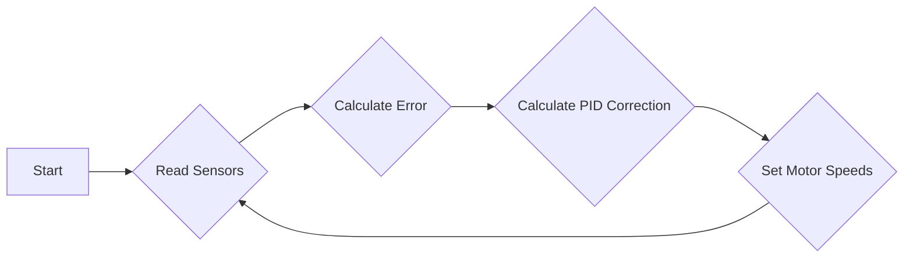
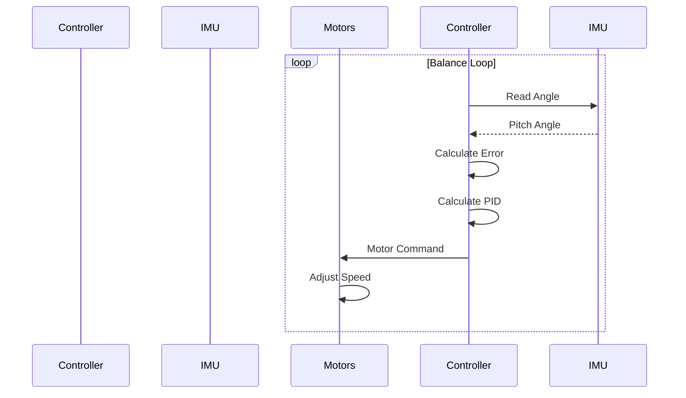

# Advanced Functionality

This section details the advanced functionalities implemented in Wall-E, including line following and self-balancing capabilities. These features leverage PID control and sensor data to achieve autonomous navigation and stability.

## Line Following

The line following functionality enables Wall-E to autonomously navigate a predefined path marked by a line. This is achieved through a combination of sensor data from a line sensor array and PID control algorithms.

### How it Works

Wall-E uses a five-sensor line sensor array to detect the black line on a white surface (or vice versa). Each sensor provides an analog reading based on the reflectance of the surface below it. These readings are then used to calculate an error value, which represents how far the bot is from the center of the line and in which direction. The PID controller uses this error to adjust the motor speeds, guiding Wall-E along the line.

### PID Control in Line Following

The PID (Proportional-Integral-Derivative) controller is crucial for achieving accurate and stable line following. Each term in the PID controller plays a specific role:

*   **Proportional (P) Term:** Provides an immediate correction based on the current error.
*   **Integral (I) Term:** Accumulates past errors to eliminate steady-state error.
*   **Derivative (D) Term:** Predicts future errors based on the rate of change of the current error, damping oscillations and improving stability.

### Error Calculation

The error is calculated as a weighted average of the sensor readings, where the weights are assigned to each sensor in the array.

```c
void calculate_error() {
  int sensor_values[5]; // Array to store sensor readings
  int weights[5] = {-5, -3, 0, 3, 5}; // Weights for each sensor
  int weighted_sum = 0;
  int sum = 0;

  // Read sensor values (replace with actual sensor reading function)
  for (int i = 0; i < 5; i++) {
    sensor_values[i] = analogRead(sensorPins[i]);
  }

  // Calculate weighted sum and sum of activated sensors
  for (int i = 0; i < 5; i++) {
    int k = (sensor_values[i] > BLACK_BOUNDARY) ? 1 : 0;
    weighted_sum += weights[i] * k;
    sum += k;
  }

  // Calculate position
  if (sum != 0) {
    error = (float)weighted_sum / sum;
  } else {
    // Handle case where all sensors are off the line
    error = previous_error; // Use previous error as an estimate
  }
  previous_error = error;
}
```

[View on GitHub](https://github.com/SRA-VJTI/Wall-E/blob/master/6_line_following/README.md)

This snippet shows how the error is calculated based on sensor readings.  The `analogRead()` function would need to be replaced with the actual function used to read the sensor values on the specific hardware. The weights `{-5, -3, 0, 3, 5}` are used to give greater importance to sensors further from the center.

### PID Correction

The PID correction is calculated using the following formula:

```
correction = Kp*(error) + Ki*(cumulative_error) + Kd*(difference)
```

```c
void calculate_correction() {
  // Calculate error difference
  float error_difference = error - previous_error;

  // Calculate cumulative error
  cumulative_error += error;

  // Calculate PID correction
  correction = (Kp * error) + (Ki * cumulative_error) + (Kd * error_difference);

  // Update previous error
  previous_error = error;
}
```

[View on GitHub](https://github.com/SRA-VJTI/Wall-E/blob/master/6_line_following/README.md)

Here, the `calculate_correction()` function computes the PID correction value, incorporating the proportional, integral, and derivative terms based on the error and its derivatives. The PID constants `Kp`, `Ki`, and `Kd` need to be tuned to achieve optimal performance.

### Motor Control

The calculated correction value is then applied to the motor speeds to steer Wall-E along the line.

```c
void set_motor_speeds(float correction) {
  int left_motor_speed = optimum_duty_cycle + correction;
  int right_motor_speed = optimum_duty_cycle - correction;

  // Apply bounds to motor speeds
  left_motor_speed = constrain(left_motor_speed, 0, 255);
  right_motor_speed = constrain(right_motor_speed, 0, 255);

  // Set motor speeds (replace with actual motor control functions)
  set_motor_pwm(LEFT_MOTOR, left_motor_speed);
  set_motor_pwm(RIGHT_MOTOR, right_motor_speed);
}
```

[View on GitHub](https://github.com/SRA-VJTI/Wall-E/blob/master/6_line_following/README.md)

This function sets the motor speeds based on the PID correction. The `optimum_duty_cycle` represents the base speed of the motors, and the correction is added or subtracted to adjust the speed of each motor. The `constrain` function ensures that the motor speeds stay within the valid range (0-255 in this example).  The `set_motor_pwm` functions will need to be implemented according to the hardware being used.

### Line Following Algorithm Flowchart





This flowchart illustrates the basic algorithm for line following. The process continuously reads sensor data, calculates the error, applies the PID correction, and adjusts the motor speeds.

## Self-Balancing

The self-balancing functionality allows Wall-E to maintain its upright position by continuously adjusting its motor speeds based on data from an Inertial Measurement Unit (IMU).

### How it Works

Wall-E uses an MPU6050 IMU to measure its pitch angle. A PID controller uses this angle to calculate the necessary motor commands to maintain balance.

### PID Control in Self-Balancing

Similar to line following, PID control is crucial for self-balancing. The error in this case is the difference between the desired angle (upright position) and the current angle.

*   **Proportional (P) Term:** Provides an immediate correction based on the current angle.
*   **Integral (I) Term:** Accumulates past errors to eliminate steady-state error (e.g., drift).
*   **Derivative (D) Term:** Predicts future errors based on the rate of change of the angle, damping oscillations and improving stability.

### Angle Measurement

The MPU6050 provides raw accelerometer and gyroscope data, which are then fused to obtain an accurate pitch angle.

```c
esp_err_t read_mpu6050(float *euler_angle, float *mpu_offset) {
  // Placeholder for reading data from MPU6050
  // Replace with actual MPU6050 reading and calculation logic
  // This example assumes you have functions to read raw data and calculate angles

  float accX, accY, accZ, gyroX, gyroY, gyroZ;
  // Read raw accelerometer and gyroscope data
  // read_raw_data(&accX, &accY, &accZ, &gyroX, &gyroY, &gyroZ);

  // Calculate pitch angle using accelerometer data
  float pitchAcc = atan2(accX, sqrt(accY * accY + accZ * accZ)) * 180 / PI;

  // Calculate pitch angle using gyroscope data (integrate over time)
  float pitchGyro = euler_angle[0] + gyroY * dt;

  // Apply complementary filter to fuse accelerometer and gyroscope data
  euler_angle[0] = 0.98 * pitchGyro + 0.02 * pitchAcc;

  return ESP_OK;
}
```

[View on GitHub](https://github.com/SRA-VJTI/Wall-E/blob/master/7_self_balancing/README.md)

This function reads data from the MPU6050 and calculates the pitch angle using a complementary filter. The filter combines accelerometer and gyroscope data to provide a more accurate and stable angle estimate. `dt` is the time step.  Replace the commented out placeholders with the actual hardware access and data processing code.

### PID Correction

The PID correction is calculated using the following formula:

```
pitch_correction = Kp*(error) + Ki*(Integral_Error) + Kd*(Error_rate)
```

```c
void calculate_motor_command(const float pitch_error, float *motor_cmd) {
    static float integral = 0;
    static float prevError = 0;

    integral += pitch_error;
    float derivative = pitch_error - prevError;
    prevError = pitch_error;

    *motor_cmd = Kp * pitch_error + Ki * integral + Kd * derivative;
}
```

[View on GitHub](https://github.com/SRA-VJTI/Wall-E/blob/master/7_self_balancing/README.md)

The `calculate_motor_command` function computes the motor command based on the PID algorithm, using the `pitch_error` as input.

### Motor Control

The calculated motor command is then used to set the motor speeds and maintain balance.

```c
void set_motor_pwm(int motor, int pwm_value) {
  // Placeholder: Implement motor control logic here
  // This function should take the motor number and PWM value as input
  // and set the motor speed accordingly

  // Example (replace with your actual implementation):
  if (motor == LEFT_MOTOR) {
    // Set PWM for left motor
  } else if (motor == RIGHT_MOTOR) {
    // Set PWM for right motor
  }
}
```

This is a placeholder for the actual motor control logic.  You will need to implement this function to set the motor speeds based on the calculated PWM values.

### Self Balancing Algorithm





This sequence diagram illustrates the interaction between the controller, IMU, and motors in the self-balancing system.

## Key Integration Points

### Data Flow

Both line following and self-balancing functionalities rely on a continuous data flow between sensors, controllers, and motors. Sensor data is processed by the PID controller, which generates motor commands to achieve the desired behavior.

### Tuning PID Constants

The performance of both functionalities heavily depends on the proper tuning of the PID constants. This can be achieved through experimental methods or by using auto-tuning algorithms. The line following code includes a HTTP server to allow real-time tuning of the PID parameters using a web interface.

```c
void start_tuning_http_server() {
  // Placeholder for starting HTTP server
  // Replace with your actual HTTP server implementation
  // This server should allow users to adjust the PID constants (Kp, Ki, Kd)
  // and send the updated values to the ESP32
  Serial.println("Starting HTTP server for PID tuning...");
}
```

[View on GitHub](https://github.com/SRA-VJTI/Wall-E/blob/master/6_line_following/README.md)

This snippet shows the declaration of a function that would start an HTTP server allowing the PID constants to be tuned.