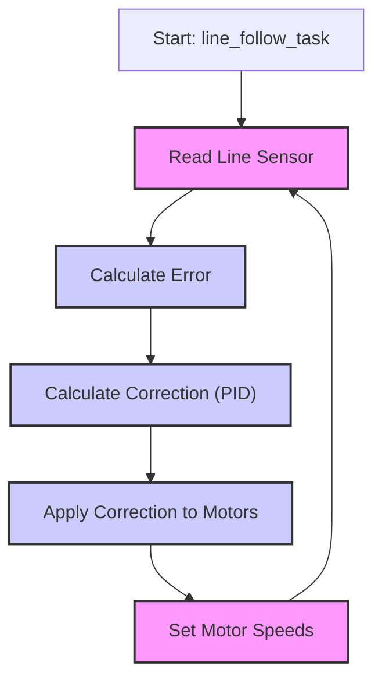

 # Line Following Module

## Overview

The line following module is a crucial component of the autonomous navigation system. Its primary function is to enable the robot to follow a black line on a white surface (or vice versa). This module employs a closed-loop control system utilizing a Proportional-Integral-Derivative (PID) controller to maintain the robot's position relative to the line.

## Key Components

The module comprises the following key components:

*   **Line Sensor Array**: A 5-sensor array detects the line's position.
*   **PID Controller**: Calculates the motor corrections based on the error.
*   **Motor Control**: Adjusts the motor speeds to follow the line.
*   **Tuning Interface**: Allows for real-time adjustment of PID parameters.

## Implementation Details

### Line Sensor Readings

The line sensor readings are the foundation of the line following algorithm. The `line_sensor_readings` structure captures the analog values from the five line sensors.

```c
typedef struct {
    uint32_t adc_reading[5];
} line_sensor_array;
```

These readings are then processed to determine the robot's position relative to the line.

### Calculating the Error

The `calculate_error()` function is responsible for determining the error.

```c
void calculate_error()
{
    int all_black_flag = 1; // assuming initially all black condition
    float weighted_sum = 0, sum = 0; 
    float pos = 0; int k = 0;

    for(int i = 0; i < 5; i++)
    {
        if(line_sensor_readings.adc_reading[i] > BLACK_BOUNDARY)
        {
            all_black_flag = 0;
        }
        if(line_sensor_readings.adc_reading[i] > BLACK_BOUNDARY)
        {
            k = 1;
        }
        if(line_sensor_readings.adc_reading[i] < BLACK_BOUNDARY)
        {
            k = 0;
        }
        weighted_sum += (float)(weights[i]) * k;
        sum = sum + k;
    }

    if(sum != 0) // sum can never be 0 but just for safety purposes
    {
        pos = (weighted_sum - 1) / sum; // This will give us the position wrt line. if +ve then bot is facing left and if -ve the bot is facing to right.
    }

    if(all_black_flag == 1)  // If all black then we check for previous error to assign current error.
    {
        if(prev_error > 0)
        {
            error = 2.5;
        }
        else
        {
            error = -2.5;
        }
    }
    else
    {
        error = pos;
    }
}
```
[View on GitHub](https://github.com/SRA-VJTI/Wall-E/blob/main/6_line_following/main/line_following.c#L77-L113)

1.  **Sensor Readings**: The function reads the line sensor values.
2.  **Weighted Average**: Calculates the weighted sum based on sensor readings.
3.  **Error Calculation**: Determines the error, which indicates how far the robot is from the center of the line.
4.  **All Black Condition**: Handles a special case when all sensors detect black.

### PID Control

The PID controller calculates the correction needed to steer the robot. The `calculate_correction()` function implements the PID algorithm.

```c
void calculate_correction()
{
    error = error*10;  // we need the error correction in range 0-100 so that we can send it directly as duty cycle paramete
    difference = error - prev_error;
    cumulative_error += error;

    cumulative_error = bound(cumulative_error, -30, 30);

    correction = read_pid_const().kp*error + read_pid_const().ki*cumulative_error + read_pid_const().kd*difference;
    prev_error = error;
}
```

[View on GitHub](https://github.com/SRA-VJTI/Wall-E/blob/main/6_line_following/main/line_following.c#L59-L75)

This function computes the correction value based on the proportional, integral, and derivative terms. The `read_pid_const()` function retrieves the current PID constants (Kp, Ki, Kd) from the tuning interface.

### Motor Control

The `line_follow_task()` function is the main task responsible for the line following process.

```c
void line_follow_task(void* arg)
{
    motor_handle_t motor_a_0, motor_a_1;
    ESP_ERROR_CHECK(enable_motor_driver(&motor_a_0, MOTOR_A_0));
    ESP_ERROR_CHECK(enable_motor_driver(&motor_a_1, MOTOR_A_1));
    adc_handle_t line_sensor;
    ESP_ERROR_CHECK(enable_line_sensor(&line_sensor));
    ESP_ERROR_CHECK(enable_bar_graph());
#ifdef CONFIG_ENABLE_OLED
    // Initialising the OLED
    ESP_ERROR_CHECK(init_oled());
    vTaskDelay(100);

    // Clearing the screen
    lv_obj_clean(lv_scr_act());

#endif

    while(true)
    {
        line_sensor_readings = read_line_sensor(line_sensor);
        for(int i = 0; i < 5; i++)
        {
            line_sensor_readings.adc_reading[i] = bound(line_sensor_readings.adc_reading[i], WHITE_MARGIN, BLACK_MARGIN);
            line_sensor_readings.adc_reading[i] = map(line_sensor_readings.adc_reading[i], WHITE_MARGIN, BLACK_MARGIN, bound_LSA_LOW, bound_LSA_HIGH);
            line_sensor_readings.adc_reading[i] = 1000 - (line_sensor_readings.adc_reading[i]);
        }

        calculate_error();
        calculate_correction();

        left_duty_cycle = bound((optimum_duty_cycle + correction), lower_duty_cycle, higher_duty_cycle);
        right_duty_cycle = bound((optimum_duty_cycle - correction), lower_duty_cycle, higher_duty_cycle);

        set_motor_speed(motor_a_0, MOTOR_FORWARD, left_duty_cycle);
        set_motor_speed(motor_a_1, MOTOR_FORWARD, right_duty_cycle);


        //ESP_LOGI("debug","left_duty_cycle:  %f    ::  right_duty_cycle :  %f  :: error :  %f  correction  :  %f  \n",left_duty_cycle, right_duty_cycle, error, correction);
        ESP_LOGI("debug", "KP: %f ::  KI: %f  :: KD: %f", read_pid_const().kp, read_pid_const().ki, read_pid_const().kd);
#ifdef CONFIG_ENABLE_OLED
        // Diplaying kp, ki, kd values on OLED 
        if (read_pid_const().val_changed)
        {
            display_pid_values(read_pid_const().kp, read_pid_const().ki, read_pid_const().kd);
            reset_val_changed_pid_const();
        }
#endif

        vTaskDelay(10 / portTICK_PERIOD_MS);
    }

    vTaskDelete(NULL);
}
```
[View on GitHub](https://github.com/SRA-VJTI/Wall-E/blob/main/6_line_following/main/line_following.c#L115-L167)

Key steps include:

1.  **Reading Sensor Values**: The function reads data from line sensors.
2.  **Error and Correction Calculation**: The calculated error and correction is used to adjust the motor speeds.
3.  **Motor Control**: The motor speeds are adjusted based on the calculated correction.

### Tuning Interface

A web-based tuning interface allows for real-time adjustment of the PID parameters (Kp, Ki, Kd).

```html
<div class="button-group">
    <h3>Kp</h3>
    <button>&lt;</button>
    <input type="number" value="0.000" id="kp" />
    <button>&gt;</button>
</div>
```

[View on GitHub](https://github.com/SRA-VJTI/Wall-E/blob/main/6_line_following/frontend/index.html#L38-L45)

This interface sends the new values to the ESP32.

### Control Flow





## Relevant Files

*   `6_line_following/README.md`: Provides an overview of the line following module.
*   `6_line_following/main/line_following.c`: Contains the line following logic, including sensor reading, error calculation, PID control, and motor control.
*   `6_line_following/frontend/index.html`: Implements the web-based tuning interface for adjusting PID parameters.

## Key Integration Points

*   **Sensor Data**: The line sensor readings are crucial. The quality and accuracy of the readings directly impact the line following performance.
*   **PID Tuning**: The tuning interface allows for optimizing the PID parameters. Proper tuning is crucial for stable and accurate line following.
*   **Motor Control**: Correct motor control is essential for the bot to follow the line smoothly and responsively.

## Best Practices

*   **Calibration**: Regularly calibrate the line sensors to ensure accurate readings.
*   **PID Tuning**: Tune the PID parameters carefully to optimize performance. Start with the proportional term (Kp) and then adjust the derivative (Kd) and integral (Ki) terms.
*   **Code Clarity**: Write clear, well-commented code to facilitate maintenance and debugging.
*   **Error Handling**: Implement appropriate error handling, such as checking sensor readings for validity.