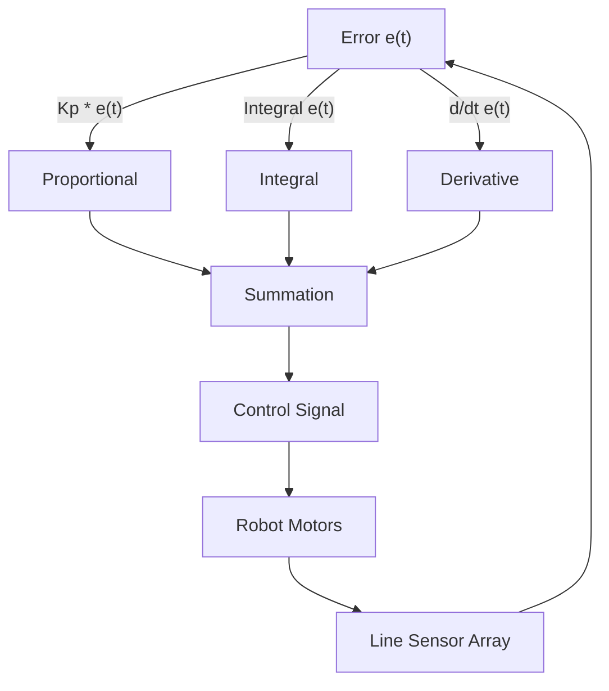
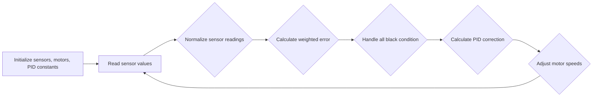

# Line Following System

This document details the implementation of the line following system for the Wall-E robot. The system uses a PID controller to ensure accurate and smooth line following, adapting to various track conditions.

## Overview

The line following system relies on a 5-sensor line sensor array to detect a black line on a white surface (or vice versa). The robot calculates an error value based on the sensor readings and uses a PID controller to adjust the motor speeds, keeping the robot centered on the line.

## Theory of Operation

### Line Sensor Array
The line sensor array provides analog readings representing the reflectance of the surface beneath each sensor. These readings are then processed to determine the robot's position relative to the line. Each sensor is assigned a weight to calculate a weighted average, indicating the error.

### PID Control

PID (Proportional-Integral-Derivative) control is used to minimize the error between the robot's current position and the desired position (center of the line).

*   **Proportional (Kp):** Reacts to the current error.
*   **Integral (Ki):** Accumulates past errors to eliminate steady-state error.
*   **Derivative (Kd):** Predicts future errors based on the rate of change of the current error.





### PID Terms Explained

*   **Proportional Term:** Directly proportional to the error. A higher Kp results in a stronger corrective response.
*   **Derivative Term:** Responds to the rate of change of the error. It helps dampen oscillations and improve stability.
*   **Integral Term:** Addresses accumulated errors over time. It helps eliminate steady-state errors and ensures the robot accurately follows the line.

## Algorithm

1.  Initialize line sensor array, motors, and PID constants.
2.  Read sensor values from the line sensor array.
3.  Normalize sensor readings.
4.  Calculate a weighted error based on sensor readings and assigned weights.
5.  Handle the "all black" condition.
6.  Calculate PID correction value.
7.  Adjust motor speeds based on the correction value.
8.  Repeat.





## Code Snippets and Explanations

### 1. Error Calculation (`calculate_error()`)

This function calculates the error, indicating how far the robot is from the center of the line.

```c
void calculate_error()
{
    int all_black_flag = 1; // assuming initially all black condition
    float weighted_sum = 0, sum = 0; 
    float pos = 0; int k = 0;

    for(int i = 0; i < 5; i++)
    {
        if(line_sensor_readings.adc_reading[i] > BLACK_BOUNDARY)
        {
            all_black_flag = 0;
        }
        if(line_sensor_readings.adc_reading[i] > BLACK_BOUNDARY)
        {
            k = 1;
        }
        if(line_sensor_readings.adc_reading[i] < BLACK_BOUNDARY)
        {
            k = 0;
        }
        weighted_sum += (float)(weights[i]) * k;
        sum = sum + k;
    }

    if(sum != 0) // sum can never be 0 but just for safety purposes
    {
        pos = (weighted_sum - 1) / sum; // This will give us the position wrt line. if +ve then bot is facing left and if -ve the bot is facing to right.
    }

    if(all_black_flag == 1)  // If all black then we check for previous error to assign current error.
    {
        if(prev_error > 0)
        {
            error = 2.5;
        }
        else
        {
            error = -2.5;
        }
    }
    else
    {
        error = pos;
    }
}
```

[View on GitHub](https://github.com/SRA-VJTI/Wall-E/blob/master/6_line_following/main/line_following.c)

### 2. Correction Calculation (`calculate_correction()`)

This function calculates the PID correction value based on the current error, cumulative error, and difference in error.

```c
void calculate_correction()
{
    error = error*10;  // we need the error correction in range 0-100 so that we can send it directly as duty cycle paramete
    difference = error - prev_error;
    cumulative_error += error;

    cumulative_error = bound(cumulative_error, -30, 30);

    correction = read_pid_const().kp*error + read_pid_const().ki*cumulative_error + read_pid_const().kd*difference;
    prev_error = error;
}
```

[View on GitHub](https://github.com/SRA-VJTI/Wall-E/blob/master/6_line_following/main/line_following.c)

### 3. Line Following Task (`line_follow_task()`)

This is the main task that orchestrates the line following process.

```c
void line_follow_task(void* arg)
{
    motor_handle_t motor_a_0, motor_a_1;
    ESP_ERROR_CHECK(enable_motor_driver(&motor_a_0, MOTOR_A_0));
    ESP_ERROR_CHECK(enable_motor_driver(&motor_a_1, MOTOR_A_1));
    adc_handle_t line_sensor;
    ESP_ERROR_CHECK(enable_line_sensor(&line_sensor));
    ESP_ERROR_CHECK(enable_bar_graph());
#ifdef CONFIG_ENABLE_OLED
    // Initialising the OLED
    ESP_ERROR_CHECK(init_oled());
    vTaskDelay(100);

    // Clearing the screen
    lv_obj_clean(lv_scr_act());

#endif

    while(true)
    {
        line_sensor_readings = read_line_sensor(line_sensor);
        for(int i = 0; i < 5; i++)
        {
            line_sensor_readings.adc_reading[i] = bound(line_sensor_readings.adc_reading[i], WHITE_MARGIN, BLACK_MARGIN);
            line_sensor_readings.adc_reading[i] = map(line_sensor_readings.adc_reading[i], WHITE_MARGIN, BLACK_MARGIN, bound_LSA_LOW, bound_LSA_HIGH);
            line_sensor_readings.adc_reading[i] = 1000 - (line_sensor_readings.adc_reading[i]);
        }

        calculate_error();
        calculate_correction();

        left_duty_cycle = bound((optimum_duty_cycle + correction), lower_duty_cycle, higher_duty_cycle);
        right_duty_cycle = bound((optimum_duty_cycle - correction), lower_duty_cycle, higher_duty_cycle);

        set_motor_speed(motor_a_0, MOTOR_FORWARD, left_duty_cycle);
        set_motor_speed(motor_a_1, MOTOR_FORWARD, right_duty_cycle);


        //ESP_LOGI("debug","left_duty_cycle:  %f    ::  right_duty_cycle :  %f  :: error :  %f  correction  :  %f  \n",left_duty_cycle, right_duty_cycle, error, correction);
        ESP_LOGI("debug", "KP: %f ::  KI: %f  :: KD: %f", read_pid_const().kp, read_pid_const().ki, read_pid_const().kd);
#ifdef CONFIG_ENABLE_OLED
        // Diplaying kp, ki, kd values on OLED 
        if (read_pid_const().val_changed)
        {
            display_pid_values(read_pid_const().kp, read_pid_const().ki, read_pid_const().kd);
            reset_val_changed_pid_const();
        }
#endif

        vTaskDelay(10 / portTICK_PERIOD_MS);
    }

    vTaskDelete(NULL);
}
```

[View on GitHub](https://github.com/SRA-VJTI/Wall-E/blob/master/6_line_following/main/line_following.c)

### 4. PID Tuning Interface (Frontend)

The `index.html` file provides a web-based interface for tuning the PID constants.

```html
<!DOCTYPE html>
<html lang="en">
	<head>
		<meta charset="UTF-8" />
		<meta name="viewport" content="width=device-width, initial-scale=1.0" />
		<title>Tuning page</title>
		<style>
			* {
				margin: 0;
				padding: 0;
				box-sizing: border-box;
				font-family: "Segoe UI", Tahoma, Geneva, Verdana, sans-serif;
				outline: none;
			}
			button {
				border: none;
				background: transparent;
			}
			body {
				width: 100%;
				height: 100vh;

				background: url("data:image/svg+xml;base64,PHN2ZyB4bWxucz0iaHR0cDovL3d3dy53My5vcmcvMjAwMC9zdmciIHhtbG5zOnhsaW5rPSJodHRwOi8vd3d3LnczLm9yZy8xOTk5L3hsaW5rIiB3aWR0aD0iMTAwJSIgaGVpZ2h0PSIxMDAlIj48ZGVmcz48cGF0dGVybiBpZD0icGF0dGVybiIgd2lkdGg9IjQ2LjE5IiBoZWlnaHQ9IjQwIiB2aWV3Qm94PSIwIDAgMzQuNjQxMDE2MTUxMzc3NTUsMzAiIHBhdHRlcm5Vbml0cz0idXNlclNwYWNlT25Vc2UiIHBhdHRlcm5UcmFuc2Zvcm09InJvdGF0ZSgxMzUpICI+PHJlY3QgaWQ9InBhdHRlcm4tYmFja2dyb3VuZCIgd2lkdGg9IjQwMCUiIGhlaWdodD0iNDAwJSIgZmlsbD0icmdiYSgyNiwgMzIsIDQ0LDEpIj48L3JlY3Q+IDxwYXRoIGZpbGw9InJnYmEoNDUsIDU1LCA3MiwxKSIgZD0iTS0yMCAtMjAgaDIwMCB2MjAwIGgtMjAwIE0zMy43NyAyNS41TDI1Ljk4IDIxTDE4LjE5IDI1LjVMMTguMTkgMzQuNUwyNS45OCAzOUwzMy43NyAzNC41ek0xNi40NSAyNS41TDguNjYgMjFMMC44NyAyNS41TDAuODcgMzQuNUw4LjY2IDM5TDE2LjQ1IDM0LjV6TTcuNzkgMTAuNUwwIDZMLTcuNzkgMTAuNUwtNy43OSAxOS41TDAgMjRMNy43OSAxOS41ek0xNi40NSAtNC41TDguNjYgLTlMMC44NyAtNC41TDAuODcgNC41TDguNjYgOUwxNi40NSA0LjV6TTMzLjc3IC00LjVMMjUuOTggLTlMMTguMTkgLTQuNUwxOC4xOSA0LjVMMjUuOTggOUwzMy43NyA0LjV6TTQyLjQzIDEwLjVMMzQuNjQgNkwyNi44NSAxMC41TDI2Ljg1IDE5LjVMMzQuNjQgMjRMNDIuNDMgMTkuNXpNMjUuMTEgMTAuNUwxNy4zMiA2TDkuNTMgMTAuNUw5LjUzIDE5LjVMMTcuMzIgMjRMMjUuMTEgMTkuNXoiPjwvcGF0aD48cGF0aCBmaWxsPSJyZ2JhKDE5MCwgMjI3LCAyNDgsMSkiIGQ9Ik0tMjAgLTIwIGgyMDAgdjIwMCBoLTIwMCBNMjQuMjEgMjUuMjVMMTUuOTggMjAuNUw3Ljc1IDI1LjI1TDcuNzUgMzQuNzVMMTUuOTggMzkuNUwyNC4yMSAzNC43NXpNNi44OSAyNS4yNUwtMS4zNCAyMC41TC05LjU3IDI1LjI1TC05LjU3IDM0Ljc1TC0xLjM0IDM5LjVMNi44OSAzNC43NXpNLTEuNzcgMTAuMjVMLTEwIDUuNUwtMTguMjMgMTAuMjVMLTE4LjIzIDE5Ljc1TC0xMCAyNC41TC0xLjc3IDE5Ljc1ek02Ljg5IC00Ljc1TC0xLjM0IC05LjVMLTkuNTcgLTQuNzVMLTkuNTcgNC43NUwtMS4zNCA5LjVMNi44OSA0Ljc1ek0yNC4yMSAtNC43NUwxNS45OCAtOS41TDcuNzUgLTQuNzVMNy43NSA0Ljc1TDE1Ljk4IDkuNUwyNC4yMSA0Ljc1ek0zMi44NyAxMC4yNUwyNC42NCA1LjVMMTYuNDEgMTAuMjVMMTYuNDEgMTkuNzVMMjQuNjQgMjQuNUwzMi44NyAxOS43NXpNNDEuNTMgMjUuMjVMMzMuMyAyMC41TDI1LjA3IDI1LjI1TDI1LjA3IDM0Ljc1TDMzLjMgMzkuNUw0MS41MyAzNC43NXpNMTUuNTUgNDAuMjVMNy4zMiAzNS41TC0wLjkxIDQwLjI1TC0wLjkxIDQ5Ljc1TDcuMzIgNTQuNUwxNS41NSA0OS43NXpNLTEwLjQzIDI1LjI1TC0xOC42NiAyMC41TC0yNi44OSAyNS4yNUwtMjYuODkgMzQuNzVMLTE4LjY2IDM5LjVMLTEwLjQzIDM0Ljc1ek0tMTAuNDMgLTQuNzVMLTE4LjY2IC05LjVMLTI2Ljg5IC00Ljc1TC0yNi44OSA0Ljc1TC0xOC42NiA5LjVMLTEwLjQzIDQuNzV6TTE1LjU1IC0xOS43NUw3LjMyIC0yNC41TC0wLjkxIC0xOS43NUwtMC45MSAtMTAuMjVMNy4zMiAtNS41TDE1LjU1IC0xMC4yNXpNNDEuNTMgLTQuNzVMMzMuMyAtOS41TDI1LjA3IC00Ljc1TDI1LjA3IDQuNzVMMzMuMyA5LjVMNDEuNTMgNC43NXpNMzIuODcgNDAuMjVMMjQuNjQgMzUuNUwxNi40MSA0MC4yNUwxNi40MSA0OS43NUwyNC42NCA1NC41TDMyLjg3IDQ5Ljc1ek0tMS43NyA0MC4yNUwtMTAgMzUuNUwtMTguMjMgNDAuMjVMLTE4LjIzIDQ5Ljc1TC0xMCA1NC41TC0xLjc3IDQ5Ljc1ek0tMTkuMDkgMTAuMjVMLTI3LjMyIDUuNUwtMzUuNTUgMTAuMjVMLTM1LjU1IDE5Ljc1TC0yNy4zMiAyNC41TC0xOS4wOSAxOS43NXpNLTEuNzcgLTE5Ljc1TC0xMCAtMjQuNUwtMTguMjMgLTE5Ljc1TC0xOC4yMyAtMTAuMjVMLTEwIC01LjVMLTEuNzcgLTEwLjI1ek0zMi44NyAtMTkuNzVMMjQuNjQgLTI0LjVMMTYuNDEgLTE5Ljc1TDE2LjQxIC0xMC4yNUwyNC42NCAtNS41TDMyLjg3IC0xMC4yNXpNNTAuMTkgMTAuMjVMNDEuOTYgNS41TDMzLjczIDEwLjI1TDMzLjczIDE5Ljc1TDQxLjk2IDI0LjVMNTAuMTkgMTkuNzV6TTE1LjU1IDEwLjI1TDcuMzIgNS41TC0wLjkxIDEwLjI1TC0wLjkxIDE5Ljc1TDcuMzIgMjQuNUwxNS41NSAxOS43NXoiPjwvcGF0aD48L3BhdHRlcm4+ICA8L2RlZnM+IDxyZWN0IGZpbGw9InVybCgjcGF0dGVybikiIGhlaWdodD0iMTAwJSIgd2lkdGg9IjEwMCUiPjwvcmVjdD48L3N2Zz4=");
				display: flex;
				justify-content: center;
				align-items: center;
			}
			main {
				background-color: rgba(0, 0, 0, 0.493);
				/* backdrop-filter: blur(2px); */
				color: white;
				min-width: 35%;
				padding: 2em;
				height: 90vh;
				border-radius: 10px;
				display: flex;
				flex-direction: column;
				justify-content: space-around;
				align-items: center;

				font-weight: 100;
			}
			.button-group {
				margin-bottom: 20px;
			}
			h1 {
				font-weight: normal;
				margin-bottom: 10px;
			}
			.button-group h3 {
				font-weight: normal;
				text-align: center;
				font-family: "Segoe UI", Tahoma, Geneva, Verdana, sans-serif;
				font-size: 1.4rem;
				/* margin-bottom: 5px; */
			}
			.button-group input {
				background-color: transparent;
				border: none;
				border-bottom: 2px solid white;
				color: white;
				text-align: center;
				font-size: 1.2rem;
				padding: 5px;
			}
			input::-webkit-outer-spin-button,
			input::-webkit-inner-spin-button {
				-webkit-appearance: none;
			}

			.button-group button {
				color: white;
				cursor: pointer;
				font-size: 2rem;
			}
		</style>
	</head>
	<body>
		<main>
			<h1>Line Following</h1>
			<div class="button-group">
				<h3>Kp</h3>
				<button>&lt;</button>
				<input type="number" value="0.000" id="kp" />
				<button>&gt;</button>
			</div>
			<div class="button-group">
				<h3>Ki</h3>
				<button>&lt;</button>
				<input type="number" value="0.000" id="ki" />
				<button>&gt;</button>
			</div>
			<div class="button-group">
				<h3>Kd</h3>
				<button>&lt;</button>
				<input type="number" value="0.000" id="kd" />
				<button>&gt;</button>
			</div>
		</main>
		<script>
			let inpArray = document.querySelectorAll("input[type='number']");
			function submitVals() {
				const data = {};
				data["kp"] = parseFloat(document.getElementById("kp").value);
				data["ki"] = parseFloat(document.getElementById("ki").value);
				data["kd"] = parseFloat(document.getElementById("kd").value);
				let finaldata = JSON.stringify(data);
				console.log(finaldata);

				let xhr = new XMLHttpRequest();

				// Vedant!
				let url = "/api/v1/pid";

				// open a connection
				xhr.open("POST", url, true);

				// Set the request header i.e. which type of content you are sending
				xhr.setRequestHeader("Content-Type", "application/json");
				// Create a state change callback
				xhr.onreadystatechange = function () {
					if (xhr.readyState === 4) {
						if (xhr.status == 400) {
							console.log("Success!");
						} else {
							console.log(xhr.status);
						}
						// Print received data from server
					}
				};

				// Sending data with the request
				xhr.send(finaldata);
			}
			for (let i = 0; i < inpArray.length; i++) {
				inpArray[i].addEventListener("change", submitVals);
			}

			let decrementButtons = document.querySelectorAll(
				".button-group button:first-of-type"
			);
			let incrementButtons = document.querySelectorAll(
				".button-group button:last-of-type"
			);
			function decrementVal(e) {
				let test = e.target.parentNode.children[2].value;
				if (!isNaN(Number(test))) {
					e.target.parentNode.children[2].value = String(
						(Number(test) - 0.01).toFixed(3)
					);
					submitVals();
				} else {
					e.target.parentNode.children[2].value = "0.000";
				}
			}
			function incrementVal(e) {
				let test = e.target.parentNode.children[2].value;
				if (!isNaN(Number(test))) {
					e.target.parentNode.children[2].value = String(
						(Number(test) + 0.01).toFixed(3)
					);
					submitVals();
				} else {
					e.target.parentNode.children[2].value = "0.000";
				}
			}
			for (button of decrementButtons) {
				button.addEventListener("click", decrementVal);
			}
			for (button of incrementButtons) {
				button.addEventListener("click", incrementVal);
			}
		</script>
	</body>
</html>
```
[View on GitHub](https://github.com/SRA-VJTI/Wall-E/blob/master/6_line_following/frontend/index.html)

This code sets up a simple HTML page with input fields for Kp, Ki, and Kd values. JavaScript is used to send these values to the ESP32 via HTTP POST requests whenever the values are changed.

### 5. Reading PID Constants

This function reads the current PID constants from memory, likely set via the tuning interface.

```c
    pid_const_t read_pid_const()
    ```
    **Description** : Returns the current PID constants (Kp, Ki, Kd) that were read from the tuning interface

    **Return** : A structure containing the three PID constants
```

### 6. WiFi Connection Handling (`connect_to_wifi()`)

Although the code for `connect_to_wifi()` is not directly within `line_following.c`, the `wifi_handler.h` header file indicates its role in establishing a WiFi connection, which is essential for the HTTP-based PID tuning interface to function.

```c
#ifndef WIFI_HANDLER_H
#define WIFI_HANDLER_H

#include <string.h>
#include "freertos/FreeRTOS.h"
#include "freertos/task.h"
#include "freertos/event_groups.h"
#include "esp_system.h"
#include "esp_wifi.h"
#include "esp_event.h"
#include "esp_log.h"
#include "nvs_flash.h"
#include "lwip/err.h"
#include "lwip/sys.h"
#include "sdkconfig.h"

#define WIFI_CONNECTED_BIT BIT0
#define WIFI_FAIL_BIT      BIT1

#define WIFI_SSID      CONFIG_WIFI_SSID
#define WIFI_PASS      CONFIG_WIFI_PASSWORD
#define MAXIMUM_RETRY  CONFIG_MAXIMUM_RETRY

void connect_to_wifi();

#endif
```
[View on GitHub](https://github.com/SRA-VJTI/Wall-E/blob/master/6_line_following/main/include/wifi_handler.h)

## Key Integration Points

1.  **Sensor Readings**: The line sensor readings directly influence the calculated error, which is the foundation of the PID control.
2.  **PID Controller**: The PID controller uses the error to calculate a correction value, which is then applied to the motor speeds.
3.  **Motor Control**: The motor speeds are adjusted based on the PID correction value, ensuring the robot stays on the line.
4.  **Tuning Interface**: The HTTP server provides a real-time interface for tuning the PID constants, allowing for dynamic adjustments to optimize performance.
5.  **WiFi Connection**: The WiFi connection is crucial for enabling remote PID tuning through the web interface.

## Best Practices

*   **PID Tuning**: Proper tuning of the PID constants is essential for optimal performance. Start with Kp, then adjust Kd to dampen oscillations, and finally, adjust Ki to eliminate steady-state errors.
*   **Sensor Calibration**: Calibrate the line sensors to ensure consistent and accurate readings. This may involve adjusting the `BLACK_BOUNDARY` value.
*   **Error Handling**: Implement robust error handling to manage unexpected sensor readings or motor behavior.
*   **Modular Code**: Keep the code modular and well-documented to facilitate future maintenance and enhancements.
*   **OLED Display**: Utilize the OLED display for real-time feedback of PID values, sensor readings, and other relevant information. This helps in debugging and tuning the system.