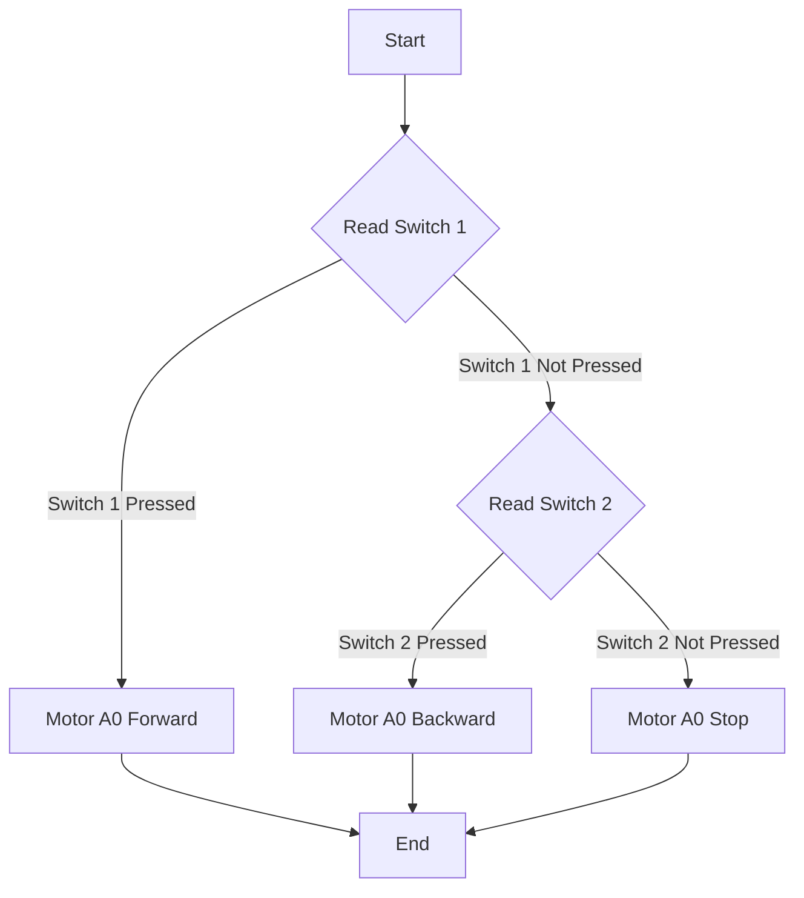

 # Motor Control and PWM

This document explains how to control DC motors using switch inputs and Pulse Width Modulation (PWM) signals on the SRA board. The examples provided use the TB6612FNG motor driver and demonstrate basic motor control functionalities.

## Switch-Controlled Motor

This section details how to control motors using switch inputs. The code reads input from switches and controls the direction and speed of the motors accordingly.

### Code Snippet: Switch Initialization

```c
//File: 4_switch_controlled_motor_normal/main/switch_control_motor_normal.c
enable_switches();
/**
 * activate gpio pins SWITCH_1, SWITCH_2, SWITCH_3, SWITCH_4 .. 
 * swtiches coorespond to following gpio pins
 * SWITCH_1 : 4
 * SWITCH_2 : 2
 * SWITCH_3 : 17
 * SWITCH_4 : 16
 * more details can be found in https://github.com/SRA-VJTI/sra-board-component/blob/9f28700759ac816660c18859d65303d6540e8732/src/switches.c#L6-L34 
 */
```

This snippet initializes the switches connected to the GPIO pins. The `enable_switches()` function configures the necessary GPIO pins for switch input. [View on GitHub](https://github.com/SRA-VJTI/Wall-E/blob/main/4_switch_controlled_motor_normal/main/switch_control_motor_normal.c)

### Code Snippet: Motor Driver Initialization

```c
//File: 4_switch_controlled_motor_normal/main/switch_control_motor_normal.c
motor_handle_t motor_a_0, motor_a_1;
ESP_ERROR_CHECK(enable_motor_driver(&motor_a_0, MOTOR_A_0));
ESP_ERROR_CHECK(enable_motor_driver(&motor_a_1, MOTOR_A_1));
/** 
 * activate motor drivers  TB6612FNG for controlling motors.
 * The ESP has two TB6612FNG drivers which can run upto 2 motors each, the a refers to the first driver
 * more details can be found in https://github.com/SRA-VJTI/sra-board-component/blob/9f28700759ac816660c18859d65303d6540e8732/src/motor_driver.c#L7-L57 
 */
```

This code initializes the motor drivers. `enable_motor_driver()` sets up the TB6612FNG driver for each motor. [View on GitHub](https://github.com/SRA-VJTI/Wall-E/blob/main/4_switch_controlled_motor_normal/main/switch_control_motor_normal.c)

### Code Snippet: Switch Input and Motor Control

```c
//File: 4_switch_controlled_motor_normal/main/switch_control_motor_normal.c
if (read_switch(SWITCH_1))
{
    set_motor_speed(motor_a_0, MOTOR_FORWARD, 80);
    ESP_LOGI(TAG_SWITCH_CONTROL_MOTOR, "MOTOR_A_0 FORWARD");
}
else if (read_switch(SWITCH_2))
{
    set_motor_speed(motor_a_0, MOTOR_BACKWARD, 80);
    ESP_LOGI(TAG_SWITCH_CONTROL_MOTOR, "MOTOR_A_0 BACKWARD");
}
else
{
    set_motor_speed(motor_a_0, MOTOR_STOP, 0);
}
/**
 * read_switch() checks if LSA has given any input to the switch and if statement is true if input is given
 * more information can be found at https://github.com/SRA-VJTI/sra-board-component/blob/9f28700759ac816660c18859d65303d6540e8732/src/switches.c#L36-L46
 */
```

This section shows how to read switch inputs and control the motor accordingly. The `read_switch()` function reads the state of the specified switch, and `set_motor_speed()` sets the motor speed and direction. [View on GitHub](https://github.com/SRA-VJTI/Wall-E/blob/main/4_switch_controlled_motor_normal/main/switch_control_motor_normal.c)

### Switch-Controlled Motor Logic





## PWM-Controlled Motor

This section explains how to control motor speed using PWM signals. The code demonstrates setting different duty cycles to vary the motor speed.

### Code Snippet: PWM Motor Control

```c
//File: 5_PWM/main/pwm_test.c
for (int duty_cycle = 60; duty_cycle <= 100; duty_cycle++)
{
    set_motor_speed(motor_a_0, MOTOR_FORWARD, duty_cycle);
    set_motor_speed(motor_a_1, MOTOR_FORWARD, duty_cycle);
    vTaskDelay(100 / portTICK_PERIOD_MS);
}
/**
 * runs the first motor A_0 for 80 duty cylces forward or backward according to LSA input
 * more details can be found at https://github.com/SRA-VJTI/sra-board-component/blob/9f28700759ac816660c18859d65303d6540e8732/src/motor_driver.c#L195
 */
```

This snippet iterates through duty cycle values from 60 to 100, setting the motor speed for each value. The `set_motor_speed()` function adjusts the PWM signal to control the motor speed. [View on GitHub](https://github.com/SRA-VJTI/Wall-E/blob/main/5_PWM/main/pwm_test.c)

### Code Snippet: PWM Motor Stop

```c
//File: 5_PWM/main/pwm_test.c
set_motor_speed(motor_a_0, MOTOR_STOP, 0);
set_motor_speed(motor_a_1, MOTOR_STOP, 0);
vTaskDelay(100 / portTICK_PERIOD_MS);
```

This code stops the motors by setting the duty cycle to 0. [View on GitHub](https://github.com/SRA-VJTI/Wall-E/blob/main/5_PWM/main/pwm_test.c)

### PWM Motor Control Flow


```mermaid
sequenceDiagram
    participant App as Application
    participant PWMTask as PWM Task
    participant MotorDriver as Motor Driver

    App->>PWMTask: Start PWM Task
    loop Duty Cycle 60-100
        PWMTask->>MotorDriver: set_motor_speed(FORWARD, duty_cycle)
        MotorDriver-->>PWMTask: Acknowledge
        PWMTask->>PWMTask: Delay 100ms
    end
    PWMTask->>MotorDriver: set_motor_speed(STOP, 0)
    MotorDriver-->>PWMTask: Acknowledge
    PWMTask->>PWMTask: Delay 100ms
    loop Duty Cycle 60-100
        PWMTask->>MotorDriver: set_motor_speed(BACKWARD, duty_cycle)
        MotorDriver-->>PWMTask: Acknowledge
        PWMTask->>PWMTask: Delay 100ms
    end
    PWMTask->>MotorDriver: set_motor_speed(STOP, 0)
    MotorDriver-->>PWMTask: Acknowledge
    PWMTask->>PWMTask: Delay 100ms
    loop Repeat
```


## Key Integration Points

- **Motor Driver Integration**: Both examples rely on the `sra_board` component for motor driver functionalities. Understanding the `motor_driver.c` file in the component is crucial.
- **Switch and Motor Control**: The switch-controlled motor example integrates switch input with motor control, demonstrating a basic feedback mechanism.
- **PWM for Speed Control**: The PWM example illustrates how to modulate motor speed by varying the PWM duty cycle, providing finer control.

By combining switch inputs and PWM signals, it's possible to create complex motor control systems for robotics applications. The examples here provide a foundation for more advanced projects.