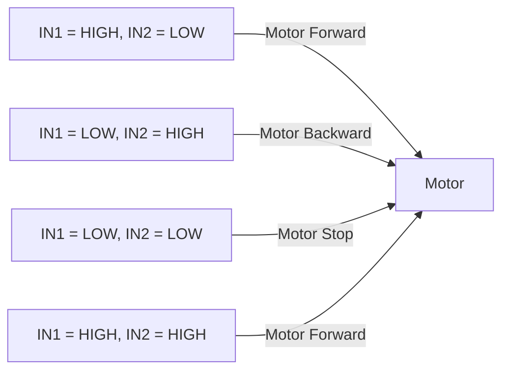
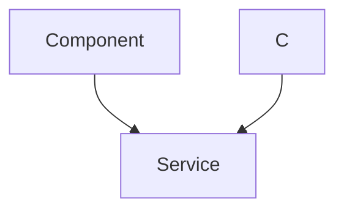

 # Motor Control

This section details motor control mechanisms implemented using PWM (Pulse Width Modulation) and switch control methods on the SRA board. The SRA board utilizes TB6612FNG motor drivers, allowing for the control of up to four motors in either Normal or Parallel mode.

## Switch Controlled Motor (Normal Mode)

### Normal Mode Operation

In normal mode, each TB6612FNG driver controls two motors independently, allowing control of four motors using eight GPIO pins from the ESP32. The direction of each motor is controlled by setting the appropriate input pins (IN1 and IN2) HIGH or LOW.





The `switch_control_motor_normal.c` file demonstrates how to control motors using input from LSA (Line Sensor Array) switches. The code activates GPIO switches, reads their input, and controls the motor drivers accordingly.

### Code Snippets

```c
// Enable the switches to read input from LSA
enable_switches();
```

This snippet from [switch_control_motor_normal.c](https://github.com/SRA-VJTI/Wall-E/blob/main/4_switch_controlled_motor_normal/main/switch_control_motor_normal.c#L17) enables the GPIO pins connected to the LSA switches, allowing the program to read input from the line sensor array. More details regarding this can be found in the sra-board-component [here](https://github.com/SRA-VJTI/sra-board-component/blob/9f28700759ac816660c18859d65303d6540e8732/src/switches.c#L6-L34).

```c
motor_handle_t motor_a_0, motor_a_1;
ESP_ERROR_CHECK(enable_motor_driver(&motor_a_0, MOTOR_A_0));
ESP_ERROR_CHECK(enable_motor_driver(&motor_a_1, MOTOR_A_1));
```

This code block [View on GitHub](https://github.com/SRA-VJTI/Wall-E/blob/main/4_switch_controlled_motor_normal/main/switch_control_motor_normal.c#L24-L26) initializes and enables the motor drivers for `MOTOR_A_0` and `MOTOR_A_1`. The `enable_motor_driver` function sets up the necessary configurations for the TB6612FNG driver. Details for the function `enable_motor_driver` can be found [here](https://github.com/SRA-VJTI/sra-board-component/blob/9f28700759ac816660c18859d65303d6540e8732/src/motor_driver.c#L7-L57).

```c
if (read_switch(SWITCH_1)) {
    set_motor_speed(motor_a_0, MOTOR_FORWARD, 80);
    ESP_LOGI(TAG_SWITCH_CONTROL_MOTOR, "MOTOR_A_0 FORWARD");
}
```

The above code [View on GitHub](https://github.com/SRA-VJTI/Wall-E/blob/main/4_switch_controlled_motor_normal/main/switch_control_motor_normal.c#L36-L39) reads the state of `SWITCH_1`. If the switch is active, it sets `MOTOR_A_0` to move forward at 80% duty cycle. A log message is also printed to indicate the motor's direction. Function `read_switch` details can be found [here](https://github.com/SRA-VJTI/sra-board-component/blob/9f28700759ac816660c18859d65303d6540e8732/src/switches.c#L36-L46) and `set_motor_speed` details can be found [here](https://github.com/SRA-VJTI/sra-board-component/blob/9f28700759ac816660c18859d65303d6540e8732/src/motor_driver.c#L195).

## PWM Based Motor Control

### PWM Implementation

The `pwm_test.c` file demonstrates motor control using PWM. PWM involves varying the duty cycle of a digital signal to control the amount of power delivered to the motor, thereby controlling its speed.

```c
set_motor_speed(motor_a_0, MOTOR_FORWARD, duty_cycle);
```

In the context of `pwm_test.c`, the `set_motor_speed` function [View on GitHub](https://github.com/SRA-VJTI/Wall-E/blob/main/5_PWM/main/pwm_test.c#L23) is called within a loop that iterates through different duty cycle values (from 60 to 100). This gradually increases the power supplied to the motor, resulting in a smooth acceleration. The `MOTOR_FORWARD` parameter specifies the direction of rotation.

### Code Snippets
```c
for (int duty_cycle = 60; duty_cycle <= 100; duty_cycle++) {
    set_motor_speed(motor_a_0, MOTOR_FORWARD, duty_cycle);
    set_motor_speed(motor_a_1, MOTOR_FORWARD, duty_cycle);
    vTaskDelay(100 / portTICK_PERIOD_MS);
}
```

This loop [View on GitHub](https://github.com/SRA-VJTI/Wall-E/blob/main/5_PWM/main/pwm_test.c#L21-L26) gradually increases the duty cycle from 60 to 100 for both motors, making them accelerate in the forward direction. The `vTaskDelay` function introduces a delay of 100ms between each duty cycle increment.

```c
set_motor_speed(motor_a_0, MOTOR_STOP, 0);
set_motor_speed(motor_a_1, MOTOR_STOP, 0);
vTaskDelay(100 / portTICK_PERIOD_MS);
```

This code [View on GitHub](https://github.com/SRA-VJTI/Wall-E/blob/main/5_PWM/main/pwm_test.c#L29-L31) stops both motors by setting their speed to 0. A delay of 100ms is added before proceeding to the next operation.

```c
set_motor_speed(motor_a_0, MOTOR_BACKWARD, duty_cycle);
set_motor_speed(motor_a_1, MOTOR_BACKWARD, duty_cycle);
vTaskDelay(100 / portTICK_PERIOD_MS);
```
This part of the code [View on GitHub](https://github.com/SRA-VJTI/Wall-E/blob/main/5_PWM/main/pwm_test.c#L39-L41) sets both motors to move backward, again increasing the duty cycle from 60 to 100.





## Key Integration Points

-   **Motor Driver Initialization:** The `enable_motor_driver` function, part of the `sra_board` library, is essential for initializing the TB6612FNG motor drivers. It configures the necessary GPIO pins and sets up the motor driver for operation.

-   **Switch Control vs. PWM:** The `switch_control_motor_normal` example demonstrates basic motor control based on digital input from switches, suitable for simple on/off control. PWM control, as shown in `pwm_test.c`, allows for more precise speed control by varying the duty cycle of the PWM signal.

-   **LSA Integration:** The `switch_control_motor_normal` project integrates with the Line Sensor Array (LSA). The robot can respond to different line patterns by reading the switch states and activating the appropriate motors.

-   **FreeRTOS Tasks:** Both examples utilize FreeRTOS tasks to run the motor control logic. This allows the motor control code to run concurrently with other tasks, such as sensor data acquisition or communication.