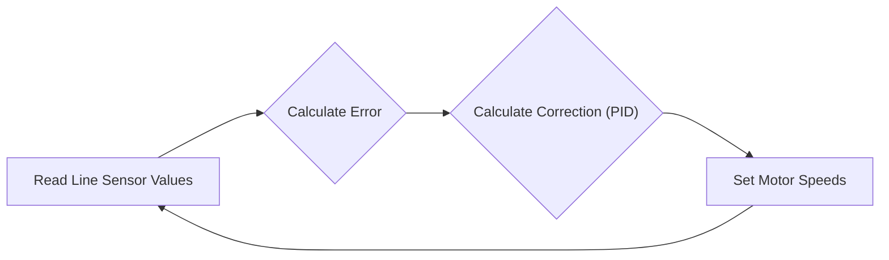
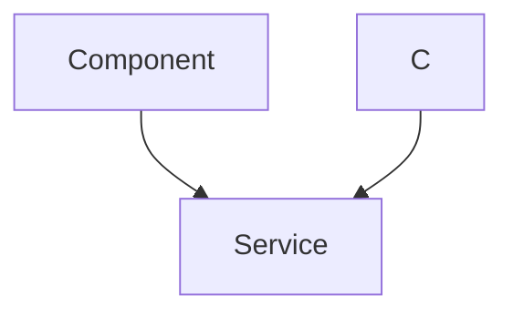

 # Line Following - Embedded Code

This section details the embedded code responsible for the line following functionality of the robot, residing on the ESP32 microcontroller. The code encompasses reading line sensor data, calculating errors and corrections using a PID controller, and controlling the motors to follow the line. Additionally, it includes a tuning HTTP server for dynamically adjusting PID constants and a WiFi handler for network connectivity.

## Core Components

- **Line Sensor Reading:** Acquires analog readings from the line sensor array.
- **Error Calculation:** Determines the robot's deviation from the line.
- **PID Control:** Implements a Proportional-Integral-Derivative (PID) controller to calculate motor speed adjustments.
- **Motor Control:** Sets motor speeds based on PID output.
- **HTTP Server:** Provides a web interface for tuning PID parameters.
- **WiFi Connectivity:** Enables wireless communication for parameter tuning and monitoring.

## File Breakdown

### `line_following.c`

This file contains the main logic for line following. It initializes hardware components, reads sensor data, calculates errors, applies PID control, and sets motor speeds.

```c
#include <stdio.h>
#include "freertos/FreeRTOS.h"
#include "freertos/task.h"
#include "sra_board.h"
#include "tuning_http_server.h"

// ... (rest of the includes and defines)

void line_follow_task(void* arg)
{
    // ... (initialization code)

    while(true)
    {
        line_sensor_readings = read_line_sensor(line_sensor);
        // ... (sensor reading and processing)

        calculate_error();
        calculate_correction();

        left_duty_cycle = bound((optimum_duty_cycle + correction), lower_duty_cycle, higher_duty_cycle);
        right_duty_cycle = bound((optimum_duty_cycle - correction), lower_duty_cycle, higher_duty_cycle);

        set_motor_speed(motor_a_0, MOTOR_FORWARD, left_duty_cycle);
        set_motor_speed(motor_a_1, MOTOR_FORWARD, right_duty_cycle);

        // ... (debugging and OLED display)

        vTaskDelay(10 / portTICK_PERIOD_MS);
    }

    vTaskDelete(NULL);
}

void app_main()
{
    xTaskCreate(&line_follow_task, "line_follow_task", 4096, NULL, 1, NULL);
    start_tuning_http_server();
}
```

[View on GitHub](https://github.com/SRA-VJTI/Wall-E/blob/main/6_line_following/main/line_following.c)

**Explanation:**

- `line_follow_task` is the primary task responsible for the line following algorithm.
- It continuously reads line sensor values, calculates the error, computes the correction using PID, and sets the motor speeds accordingly.
- `app_main` creates the `line_follow_task` and starts the tuning HTTP server.

The function `calculate_error` is responsible for estimating the bots deviation from the line.

```c
void calculate_error()
{
    int all_black_flag = 1; // assuming initially all black condition
    float weighted_sum = 0, sum = 0; 
    float pos = 0; int k = 0;

    for(int i = 0; i < 5; i++)
    {
        if(line_sensor_readings.adc_reading[i] > BLACK_BOUNDARY)
        {
            all_black_flag = 0;
        }
        if(line_sensor_readings.adc_reading[i] > BLACK_BOUNDARY)
        {
            k = 1;
        }
        if(line_sensor_readings.adc_reading[i] < BLACK_BOUNDARY)
        {
            k = 0;
        }
        weighted_sum += (float)(weights[i]) * k;
        sum = sum + k;
    }

    if(sum != 0) // sum can never be 0 but just for safety purposes
    {
        pos = (weighted_sum - 1) / sum; // This will give us the position wrt line. if +ve then bot is facing left and if -ve the bot is facing to right.
    }

    if(all_black_flag == 1)  // If all black then we check for previous error to assign current error.
    {
        if(prev_error > 0)
        {
            error = 2.5;
        }
        else
        {
            error = -2.5;
        }
    }
    else
    {
        error = pos;
    }
}
```
[View on GitHub](https://github.com/SRA-VJTI/Wall-E/blob/main/6_line_following/main/line_following.c#L74)

The weights assigned to the LSA in the `weights` array help calculate the error.

```c
const int weights[5] = {-5, -3, 1, 3, 5};
```
[View on GitHub](https://github.com/SRA-VJTI/Wall-E/blob/main/6_line_following/main/line_following.c#L14)

#### PID Control Flow





### `tuning_http_server.c`

This file implements an HTTP server that allows users to tune PID constants via a web interface.  It utilizes SPIFFS to serve static web files.

```c
#include "tuning_http_server.h"

// ... (rest of the includes and defines)

static esp_err_t tuning_pid_post_handler(httpd_req_t *req)
{
    // ... (receive data and parse JSON)

    pid_constants.kp = (float)cJSON_GetObjectItem(root, "kp")->valuedouble;
    pid_constants.ki = (float)cJSON_GetObjectItem(root, "ki")->valuedouble;
    pid_constants.kd = (float)cJSON_GetObjectItem(root, "kd")->valuedouble;

    // ... (cleanup and send response)

    pid_constants.val_changed = true;
    return ESP_OK;
}

void start_tuning_http_server()
{
    // ... (initialization code)
    ESP_ERROR_CHECK(start_tuning_http_server_private());

    vTaskDelete(NULL);
}
```

[View on GitHub](https://github.com/SRA-VJTI/Wall-E/blob/main/6_line_following/main/tuning_http_server.c)

**Explanation:**

- `tuning_pid_post_handler` receives POST requests containing new PID values in JSON format. It parses the JSON, updates the `pid_constants` structure, and sets a flag indicating that the values have changed.
- `start_tuning_http_server` initializes the file system, connects to WiFi, and starts the HTTP server.
-  SPIFFS (SPI Flash File System) configuration and initialization.

```c
static esp_err_t init_fs(void)
{
    esp_vfs_spiffs_conf_t conf = {
        .base_path = WEB_MOUNT_POINT,
        .partition_label = NULL,
        .max_files = 5,
        .format_if_mount_failed = false
    };
    esp_err_t ret = esp_vfs_spiffs_register(&conf);
    // ...
}
```
[View on GitHub](https://github.com/SRA-VJTI/Wall-E/blob/main/6_line_following/main/tuning_http_server.c#L33)

#### HTTP Request Handling





### `wifi_handler.c`

This file handles WiFi connection and disconnection events. It attempts to connect to the configured WiFi network and retries if the connection fails.

```c
#include "wifi_handler.h"

// ... (rest of the includes and defines)

static void event_handler(void* arg, esp_event_base_t event_base, int32_t event_id, void* event_data)
{
    if (event_base == WIFI_EVENT && event_id == WIFI_EVENT_STA_START) 
    {
        esp_wifi_connect();
    } 
    // ... (other event handling)
}

void wifi_init_sta(void)
{
    // ... (initialization code)

    ESP_ERROR_CHECK(esp_wifi_set_mode(WIFI_MODE_STA) );
    ESP_ERROR_CHECK(esp_wifi_set_config(ESP_IF_WIFI_STA, &wifi_config) );
    ESP_ERROR_CHECK(esp_wifi_start() );

    // ... (waiting for connection)
}

void connect_to_wifi()
{
    // ... (initialization code)
    wifi_init_sta();
}
```

[View on GitHub](https://github.com/SRA-VJTI/Wall-E/blob/main/6_line_following/main/wifi_handler.c)

**Explanation:**

- `event_handler` is called when WiFi events occur (e.g., connection, disconnection). It attempts to connect to the WiFi network or sets flags indicating connection failure.
- `wifi_init_sta` initializes the WiFi module and attempts to connect to the configured network.
- `connect_to_wifi` initializes NVS flash and calls `wifi_init_sta` to start the WiFi connection process.

```c
wifi_config_t wifi_config = {
    .sta = {
        .ssid = WIFI_SSID,
        .password = WIFI_PASS,
        .threshold.authmode = WIFI_AUTH_WPA2_PSK,

        .pmf_cfg = {
            .capable = true,
            .required = false
        },
    },
};
```
[View on GitHub](https://github.com/SRA-VJTI/Wall-E/blob/main/6_line_following/main/wifi_handler.c#L55)

## Key Integration Points

1.  **PID Tuning via HTTP:** The `tuning_http_server` allows real-time adjustments to the PID constants without reflashing the ESP32. This is crucial for fine-tuning the line following performance in different environments. The `pid_const_t` struct facilitates the sharing of PID values between the HTTP server and the line following task.

2.  **WiFi Dependence:** The HTTP server relies on a stable WiFi connection. The `wifi_handler` ensures that the ESP32 connects to the WiFi network before the HTTP server is started. Error handling and retry mechanisms are implemented to handle connection failures.

3.  **Line Sensor Calibration:** The code includes a `map` function that remaps the ADC readings from the line sensors to a specific range. This calibration step is essential for compensating for variations in sensor sensitivity and ambient lighting conditions.

4.  **Main Task Orchestration:** The `app_main` function in `line_following.c` orchestrates the entire line following process. It creates the `line_follow_task` and starts the `tuning_http_server`, ensuring that both the line following logic and the tuning interface are running concurrently.