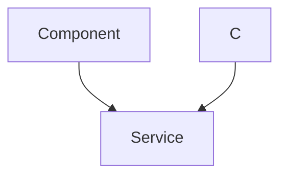
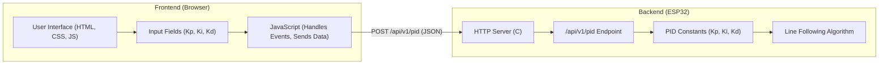

 # Line Following Frontend

This document details the user interface for the line following module, focusing on the frontend web page and the backend HTTP server that allows for real-time PID (Proportional-Integral-Derivative) tuning. The interface enables users to adjust PID constants to optimize the line following performance of the robot.

## Overview

The line following frontend is a simple HTML page that provides input fields for adjusting the Kp, Ki, and Kd values. These values are sent to the robot via HTTP POST requests to an API endpoint. The backend, implemented in C, handles these requests, updates the PID constants, and applies them to the line following algorithm.

## Frontend Structure (index.html)

The frontend is built using HTML, CSS, and JavaScript. It provides a user-friendly interface for tuning the PID constants.

```html title="6_line_following/frontend/index.html"
<!DOCTYPE html>
<html lang="en">
	<head>
		<meta charset="UTF-8" />
		<meta name="viewport" content="width=device-width, initial-scale=1.0" />
		<title>Tuning page</title>
		<style>
			/* CSS styles for the page */
		</style>
	</head>
	<body>
		<main>
			<h1>Line Following</h1>
			<div class="button-group">
				<h3>Kp</h3>
				<button>&lt;</button>
				<input type="number" value="0.000" id="kp" />
				<button>&gt;</button>
			</div>
			<div class="button-group">
				<h3>Ki</h3>
				<button>&lt;</button>
				<input type="number" value="0.000" id="ki" />
				<button>&gt;</button>
			</div>
			<div class="button-group">
				<h3>Kd</h3>
				<button>&lt;</button>
				<input type="number" value="0.000" id="kd" />
				<button>&gt;</button>
			</div>
		</main>
		<script>
			// JavaScript for handling input and sending data
		</script>
	</body>
</html>
```

The HTML structure includes input fields for Kp, Ki, and Kd, along with increment and decrement buttons to easily adjust the values.  The CSS provides basic styling to make the interface readable and functional.  The JavaScript handles user input and sends the data to the backend server. [View on GitHub](https://github.com/SRA-VJTI/Wall-E/blob/main/6_line_following/frontend/index.html)

### Key Features:

-   **Input Fields:**  `<input type="number" value="0.000" id="kp" />` - These input fields allow users to enter and view the PID values.
-   **Increment/Decrement Buttons:** `<button>&lt;</button>` and `<button>&gt;</button>` - These buttons increment or decrement the PID values by 0.01, providing fine-grained control.
-   **Automatic Submission:** The `submitVals()` function is called whenever a value is changed or a button is clicked, ensuring that the backend receives the updated values in real-time.

## JavaScript Logic

The JavaScript code in `index.html` is responsible for handling user interactions and communicating with the backend server.

```javascript title="6_line_following/frontend/index.html"
<script>
    let inpArray = document.querySelectorAll("input[type='number']");
    function submitVals() {
        const data = {};
        data["kp"] = parseFloat(document.getElementById("kp").value);
        data["ki"] = parseFloat(document.getElementById("ki").value);
        data["kd"] = parseFloat(document.getElementById("kd").value);
        let finaldata = JSON.stringify(data);
        console.log(finaldata);

        let xhr = new XMLHttpRequest();

        // Vedant!
        let url = "/api/v1/pid";

        // open a connection
        xhr.open("POST", url, true);

        // Set the request header i.e. which type of content you are sending
        xhr.setRequestHeader("Content-Type", "application/json");
        // Create a state change callback
        xhr.onreadystatechange = function () {
            if (xhr.readyState === 4) {
                if (xhr.status == 400) {
                    console.log("Success!");
                } else {
                    console.log(xhr.status);
                }
                // Print received data from server
            }
        };

        // Sending data with the request
        xhr.send(finaldata);
    }
    for (let i = 0; i < inpArray.length; i++) {
        inpArray[i].addEventListener("change", submitVals);
    }

    let decrementButtons = document.querySelectorAll(
        ".button-group button:first-of-type"
    );
    let incrementButtons = document.querySelectorAll(
        ".button-group button:last-of-type"
    );
    function decrementVal(e) {
        let test = e.target.parentNode.children[2].value;
        if (!isNaN(Number(test))) {
            e.target.parentNode.children[2].value = String(
                (Number(test) - 0.01).toFixed(3)
            );
            submitVals();
        } else {
            e.target.parentNode.children[2].value = "0.000";
        }
    }
    function incrementVal(e) {
        let test = e.target.parentNode.children[2].value;
        if (!isNaN(Number(test))) {
            e.target.parentNode.children[2].value = String(
                (Number(test) + 0.01).toFixed(3)
            );
            submitVals();
        } else {
            e.target.parentNode.children[2].value = "0.000";
        }
    }
    for (button of decrementButtons) {
        button.addEventListener("click", decrementVal);
    }
    for (button of incrementButtons) {
        button.addEventListener("click", incrementVal);
    }
</script>
```

### Key functions

*   **`submitVals()`:** This function collects the PID values from the input fields, converts them to floating-point numbers, and sends them to the `/api/v1/pid` endpoint using an XMLHttpRequest. The data is sent as a JSON string with `Content-Type` header set to `application/json`.
*   **`decrementVal(e)` and `incrementVal(e)`:** These functions handle the decrement and increment button clicks, respectively.  They update the corresponding input field's value by 0.01 and then call `submitVals()` to send the updated values to the backend.

## Backend HTTP Server (tuning_http_server.c & tuning_http_server.h)

The backend HTTP server, implemented in C, is responsible for receiving the PID values from the frontend and updating the PID constants used by the line following algorithm.

```c title="6_line_following/main/include/tuning_http_server.h"
#ifndef TUNING_HTTP_SERVER_H
#define TUNING_HTTP_SERVER_H

#include <string.h>
#include <fcntl.h>
#include "freertos/FreeRTOS.h"
#include "freertos/task.h"
#include "driver/gpio.h"
#include "esp_spiffs.h"
#include "nvs_flash.h"
#include "esp_netif.h"
#include "esp_event.h"
#include "esp_log.h"
#include "mdns.h"
#include "lwip/apps/netbiosns.h"
#include "esp_http_server.h"
#include "esp_system.h"
#include "esp_vfs.h"
#include "cJSON.h"
#include "sdkconfig.h"
#include "wifi_handler.h"

#define MDNS_INSTANCE "walle pid tuning web server"
#define MDNS_HOST_NAME CONFIG_MDNS_HOST_NAME
#define WEB_MOUNT_POINT "/www"
#define FILE_PATH_MAX (ESP_VFS_PATH_MAX + 128)
#define SCRATCH_BUFSIZE (10240)
#define CHECK_FILE_EXTENSION(filename, ext) (strcasecmp(&filename[strlen(filename) - strlen(ext)], ext) == 0)

typedef struct pid_const
{
    float kp;
    float ki;
    float kd;
    bool val_changed;
} pid_const_t;

pid_const_t read_pid_const();
void reset_val_changed_pid_const();
void start_tuning_http_server();

#endif
```

This header file defines the structure `pid_const_t` to hold the PID constants and a flag to indicate if the values have been changed.  It also declares the functions used to read, reset, and start the HTTP server. [View on GitHub](https://github.com/SRA-VJTI/Wall-E/blob/main/6_line_following/main/include/tuning_http_server.h)

```c title="6_line_following/main/tuning_http_server.c"
#include "tuning_http_server.h"

static const char *TAG = "tuning_http_server";
static char scratch[SCRATCH_BUFSIZE];
static pid_const_t pid_constants = {.kp = 0.9, .ki = 0, .kd = 6.5, .val_changed = true};

static void initialise_mdns(void)
{
    mdns_init();
    mdns_hostname_set(MDNS_HOST_NAME);
    mdns_instance_name_set(MDNS_INSTANCE);

    mdns_txt_item_t serviceTxtData[] = {
        {"board", "esp32"},
        {"path", "/"}
    };

    ESP_ERROR_CHECK(mdns_service_add("ESP32-WebServer", "_http", "_tcp", 80, serviceTxtData,
                                     sizeof(serviceTxtData) / sizeof(serviceTxtData[0])));
}

/* Set HTTP response content type according to file extension */
static esp_err_t set_content_type_from_file(httpd_req_t *req, const char *filepath)
{
    const char *type = "text/plain";
    if (CHECK_FILE_EXTENSION(filepath, ".html")) {
        type = "text/html";
    } else if (CHECK_FILE_EXTENSION(filepath, ".js")) {
        type = "application/javascript";
    } else if (CHECK_FILE_EXTENSION(filepath, ".css")) {
        type = "text/css";
    } else if (CHECK_FILE_EXTENSION(filepath, ".png")) {
        type = "image/png";
    } else if (CHECK_FILE_EXTENSION(filepath, ".ico")) {
        type = "image/x-icon";
    } else if (CHECK_FILE_EXTENSION(filepath, ".svg")) {
        type = "text/xml";
    }
    return httpd_resp_set_type(req, type);
}

/* Send HTTP response with the contents of the requested file */
static esp_err_t rest_common_get_handler(httpd_req_t *req)
{
    char filepath[FILE_PATH_MAX] = WEB_MOUNT_POINT;

   if (strlen(req->uri) > 0 && req->uri[strlen(req->uri) - 1] == '/') 
    {
        strlcat(filepath, "/index.html", sizeof(filepath));
    }
    else 
    {
        strlcat(filepath, req->uri, sizeof(filepath));
    }

    int fd = open(filepath, O_RDONLY, 0);
    if (fd == -1) {
        ESP_LOGE(TAG, "Failed to open file : %s", filepath);
        /* Respond with 500 Internal Server Error */
        httpd_resp_send_err(req, HTTPD_500_INTERNAL_SERVER_ERROR, "Failed to read existing file");
        return ESP_FAIL;
    }

    set_content_type_from_file(req, filepath);

    char *chunk = scratch;
    memset(scratch, '\0', SCRATCH_BUFSIZE);
    ssize_t read_bytes;
    do {
        /* Read file in chunks into the scratch buffer */
        read_bytes = read(fd, chunk, SCRATCH_BUFSIZE);
        if (read_bytes == -1) {
            ESP_LOGE(TAG, "Failed to read file : %s", filepath);
        } else if (read_bytes > 0) {
            /* Send the buffer contents as HTTP response chunk */
            if (httpd_resp_send_chunk(req, chunk, read_bytes) != ESP_OK) {
                close(fd);
                ESP_LOGE(TAG, "File sending failed!");
                /* Abort sending file */
                httpd_resp_sendstr_chunk(req, NULL);
                /* Respond with 500 Internal Server Error */
                httpd_resp_send_err(req, HTTPD_500_INTERNAL_SERVER_ERROR, "Failed to send file");
                return ESP_FAIL;
            }
        }
    } while (read_bytes > 0);
    /* Close file after sending complete */
    close(fd);
    ESP_LOGI(TAG, "File sending complete");
    /* Respond with an empty chunk to signal HTTP response completion */
    httpd_resp_send_chunk(req, NULL, 0);
    return ESP_OK;
}

/* Simple handler for Tuning PID */
static esp_err_t tuning_pid_post_handler(httpd_req_t *req)
{
    int total_len = req->content_len;
    int cur_len = 0;
    char *buf = scratch;
    memset(scratch, '\0', SCRATCH_BUFSIZE);
    int received = 0;
    if (total_len >= SCRATCH_BUFSIZE) {
        /* Respond with 500 Internal Server Error */
        httpd_resp_send_err(req, HTTPD_500_INTERNAL_SERVER_ERROR, "content too long");
        return ESP_FAIL;
    }
    while (cur_len < total_len) {
        received = httpd_req_recv(req, buf + cur_len, total_len);
        if (received <= 0) {
            /* Respond with 500 Internal Server Error */
            httpd_resp_send_err(req, HTTPD_500_INTERNAL_SERVER_ERROR, "Failed to post control value");
            return ESP_FAIL;
        }
        cur_len += received;
    }
    buf[total_len] = '\0';

    cJSON *root = cJSON_Parse(buf);
    if (root == NULL)
    {   
        ESP_LOGE(TAG, "invalid json response");
        return ESP_FAIL;
    }
    
    if (!cJSON_HasObjectItem(root, "kp") || !cJSON_HasObjectItem(root, "ki") || !cJSON_HasObjectItem(root, "kd"))
    {
        ESP_LOGE(TAG, "invalid json response");
        return ESP_FAIL;
    }
    
    pid_constants.kp = (float)cJSON_GetObjectItem(root, "kp")->valuedouble;
    pid_constants.ki = (float)cJSON_GetObjectItem(root, "ki")->valuedouble;
    pid_constants.kd = (float)cJSON_GetObjectItem(root, "kd")->valuedouble;

    cJSON_Delete(root);
    httpd_resp_sendstr(req, "Post control value successfully");

    pid_constants.val_changed = true;
    return ESP_OK;
}

static esp_err_t start_tuning_http_server_private()
{
    httpd_handle_t server = NULL;
    httpd_config_t config = HTTPD_DEFAULT_CONFIG();
    config.uri_match_fn = httpd_uri_match_wildcard;

    ESP_LOGI(TAG, "Starting HTTP Server");
    if (httpd_start(&server, &config) != ESP_OK)
    {
        ESP_LOGE(TAG, "start server failed");
        return ESP_FAIL;
    }
    
    httpd_uri_t tuning_pid_post_uri = {
        .uri = "/api/v1/pid",
        .method = HTTP_POST,
        .handler = tuning_pid_post_handler,
        .user_ctx = NULL
    };
    if (httpd_register_uri_handler(server, &tuning_pid_post_uri) != ESP_OK)
    {
        ESP_LOGE(TAG, "register post uri failed");
        return ESP_FAIL;
    }

    httpd_uri_t common_get_uri = {
        .uri = "/*",
        .method = HTTP_GET,
        .handler = rest_common_get_handler,
        .user_ctx = NULL
    };
    if(httpd_register_uri_handler(server, &common_get_uri) != ESP_OK)
    {
        ESP_LOGE(TAG, "register get uri failed");
        return ESP_FAIL;
    }

    return ESP_OK;
}

pid_const_t read_pid_const()
{
    return pid_constants;
}

void reset_val_changed_pid_const()
{
    pid_constants.val_changed = false;
}

void start_tuning_http_server()
{
    ESP_ERROR_CHECK(nvs_flash_init());
    ESP_ERROR_CHECK(esp_netif_init());
    ESP_ERROR_CHECK(esp_event_loop_create_default());
    initialise_mdns();
    netbiosns_init();
    netbiosns_set_name(MDNS_HOST_NAME);

    connect_to_wifi();
    ESP_ERROR_CHECK(init_fs());
    ESP_ERROR_CHECK(start_tuning_http_server_private());
    
    vTaskDelete(NULL);
}
```

### Key Components:

*   **`pid_const_t` Structure:** Holds the Kp, Ki, and Kd values and a flag indicating whether the values have been changed.
*   **`tuning_pid_post_handler()`:**  This function handles the HTTP POST requests to the `/api/v1/pid` endpoint. It parses the JSON data from the request body, updates the `pid_constants` structure, and sets the `val_changed` flag to `true`.
*   **`start_tuning_http_server_private()`:**  This function initializes and starts the HTTP server, registering the `/api/v1/pid` endpoint with the `tuning_pid_post_handler`. It also sets up a default handler to serve static files from the `/www` directory using the `rest_common_get_handler`.
*   **`rest_common_get_handler()`:** This function handles HTTP GET requests for static files. It determines the content type based on the file extension and sends the file contents as the HTTP response.

## Data Flow

The following diagram illustrates the data flow between the frontend and backend:





## Initializing the File System

The `init_fs()` function initializes the SPIFFS (SPI Flash File System) to serve the frontend files.

```c title="6_line_following/main/tuning_http_server.c"
static esp_err_t init_fs(void)
{
    esp_vfs_spiffs_conf_t conf = {
        .base_path = WEB_MOUNT_POINT,
        .partition_label = NULL,
        .max_files = 5,
        .format_if_mount_failed = false
    };
    esp_err_t ret = esp_vfs_spiffs_register(&conf);

    if (ret != ESP_OK) {
        if (ret == ESP_FAIL) {
            ESP_LOGE(TAG, "Failed to mount or format filesystem");
        } else if (ret == ESP_ERR_NOT_FOUND) {
            ESP_LOGE(TAG, "Failed to find SPIFFS partition");
        } else {
            ESP_LOGE(TAG, "Failed to initialize SPIFFS (%s)", esp_err_to_name(ret));
        }
        return ESP_FAIL;
    }

    size_t total = 0, used = 0;
    ret = esp_spiffs_info(NULL, &total, &used);
    if (ret != ESP_OK) {
        ESP_LOGE(TAG, "Failed to get SPIFFS partition information (%s)", esp_err_to_name(ret));
    } else {
        ESP_LOGI(TAG, "Partition size: total: %d, used: %d", total, used);
    }
    return ESP_OK;
}
```

This function configures and registers the SPIFFS, which allows the web server to serve the HTML, CSS, and JavaScript files required for the frontend.

## Key Integration Points

-   **HTTP Server and File System:** The HTTP server serves the frontend files directly from the SPIFFS partition. This eliminates the need for a separate file server and simplifies the deployment process.
-   **JSON Parsing:** The `cJSON` library is used to parse the JSON data received from the frontend. This allows the backend to easily extract the PID values and update the PID constants.
-   **Real-time Tuning:**  The frontend and backend work together to provide real-time PID tuning. Changes made on the frontend are immediately sent to the backend, allowing users to quickly iterate and optimize the line following performance.


