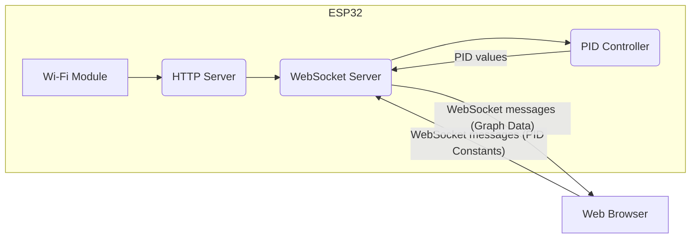
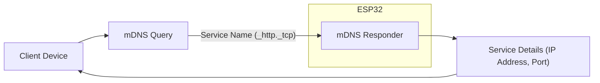

---
title: "Self-Balancing - WebSocket Server"
description: "Explains the websocket server used for tuning the self-balancing system."
---

# Self-Balancing - WebSocket Server

This document details the WebSocket server implementation used in the Wall-E project for tuning the self-balancing system. The server facilitates real-time communication between a client (typically a web browser) and the ESP32 microcontroller, allowing users to adjust PID constants and visualize data for optimal balancing performance.

## Overview

The self-balancing system relies on PID control to maintain stability. Tuning the PID constants (Kp, Ki, Kd) is crucial for achieving the desired response. The WebSocket server provides a convenient interface for modifying these constants and observing the system's behavior in real-time.

## Key Components

- **`tuning_websocket_server.h`**: Header file declaring the functions and data structures related to the WebSocket server.
- **`tuning_websocket_server.c`**: Source file implementing the WebSocket server logic.
- **`wifi_handler.c`**: Source file responsible for establishing a Wi-Fi connection.

## Functionality

1.  **Wi-Fi Connectivity**: Establishes a Wi-Fi connection using the provided SSID and password.
2.  **WebSocket Communication**: Implements a WebSocket server for real-time bidirectional communication.
3.  **PID Constant Adjustment**: Allows users to modify PID constants (Kp, Ki, Kd, setpoint, offset) via WebSocket messages.
4.  **Data Visualization**: Sends real-time data (p\_term, d\_term, i\_term, pitch\_corr, pitch\_err) to the client for visualization.
5.  **HTTP Server**: Serves a basic HTML page (index.html) to facilitate WebSocket connection.
6.  **mDNS Service**: Provides a mDNS service to discover the Wall-E on the network using the name `CONFIG_MDNS_HOST_NAME`.

## Code Snippets and Explanation

### 1. PID Constants Structure

```c
typedef struct pid_const
{
    float kp;
    float ki;
    float kd;
    float setpoint;
    float offset;
    bool val_changed;
} pid_const_t;
```

This structure, defined in `tuning_websocket_server.h`, holds the PID constants and a flag to indicate whether the values have been changed. The `val_changed` flag is used to optimize the PID control loop by only updating the constants when necessary. [View on GitHub](https://github.com/SRA-VJTI/Wall-E/blob/master/7_self_balancing/main/include/tuning_websocket_server.h)

### 2. WebSocket Callback Function

```c
void websocket_callback(uint8_t num, WEBSOCKET_TYPE_t type, char *msg, uint64_t len)
{
    switch (type)
    {
    case WEBSOCKET_CONNECT:
        ESP_LOGI(TAG, "client %i connected!", num);
        break;
    case WEBSOCKET_TEXT:
        if (len)
        { // if the message length was greater than zero
            pid_constants.val_changed = true;

            switch (msg[0])
            {
            case 'P':
                ESP_LOGI(TAG, "got message length %i: %s", (int)len - 1, &(msg[1]));
                pid_constants.kp = atof(&msg[1]);
                break;
            // ... other cases for D, I, S, O
            default:
                ESP_LOGI(TAG, "got an unknown message with length %i", (int)len);
                break;
            }
        }
        break;
    // ... other cases
    }
}
```

This function, in `tuning_websocket_server.c`, handles incoming WebSocket messages. It parses the messages to update the PID constants.  The message format is a single character identifying the constant ('P' for Kp, 'I' for Ki, 'D' for Kd, 'S' for setpoint, 'O' for offset) followed by the new value.  The `atof()` function converts the string representation of the value to a floating-point number. [View on GitHub](https://github.com/SRA-VJTI/Wall-E/blob/master/7_self_balancing/main/tuning_websocket_server.c)

### 3. Plot Graph Function

```c
void plot_graph(float p_term, float d_term, float i_term, float pitch_corr, float pitch_err)
{
    char out[100];
    int len;

    char n0_buf[20];
    char n1_buf[20];
    char n2_buf[20];
    char n3_buf[20];
    char n4_buf[20];

    sprintf(n0_buf, "%.1f", p_term);
    sprintf(n1_buf, "%.1f", d_term);
    sprintf(n2_buf, "%.1f", i_term);
    sprintf(n3_buf, "%.1f", pitch_corr);
    sprintf(n4_buf, "%.1f", pitch_err);

    char n[100];

    n[0] = '\0';
    strcat(n, n0_buf);
    strcat(n, ",");
    strcat(n, n1_buf);
    strcat(n, ",");
    strcat(n, n2_buf);
    strcat(n, ",");
    strcat(n, n3_buf);
    strcat(n, ",");
    strcat(n, n4_buf);
    sprintf(out, "%s", n);
    len = strlen(n);
    ws_server_send_text_all(n, len);
}
```

This function, in `tuning_websocket_server.c`, formats the data to be plotted (p\_term, d\_term, i\_term, pitch\_corr, pitch\_err) into a comma-separated string and sends it to all connected WebSocket clients. The data is formatted to one decimal place using `sprintf`. [View on GitHub](https://github.com/SRA-VJTI/Wall-E/blob/master/7_self_balancing/main/tuning_websocket_server.c)

### 4. Wi-Fi Initialization

```c
void wifi_init_sta(void)
{
    s_wifi_event_group = xEventGroupCreate();

    ESP_ERROR_CHECK(esp_netif_init());

    esp_netif_create_default_wifi_sta();

    wifi_init_config_t cfg = WIFI_INIT_CONFIG_DEFAULT();
    ESP_ERROR_CHECK(esp_wifi_init(&cfg));

    // ... event handlers and configuration

    ESP_ERROR_CHECK(esp_wifi_set_mode(WIFI_MODE_STA) );
    ESP_ERROR_CHECK(esp_wifi_set_config(ESP_IF_WIFI_STA, &wifi_config) );
    ESP_ERROR_CHECK(esp_wifi_start() );

    // ... connection and error handling
}
```

This function, in `wifi_handler.c`, initializes the Wi-Fi interface in station mode.  It creates an event group to manage connection events, initializes the network interface, sets the Wi-Fi mode to station, configures the Wi-Fi settings (SSID and password), and starts the Wi-Fi driver. [View on GitHub](https://github.com/SRA-VJTI/Wall-E/blob/master/7_self_balancing/main/wifi_handler.c)

### 5. Starting the WebSocket Server

```c
void start_websocket_server()
{
    ESP_ERROR_CHECK(nvs_flash_init());
    ESP_ERROR_CHECK(esp_netif_init());
    ESP_ERROR_CHECK(esp_event_loop_create_default());
    initialise_mdns();
    netbiosns_init();
    netbiosns_set_name(MDNS_HOST_NAME);

    connect_to_wifi();

    // ESP_ERROR_CHECK(init_fs());
    ws_server_start();
    xTaskCreatePinnedToCore(&server_task, "server_task", 3000, NULL, 4, NULL, 1);
    xTaskCreatePinnedToCore(&server_handle_task, "server_handle_task", 4000, NULL, 3, NULL, 1);
}
```

This function, found in `tuning_websocket_server.c`, is the entry point for starting the WebSocket server. It initializes the Non-Volatile Storage (NVS), network interface, event loop, mDNS service, connects to Wi-Fi, starts the WebSocket server, and creates two FreeRTOS tasks: `server_task` and `server_handle_task`. The `server_task` listens for incoming client connections, and `server_handle_task` handles the HTTP requests and WebSocket connections. [View on GitHub](https://github.com/SRA-VJTI/Wall-E/blob/master/7_self_balancing/main/tuning_websocket_server.c)

### 6. HTTP Server Task

```c
static void server_task(void *pvParameters)
{
    // const static char *TAG = "server_task";
    struct netconn *conn, *newconn;
    static err_t err;
    client_queue = xQueueCreate(client_queue_size, sizeof(struct netconn *));

    conn = netconn_new(NETCONN_TCP);
    netconn_bind(conn, NULL, 80);
    netconn_listen(conn);
    ESP_LOGI(TAG, "server listening");
    do
    {
        err = netconn_accept(conn, &newconn);
        ESP_LOGI(TAG, "new client");
        if (err == ERR_OK)
        {
            xQueueSendToBack(client_queue, &newconn, portMAX_DELAY);
            // http_serve(newconn);
        }
        vTaskDelay(10);
    } while (err == ERR_OK);
    netconn_close(conn);
    netconn_delete(conn);
    ESP_LOGE(TAG, "task ending, rebooting board");
    esp_restart();
}
```

This FreeRTOS task, `server_task` in `tuning_websocket_server.c`, is responsible for accepting new client connections to the HTTP server. It creates a TCP connection, binds it to port 80, listens for incoming connections, and adds the new connections to a queue for processing by the `server_handle_task`. [View on GitHub](https://github.com/SRA-VJTI/Wall-E/blob/master/7_self_balancing/main/tuning_websocket_server.c)

## Data Flow Diagram





This diagram illustrates the data flow within the self-balancing system. The web browser sends PID constants to the WebSocket server, which then updates the PID controller. The PID controller calculates the necessary adjustments and sends data back to the WebSocket server for visualization in the web browser.

## mDNS Service Discovery





This diagram shows how mDNS is used to discover the ESP32's IP address and port number. The client device sends an mDNS query for the service name "_http._tcp". The ESP32's mDNS responder answers the query with the ESP32's IP address and port number, allowing the client to connect to the HTTP server.

## Key Integration Points

-   The `websocket_callback` function is the central point for handling WebSocket messages and updating the PID constants.
-   The `plot_graph` function formats and sends the data needed for real-time visualization of the PID controller's performance.
-   The Wi-Fi connection is established using the `wifi_init_sta` function, ensuring reliable communication.
-   The FreeRTOS tasks allow for concurrent handling of HTTP requests and WebSocket connections, improving responsiveness.

## Best Practices

-   **Error Handling**: Implement robust error handling to gracefully handle unexpected events, such as Wi-Fi disconnections or invalid WebSocket messages.
-   **Data Validation**: Validate incoming WebSocket messages to prevent invalid data from being used in the PID controller.
-   **Security**: Implement security measures, such as authentication and encryption, to protect the WebSocket connection from unauthorized access.
-   **Configuration**: Use a configuration file or environment variables to store sensitive information, such as Wi-Fi credentials.
-   **Code Readability**: Write clean, well-documented code to improve maintainability.
-   **Resource Management**: Properly manage memory and other resources to prevent memory leaks or other issues.
```