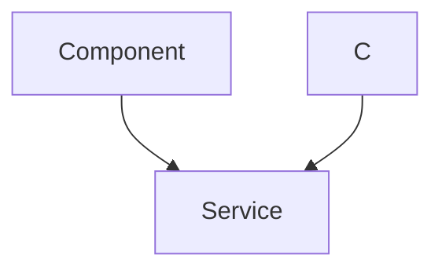
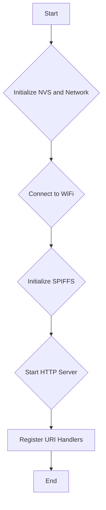

 # Line Following - Web Interface

This document describes the web interface used for tuning the PID controller of the line following module in the Wall-E robot. The interface allows users to adjust the Proportional (Kp), Integral (Ki), and Derivative (Kd) constants and observe the robot's behavior in real-time.

## Overview

The web interface is built using HTML, CSS, and JavaScript and is served by an embedded HTTP server running on the ESP32. The interface provides input fields for each PID constant, along with increment and decrement buttons to fine-tune the values. Changes made through the interface are sent to the ESP32 via HTTP POST requests, updating the PID controller's parameters.

## Frontend (HTML, CSS, JavaScript)

The frontend code is located in the [6_line_following/frontend/index.html](https://github.com/SRA-VJTI/Wall-E/blob/main/6_line_following/frontend/index.html) file. It consists of the following key components:

-   **HTML Structure:** Defines the layout of the web page, including input fields for Kp, Ki, and Kd values, as well as buttons for incrementing and decrementing these values.
-   **CSS Styling:** Styles the web page to provide a user-friendly interface.
-   **JavaScript Logic:** Handles user interactions, such as button clicks and input changes, and sends HTTP POST requests to the ESP32 to update the PID constants.

Here's a snippet of the HTML code that defines the input fields for the PID constants:

```html
<div class="button-group">
    <h3>Kp</h3>
    <button>&lt;</button>
    <input type="number" value="0.000" id="kp" />
    <button>&gt;</button>
</div>
```

[View on GitHub](https://github.com/SRA-VJTI/Wall-E/blob/main/6_line_following/frontend/index.html#L68-L72)

This snippet creates a group of elements for adjusting the Kp value. It includes a label ("Kp"), a decrement button ("<"), an input field for the numerical value, and an increment button (">"). Similar structures are used for Ki and Kd.

The JavaScript code handles the submission of PID values to the server. Here is the submitVals() function:

```javascript
function submitVals() {
    const data = {};
    data["kp"] = parseFloat(document.getElementById("kp").value);
    data["ki"] = parseFloat(document.getElementById("ki").value);
    data["kd"] = parseFloat(document.getElementById("kd").value);
    let finaldata = JSON.stringify(data);
    console.log(finaldata);

    let xhr = new XMLHttpRequest();

    let url = "/api/v1/pid";

    xhr.open("POST", url, true);
    xhr.setRequestHeader("Content-Type", "application/json");
    xhr.onreadystatechange = function () {
        if (xhr.readyState === 4) {
            if (xhr.status == 400) {
                console.log("Success!");
            } else {
                console.log(xhr.status);
            }
        }
    };

    xhr.send(finaldata);
}
```

[View on GitHub](https://github.com/SRA-VJTI/Wall-E/blob/main/6_line_following/frontend/index.html#L123-L152)

This function retrieves the values from the input fields, packages them into a JSON object, and sends it to the `/api/v1/pid` endpoint on the ESP32 using an HTTP POST request.

The JavaScript code also includes functions to increment and decrement the PID values when the corresponding buttons are clicked. For example:

```javascript
function decrementVal(e) {
    let test = e.target.parentNode.children[2].value;
    if (!isNaN(Number(test))) {
        e.target.parentNode.children[2].value = String(
            (Number(test) - 0.01).toFixed(3)
        );
        submitVals();
    } else {
        e.target.parentNode.children[2].value = "0.000";
    }
}
```

[View on GitHub](https://github.com/SRA-VJTI/Wall-E/blob/main/6_line_following/frontend/index.html#L163-L173)

This function decrements the value in the input field by 0.01, ensuring that the value remains a valid number. The `submitVals()` function is then called to send the updated value to the ESP32.

## Backend (C - ESP32)

The backend code, responsible for serving the web interface and handling the PID constant updates, is located in the [6_line_following/main/tuning_http_server.c](https://github.com/SRA-VJTI/Wall-E/blob/main/6_line_following/main/tuning_http_server.c) file.

The core functionality of the backend includes:

-   **Initialization of SPIFFS:** Initializes the SPIFFS (SPI Flash File System) to store the HTML, CSS, and JavaScript files for the web interface.
-   **HTTP Server Setup:** Creates an HTTP server to handle incoming requests.
-   **Request Handlers:** Defines handlers for serving static files and updating the PID constants.

Here's a snippet of the code that initializes the SPIFFS:

```c
static esp_err_t init_fs(void)
{
    esp_vfs_spiffs_conf_t conf = {
        .base_path = WEB_MOUNT_POINT,
        .partition_label = NULL,
        .max_files = 5,
        .format_if_mount_failed = false
    };
    esp_err_t ret = esp_vfs_spiffs_register(&conf);

    if (ret != ESP_OK) {
        if (ret == ESP_FAIL) {
            ESP_LOGE(TAG, "Failed to mount or format filesystem");
        } else if (ret == ESP_ERR_NOT_FOUND) {
            ESP_LOGE(TAG, "Failed to find SPIFFS partition");
        } else {
            ESP_LOGE(TAG, "Failed to initialize SPIFFS (%s)", esp_err_to_name(ret));
        }
        return ESP_FAIL;
    }

    size_t total = 0, used = 0;
    ret = esp_spiffs_info(NULL, &total, &used);
    if (ret != ESP_OK) {
        ESP_LOGE(TAG, "Failed to get SPIFFS partition information (%s)", esp_err_to_name(ret));
    } else {
        ESP_LOGI(TAG, "Partition size: total: %d, used: %d", total, used);
    }
    return ESP_OK;
}
```

[View on GitHub](https://github.com/SRA-VJTI/Wall-E/blob/main/6_line_following/main/tuning_http_server.c#L52-L83)

This function configures and mounts the SPIFFS partition, allowing the ESP32 to access the files stored in flash memory.

The `tuning_pid_post_handler` function handles the HTTP POST requests sent by the frontend when the PID constants are updated.

```c
static esp_err_t tuning_pid_post_handler(httpd_req_t *req)
{
    int total_len = req->content_len;
    int cur_len = 0;
    char *buf = scratch;
    memset(scratch, '\0', SCRATCH_BUFSIZE);
    int received = 0;
    if (total_len >= SCRATCH_BUFSIZE) {
        httpd_resp_send_err(req, HTTPD_500_INTERNAL_SERVER_ERROR, "content too long");
        return ESP_FAIL;
    }
    while (cur_len < total_len) {
        received = httpd_req_recv(req, buf + cur_len, total_len);
        if (received <= 0) {
            httpd_resp_send_err(req, HTTPD_500_INTERNAL_SERVER_ERROR, "Failed to post control value");
            return ESP_FAIL;
        }
        cur_len += received;
    }
    buf[total_len] = '\0';

    cJSON *root = cJSON_Parse(buf);
    if (root == NULL)
    {   
        ESP_LOGE(TAG, "invalid json response");
        return ESP_FAIL;
    }
    
    if (!cJSON_HasObjectItem(root, "kp") || !cJSON_HasObjectItem(root, "ki") || !cJSON_HasObjectItem(root, "kd"))
    {
        ESP_LOGE(TAG, "invalid json response");
        return ESP_FAIL;
    }
    
    pid_constants.kp = (float)cJSON_GetObjectItem(root, "kp")->valuedouble;
    pid_constants.ki = (float)cJSON_GetObjectItem(root, "ki")->valuedouble;
    pid_constants.kd = (float)cJSON_GetObjectItem(root, "kd")->valuedouble;

    cJSON_Delete(root);
    httpd_resp_sendstr(req, "Post control value successfully");

    pid_constants.val_changed = true;
    return ESP_OK;
}
```

[View on GitHub](https://github.com/SRA-VJTI/Wall-E/blob/main/6_line_following/main/tuning_http_server.c#L150-L206)

This function receives the JSON payload containing the updated PID constants, parses it using the `cJSON` library, and updates the `pid_constants` structure with the new values. The `val_changed` flag is set to true, indicating that the PID constants have been modified.

## Interaction Flow





## Key Integration Points

-   The web interface communicates with the ESP32 using HTTP POST requests to the `/api/v1/pid` endpoint.
-   The ESP32 uses the `cJSON` library to parse the JSON payload received from the web interface.
-   The updated PID constants are stored in the `pid_constants` structure and are used by the line following module.
-   The `val_changed` flag is used to signal the line following module that the PID constants have been updated.
-   SPIFFS is initialized for serving static web files (HTML, CSS, JS).

## Recommendations

-   Implement input validation on the frontend to ensure that the PID constants are within a valid range.
-   Add error handling to the backend to handle invalid JSON payloads or other unexpected errors.
-   Consider using WebSockets for real-time communication between the frontend and backend, allowing for more responsive updates and feedback.

## Tuning HTTP Server Header File

The [6_line_following/main/include/tuning_http_server.h](https://github.com/SRA-VJTI/Wall-E/blob/main/6_line_following/main/include/tuning_http_server.h) file contains the declarations for the functions and data structures used by the tuning HTTP server. It defines the `pid_const_t` structure, which holds the PID constants and a flag to indicate whether the values have changed:

```c
typedef struct pid_const
{
    float kp;
    float ki;
    float kd;
    bool val_changed;
} pid_const_t;
```

[View on GitHub](https://github.com/SRA-VJTI/Wall-E/blob/main/6_line_following/main/include/tuning_http_server.h#L31-L37)

It also declares the functions used to read the PID constants, reset the `val_changed` flag, and start the tuning HTTP server:

```c
pid_const_t read_pid_const();
void reset_val_changed_pid_const();
void start_tuning_http_server();
```

[View on GitHub](https://github.com/SRA-VJTI/Wall-E/blob/main/6_line_following/main/include/tuning_http_server.h#L40-L42)

## Flowchart of Server Initialization


