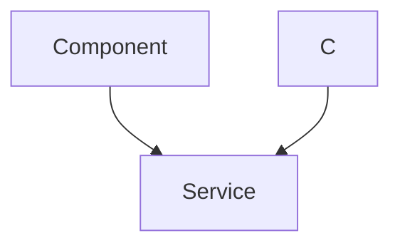

 # Self Balancing: Frontend

The frontend for the self-balancing module is designed to provide real-time data visualization and control over the PID parameters. This section details the `index.html` file, which is the core of the frontend implementation.

## Overview

The `index.html` file serves as the user interface for monitoring and tuning the self-balancing mechanism. It leverages HTML, CSS, JavaScript, and external libraries like Bootstrap and Chart.js to create an interactive dashboard. The key features include:

*   Real-time data visualization of sensor data (acceleration, orientation).
*   Interactive controls for adjusting PID parameters (Kp, Ki, Kd, Setpoint, Offset).
*   WebSocket communication for receiving data from the backend (MicroPython on ESP32).

## Key Components

### HTML Structure

The HTML structure defines the layout of the dashboard, including sections for charts, input forms, and labels.

*   **Header:** Includes links to Bootstrap CSS for styling, Google Fonts for typography, and jQuery and Chart.js for data visualization.
*   **Charts:** Uses `<canvas>` elements to display real-time data using Chart.js. There are charts for X, Y, and Z acceleration, as well as Roll and Pitch.
*   **Input Forms:** Contains input fields and buttons for adjusting PID parameters (Kp, Ki, Kd, Setpoint, Offset). Each input field has an associated "Send" button that triggers a WebSocket message to the backend.

### CSS Styling

The CSS styling is primarily handled inline within the `<style>` tags. It uses a combination of Bootstrap classes and custom styles to achieve the desired look and feel of the dashboard. Key aspects include:

*   Font selection using Google Fonts (Oswald).
*   Color theming (dark background, white text).
*   Layout using flexbox to arrange the chart and input elements.
*   Custom styling for input fields and buttons.

### JavaScript Functionality

The JavaScript code handles the WebSocket communication, data processing, and chart updates.

*   **WebSocket Initialization:** Establishes a WebSocket connection to the backend server running on the ESP32.
    ```javascript
    var websocket = new WebSocket("ws://" + location.hostname + "/");
    ```
    [View on GitHub](https://github.com/SRA-VJTI/Wall-E/blob/main/7_self_balancing/frontend/index.html#L18)
*   **Data Sending Functions:** Functions to send PID parameter values to the backend via WebSocket messages.
    ```javascript
    function send_Text_kp(text) {
      websocket.send("P" + text);
    }
    ```
    [View on GitHub](https://github.com/SRA-VJTI/Wall-E/blob/main/7_self_balancing/frontend/index.html#L21)
*   **Chart Initialization:** Sets up the Chart.js instances for each of the data visualizations (acceleration, orientation). Configures chart options such as axes, titles, and tooltips.
    ```javascript
        var xAccelChartInstance = new Chart(xAccelChart, {
            type: "line",
            data: {
              datasets: [
                {
                  label: "X Acceleration",
                  fill: false,
                  borderColor: "#FFF",
                  borderWidth: 2,
                  fontColor: "#FFF",
                },
              ],
            },
            options: Object.assign({}, commonOptions, {
              title: {
                display: true,
                text: "P-TERM",
                fontSize: 18,
                fontFamily: "Oswald",
                fontColor: "#FFF",
              },
              elements: {
                point: {
                  radius: 0,
                },
              },
            }),
            scales: {
              xAxes: [
                {
                  type: "time",
                  time: {
                    displayFormats: {
                      millisecond: "S",
                    },
                  },
                  gridLines: { color: "#FFF" },
                },
              ],
              yAxes: [
                {
                  ticks: {
                    suggestedMin: -50, // minimum will be 0, unless there is a lower value.
                    suggestedMax: 50, // maximum will be
                  },
                  gridLines: { color: "#FFF" },
                },
              ],
            },
            legend: { display: false },
            tooltips: {
              enabled: false,
            },
          });
    ```
    [View on GitHub](https://github.com/SRA-VJTI/Wall-E/blob/main/7_self_balancing/frontend/index.html#L60)
*   **Data Handling:** Processes incoming data from the WebSocket, parses it, and updates the chart datasets.
    ```javascript
    function addData(data) {
        console.log(data);
        var new_data = data
          .split(",")
          .filter((x) => x.trim().length && !isNaN(x))
          .map(Number);
    ```
    [View on GitHub](https://github.com/SRA-VJTI/Wall-E/blob/main/7_self_balancing/frontend/index.html#L190)
*   **Event Listeners:** Adds event listeners to the input fields to enable the "Enter" key to trigger the "Send" button clicks, improving user interaction.
    ```javascript
    document.querySelectorAll('input[name="ftext"]').forEach((input, index) => {
        input.addEventListener('keydown', function (event) {
          if (event.key === 'Enter') {
            event.preventDefault();  // Prevent form submission
            document.querySelectorAll('button')[index].click();
          }
        });
      });
    ```
    [View on GitHub](https://github.com/SRA-VJTI/Wall-E/blob/main/7_self_balancing/frontend/index.html#L274)

### WebSocket Communication

The frontend establishes a WebSocket connection to the backend (MicroPython on ESP32) to receive real-time data and send control commands. The WebSocket messages are formatted as follows:

*   **Incoming Data:** The backend sends comma-separated values representing sensor data (acceleration, orientation) which is then parsed and displayed on the charts.
*   **Outgoing Data:** The frontend sends commands to the backend prefixed with a character indicating the parameter to be set, followed by the value.

    *   `P` : Kp
    *   `I` : Ki
    *   `D` : Kd
    *   `S` : Setpoint
    *   `O` : Offset

## Data Flow

The following sequence diagram illustrates the data flow between the frontend, backend (ESP32), and the self-balancing mechanism.





## Insights and Best Practices

*   **Real-time Data Visualization:** The use of Chart.js provides an effective way to visualize real-time sensor data, enabling users to monitor the performance of the self-balancing system.
*   **Interactive Control:** The input forms and WebSocket communication allow for dynamic tuning of PID parameters, crucial for optimizing the self-balancing behavior.
*   **Modular Design:** The separation of concerns (HTML for structure, CSS for styling, and JavaScript for functionality) makes the code more organized and maintainable.
*   **Error Handling:** The `ws.onerror` function handles WebSocket errors, which helps in debugging and ensures the application's robustness.
*   **User Experience:** The use of Bootstrap and Google Fonts improves the overall user experience by providing a clean and visually appealing interface.

## Key Integration Points

*   **WebSocket Connection:** This is the core of the real-time data exchange. The frontend must be able to establish and maintain a WebSocket connection to the backend running on the ESP32.
*   **Data Parsing:** The frontend needs to correctly parse the comma-separated data received from the backend to update the charts.
*   **PID Parameter Control:** The frontend's ability to send and receive PID parameters via the WebSocket connection is critical for tuning the system's performance.
*   **Chart Updates:** The charts must be updated efficiently with the incoming data to provide a smooth and responsive user experience.