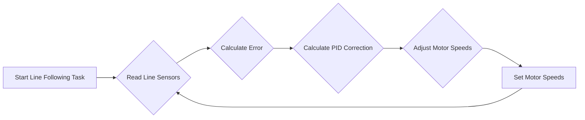
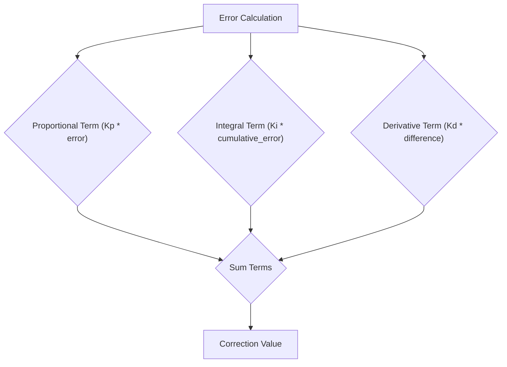

 # Line Following System

This document details the line following system implemented in the Wall-E robot project. The system utilizes a PID control loop and a 5-sensor line sensor array to enable the robot to autonomously follow a black line on a white surface.

## Components

*   **Line Sensor Array:** A 5-sensor array that provides analog readings based on the surface reflectance.
*   **Motors:** Two DC motors that drive the robot's wheels, controlled independently for steering.
*   **PID Controller:** A proportional-integral-derivative (PID) controller that adjusts motor speeds based on the error between the robot's current position and the desired line position.
*   **Microcontroller (ESP32):** Processes sensor data, calculates PID corrections, and controls the motors.

## Theory of Operation

The line following system relies on feedback control to maintain the robot's position on the line. The line sensor array detects the line, and the PID controller calculates the necessary corrections to the motor speeds.

### PID Control

The PID controller consists of three terms:

*   **Proportional (Kp):** Responds to the current error.
*   **Integral (Ki):** Accumulates past errors to eliminate steady-state error.
*   **Derivative (Kd):** Predicts future error based on the rate of change of the current error.

The PID controller calculates a correction value that is applied to the motor speeds to steer the robot back onto the line.

### Algorithm

1.  Read the line sensor array values.
2.  Calculate the error, which is the deviation from the center of the line.
3.  Calculate the PID correction.
4.  Adjust the motor speeds based on the correction.
5.  Repeat.

## Key Functions

*   `calculate_error()`: [View on GitHub](https://github.com/SRA-VJTI/Wall-E/blob/main/6_line_following/main/line_following.c#L73-L119)
    ```c
    void calculate_error()
    {
        int all_black_flag = 1; // assuming initially all black condition
        float weighted_sum = 0, sum = 0; 
        float pos = 0; int k = 0;

        for(int i = 0; i < 5; i++)
        {
            if(line_sensor_readings.adc_reading[i] > BLACK_BOUNDARY)
            {
                all_black_flag = 0;
            }
            if(line_sensor_readings.adc_reading[i] > BLACK_BOUNDARY)
            {
                k = 1;
            }
            if(line_sensor_readings.adc_reading[i] < BLACK_BOUNDARY)
            {
                k = 0;
            }
            weighted_sum += (float)(weights[i]) * k;
            sum = sum + k;
        }

        if(sum != 0) // sum can never be 0 but just for safety purposes
        {
            pos = (weighted_sum - 1) / sum; // This will give us the position wrt line. if +ve then bot is facing left and if -ve the bot is facing to right.
        }

        if(all_black_flag == 1)  // If all black then we check for previous error to assign current error.
        {
            if(prev_error > 0)
            {
                error = 2.5;
            }
            else
            {
                error = -2.5;
            }
        }
        else
        {
            error = pos;
        }
    }
    ```
    This function calculates the error based on the weighted average of the line sensor readings. The `all_black_flag` handles the case where all sensors detect black.

*   `calculate_correction()`: [View on GitHub](https://github.com/SRA-VJTI/Wall-E/blob/main/6_line_following/main/line_following.c#L58-L71)
    ```c
    void calculate_correction()
    {
        error = error*10;  // we need the error correction in range 0-100 so that we can send it directly as duty cycle paramete
        difference = error - prev_error;
        cumulative_error += error;

        cumulative_error = bound(cumulative_error, -30, 30);

        correction = read_pid_const().kp*error + read_pid_const().ki*cumulative_error + read_pid_const().kd*difference;
        prev_error = error;
    }
    ```
    This function calculates the PID correction value. It uses the current error, the previous error (for the derivative term), and the cumulative error (for the integral term).

*   `line_follow_task()`: [View on GitHub](https://github.com/SRA-VJTI/Wall-E/blob/main/6_line_following/main/line_following.c#L121-L186)
    ```c
    void line_follow_task(void* arg)
    {
        motor_handle_t motor_a_0, motor_a_1;
        ESP_ERROR_CHECK(enable_motor_driver(&motor_a_0, MOTOR_A_0));
        ESP_ERROR_CHECK(enable_motor_driver(&motor_a_1, MOTOR_A_1));
        adc_handle_t line_sensor;
        ESP_ERROR_CHECK(enable_line_sensor(&line_sensor));
        ESP_ERROR_CHECK(enable_bar_graph());
    #ifdef CONFIG_ENABLE_OLED
        // Initialising the OLED
        ESP_ERROR_CHECK(init_oled());
        vTaskDelay(100);

        // Clearing the screen
        lv_obj_clean(lv_scr_act());

    #endif

        while(true)
        {
            line_sensor_readings = read_line_sensor(line_sensor);
            for(int i = 0; i < 5; i++)
            {
                line_sensor_readings.adc_reading[i] = bound(line_sensor_readings.adc_reading[i], WHITE_MARGIN, BLACK_MARGIN);
                line_sensor_readings.adc_reading[i] = map(line_sensor_readings.adc_reading[i], WHITE_MARGIN, BLACK_MARGIN, bound_LSA_LOW, bound_LSA_HIGH);
                line_sensor_readings.adc_reading[i] = 1000 - (line_sensor_readings.adc_reading[i]);
            }

            calculate_error();
            calculate_correction();

            left_duty_cycle = bound((optimum_duty_cycle + correction), lower_duty_cycle, higher_duty_cycle);
            right_duty_cycle = bound((optimum_duty_cycle - correction), lower_duty_cycle, higher_duty_cycle);

            set_motor_speed(motor_a_0, MOTOR_FORWARD, left_duty_cycle);
            set_motor_speed(motor_a_1, MOTOR_FORWARD, right_duty_cycle);


            //ESP_LOGI("debug","left_duty_cycle:  %f    ::  right_duty_cycle :  %f  :: error :  %f  correction  :  %f  \n",left_duty_cycle, right_duty_cycle, error, correction);
            ESP_LOGI("debug", "KP: %f ::  KI: %f  :: KD: %f", read_pid_const().kp, read_pid_const().ki, read_pid_const().kd);
    #ifdef CONFIG_ENABLE_OLED
            // Diplaying kp, ki, kd values on OLED 
            if (read_pid_const().val_changed)
            {
                display_pid_values(read_pid_const().kp, read_pid_const().ki, read_pid_const().kd);
                reset_val_changed_pid_const();
            }
    #endif

            vTaskDelay(10 / portTICK_PERIOD_MS);
        }

        vTaskDelete(NULL);
    }
    ```
    This is the main task that implements the line following logic. It reads sensor data, calculates errors and corrections, and sets the motor speeds.

*   `read_pid_const()`: [View on GitHub](https://github.com/SRA-VJTI/Wall-E/blob/main/6_line_following/main/line_following.c) (This function is likely defined in `tuning_http_server.h` or similar file, as it's related to PID tuning.)

## PID Tuning

PID tuning is critical for achieving optimal line following performance. The `start_tuning_http_server()` function [View on GitHub](https://github.com/SRA-VJTI/Wall-E/blob/main/6_line_following/main/line_following.c#L191) starts an HTTP server that allows remote tuning of the PID parameters through a web interface. This allows you to adjust the Kp, Ki, and Kd values in real-time to achieve the desired performance.





## Error Calculation Details

The `calculate_error` function determines the robot's deviation from the center of the line.  The weights assigned to each sensor enable the robot to determine not only *if* it is off-center, but *how far* and in which direction.  The function also includes a special case to handle situations where all sensors detect black, indicating a potential intersection or break in the line. In this case, the robot continues in the direction it was previously moving.

## Correction Calculation Details

The `calculate_correction` function implements the PID control algorithm. It calculates the correction value based on the proportional, integral, and derivative terms. The `cumulative_error` is bounded to prevent windup, which can occur when the integral term accumulates excessively large errors.





## Key Integration Points

*   The `line_follow_task` is the core of the line following system. It integrates the sensor readings, error calculation, PID control, and motor control.
*   The `tuning_http_server` provides a valuable interface for tuning the PID parameters.
*   The `sra_board.h` likely contains board-specific definitions for motor control and sensor access.

## Best Practices

*   **PID Tuning:** Spend time tuning the PID parameters to achieve optimal performance.
*   **Sensor Calibration:** Calibrate the line sensors to ensure accurate readings.
*   **Motor Control:** Implement proper motor control to ensure smooth and reliable movement.

By understanding the components, algorithms, and key integration points of the line following system, you can effectively debug, modify, and improve its performance.