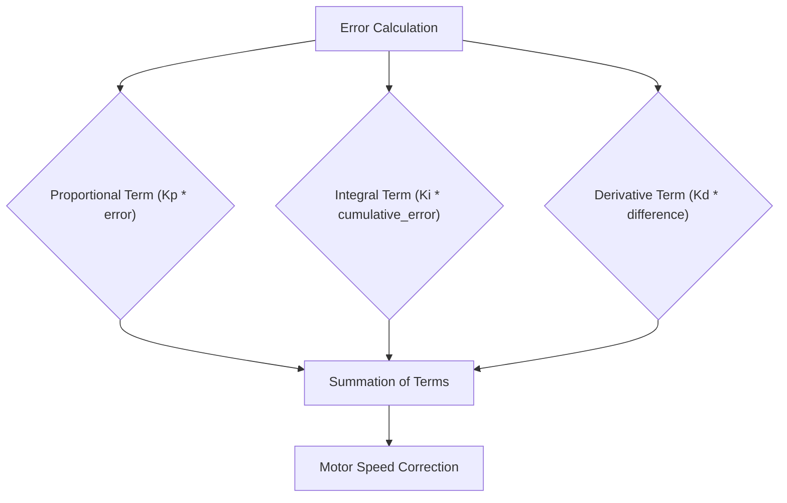
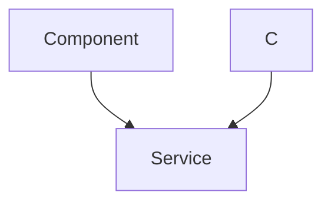

 # Line Following

This document details the implementation of the line following functionality for the robot, covering sensor integration, PID control, and the web interface for tuning.

## Overview

The line following system enables the robot to autonomously navigate a path defined by a black line on a white surface. It uses a 5-sensor array to detect the line, calculates an error value representing the robot's deviation from the center of the line, and then applies a PID control algorithm to adjust the motor speeds to correct its trajectory. A web interface allows for real-time tuning of the PID parameters.

## Line Sensing and Error Calculation

The robot utilizes a 5-sensor line sensor array. Each sensor outputs an analog reading based on the surface reflectance. These readings are then used to calculate an error signal that drives the control loop.

### Weighted Error Calculation

The function `calculate_error` in [line_following.c](https://github.com/SRA-VJTI/Wall-E/blob/main/6_line_following/main/line_following.c) calculates the error based on the weighted average of the sensor readings:

```c
void calculate_error() {
    int all_black_flag = 1;
    float weighted_sum = 0, sum = 0; 
    float pos = 0, k = 0;

    for(int i = 0; i < 5; i++) {
        if(line_sensor_readings.adc_reading[i] > BLACK_BOUNDARY) {
            all_black_flag = 0;
        }
        if(line_sensor_readings.adc_reading[i] > BLACK_BOUNDARY) {
            k = 1;
        }
        if(line_sensor_readings.adc_reading[i] < BLACK_BOUNDARY) {
            k = 0;
        }
        weighted_sum += (float)(weights[i]) * k;
        sum = sum + k;
    }

    if(sum != 0) {
        pos = (weighted_sum - 1) / sum;
    }

    if(all_black_flag == 1)  {
        if(prev_error > 0) {
            error = 2.5;
        }
        else {
            error = -2.5;
        }
    }
    else {
        error = pos;
    }
}
```

This function iterates through the sensor readings, applies weights, and calculates a position error. If all sensors detect black, it uses the previous error to estimate the current direction.

## PID Control Algorithm

The line following system employs a PID (Proportional-Integral-Derivative) control algorithm to minimize the error between the robot's current position and the center of the line.

### PID Correction Calculation

The `calculate_correction` function computes the PID correction value:

```c
void calculate_correction() {
    error = error*10;
    difference = error - prev_error;
    cumulative_error += error;

    cumulative_error = bound(cumulative_error, -30, 30);

    correction = read_pid_const().kp*error + read_pid_const().ki*cumulative_error + read_pid_const().kd*difference;
    prev_error = error;
}
```

This function calculates the proportional, integral, and derivative terms based on the error, cumulative error, and error difference. The `read_pid_const()` function fetches the PID constants [from here](https://github.com/SRA-VJTI/Wall-E/blob/main/6_line_following/main/line_following.c#L39).

### PID Constants
The `pid_const_t` struct is used to store the PID values:
```c
typedef struct pid_const
{
  float kp;
  float ki;
  float kd;
  bool val_changed;
} pid_const_t;
```
The `val_changed` is a boolean to indicate when the values were changed.
This is used to print the values on the OLED display on value change.





## Motor Control

The calculated correction value is applied to the motor speeds to steer the robot.

### Motor Speed Adjustment

The motor speeds are adjusted based on the PID correction:

```c
left_duty_cycle = bound((optimum_duty_cycle + correction), lower_duty_cycle, higher_duty_cycle);
right_duty_cycle = bound((optimum_duty_cycle - correction), lower_duty_cycle, higher_duty_cycle);

set_motor_speed(motor_a_0, MOTOR_FORWARD, left_duty_cycle);
set_motor_speed(motor_a_1, MOTOR_FORWARD, right_duty_cycle);
```

The `left_duty_cycle` and `right_duty_cycle` are calculated by adding and subtracting the correction value from an optimum duty cycle.  The `bound` function ensures that the duty cycle stays within acceptable limits. [View on GitHub](https://github.com/SRA-VJTI/Wall-E/blob/main/6_line_following/main/line_following.c#L136-L137)

## Web Interface for PID Tuning

A web interface is provided to allow real-time tuning of the PID parameters.

### Frontend (HTML)

The frontend, implemented in `index.html` [located here](https://github.com/SRA-VJTI/Wall-E/blob/main/6_line_following/frontend/index.html), provides input fields for adjusting Kp, Ki, and Kd values.

```html
<div class="button-group">
    <h3>Kp</h3>
    <button>&lt;</button>
    <input type="number" value="0.000" id="kp" />
    <button>&gt;</button>
</div>
```

### Backend (HTTP Server)

The backend, implemented using an HTTP server, handles the updates to the PID constants.

```c
void start_tuning_http_server()
{
    static httpd_handle_t server = NULL;

    /* Start the server for the first time */
    if (server == NULL) {
        server = start_webserver();
    }
}
```

This function starts the HTTP server that listens for incoming requests to update the PID values. The server implementation can be found in `tuning_http_server.c`.

### Data Flow





## Key Integration Points

- **Sensor Readings**: The line sensor readings are crucial inputs for the error calculation.
- **PID Constants**: The PID constants, tuned via the web interface, directly impact the robot's line following performance.
- **Motor Control**: The motor control outputs are directly influenced by the PID correction values.

## Best Practices

- **Sensor Calibration**: Ensure that the line sensors are properly calibrated to provide accurate readings.
- **PID Tuning**: Fine-tune the PID constants to achieve optimal line following performance.
- **Error Handling**: Implement robust error handling to manage unexpected sensor readings or motor behavior.