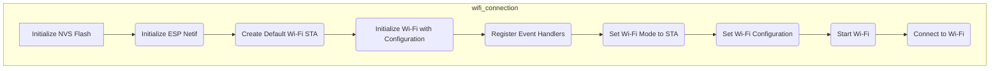
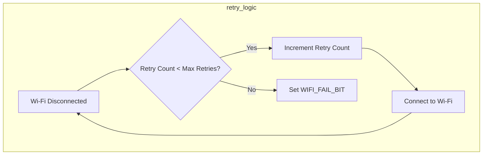

---
title: "Network Configuration"
description: "Describes the Wi-Fi connection process for line following and self-balancing."
---

# Network Configuration

This document details the Wi-Fi connection process implemented in the Wall-E project, specifically for the line following and self-balancing functionalities. The ESP32 module utilizes the ESP-IDF framework for establishing a station (STA) mode connection to a Wi-Fi network.

## Wi-Fi Connection Process Overview

The Wi-Fi connection process involves initializing the ESP32's Wi-Fi stack, configuring the Wi-Fi settings, and establishing a connection to the specified access point. The process incorporates retry mechanisms to handle connection failures and leverages FreeRTOS event groups for synchronization and status monitoring.





## Key Components and Functions

*   **`connect_to_wifi()`**: This function serves as the entry point for initiating the Wi-Fi connection. It first initializes the Non-Volatile Storage (NVS) flash memory, which is used to store Wi-Fi credentials and other configuration data. Then, it calls `wifi_init_sta()` to configure and start the Wi-Fi connection.
    [View on GitHub](https://github.com/SRA-VJTI/Wall-E/blob/master/6_line_following/main/wifi_handler.c)

    ```c
    void connect_to_wifi()
    {
        esp_err_t ret = nvs_flash_init();
        if (ret == ESP_ERR_NVS_NO_FREE_PAGES || ret == ESP_ERR_NVS_NEW_VERSION_FOUND) 
        {
          ESP_ERROR_CHECK(nvs_flash_erase());
          ret = nvs_flash_init();
        }
        ESP_ERROR_CHECK(ret);

        ESP_LOGI(TAG, "ESP_WIFI_MODE_STA");
        wifi_init_sta();
    }
    ```

*   **`wifi_init_sta()`**: This function performs the core Wi-Fi initialization and connection setup. It creates an event group for managing Wi-Fi connection events, initializes the ESP-Netif library, creates a default Wi-Fi station interface, initializes the Wi-Fi driver with default configuration, registers event handlers for Wi-Fi and IP events, configures the Wi-Fi settings with the SSID and password, sets the Wi-Fi mode to station mode, and starts the Wi-Fi driver. Finally, it waits for either a successful connection or a connection failure event.
    [View on GitHub](https://github.com/SRA-VJTI/Wall-E/blob/master/6_line_following/main/wifi_handler.c)

    ```c
    void wifi_init_sta(void)
    {
        s_wifi_event_group = xEventGroupCreate();

        ESP_ERROR_CHECK(esp_netif_init());

        esp_netif_create_default_wifi_sta();

        wifi_init_config_t cfg = WIFI_INIT_CONFIG_DEFAULT();
        ESP_ERROR_CHECK(esp_wifi_init(&cfg));

        esp_event_handler_instance_t instance_any_id;
        esp_event_handler_instance_t instance_got_ip;
        ESP_ERROR_CHECK(esp_event_handler_instance_register(WIFI_EVENT,
                                                            ESP_EVENT_ANY_ID,
                                                            &event_handler,
                                                            NULL,
                                                            &instance_any_id));
        ESP_ERROR_CHECK(esp_event_handler_instance_register(IP_EVENT,
                                                            IP_EVENT_STA_GOT_IP,
                                                            &event_handler,
                                                            NULL,
                                                            &instance_got_ip));

        wifi_config_t wifi_config = {
            .sta = {
                .ssid = WIFI_SSID,
                .password = WIFI_PASS,
                .threshold.authmode = WIFI_AUTH_WPA2_PSK,

                .pmf_cfg = {
                    .capable = true,
                    .required = false
                },
            },
        };
        ESP_ERROR_CHECK(esp_wifi_set_mode(WIFI_MODE_STA) );
        ESP_ERROR_CHECK(esp_wifi_set_config(ESP_IF_WIFI_STA, &wifi_config) );
        ESP_ERROR_CHECK(esp_wifi_start() );

        ESP_LOGI(TAG, "wifi_init_sta finished.");


        EventBits_t bits = xEventGroupWaitBits(s_wifi_event_group,
                WIFI_CONNECTED_BIT | WIFI_FAIL_BIT,
                pdFALSE,
                pdFALSE,
                portMAX_DELAY);

        if (bits & WIFI_CONNECTED_BIT) 
        {
            ESP_LOGI(TAG, "connected to ap SSID: %s", WIFI_SSID);
        } 
        else if (bits & WIFI_FAIL_BIT) 
        {
            ESP_LOGI(TAG, "Failed to connect to SSID: %s", WIFI_SSID);
        } 
        else 
        {
            ESP_LOGE(TAG, "UNEXPECTED EVENT");
        }

        ESP_ERROR_CHECK(esp_event_handler_instance_unregister(IP_EVENT, IP_EVENT_STA_GOT_IP, instance_got_ip));
        ESP_ERROR_CHECK(esp_event_handler_instance_unregister(WIFI_EVENT, ESP_EVENT_ANY_ID, instance_any_id));
        vEventGroupDelete(s_wifi_event_group);
    }
    ```

*   **`event_handler()`**: This function is the callback function for handling Wi-Fi and IP events. It handles the following events:
    *   `WIFI_EVENT_STA_START`: When the Wi-Fi station starts, it attempts to connect to the configured access point.
    *   `WIFI_EVENT_STA_DISCONNECTED`: If the Wi-Fi connection is disconnected, it retries the connection up to a maximum number of retries defined by `MAXIMUM_RETRY`. If the maximum number of retries is reached, it sets the `WIFI_FAIL_BIT` in the event group.
    *   `IP_EVENT_STA_GOT_IP`: When the Wi-Fi station obtains an IP address, it logs the IP address and sets the `WIFI_CONNECTED_BIT` in the event group.
        [View on GitHub](https://github.com/SRA-VJTI/Wall-E/blob/master/6_line_following/main/wifi_handler.c)

    ```c
    static void event_handler(void* arg, esp_event_base_t event_base, int32_t event_id, void* event_data)
    {
        if (event_base == WIFI_EVENT && event_id == WIFI_EVENT_STA_START) 
        {
            esp_wifi_connect();
        } 
        else if (event_base == WIFI_EVENT && event_id == WIFI_EVENT_STA_DISCONNECTED) 
        {
            if (s_retry_num < MAXIMUM_RETRY) {
                esp_wifi_connect();
                s_retry_num++;
                ESP_LOGI(TAG, "retry to connect to the AP");
            } else {
                xEventGroupSetBits(s_wifi_event_group, WIFI_FAIL_BIT);
            }
            ESP_LOGI(TAG,"connect to the AP fail");
        } 
        else if (event_base == IP_EVENT && event_id == IP_EVENT_STA_GOT_IP) 
        {
            ip_event_got_ip_t* event = (ip_event_got_ip_t*) event_data;
            ESP_LOGI(TAG, "got ip:" IPSTR, IP2STR(&event->ip_info.ip));
            s_retry_num = 0;
            xEventGroupSetBits(s_wifi_event_group, WIFI_CONNECTED_BIT);
        }
    }
    ```

*   **Configuration Macros**: The `wifi_handler.h` file defines several macros for configuring the Wi-Fi connection, including the SSID, password, and maximum retry attempts. These macros are defined using the ESP-IDF's configuration system, allowing them to be easily configured through the project's configuration menu.
    [View on GitHub](https://github.com/SRA-VJTI/Wall-E/blob/master/6_line_following/main/include/wifi_handler.h)

    ```c
    #define WIFI_SSID      CONFIG_WIFI_SSID
    #define WIFI_PASS      CONFIG_WIFI_PASSWORD
    #define MAXIMUM_RETRY  CONFIG_MAXIMUM_RETRY
    ```

## Event Handling

The system leverages the ESP-IDF event loop and FreeRTOS event groups for managing the asynchronous nature of the Wi-Fi connection process. The `event_handler` function is registered to receive Wi-Fi and IP events, allowing the system to react to changes in the Wi-Fi connection status.  The event group `s_wifi_event_group` is used to signal the main task when the Wi-Fi connection is established or fails.

## Error Handling and Retries

The `event_handler` implements a retry mechanism to handle connection failures.  The `s_retry_num` variable tracks the number of connection attempts, and the connection is retried up to `MAXIMUM_RETRY` times.  If the connection fails after the maximum number of retries, the `WIFI_FAIL_BIT` is set in the event group, signaling the main task that the connection failed.





## Key Integration Points

The `connect_to_wifi()` function should be called early in the application's initialization process to establish the Wi-Fi connection. Ensure that the `CONFIG_WIFI_SSID` and `CONFIG_WIFI_PASSWORD` configuration options are set correctly in the project's configuration menu. Consider adding error handling to the main application loop to handle cases where the Wi-Fi connection fails. The code is nearly identical between the line following and self-balancing projects, indicating a reusable module.

## Best Practices

*   **Configuration:** Use the ESP-IDF configuration system to manage Wi-Fi credentials and other configuration options. This allows for easy modification of the Wi-Fi settings without modifying the source code.
*   **Error Handling:** Implement robust error handling to handle connection failures and other Wi-Fi-related errors.
*   **Security:** Use WPA2-PSK or higher security protocols to protect the Wi-Fi connection.
*   **Power Management:** Consider implementing power management techniques to reduce power consumption when the Wi-Fi connection is not actively used.

By following these guidelines, you can ensure a reliable and secure Wi-Fi connection for your Wall-E project.
```