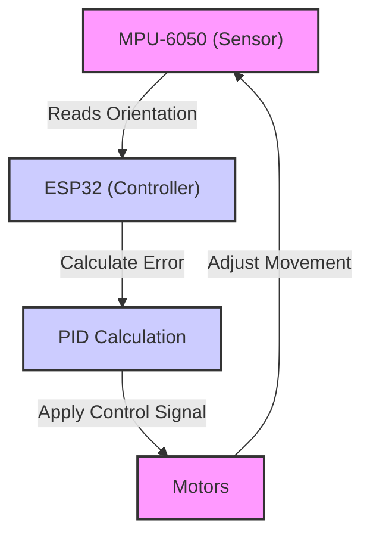

 # Self Balancing Module

This document provides a comprehensive overview of the self-balancing module, its underlying principles, and implementation details.

## How the Bot Balances Itself?

The core concept behind self-balancing is based on feedback control. The bot continuously monitors its orientation and adjusts motor speeds to maintain equilibrium.

### Theory

The fundamental principle involves reacting to changes in the bot's orientation:

*   **Forward Movement:** When the bot moves forward, the front tilts upwards.
*   **Backward Movement:** When the bot moves backward, the front tilts downwards.
*   **Above Desired Position:** To correct, the bot moves backward.
*   **Below Desired Position:** To correct, the bot moves forward.

This creates a closed-loop system where the bot's movements are constantly adjusted to maintain balance.

### Use of PID

PID (Proportional-Integral-Derivative) control is the cornerstone of the balancing algorithm. This method continuously calculates an error value and then applies a correction based on that error.

The components of PID control include:

*   **Proportional (P) Term:** Responds to the current error value.
*   **Integral (I) Term:** Accumulates the error over time.
*   **Derivative (D) Term:** Reacts to the rate of change of the error.





### Proportional Term

The Proportional term directly addresses the current error.

*   `correction_speed = Kp * Error`
*   `Kp` is the proportionality constant. A well-tuned Kp ensures the bot responds effectively without overshooting.

### Derivative Term

The Derivative term anticipates and dampens oscillations.

*   `Correction_Speed = Kp * Error + Kd * Error_Rate`
*   `Error_Rate = (Current_Error - Previous_Error) / dt`
*   `Kd` is the derivative constant, which stabilizes the system.

### Integral Term

The Integral term corrects for accumulated errors over time, ensuring the bot reaches and maintains its target position.

## Formula for Calculation of Pitch Correction

The overall pitch correction is determined by the PID equation:

```
pitch_correction = Kp*(error) + Ki*(Integral_Error) + Kd*(Error_rate)
```

## Algorithm

The self-balancing algorithm follows these steps:

1.  Read sensor data and calculate the error.
2.  Calculate the "Error Rate" and "Cumulative Error" (Integral) terms.
3.  Calculate the correction speed using the PID equation.
4.  Threshold the correction speed to the maximum and minimum PWM values.
5.  Determine the direction of movement:
    *   If `Error > 1`: move forward.
    *   If `Error < -1`: move backward.
    *   Otherwise, stop.
6.  Repeat from step 1.

## Description of the Functions

*   `calculate_motor_command(const float pitch_error, float *motor_cmd)`: This function calculates the motor commands based on the pitch angle error. [View on GitHub](https://github.com/SRA-VJTI/Wall-E/blob/main/7_self_balancing/main/self_balancing.c#L50).

    *   `pitch_error`: The difference between the desired and current pitch angles.
    *   `motor_cmd`: A pointer to store the calculated correction values.

    ```c
    //Components
    #include "sra_board.h"
    #include <stdio.h>
    #include <math.h>

    //Limiting Variables
    #define MAX_PITCH_CORRECTION (90.0f)
    #define MAX_PITCH_AREA (850.0f)
    #define MAX_PITCH_RATE (850.0f)
    #define MAX_PWM (80.0f)
    #define MIN_PWM (60.0f)

    void calculate_motor_command(const float pitch_error, float *motor_cmd)
    {
    	// ... (implementation) ...
    }
    ```

*   `balance_task(void *arg)`: The main task responsible for balancing the bot. [View on GitHub](https://github.com/SRA-VJTI/Wall-E/blob/main/7_self_balancing/main/self_balancing.c#L101).

    ```c
    void balance_task(void *arg)
    {
        // ... (implementation) ...
    }
    ```

*   `read_mpu6050(euler_angle, mpu_offset)`: Reads data from the MPU-6050 sensor and calculates complementary pitch and roll angles. [View on GitHub](https://github.com/SRA-VJTI/Wall-E/blob/main/7_self_balancing/main/self_balancing.c#L101).

    *   `euler_angle`: An array to store the calculated pitch and roll angles.
    *   `mpu_offset`: The initial accelerometer angles at rest.
    *   Returns `ESP_OK` on success; `ESP_FAIL` on error.

    ```c
    esp_err_t read_mpu6050(float *euler_angle, float *mpu_offset)
    {
        // ... (implementation) ...
    }
    ```

## Key Integration Points

1.  **Sensor Integration:** The MPU-6050 provides the necessary data for orientation calculations. Accurate sensor readings are crucial for proper balancing.
2.  **PID Tuning:** Fine-tuning the PID constants (Kp, Ki, Kd) is essential for optimal performance. The provided frontend allows for real-time adjustment of these parameters.
3.  **Motor Control:** The `calculate_motor_command` function translates the PID output into motor commands. The motor control logic ensures the bot moves in the correct direction and at the appropriate speed to maintain balance.
4.  **Websocket Server:** The WebSocket server facilitates communication between the ESP32 and the frontend, enabling real-time data visualization and PID tuning. The frontend allows users to change Kp, Ki, Kd, Setpoint and Offset.
5.  **Data Visualization:** The frontend provides real-time graphs displaying acceleration, roll, pitch, and correction values. This visual feedback assists in understanding the bot's behavior and tuning the PID parameters.