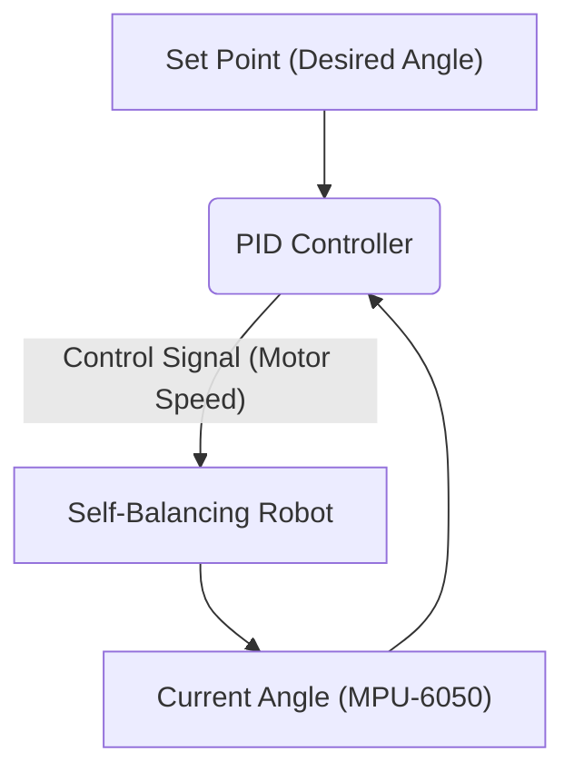
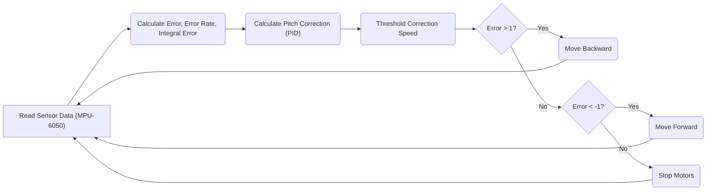

---
title: "Self-Balancing System"
description: "Presents the implementation of the self-balancing robot functionality."
---

# Self-Balancing System

This document details the implementation of the self-balancing functionality for the Wall-E robot. The system utilizes a PID (Proportional-Integral-Derivative) controller to maintain balance by adjusting motor speeds based on the robot's pitch angle.

## How the Robot Balances

The core concept revolves around using motor movements to counteract tilting. If the robot leans forward, moving it backward will help restore balance, and vice versa. A PID controller is essential for achieving precise and stable balancing.

### PID Controller Explained

A PID controller calculates an error value as the difference between a desired setpoint (e.g., upright position) and a measured process variable (e.g., current pitch angle). The controller then attempts to minimize the error by adjusting a control variable (e.g., motor speed).

*   **Proportional (P) Term:** Responds to the current error. Larger errors result in larger corrections.
*   **Integral (I) Term:** Accumulates past errors. This helps eliminate steady-state errors, but can cause overshoot if not tuned correctly.
*   **Derivative (D) Term:** Responds to the rate of change of the error. This helps dampen oscillations and improve stability.





## Formula for Pitch Correction

The PID controller calculates a `pitch_correction` value using the following formula:

```
pitch_correction = Kp * (error) + Ki * (Integral_Error) + Kd * (Error_rate)
```

Where:

*   `Kp` is the proportional gain.
*   `Ki` is the integral gain.
*   `Kd` is the derivative gain.
*   `error` is the difference between the desired angle and the current angle.
*   `Integral_Error` is the accumulated error over time.
*   `Error_rate` is the rate of change of the error.

## Algorithm Overview

1.  **Sensor Readings:** Read pitch and roll angles from the MPU-6050 sensor and calculate the error (difference between desired and current pitch).
2.  **Error Term Calculation:** Calculate the error rate (derivative) and cumulative error (integral).
3.  **PID Calculation:** Calculate the correction speed using the PID equation.
4.  **Thresholding:** Limit the correction speed to a maximum and minimum PWM value for the motors.
5.  **Motor Control:** Determine the direction the robot should move and set the motor speeds accordingly:
    *   If `error > 1` (bot leaning forward): Move backward.
    *   If `error < -1` (bot leaning backward): Move forward.
    *   Else (bot is balanced): Stop the motors.
6.  **Loop:** Repeat from step 1.





## Key Functions and Code Snippets

### 1. `calculate_motor_command`

This function calculates the motor commands based on the pitch error.

```c
void calculate_motor_command(const float pitch_error, float *motor_cmd) {
    static float prev_pitch_error = 0.0f;
    static float pitch_area = 0.0f;
    float pitch_error_difference = 0.0f;

    float pitch_correction = 0.0f;
    float pitch_rate = 0.0f;

    float P_term = 0.0f, I_term = 0.0f, D_term = 0.0f;

    pitch_error_difference = pitch_error - prev_pitch_error;
    pitch_area += (pitch_error);
    pitch_rate = pitch_error_difference;

    P_term = read_pid_const().kp * pitch_error;
    I_term = read_pid_const().ki * bound(pitch_area, -MAX_PITCH_AREA, MAX_PITCH_AREA);
    D_term = read_pid_const().kd * bound(pitch_rate, -MAX_PITCH_RATE, MAX_PITCH_RATE);

    pitch_correction = P_term + I_term + D_term;
    *motor_cmd = fabsf(pitch_correction); // corrected values
    prev_pitch_error = pitch_error;
}
```

[View on GitHub](https://github.com/SRA-VJTI/Wall-E/blob/master/7_self_balancing/main/self_balancing.c#L28)

**Explanation:** This function calculates the motor command using the PID controller. It takes the pitch error as input and calculates the P, I, and D terms. The final `pitch_correction` is the sum of these terms.

### 2. `balance_task`

This is the main task responsible for balancing the robot.

```c
void balance_task(void *arg) {
    float euler_angle[2], mpu_offset[2] = {0.0f, 0.0f};
    float pitch_angle, pitch_error;
    float motor_cmd, motor_pwm = 0.0f;
    motor_handle_t motor_a_0, motor_a_1;
    float pitch_cmd = 0.0f;

    if (enable_mpu6050() == ESP_OK) {
        enable_motor_driver(&motor_a_0, MOTOR_A_0);
        enable_motor_driver(&motor_a_1, MOTOR_A_1);
        while (1) {
            if (read_mpu6050(euler_angle, mpu_offset) == ESP_OK) {
                pitch_cmd = read_pid_const().setpoint;
                pitch_angle = euler_angle[1];
                pitch_error = pitch_cmd - pitch_angle;

                calculate_motor_command(pitch_error, &motor_cmd);
                motor_pwm = bound((motor_cmd), MIN_PWM, MAX_PWM);

                if (pitch_error > 1) {
                    set_motor_speed(motor_a_0, MOTOR_BACKWARD, motor_pwm);
                    set_motor_speed(motor_a_1, MOTOR_BACKWARD, motor_pwm);
                } else if (pitch_error < -1) {
                    set_motor_speed(motor_a_0, MOTOR_FORWARD, motor_pwm);
                    set_motor_speed(motor_a_1, MOTOR_FORWARD, motor_pwm);
                } else {
                    set_motor_speed(motor_a_0, MOTOR_STOP, 0);
                    set_motor_speed(motor_a_1, MOTOR_STOP, 0);
                }
                vTaskDelay(10 / portTICK_PERIOD_MS);
            }
        }
    }
    vTaskDelete(NULL);
}
```

[View on GitHub](https://github.com/SRA-VJTI/Wall-E/blob/master/7_self_balancing/main/self_balancing.c#L88)

**Explanation:** This function initializes the MPU6050, reads the pitch angle, calculates the error, and sets the motor speeds based on the error.  It runs continuously in a `while` loop, constantly adjusting the motors to maintain balance.

### 3. `read_mpu6050`

This function reads data from the MPU6050 sensor and calculates the pitch and roll angles.

```c
esp_err_t read_mpu6050(float *euler_angle, float *mpu_offset) {
    // Implementation details to read from MPU6050
    // ...
    return ESP_OK; // Or ESP_FAIL if an error occurred
}
```

**Explanation:** Reads raw accelerometer and gyroscope data from the MPU6050 sensor. This data is then processed using a complementary filter (or similar technique) to estimate the pitch and roll angles, compensating for sensor drift and noise.

### 4. PID Tuning via Websocket

The frontend `index.html` includes Javascript functions to send PID values to the ESP32 via websocket connection.

```javascript
    function send_Text_kp(text) {
      websocket.send("P" + text);
    }
    function send_Text_kd(text) {
      websocket.send("D" + text);
    }
    function send_Text_ki(text) {
      websocket.send("I" + text);
    }
```

[View on GitHub](https://github.com/SRA-VJTI/Wall-E/blob/master/7_self_balancing/frontend/index.html#L16)

**Explanation:** These Javascript functions are called when the user enters a value in the corresponding input field and clicks the "Send" button.  The value is prepended with a character ("P", "D", or "I") to identify the PID constant being updated.  The complete string is then sent to the ESP32 via a websocket.

### 5. WiFi Connection
The `wifi_handler.h` header file contains the definitions and function declaration for connecting to a WiFi network.

```c
#ifndef WIFI_HANDLER_H
#define WIFI_HANDLER_H

#include <string.h>
#include "freertos/FreeRTOS.h"
#include "freertos/task.h"
#include "freertos/event_groups.h"
#include "esp_system.h"
#include "esp_wifi.h"
#include "esp_event.h"
#include "esp_log.h"
#include "nvs_flash.h"
#include "lwip/err.h"
#include "lwip/sys.h"
#include "sdkconfig.h"

#define WIFI_SSID      CONFIG_WIFI_SSID
#define WIFI_PASS      CONFIG_WIFI_PASSWORD
#define MAXIMUM_RETRY  CONFIG_MAXIMUM_RETRY

void connect_to_wifi();

#endif
```

[View on GitHub](https://github.com/SRA-VJTI/Wall-E/blob/master/7_self_balancing/main/include/wifi_handler.h)

**Explanation:** This header file defines the WiFi SSID and password, along with other configuration parameters. It also declares the `connect_to_wifi()` function, which is responsible for establishing a connection to the specified WiFi network. The `connect_to_wifi()` implementation will use the ESP-IDF WiFi libraries to connect to the WiFi network.

## Key Integration Points

*   **MPU6050 Integration:** Accurate and reliable data from the MPU6050 is critical for the self-balancing system. Proper calibration and filtering of sensor data are essential.
*   **PID Tuning:** The PID gains (`Kp`, `Ki`, `Kd`) must be carefully tuned to achieve stable balancing.  This often involves trial and error, and may require different values depending on the robot's physical characteristics. The frontend provides a way to modify these values in real-time and see the effect on the robot's behavior.
*   **Motor Control:** Precise motor control is essential for smooth and responsive balancing. The motor drivers must be capable of delivering the required torque and speed.
*   **Websocket Communication:** The websocket server allows for remote monitoring and tuning of the self-balancing system. This is particularly useful for debugging and optimizing the PID gains.

## Best Practices

*   **Sensor Calibration:** Calibrate the MPU6050 to minimize bias and drift.
*   **Filter Noise:** Implement a filter (e.g., Kalman filter or complementary filter) to reduce noise in the sensor data.
*   **Limit Motor Speed:** Implement a maximum motor speed limit to prevent instability and damage.
*   **Safety Mechanisms:** Incorporate safety mechanisms to prevent the robot from falling over completely (e.g., angle limits).
*   **Tuning Iteration:** Systematically tune the PID gains, starting with `Kp`, then `Kd`, and finally `Ki`.  Monitor the robot's response to changes in each gain.
```