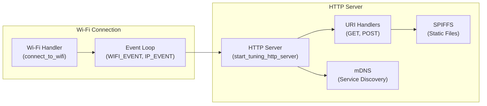

---
title: "Underlying Infrastructure"
description: "Describes common infrastructure components used in advanced functionalities like Wi-Fi handling and HTTP servers."
---

# Underlying Infrastructure

This document outlines the core infrastructure components employed in the Wall-E project, particularly focusing on Wi-Fi connectivity and HTTP server functionalities. These components are crucial for enabling advanced features such as remote tuning, data logging, and over-the-air updates.

## Wi-Fi Handling

The Wi-Fi handler is responsible for establishing and maintaining a connection to a wireless network. It uses the ESP-IDF's Wi-Fi stack to manage the connection process, including scanning for networks, authenticating with the access point, and handling disconnections.

```c
#include "wifi_handler.h"

static EventGroupHandle_t s_wifi_event_group;
static const char *TAG = "wifi station";
static int s_retry_num = 0;

// ... (rest of the wifi_handler.c code)
```

[View on GitHub](https://github.com/SRA-VJTI/Wall-E/blob/master/6_line_following/main/wifi_handler.c)

The `wifi_init_sta` function initializes the Wi-Fi station mode and configures the connection parameters such as SSID and password. It also sets up event handlers to monitor the connection status.

```c
void wifi_init_sta(void)
{
    s_wifi_event_group = xEventGroupCreate();

    ESP_ERROR_CHECK(esp_netif_init());

    esp_netif_create_default_wifi_sta();

    wifi_init_config_t cfg = WIFI_INIT_CONFIG_DEFAULT();
    ESP_ERROR_CHECK(esp_wifi_init(&cfg));

    // ... (rest of the function)
}
```

[View on GitHub](https://github.com/SRA-VJTI/Wall-E/blob/master/6_line_following/main/wifi_handler.c)

This snippet showcases the initialization of the Wi-Fi stack. `esp_netif_init()` initializes the underlying TCP/IP stack, and `esp_wifi_init(&cfg)` initializes the Wi-Fi driver with default configurations. Event handlers are registered to respond to Wi-Fi connection events.

The `event_handler` function is the callback function that handles Wi-Fi events, such as connection success, connection failure, and IP address assignment. It uses an event group to synchronize the connection process.

```c
static void event_handler(void* arg, esp_event_base_t event_base, int32_t event_id, void* event_data)
{
    if (event_base == WIFI_EVENT && event_id == WIFI_EVENT_STA_START) 
    {
        esp_wifi_connect();
    } 
    else if (event_base == WIFI_EVENT && event_id == WIFI_EVENT_STA_DISCONNECTED) 
    {
        // ... (rest of the function)
    } 
    else if (event_base == IP_EVENT && event_id == IP_EVENT_STA_GOT_IP) 
    {
        // ... (rest of the function)
    }
}
```

[View on GitHub](https://github.com/SRA-VJTI/Wall-E/blob/master/6_line_following/main/wifi_handler.c)

This code snippet defines the event handler for Wi-Fi events. It attempts to connect to the Wi-Fi network upon receiving the `WIFI_EVENT_STA_START` event. If a disconnection occurs, it retries the connection up to a maximum number of attempts. Upon successful connection and IP address acquisition (`IP_EVENT_STA_GOT_IP`), it sets the `WIFI_CONNECTED_BIT` in the event group.

## HTTP Server for Tuning

The HTTP server enables remote tuning of PID controller parameters through a web interface. It uses the ESP-IDF's HTTPD component to handle HTTP requests and responses.  The server hosts a simple web interface that allows users to adjust the PID constants (Kp, Ki, Kd) and observe the system's response in real-time.

```c
#include "tuning_http_server.h"

static const char *TAG = "tuning_http_server";
static char scratch[SCRATCH_BUFSIZE];
static pid_const_t pid_constants = {.kp = 0.9, .ki = 0, .kd = 6.5, .val_changed = true};

// ... (rest of the tuning_http_server.c code)
```

[View on GitHub](https://github.com/SRA-VJTI/Wall-E/blob/master/6_line_following/main/tuning_http_server.c)

The `tuning_pid_post_handler` function handles HTTP POST requests to update the PID constants. It parses the JSON payload, extracts the new values, and updates the `pid_constants` variable.

```c
static esp_err_t tuning_pid_post_handler(httpd_req_t *req)
{
    // ... (read data from the request)

    cJSON *root = cJSON_Parse(buf);
    if (root == NULL)
    {   
        ESP_LOGE(TAG, "invalid json response");
        return ESP_FAIL;
    }
    
    // ... (extract values from JSON)

    pid_constants.kp = (float)cJSON_GetObjectItem(root, "kp")->valuedouble;
    pid_constants.ki = (float)cJSON_GetObjectItem(root, "ki")->valuedouble;
    pid_constants.kd = (float)cJSON_GetObjectItem(root, "kd")->valuedouble;

    cJSON_Delete(root);
    httpd_resp_sendstr(req, "Post control value successfully");

    pid_constants.val_changed = true;
    return ESP_OK;
}
```

[View on GitHub](https://github.com/SRA-VJTI/Wall-E/blob/master/6_line_following/main/tuning_http_server.c)

This snippet demonstrates how the HTTP server receives PID tuning parameters. The `tuning_pid_post_handler` function parses the JSON payload sent in the HTTP POST request and updates the PID constants. The `cJSON` library is used for parsing the JSON data.

The `rest_common_get_handler` function serves static files from the SPIFFS filesystem. It determines the content type based on the file extension and sends the file contents as an HTTP response.

```c
static esp_err_t rest_common_get_handler(httpd_req_t *req)
{
    char filepath[FILE_PATH_MAX] = WEB_MOUNT_POINT;

    // ... (construct file path)

    int fd = open(filepath, O_RDONLY, 0);
    if (fd == -1) {
        // ... (handle file open error)
    }

    set_content_type_from_file(req, filepath);

    // ... (read and send file content)

    close(fd);
    return ESP_OK;
}
```

[View on GitHub](https://github.com/SRA-VJTI/Wall-E/blob/master/6_line_following/main/tuning_http_server.c)

This function handles HTTP GET requests for static files. It opens the requested file from the SPIFFS filesystem, determines the correct content type, and sends the file's content as the HTTP response. Error handling is included for cases where the file cannot be opened.

```c
static esp_err_t start_tuning_http_server_private()
{
    httpd_handle_t server = NULL;
    httpd_config_t config = HTTPD_DEFAULT_CONFIG();
    config.uri_match_fn = httpd_uri_match_wildcard;

    ESP_LOGI(TAG, "Starting HTTP Server");
    if (httpd_start(&server, &config) != ESP_OK)
    {
        ESP_LOGE(TAG, "start server failed");
        return ESP_FAIL;
    }
    
    // ... (register URI handlers)

    return ESP_OK;
}
```

[View on GitHub](https://github.com/SRA-VJTI/Wall-E/blob/master/6_line_following/main/tuning_http_server.c)

This snippet shows the core of starting the HTTP server using the `httpd_start` function with a default configuration, and the registration of two URI handlers: one for POST requests to `/api/v1/pid` (for updating PID values) and another for GET requests for all other paths (serving static web content).

## SPIFFS Filesystem

The SPIFFS (Serial Peripheral Interface Flash File System) is used to store the static web files served by the HTTP server. It is a lightweight filesystem designed for embedded systems with limited resources. The `init_fs` function initializes the SPIFFS filesystem.

```c
static esp_err_t init_fs(void)
{
    esp_vfs_spiffs_conf_t conf = {
        .base_path = WEB_MOUNT_POINT,
        .partition_label = NULL,
        .max_files = 5,
        .format_if_mount_failed = false
    };
    esp_err_t ret = esp_vfs_spiffs_register(&conf);

    // ... (error handling and information retrieval)

    return ESP_OK;
}
```

[View on GitHub](https://github.com/SRA-VJTI/Wall-E/blob/master/6_line_following/main/tuning_http_server.c)

This code initializes the SPIFFS filesystem, which is used to store static web files. It configures the SPIFFS parameters, such as the base path and maximum number of files. If mounting fails, it logs an error and returns an error code.

## mDNS for Service Discovery

mDNS (Multicast Domain Name System) allows devices on the local network to discover each other by name. This simplifies the process of accessing the Wall-E's web interface without needing to know its IP address.  The `initialise_mdns` function initializes the mDNS service and sets the hostname and instance name.

```c
static void initialise_mdns(void)
{
    mdns_init();
    mdns_hostname_set(MDNS_HOST_NAME);
    mdns_instance_name_set(MDNS_INSTANCE);

    mdns_txt_item_t serviceTxtData[] = {
        {"board", "esp32"},
        {"path", "/"}
    };

    ESP_ERROR_CHECK(mdns_service_add("ESP32-WebServer", "_http", "_tcp", 80, serviceTxtData,
                                     sizeof(serviceTxtData) / sizeof(serviceTxtData[0])));
}
```

[View on GitHub](https://github.com/SRA-VJTI/Wall-E/blob/master/6_line_following/main/tuning_http_server.c)

This function initializes the mDNS service for service discovery. It sets the hostname and instance name for the device and adds a service record for the HTTP server, allowing other devices on the network to discover the Wall-E device by name.

## Key Integration Points

The Wi-Fi handler, HTTP server, SPIFFS filesystem, and mDNS service work together to provide a comprehensive infrastructure for remote control and monitoring of the Wall-E project. The Wi-Fi handler establishes the network connection, the HTTP server serves the web interface and handles tuning requests, the SPIFFS filesystem stores the static web files, and the mDNS service enables easy discovery of the device on the local network.





This diagram illustrates the interaction between the core infrastructure components. The Wi-Fi handler establishes a network connection, enabling the HTTP server to serve web pages and API endpoints. The SPIFFS filesystem provides storage for static web files, and mDNS enables easy discovery of the device on the network.

## Best Practices

- **Error Handling:** Implement robust error handling to gracefully handle unexpected situations, such as network disconnections, file access errors, and invalid user input.
- **Security:** Secure the HTTP server with authentication and authorization mechanisms to prevent unauthorized access.
- **Resource Management:** Optimize resource usage to minimize memory consumption and CPU load.
- **Configuration:** Use a configuration file or environment variables to store sensitive information such as Wi-Fi credentials and API keys.

By following these best practices, you can ensure that the Wall-E project is reliable, secure, and easy to maintain.
```